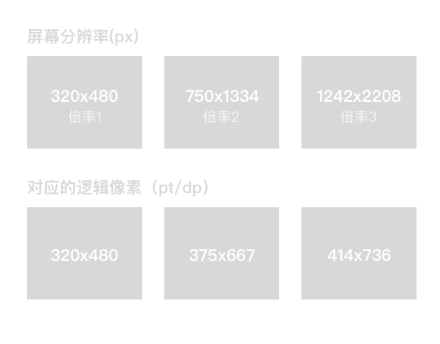

# Android

## 1. adb

### 1.1. 在 zsh 中添加环境变量

参考：[ADB 操作命令详解及用法大全](https://juejin.im/post/5b5683bcf265da0f9b4dea96)

```shell
echo 'export PATH="/Users/forwardNow/Library/Android/sdk/platform-tools/adb:$PATH"' >> ~/.zshrc

source ~/.zshrc
```

### 1.2. 基本命令

```shell
$ adb start-server
$ adb stop-server

# 安装/卸载 apk
$ adb install /.../hello/app/build/outputs/apk/debug/app-debug.apk
$ adb uninstall fn.cn.hello

# 开启手机的终端，可执行 shell 命令
$ adb shell

$ echo 'hello' > 1.txt

# 将文件推到终端
$ adb push 1.txt /mnt/sdcard

# 将文件从终端拉取出来，并重命名
$ adb pull /mnt/sdcard/1.txt 2.txt

$ rm 1.txt 2.txt
```

## 2. R 文件

位置：`app/build/generated/not_namespaced_r_class_sources/debug/r/fn/cn/phonedail/R.java`

## 3. 拨号

### 3.1. 权限设置

`AndroidManifest.xml`：

```xml
<?xml version="1.0" encoding="utf-8"?>
<manifest ...>

    <uses-permission android:name="android.permission.CALL_PHONE" />

    <application> ... </application>
</manifest>
```

### 3.2. 检查并请求权限

```java
public class MainActivity extends AppCompatActivity {

    private static final int MY_PERMISSIONS_REQUEST_CALL_PHONE = 1;

    @Override
    public void onRequestPermissionsResult( int requestCode, @NonNull String[] permissions, @NonNull int[] grantResults ) {
        switch ( requestCode ) {
            case MY_PERMISSIONS_REQUEST_CALL_PHONE: {

                // 已授权
                if ( grantResults[ 0 ] == PackageManager.PERMISSION_GRANTED ) {
                    Toast.makeText( this, "已授予拨号的权限", Toast.LENGTH_SHORT ).show();
                } else { // 未授权
                    Toast.makeText( this, "未授予拨号的权限", Toast.LENGTH_SHORT ).show();
                }

                return;
            }
        }


        super.onRequestPermissionsResult( requestCode, permissions, grantResults );
    }

    private void checkPermission() {
        if ( ActivityCompat.checkSelfPermission( this, Manifest.permission.CALL_PHONE ) != PackageManager.PERMISSION_GRANTED ) {
            ActivityCompat.requestPermissions( this, new String[] { Manifest.permission.CALL_PHONE }, MY_PERMISSIONS_REQUEST_CALL_PHONE );
        }
    }

}
```

### 3.3. 意图

```java
public class MainActivity extends AppCompatActivity {
    private void callPhone( String num ) {
        // 创建一个意图对象
        Intent dialIntent = new Intent();

        dialIntent.setAction( Intent.ACTION_CALL ); // 动作

        dialIntent.setData( Uri.parse( "tel:" + num ) ); // 数据

        // 开启意图
        startActivity( dialIntent );
    }
}
```

## 4. 按钮点击事件

### 4.1. 匿名内部类

```java
public class MainActivity extends AppCompatActivity {

    @Override
    protected void onCreate( Bundle savedInstanceState ) {

        Button buttonView = findViewById( R.id.button );

        buttonView.setOnClickListener( new View.OnClickListener() {
            @Override
            public void onClick( View v ) {
                // ...
            }
        } );
    }
}
```

### 4.2. 让当前类实现 `View.OnClickListener` 接口类型

>用于多个按钮的点击事件处理

```java
public class MainActivity extends AppCompatActivity implements View.OnClickListener  {
    @Override
    protected void onCreate( Bundle savedInstanceState ) {

        EditText phoneNumView = findViewById( R.id.editText );
        Button buttonView = findViewById( R.id.button );

        buttonView.setOnClickListener( this );
        phoneNumView.setOnClickListener( this );
    }

    @Override
    public void onClick( View v ) {
        switch ( v.getId() ) {
            case R.id.button: {
                Toast.makeText( this, "点击了按钮", Toast.LENGTH_SHORT ).show();
                break;
            }
            case R.id.editText: {
                Toast.makeText( this, "点击了可编辑的文本框", Toast.LENGTH_SHORT ).show();
                break;
            }
        }
    }
}
```

### 4.3. 使用控件的 `android:onClick` 属性

>用于 demo

```xml
<Button
    android:layout_width="wrap_content"
    android:layout_height="wrap_content"
    android:layout_marginTop="100dp"
    android:onClick="clickMe"
    android:text="拨号" />
```

```java
public class MainActivity extends AppCompatActivity {
  public void clickMe( View view ) {
        Toast.makeText( this, "点击了我", Toast.LENGTH_SHORT ).show();
    }
}
```

## 5. 常用布局

* 线性布局
* 相对布局
* 帧布局
* 表格布局
* 绝对布局（被废弃，不好做适配）

### 5.1. 线性布局

按照指定的（水平或垂直）顺序挨个排列。

类比 CSS 中 flex 布局中：

```scss
.container {
  display: flex;
  flex-direction: row; // 项目将水平显示，正如一个行一样。
  flex-direction: column; // 项目将垂直显示，正如一个列一样。
}
```

#### 5.1.1. 创建布局文件


#### 5.1.2. 示例

```xml
<?xml version="1.0" encoding="utf-8"?>
<LinearLayout
    xmlns:android="http://schemas.android.com/apk/res/android"
    android:layout_width="match_parent"
    android:layout_height="match_parent"
    android:orientation="vertical"
    >

    <TextView
        android:id="@+id/tv_label"
        android:layout_width="match_parent"
        android:layout_height="wrap_content"
        android:layout_margin="10dp"
        android:text="请输入电话号码" />

    <EditText
        android:layout_width="match_parent"
        android:layout_height="wrap_content"
        android:hint="电话号码"
        />

    <Button
        android:layout_width="wrap_content"
        android:layout_height="wrap_content"
        android:text="拨打"
        />

</LinearLayout>
```

### 5.2. 相对布局

默认都相对左上角。

示例：

```xml
<?xml version="1.0" encoding="utf-8"?>
<RelativeLayout
    xmlns:android="http://schemas.android.com/apk/res/android"
    android:layout_width="match_parent"
    android:layout_height="match_parent">

    <Button
        android:id="@+id/btn_1"
        android:layout_width="match_parent"
        android:layout_height="wrap_content"
        android:text="btn_1"
        />

    <Button
        android:id="@+id/btn_2"
        android:layout_width="100dp"
        android:layout_height="200dp"
        android:text="btn_2"
        android:layout_below="@id/btn_1"
        />

    <Button
        android:layout_width="200dp"
        android:layout_height="100dp"
        android:text="btn_3"
        android:layout_below="@id/btn_1"
        android:layout_toRightOf="@id/btn_2"
        />

</RelativeLayout>
```

### 5.3. 帧布局

堆叠。

示例：播放器，播放按钮堆叠在播放界面的中心。

```xml
<?xml version="1.0" encoding="utf-8"?>
<FrameLayout xmlns:android="http://schemas.android.com/apk/res/android"
    android:layout_width="match_parent"
    android:layout_height="match_parent">

    <TextView
        android:layout_width="match_parent"
        android:layout_height="match_parent"
        android:text="我是一个播放器" />

    <Button
        android:layout_width="wrap_content"
        android:layout_height="wrap_content"
        android:layout_gravity="center"
        android:text="播放"
        />

</FrameLayout>
```

### 5.4. 表格布局

示例：

```xml
<?xml version="1.0" encoding="utf-8"?>
<TableLayout xmlns:android="http://schemas.android.com/apk/res/android"
    android:layout_width="match_parent"
    android:layout_height="match_parent">

    <TableRow
        android:layout_weight="match_parent"
        android:layout_height="wrap_content"
        >

        <TextView
            android:layout_weight="wrap_content"
            android:layout_height="wrap_content"
            android:text="行1列1"
            android:textColor="#FF0000"
            />

        <TextView
            android:layout_weight="wrap_content"
            android:layout_height="wrap_content"
            android:text="行1列2"
            android:textColor="#00FF00"
            />

    </TableRow>

    <TableRow
        android:layout_weight="match_parent"
        android:layout_height="wrap_content"
        >

        <TextView
            android:layout_weight="wrap_content"
            android:layout_height="wrap_content"
            android:text="行2列1"
            android:textColor="#0000FF"
            />

        <TextView
            android:layout_weight="wrap_content"
            android:layout_height="wrap_content"
            android:text="行2列2"
            android:textColor="#333"
            />

    </TableRow>

</TableLayout>
```

## 6. 单位

参考：[如何一稿适配 iOS、Android](https://zhuanlan.zhihu.com/p/22084291)

| 单位 | 说明                                             |
| ---- | ------------------------------------------------ |
| dp   | 布局尺寸，device independent pixel，设备无关像素 |
| sp   | 文字尺寸，scale-independent pixel                |

倍率：

* iOS：
  * 1倍（163 ppi、1～3gs）
  * 2倍（326 ppi、4～6s）
  * 3倍（401 ppi、plus系列）
* Android：
  * mdpi （160 dpi、1倍）
  * hdpi （240 dpi、1.5倍）
  * xhdpi （320 dpi、2倍 ）
  * xxhdpi （480 dpi、3倍）
  * xxxhdpi （640 dpi、4倍）

px 与 dp 的关系：



## 7. 测试

好的软件不是开放出来的，是不断测试出来的。

根据是否知道源代码，分为：

* 黑盒测试，也叫功能测试
* 白盒测试

根据测试的粒度，分为：

* 方法测试
* 单元测试
* 集成测试
* 系统测试

根据测试的暴力程度，分为：

* 压力测试，如 12306
* 冒烟测试，测试到冒烟为止

  ```shell
  $ adb shell
  # Google 提供的压力测试的指令
  > monkey 2000
  ```

### 7.1. 单元测试

在 `app/build.gradle` 中添加依赖

```text
dependencies {
    // ...
    androidTestImplementation 'androidx.test.ext:junit:1.1.0'
}
```

## 8. 日志

```java
public class MainActivity extends AppCompatActivity {

    @Override
    protected void onCreate( Bundle savedInstanceState ) {
        super.onCreate( savedInstanceState );
        setContentView( R.layout.activity_main );

        String tag = "MainActivity";


        Log.v( tag, "我是 verbose 级别" );
        Log.d( tag, "我是 debug 级别" );
        Log.i( tag, "我是 info 级别" );
        Log.w( tag, "我是 warn 级别" );
        Log.e( tag, "我是 error 级别" );
        System.out.println( "我是 System.out" );
    }
}

```

可通过 tag 进行过滤。

## 9. 上下文 Context

参考：[API：android.content.Context](https://developer.android.google.cn/reference/android/content/Context?hl=en)

通过 `context` 打开 i/o 流：

```java
// "/data/data/fn.cn.login/files/user_info.txt"
FileOutputStream fos = MainActivity.this.openFileOutput( "user_info.txt", 0 )
fos.write( "abc".getBytes() );
fos.close();
```

## 10. 环境 Environment

参考：[API：android.os.Environment](https://developer.android.google.cn/reference/android/os/Environment?hl=en)

获取 sdcard 的路径：

```java
// "/mnt/sdcard"
String sdcardPath = Environment.getExternalStorageDirectory().getPath();
```

判断 sdcard 是否已经挂载：

```java
if ( Environment.MEDIA_MOUNTED.equals( Environment.getExternalStorageState() ) ) {
    Toast.makeText( context, "sdcard 已经挂载", Toast.LENGTH_LONG ).show();
}
```

往 sdcard 写数据需要相应权限：

```xml
<manifest xmlns:android="http://schemas.android.com/apk/res/android"
    package="fn.cn.login">

    <uses-permission android:name="android.permission.READ_EXTERNAL_STORAGE" />
    <uses-permission android:name="android.permission.WRITE_EXTERNAL_STORAGE" />

    <application> ... </application>
</manifest>
```

查看 sdcard 的控件：

```java
private void showSdCardInfo() {
    File externalStorageDirectory = Environment.getExternalStorageDirectory();

    long totalSpace = externalStorageDirectory.getTotalSpace();
    long usableSpace = externalStorageDirectory.getUsableSpace();

    // 813 MB
    String formatTotalSpaceFileSize = Formatter.formatFileSize( this, totalSpace );
    // 679 MB
    String formatUsableSpaceFileSize = Formatter.formatFileSize( this, usableSpace );
}
```

## 11. 文件权限

`MODE_PRIVATE`、`MODE_APPEND` 设置的权限针对是 “UGO” 中的 “O”

```java
public class MainActivity extends AppCompatActivity {
    public void createPrivateFile() {
        try {
            /*
             * File creation mode: the default mode,
             * where the created file can only be accessed by the calling application
             * (or all applications sharing the same user ID)
             *
             * -rw-rw----
             */
            FileOutputStream fos = openFileOutput( "private.txt", MODE_PRIVATE );
            fos.write( "private".getBytes() );
            fos.close();
        } catch ( Exception e ) {
            e.printStackTrace();
        }
    }
    public void createAppendFile() {
        try {
            /*
             * File creation mode: for use with openFileOutput(String, int),
             * if the file already exists then write data to the end of the existing file instead of erasing it.
             *
             * -rw-rw----
             */
            FileOutputStream fos = openFileOutput( "append.txt", MODE_APPEND );
            fos.write( "append".getBytes() );
            fos.close();
        } catch ( Exception e ) {
            e.printStackTrace();
        }
    }
}
```

在 Linux 中修改文件权限：

```shell
# root
➜  ~ adb root

# 进入 Linux 系统
➜  ~ adb shell

# 切换到 data 目录
generic_x86:/ # cd /data/data/

generic_x86:/data/data # ls | grep fn

fn.cn.file_permission

generic_x86:/data/data # cd fn.cn.file_permission/files
generic_x86:/data/data/fn.cn.file_permission/files # ls -l
total 8
-rw-rw---- 1 u0_a79 u0_a79    6 2019-09-10 10:13 append.txt
-rw-rw---- 1 u0_a79 u0_a79    7 2019-09-10 10:13 private.txt

generic_x86:/data/data/fn.cn.file_permission/files # chmod 777 private.txt
generic_x86:/data/data/fn.cn.file_permission/files # ls -l
total 8
-rw-rw---- 1 u0_a79 u0_a79 6 2019-09-10 10:13 append.txt
-rwxrwxrwx 1 u0_a79 u0_a79 7 2019-09-10 10:13 private.txt
```

## 12. SharedPreferences

参考：

* [API：android.content.SharedPreferences](https://developer.android.google.cn/reference/android/content/SharedPreferences?hl=en)
* [Save key-value data](https://developer.android.google.cn/training/data-storage/shared-preferences.html?hl=en#java)

示例：

```java
// 创建 /data/data/fn.cn.sp/shared_prefs/config.xml 文件
SharedPreferences sharedPref = getSharedPreferences( "config", Context.MODE_PRIVATE);
```

```java
public class MainActivity extends AppCompatActivity {
    private EditText et_loginName;
    private EditText et_loginPassword;
    private CheckBox cb_rememberMe;

    @Override
    protected void onCreate( Bundle savedInstanceState ) {
        super.onCreate( savedInstanceState );
        setContentView( R.layout.activity_main );


        et_loginName = findViewById( R.id.et_loginName );
        et_loginPassword = findViewById( R.id.et_loginPassword );
        cb_rememberMe = findViewById( R.id.cb_rememberMe );

        SharedPreferences sharedPref = getSharedPreferences( "config", Context.MODE_PRIVATE);
        String loginName = sharedPref.getString("loginName", "");
        String loginPassword = sharedPref.getString("loginPassword", "");
        boolean isRememberMe = sharedPref.getBoolean("isRememberMe", false);

        et_loginName.setText( loginName );
        et_loginPassword.setText( loginPassword );
        cb_rememberMe.setChecked( isRememberMe );
    }

    public void handleClick( View v ) {
        MainActivity ctx = MainActivity.this;


        String loginName = et_loginName.getText().toString();
        String loginPassword = et_loginPassword.getText().toString();
        boolean isRememberMe = cb_rememberMe.isChecked();

        SharedPreferences sharedPref = getSharedPreferences( "config", Context.MODE_PRIVATE);
        SharedPreferences.Editor editor = sharedPref.edit();
        editor.putBoolean( "isRememberMe", isRememberMe );

        if ( isRememberMe ) {
            editor.putString( "loginName", loginName );
            editor.putString( "loginPassword", loginPassword );
        } else {
            editor.putString( "loginName", "" );
            editor.putString( "loginPassword", "" );
        }

        editor.apply();
    }
}
```
