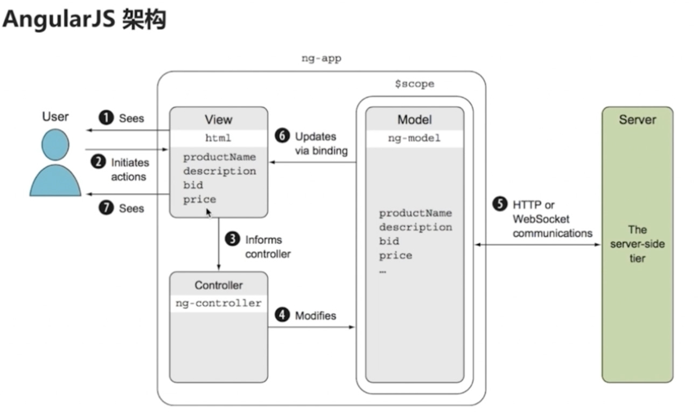

 # 笔记

## 1. 版本

主要版本：
* Angular 1.5
* Angular 4

Angular 2 之前的版本 称为 AngularJS，之后的版本称为 Angular。

Angular 不是由 AngularJS 升级而来，而是完全重写。

## 2. 架构

**AngularJS：典型的MVC架构。**

**Angular：围绕组件。**

## 3. 框架比较

AngularJS
* 优点
    * 模板功能强大丰富
    * 比较完善的前端MVC框架
    * 引入了Java的一些概念：依赖注入，单元测试等
* 问题
    * 性能：数据绑定 的 脏检查
    * 路由：简单，不能嵌套路由
    * 作用域
    * 表单验证：显示错误信息
    * JavaScript语言：弱类型，面向对象
    * 学习成本：高

Angular
* 全新的命令行工具 AngularCLI
* 服务器端渲染
* 移动和桌面兼容
* 继承 AngularJS，吸收 React的优点。

与React对比
* 优点
    * 速度
    * FLUX架构
    * 服务器端渲染
* 缺点
    * React并不是一套完整的前端框架，更专注与 v层

与vue对比
* 优点
    * 简单
    * 灵活
    * 性能
* 不足
    * 个人主导的项目
    * 只关注web
    * 服务器端渲染依赖第三方

