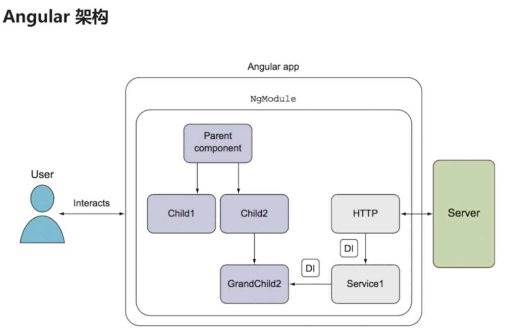

 # 笔记

## 1. 介绍

Angular 2 之前的版本 称为 AngularJS，之后的版本称为 Angular。
Angular 不是由 AngularJS 升级而来，而是完全重写。

**AngularJS：典型的MVC架构。**

**Angular：围绕组件。**

## 2. CLI命令

    # 全局安装 CLI
    $ npm install -g @angular/cli
    $ ng -v

    # 创建 ng项目
    $ ng new 项目名

    # 创建带路由的 ng项目
    $ ng new 项目名 --routing

    # 启动
    $ ng serve --open

    # 新建组件
    $ ng generate component navbar

CLI安装位置:
`/usr/local/Cellar/node/10.6.0/lib/node_modules/node_modules/@angular/cli/bin/ng`

## 3. 引入第三方库和样式

注：`first` 为项目名

### 3.1. jQuery

**安装**：

    $ npm install jquery --save
    # jquery@3.3.1

**配置文件路径**：

    项目名/
        angular.json

        {
            ...
            "projects": {
                "项目名": {
                    "architect": {
                        "build": {
                            "options": {
                                "styles": [
                                    ...
                                ],
                                "scripts": [
                                    ...
                                    "./node_modules/jquery/dist/jquery.js"
                                ]
                            }
                    }
                }
            }
        }

**类型定义**：

    $ npm install @types/jquery --save-dev

**使用**：

    import * as $ from 'jquery';
    
    $('body').html();

### 3.2. bootstrapp

    $ npm install bootstrap --save
    # bootstrap@3.3.7

    $ npm install @types/bootstrap --save-dev

    "styles": [
        "src/styles.css",
        "./node_modules/bootstrap/dist/css/bootstrap.css"
    ],
    "scripts": [
        "./node_modules/jquery/dist/jquery.js",
        "./node_modules/bootstrap/dist/js/bootstrap.js"
    ]

### 3.3. 父传子

    # 子 <app-start>
    export class StarComponent {
        @Input()
        public rating: number;
    }
    
{{ rating }}

    # 父 <app>
    export class AppComponent {
        num = 1;
    }
    

        <app-start [rating]="num">
    

## 4. 路由

### 4.1. 基础

**说明**：

|名称|简介|
|-|-|
| routes | 路由配置 |
| ActivatedRoute | 当前路由，可获取数据 |
| router | 路由器，用于编程导航 |
| `<a [routerLink]="['/']"> `| 路由器导航链接 |
| `<router-outlet>` | 路由器视图插座 |

**示例**：

    # app-routing.module.ts
    const routes: Routes = [
        // 匹配 根路由， "/"
        { path: '', component: HomeComponent },
        // 匹配 主页，"/home"
        { path: 'home', component: HomeComponent },
        // 匹配 产品页，"/product"
        { path: 'product', component: ProductComponent},
        // 匹配 为配置的路由，404
        { path: '**', component: Code404Component }
    ];

    # app.component.html
    
首页

    
产品页

    
未配置的页

    
编程导航

    <router-outlet></router-outlet>

    # app.component.ts
    constructor(private router: Router) {}
    customNav() {
        this.router.navigate(['/product']);
    }

### 4.2. 路由参数

#### 4.2.1. 传递参数

查询字符串参数：

    <a [routerLink]="['/product']"
       [queryParams]="{id: 1}">产品页-查询参数</a> 

路径参数：

    routes = [ { path: 'product/:id', ...} ]
    <a [routerLink]="['/product', 1]">产品页-路径参数</a>

#### 4.2.2. 接收参数

参数快照：

    id: number;
    constructor( private activatedRoute: ActivatedRoute ) { }
    ngOnInit() {
        // this.id = this.activatedRoute.snapshot.queryParams.id;
        this.id = this.activatedRoute.snapshot.params.id;
    }

参数订阅：

    this.activatedRoute.queryParams.subscribe(
        (params: Params) => {
            this.id = params.id;
        }
    );

参数快照用于只获取一次参数，参数订阅可多次获取参数。
如果路由自身就需要路由订阅。

### 4.3. 重定向

    routes: [
        { path: '', redirectTo: '/home', pathMatch: 'full' },
        { path: 'home', component: HomeComponent },
    ]

### 4.4. 子路由

路由嵌套，插槽嵌套。

    # app-routing.module.ts
    const routes: Routes = [
        { path: 'product/:id', component: ProductComponent,
          children: [
            { path: 'list/:id', component: ProductListComponent },
            { path: 'desc', component: ProductDescComponent },
          ]
        }
    ];

    # app.component.html
    <a [routerLink]="['/product', 1]">产品页-路径参数</a>  
    <router-outlet></router-outlet>

    # product.component.html
    <a [routerLink]="['list', 12]">产品-列表</a> 
    <a [routerLink]="['desc']">产品-描述</a> 
    <router-outlet></router-outlet>

