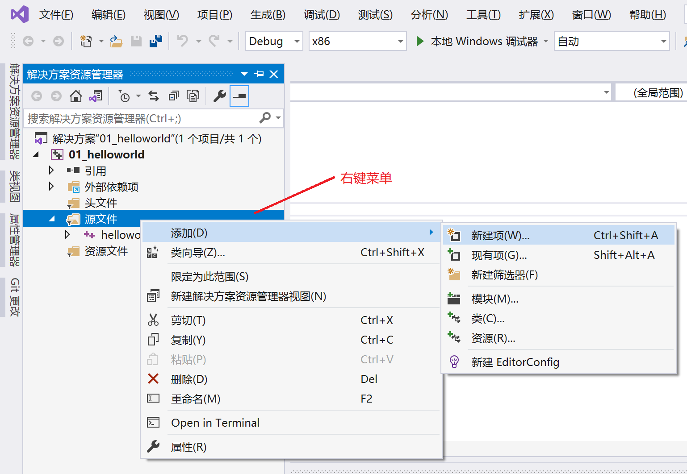
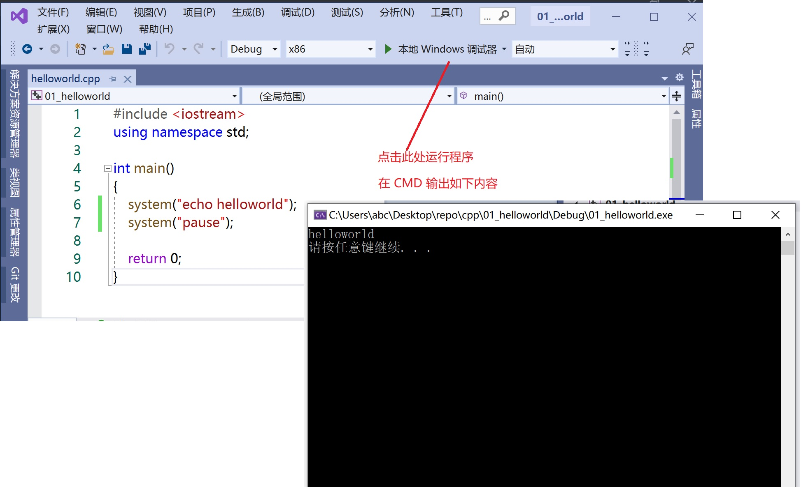

# C++ 基础入门

## 1. C++ 初识

### 1.1. 第一个 C++ 程序

编写一个 C++ 程序总共分为 4 个步骤
* 创建项目
* 创建文件
* 编写代码
* 运行程序

#### 1.1.1. 创建项目

使用 Visual Studio 编写 C++ 程序
* 文件（菜单） -> 创建 “空项目” （01_helloworld）

环境相关的问题：
* [关于Visual Studio 2019安装时VS installer无法下载文件，进度条为0，显示网络有问题的解决办法](https://blog.csdn.net/qq_43085848/article/details/109901050) 
* [windows开发笔记——VS 2019遇到windows SDK找不到](https://blog.csdn.net/chengxu_kuangrexintu/article/details/102980348)

#### 1.1.2. 创建文件



#### 1.1.3. 编写文件

```c++
#include <iostream>
using namespace std;

int main()
{
	cout << "hello world" << endl;
	system("pause");

	return 0;
}
```

界面设置：
* [VS2017如何更改字体大小](https://blog.csdn.net/fadbgfnbxb/article/details/89788194)

#### 1.1.4. 运行程序



### 1.2. 注释

单行注释： `// 注释的内容`

多行注释： `/* 注释的内容 */`

### 1.3. 变量

作用： 给一段指定的内存空间起名，方便操作这段内存。方便我们管理内存空间

语法： `数据类型 变量名 = 初始值;`

### 1.4. 常量

作用： 用于记录程序中不可更改的数据

定义常量的两种方式：
1. #define 宏常量： `#define 常量名 常量值`
	 * 通常在文件上方定义，表示一个常量
	 * 示例 `#define Day 7`
2. const 修饰的变量： `const 数据类型 常量名 = 常量值;`
	 * 通常在变量定义前加关键字 const，修饰该变量为常量，不可修改
	 * 示例 `const int day = 7;`

### 1.5. 关键字

asm
do
if
return
typedef
auto
double
inline
short
typeid
bool
dynamic_cast
int
signed
typename
break
else
long
sizeof
union
case
enum
mutable
static
unsigned
catch
explicit
namespace
static_cast
using
char
export
new
struct
virtual
class
extern
operator
switch
void
const
false
private
template
volatile
const_cast
float
protected
this
wchar_t
continue
for
public
throw
while
default
friend
register
true
delete
goto
reinterpret_cast
try

### 1.6. 标识符命名规则

给变量命名时：以 下划线、字母 打头的 字母、数字、下划线 组合。

## 2. 数据类型

C++ 规定在创建一个变量或者常量时，必须要指定出相应的数据类型，否则无法给变量分配内存。

### 2.1. 整形

作用：整形变量表示的是整数类型的数据

整数类型，区别在于所占内存空间不同，进而取值范围不同：

* `short` 短整型
* `int` 整型
* `long` 长整型
* `long long` 长长整型


### 2.2. sizeof 关键字

作用： 利用 sizeof 关键字可以统计数据类型所占内存空间字节数

语法： `sizeof(数据类型 | 变量)`

示例；

```c++
cout << "int: " << sizeof(int) << endl; // => int: 4
cout << "long long: " << sizeof(long long) << endl; // => long long: 8
```

### 2.3. 实型（浮点型）

作用：表示实数（带小数部分的数）

有两种：

* float，单精度，4字节，7位有效数字
* double，双精度，8字节，7位有效数字

说明：

* 默认情况下，输出一个小数，只会显示 6 位有效数字

示例：

```c++
float pi = 3.14f;
double pi2 = 3.1415926; 

// 科学计数法
double money = 1.0e2; // 1.0 * 10 ^ 2
```

### 2.4. 字符型

作用： 字符型变量用于显示单个字符

语法： `char valid = 'Y';`

说明：

* 值 是单个字符，用单引号界定
* 1 个字节，存储的是 ASCII 编码