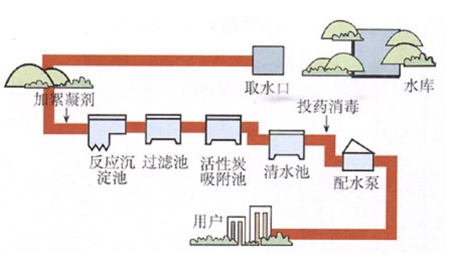

 # Express 框架

## 1. 介绍

原生的 http 核心模块在某些方面不足应对满足我们的开发需求，所以我们需要使用框架来提供开发效率。

框架的目的就是提高效率，让我们的代码高度统一。

在 Node 中，有很多 web 开发框架（如 koa），这里以 [Express](http://expressjs.com/) 为主。

作者：https://github.com/tj 

## 2. 安装

参考：http://expressjs.com/en/starter/installing.html

```shell
$ npm install --save express
+ express@4.16.3
added 52 packages from 47 contributors in 4.218s
```

## 3. hello world

参考：http://expressjs.com/en/starter/hello-world.html

查看：[./code3/01.express-helloworld.js](./code3/01.express-helloworld.js)

```javascript
// 1.引入
const express = require('express');

// 2.创建服务（相对于 http.createServer）
const app = express();


// 3.处理请求
app.get('/', (req, res) => {
  res.send('hello express');
});

// 提供静态资源服务（公开指定目录）
app.use('/public/', express.static('./public/'));
app.use('/static/', express.static('./static/'));

app.get('/about', (req, res) => {
  res.send('关于 Express');
});

// 4.监听端口（相对于 server.listen）
app.listen(3000, () => {
  console.log('http://localhost:3000');
});

```


## 4. 自动重启服务

使用第三方命令行工具 nodemon ,但文件被修改后自动重启服务。

nodemon 是一个基于 Node.js 开发的第三方命令行工具，我们需要独立安装：

```shell
$ npm install --global nodemon
```

使用：

```shell
$ nodemon app.js
+ nodemon@1.18.3
added 300 packages from 151 contributors in 11.539s
```

只要是通过 `nodemon` 执行的脚本，它会监视脚本的变化，一旦脚本被修改则自动帮你重启服务。

## 5. 基本路由

路由其实就是一张表，这个表里面有具体的映射关系。

get：

```javascript
app.get('/', (req, res) => {
  res.send('hello world');
});
```

post：

```javascript
app.post('/reg', (req, res) => {
  req.query;
  res.send('hello world');
});
```

## 6. 静态服务（公开静态资源）

文档：http://expressjs.com/en/starter/static-files.html

```
/
  public/
    js/
      a.js
```

常用方式：

```javascript
// 访问 /public/js/a.js
app.use('/public/', express.static('./public/'));
```

省略目录：

```javascript
// 访问 /js/a.js
app.use( express.static('./public/'));
```

其他（别名）：

```javascript
// 访问 /abc/js/a.js
app.use('/abc/', express.static('./public/'));
```

## 7. 配置并使用 art-template

文档：https://aui.github.io/art-template/express/

### 7.1. 安装

```shell
$ npm install --save art-template
$ npm install --save express-art-template
```

### 7.2. 配置

```javascript
var express = require('express');
var app = express();

// 当渲染以 .art 结尾的文件时，使用 art-template 模板引擎
app.engine('art', require('express-art-template'));
```

### 7.3. 使用

Express 为 Response 提供了一个方法：`render()`：

```javascript
res.render('模板路径', {模板数据})
```

当给 Express 配置了模板引擎后才可以使用 `render()`：

```javascript
app.engine('html', require('express-art-template'));
```

模板路径默认情况下是相对于 `${root}/views/` 目录，可指定默认相对路径：

```javascript
app.set('views', './myViews/');
```

使用：

```javascript
app.get('/', (req, res) => {
  // ./views/index.html
  res.render('index.html', {
    title: '首页'
  });
});
```

## 8. 获取 GET 请求参数

```javascript
req.query; //=> { name: '张三' }
```

## 9. 获取 POST 请求体数据

在 Express 中没有内置获取表单 POST 请求体的 API，
需要使用 Express 中间件 [body-parser](http://expressjs.com/en/resources/middleware/body-parser.html)。

### 9.1. 安装

```shell
$ npm install --save body-parser
```

### 9.2. 配置

配置完成后，会在 `req` 上添加添加 `body` 属性以获取请求体数据。

```javascript
var express = require('express')
var bodyParser = require('body-parser')

var app = express()

// parse application/x-www-form-urlencoded
app.use(bodyParser.urlencoded({ extended: false }))

// parse application/json
app.use(bodyParser.json())

```

## 10. 常用 API

### 10.1. 返回状态码

```javascript
app.get('/', (req, res) => {
    res.status(200).send('ok');
});
```

### 10.2. 渲染页面

```javascript
app.engine('art', require('express-art-template'));

app.get('/', (req, res) => {
    res.render('index.html', { data });
});
```

### 10.3. 返回 json 字符串

```javascript
app.get('/', (req, res) => {
    res.status(200).json({
      success: true,
      message: '处理成功'
    });
});
```

## 11. 路由

### 11.1. 路由设计

| method | pathname        | query | body                       | desc       |
| ------ | --------------- | ----- | -------------------------- | ---------- |
| GET    | /students       |       |                            | 渲染首页   |
| GET    | /student/new    |       |                            | 渲染添加页 |
| POST   | /student/new    |       | name&age&gender&hobbies    | 处理添加   |
| GET    | /student/edit   | id    |                            | 渲染编辑页 |
| POST   | /student/edit   |       | id&name&age&gender&hobbies | 处理编辑   |
| GET    | /student/delete | id    |                            | 处理删除   |

### 11.2. Express 路由

目录：

```
/
app.js
router.js
```

router.js

```javascript
const express = require('express');

// 1. 创建路由容器
const router = express.Router();

// 2. 把路由挂载到路由容器上
router.get('/', (req, res) => {
  res.render('index.html');
});

// 3. 导出路由容器
module.exports = router;
```

/app.js

```javascript
const express = require('express');

// 4. 引入路由容器
const router = require('./router.js');

const app = express();

//...

// 5. 把路由容器挂载到 app 服务上
app.use(router);

```

## 12. session

>此处的客户端为浏览器，移动端应用虽然支持 HTTP 协议但是一般不支持 Cookie。

### 12.1. 说明

HTTP 是无状态的，为了识别每个 HTTP 请求：

1. 浏览器发送登陆认证 HTTP 请求
2. 在服务端接收到请求，并进行认证处理，登陆(认证)成功后
    1. 将用户信息存入一个 Session，通过 sessionId 来读取该 Session
    2. 将 sessionId 写入响应头 `Set-Cookie:sessionId=1` 
    3. 发送响应
3. 浏览器接收到响应，将 sessionId 存入 cookie
4. 浏览器向该服务器发送的后续请求都会自动携带 `Cookie: sessionId=1;`

注意：

* session 的有效期通常由 cookie 的有效期决定。
* session 默认是存储在内存的，一旦服务器重启就会丢失，生产环境下会把 session 持久化存储（如文件、数据库）

### 12.2. express-session 中间件

官网：http://expressjs.com/en/resources/middleware/session.html

安装：

```shell
$ npm install express-session --save
```

使用：

```javascript
var express = require('express')
var session = require('express-session')
var app = express()

app.use(session({
  // 加密 sessionId 的过程中拼接一段字符串，以提升安全性防止恶意伪造
  // 如 md5(md5(sessionId) + 'wahh')
  secret: 'wahh',
  
  resave: false,

  // true：无论是否往使用 session，都会往 cookie 存 sessionId
  saveUninitialized: true
}))

app.get('/', (req, res) => {

  // 写入数据
  req.session.user = {...} 

  // 读取数据
  console.log(req.session.user);
});
```

## 13. 中间件

### 13.1. 概念

类比自来水处理的中间环节，水库里水经过很多个中间处理环节才最终到达用户的家里，如下




处理过程的环节可以只有一个，也可以有多个，每个处理环节有输入有输出。

中间件就是一个处理环节。

对于浏览器和数据库，Web 服务器就是中间件。

### 13.2. Express 中间件

查看：[./code5/02.middlewar.js](./code5/02.middlewar.js)

#### 13.2.1. 说明

从上往下注册中间件，也就是说先注册的先匹配，匹配成功才执行中间件。

执行了 `next()` 方法才会继续匹配下一个中间件，执行到最后一个中间件如果进行响应，则返回默认的 404。

同一个请求所经过的中间件，都是同一对 `req` 和 `res`；
也就是说前面中间件往 `req`、`res` 挂载属性或方法，后续匹配到的中间件可以使用，比如：

* 注册了 express-session 后，可以使用 `req.session`
* 注册了 body-parser 后，可以使用 `req.body`

#### 13.2.2. 中间件类别

参考：http://expressjs.com/en/guide/using-middleware.html

**Application-level middleware**

通过 `app.use()` 、`app.get()` 、`app.post()` 等注册的中间件

```javascript
app.get('/', (req, res) => {...})

// 处理 404
// 至于中间件链末尾，但错误处理中间件之前
app.use((req, res) => {
  res.render('404.html'); // 要配置模板引擎
});
```

**Router-level middleware**

与应用级的从差不多，不过是通过 `express.Router()` 注册的中间件，

```javascript
var router = express.Router()

router.get('/', (req, res) => {...})
```

**Error-handling middleware**

中间件必须指定四个参数，且中间件必须至于中间件链末尾。

```javascript
// 置于中间件链最后
// 必须指定四个形参
app.use(function (err, req, res, next) {
  console.error(err.stack)
  res.status(500).send('Something broke!')
})
```

当执行的某个中间件抛出异常时，会自动跳转到末尾的错误处理中间件

```javascript
app.get(() => {
  throw {err_code: 500, message: '我是一个错误。'};
});
```

当执行的某个中间件调用了 `next(err)` 方法，会直接跳转到末尾的错误处理中间件

```javascript
app.get('/', (req, res, next) => {
  fs.readFile('/no/such/file', (err) => {
    // 必须传递参数，以直接跳转到后面的错误处理中间件（四个参数的中间件）
    next(err);
  })
});
```

**Built-in middleware**

```javascript
// express.static
app.use('/public/', express.static(path.join(__dirname, './public/')))

```

**Third-party middleware**

[官方推荐第三方中间件](http://expressjs.com/en/resources/middleware.html)


#### 13.2.3. 创建中间件

中间件：处理请求的，本质就是函数

```javascript
/**
 * Express 中间件
 * @param {Request} req 请求
 * @param {Response} res 响应
 * @param {function} next 执行下一个中间件
 */
function middleware(req, res, next) {
  next();
}
```

#### 13.2.4. 注册中间件

方式：

* app.use(middleware) 匹配所有 url
* app.use(pathnamePrefix, middleware) 匹配指定前缀的 url
* app.get(pathname, middleware) 完全匹配 url，且为 GET 请求
* app.post(pathname, middleware) 完全匹配 url，且为 POST 请求

示例：

```javascript
app.use((req, res, next) => {
  console.log(1, req.url);
  next();
});

app.use('/a/', (req, res, next) => {
  console.log(2, req.url);
  next();
});

app.get('/a/b', (req, res, next) => {
  console.log(3, req.url);
  next();
});

app.get('/a/b', (req, res, next) => {
  console.log(4, req.url);
  next();
});

app.use((req, res) => {
  console.log(5, req.url);
  res.status(404).send(`没有：${req.method} ${req.url}`);
});

/*
服务端

1 '/a/b'
2 '/b'
3 '/a/b'
4 '/a/b'
5 '/a/b'

浏览器

  没有：GET /a/b
*/
```

## 14. 模块

模块职责要单一。

划分模块的目的就是为了增强代码的可维护性，提升开发效率。

### 14.1. app.js 模块

职责：

* 创建服务
* 做一些服务相关配置
    * 模板引擎
    * body-parser 解析 post 请求体
    * 提供静态服务
* 挂载路由
* 监听端口并启动服务

### 14.2. router.js 模块

职责：

* 处理路由
* 根据不同的请求方法、请求路径，设置不同的请求处理函数

### 14.3. Student.js

职责：操作文件的数据，只处理数据，不关心业务

## 15. ES6 API

`Array.prototype.find`

`Array.prototype.findIndex`
