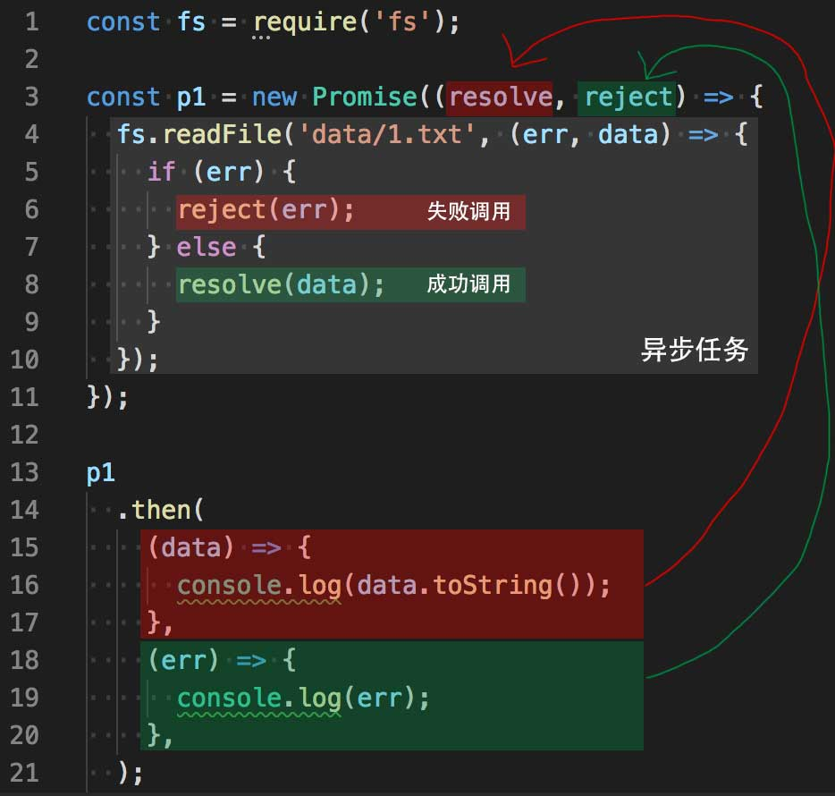
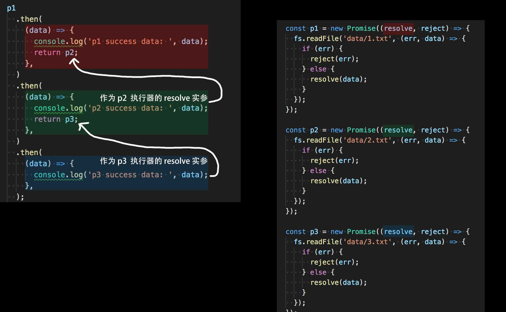

 # 异步编程

**异步 API**：

* 浏览器端
    * 事件
    * 定时器：`setTimeout()` `setInterval()`
    * ajax

* node 端
    * fs 模块：`readFile()` `writeFile()` `readdir()`

## 1. 回调函数

回调函数（callback）：获取异步操作的结果。

一般情况下，把函数作为参数的目的就是为了获取函数内部的异步操作结果。

```javascript
function fn(callback) {
  setTimeout(() => {
    let data = 'hello';
    callback(data);
  });
}

fn((data) => {
  console.log(data);
});
```

## 2. Promise

### 2.1. 引入

#### 2.1.1. 无法保证顺序的多个异步操作

目录

```
data/
  1.txt（内容为：aaa）
  2.txt（内容为：bbb）
  3.txt（内容为：ccc）
```

代码

```javascript
const fs = require('fs');

fs.readFile('data/1.txt', (err, data) => {
  if (err) { throw err; }
  console.log(data.toString());
});

fs.readFile('data/2.txt', (err, data) => {
  if (err) { throw err; }
  console.log(data.toString());
});

fs.readFile('data/3.txt', (err, data) => {
  if (err) { throw err; }
  console.log(data.toString());
});
```

#### 2.1.2. 通过嵌套回调函数的方式来保证多个异步操作的顺序

通过嵌套回调函数

```javascript
const fs = require('fs');

fs.readFile('data/1.txt', (err, data) => {
  if (err) { throw err; }
  console.log(data.toString());
  fs.readFile('data/2.txt', (err2, data2) => {
    if (err2) { throw err2; }
    console.log(data2.toString());
    fs.readFile('data/3.txt', (err3, data3) => {
      if (err3) { throw err3; }
      console.log(data3.toString());
    });
  });
});
```

#### 2.1.3. 回调地狱（callback hell）


当回调函数嵌套过多时会带来回调地狱的问题，所以在 ES6 中新增了一个 API：Promise。

### 2.2. Promise 状态

Promise 可以认为是一个容器，容器中存放了一个异步任务。

Promise 本身不是异步，但内部往往都封装了一个异步任务。

```
 -------- Promise ----------
|             ___ Resolved  |
|            /              |
| Pending ---               |
|            \___           |
|                 Rejected  |
 ---------------------------
```

状态只能变为其中一种

### 2.3. Promise API

`Promise` 是一个构造函数。

#### 2.3.1. 原理

```javascript
new Promise(function executer(resolve, reject) {

})
```

一个 Promise 容器，里面封装了一个异步任务：

异步任务成功则调用 `resolve()` 回调函数，

异步任务失败则调用 `reject()` 回调函数。

而 `resolve()`、`reject()` 回调函数通过 Promise 容器的 `then(resolve, reject)` 方法传递进去。

#### 2.3.2. 图示



#### 2.3.3. 示例

查看：[./code4/06.Promise-API.js](./code4/06.Promise-API.js)

```javascript
const fs = require('fs');

// 1. 创建一个 Promise 容器
// 给别人一个承诺 I promise you.
// Promise 容器一旦创建，就立即执行里面的代码

const p1 = new Promise((resolve, reject) => {
  // 异步任务
  fs.readFile('data/1.txt', (err, data) => {
    if (err) {
      // Promise 容器中的任务失败
      // 把 Promise 容器的 Pending 状态变为 Rejected
      reject(err);
      // reject 函数是 then 方法通过第二个参数传递进来的
    } else {
      // Promise 容器中的任务成功
      // 把 Promise 容器的 Pending 状态变为 Resolved
      resolve(data);
      // resolve 函数是 then 方法通过第一个参数传递进来的
    }
  });
});


// 2.
// p1 就是那个 Promise 容器
// then(fn1, fn2)
//  fn1：就是 Promise 容器中的 resolve 函数
//  fn2：就是 Promise 容器中的 reject 函数

p1
  .then((data) => {
    console.log(data.toString());
  }, (err) => {
    console.log(err);
  });

```

### 2.4. 多个异步任务

由于一个 Promise 容器封装一个异步任务，
当有多个异步任务时，通过 Promise 链串联多个异步任务以保障执行顺序。

#### 2.4.1. 原理

Promise 实例调用 `then()` 方法后会返回一个新的 Promise 实例，
因此可以无限调用 `then()` 方法，如下：

```javascript
p1
  .then(resolve1)
  .then(resolve2)
  .then(resolve3)
  .then(resolve4);
```

前一个 `resolve` 的返回值 `ret`， 如果：

* `ret` 不是 Promise 实例，则 `ret` 将作为下一个 `resolve` 的实参
* `ret` 是 Promise 实例（`p2`），则下一个 `resolve` 则会作为 `p2` 执行器的第一个参数，如下

```javascript
p1
  .then(
    data => {
      console.log('p1 success data: ', data);
      return p2;
    }
  )
  .then(
    data => {
      console.log('p2 success data: ', data);
      return p3;
    }
  )
  .then(
    data => {
      console.log('p3 success data: ', data);
    }
  )
```

#### 2.4.2. 图示



#### 2.4.3. 示例

```javascript
const fs = require('fs');

const p1 = new Promise((resolve, reject) => {
  fs.readFile('data/1.txt', (err, data) => {
    if (err) {
      reject(err);
    } else {
      resolve(data);
    }
  });
});

const p2 = new Promise((resolve, reject) => {
  fs.readFile('data/2.txt', (err, data) => {
    if (err) {
      reject(err);
    } else {
      resolve(data);
    }
  });
});

const p3 = new Promise((resolve, reject) => {
  fs.readFile('data/3.txt', (err, data) => {
    if (err) {
      reject(err);
    } else {
      resolve(data);
    }
  });
});

p1
  .then(
    (data) => {
      console.log('p1 success data: ', data);
      return p2;
    },
  )
  .then(
    (data) => {
      console.log('p2 success data: ', data);
      return p3;
    },
  )
  .then(
    (data) => {
      console.log('p3 success data: ', data);
    },
  );

```