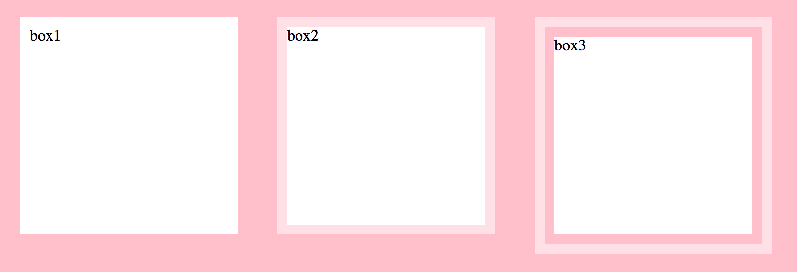
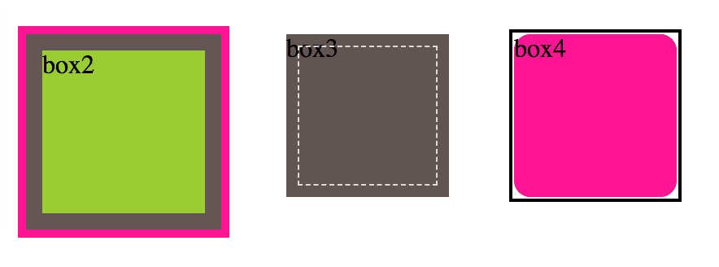

 # 背景与边框

## 1. 半透明边框

### 1.1. 难题

半透明颜色 rgba() 和 hsla()，早期主要用在背景上，原因：
* 没有把它当做真正的颜色，而是当做背景图片来使用
* 针对背景图片的回退很容易，只需要一张单像素的透明图片，而其他的只能回退到实色
* 其他属性（如边框）不太容易使用半透明色。

### 1.2. 解决方案

给容器设置白色的背景和半透明的边框，让body的背景能透过来：

    # 透不过来：透过来的是背景色
    .box1 {
        border: 10px solid rgba(255,255,255, 0.5);
        background: white;
    }
    # 透过来了：填充到padding
    .box2 {
        border: 10px solid rgba(255,255,255, 0.5);
        background: white;
        background-clip: padding-box;
    }
    # 透过来了：填充到内容
    .box3 {
        padding: 10px;
        border: 10px solid rgba(255,255,255, 0.5);
        background: white;
        background-clip: content-box;
    }

`background` 默认会填充到`border`的区域，可以使用`background-clip`控制背景填充的区域。

#### 1.2.1. 相关

示例：[./demo/2.1.html](./demo/2.1.html)

参考：[http://dabblet.com/gist/012289cc14106a1bd7a5](http://dabblet.com/gist/012289cc14106a1bd7a5)

规范：[CSS 背景与边框](http://w3.org/TR/css-backgrounds)

## 2. 多重边框

### 2.1. 难题

我们通常希望在CSS代码层面以更灵活的方式来调整边框样式

### 2.2. box-shadow 方案

    第一（偏移量x）、二个参数（偏移量y）为零，
    第三个参数（模糊值）为零则为不模糊（实心）。
    第四个参数（扩展半径）可指定投影的宽度，
    .box1 {
        box-shadow: 
            0 0 0 10px #665,
            0 0 0 20px deeppink,
            0 2px 5px 20px rgba(0,0,0,.6);
    }

`box-shadow` 可通过逗号叠加多层投影 和 第四个参数来模拟多层边框。

注意：
* 投影的行为与边框不一致，不影响布局。可通过内边距或外边距来模拟边框所需要的空间。
* 投影模拟的假边框不会响应鼠标事件（如悬停或点击）。可通过`inset`关键字将投影绘制在内圈，并添加内边距。

#### 2.2.1. 相关

示例：[./demo/2.2.html](./demo/2.2.html)

参考：[http://dabblet.com/gist/525eb8e9cdade71723c1](http://dabblet.com/gist/525eb8e9cdade71723c1)

规范：[CSS 背景与边框](http://w3.org/TR/css-backgrounds)

### 2.3. outline方案

如果你只需要两层边框，则可先使用常规边框，再加上outline（描边）来产生外层边框。

优点是比 box-shadow 更灵活：
* 产生虚线边框效果
* 通过 `outline-offset` 属性控制与元素边缘的距离。

注意：
* 只能用于双层边框的场景
* 不一定贴合圆角
* 不会影响盒模型，不响应鼠标事件

示例：

    // 双层边框
    .box2 {
        background: yellowgreen;
        border: 10px solid #655;
        outline: 5px solid deeppink;
    }
    // 缝线效果
    .box3 {
        background: #625552;
        outline: 1px dashed rgba(255,255,255,.8);
        outline-offset: -8px;
    }
    // 不能贴合圆角
    .box4 {
        background: deeppink;
        outline: 2px solid #000;
        outline-offset: 1px;
        border-radius: 10px;
    }

#### 2.3.1. 相关

示例：[./demo/2.2.html](./demo/2.2.html)

规范：[„CSS 背景与边框](http://w3.org/TR/css-backgrounds) 、[CSS 基本 UI 特性](http://w3.org/TR/css3-ui)