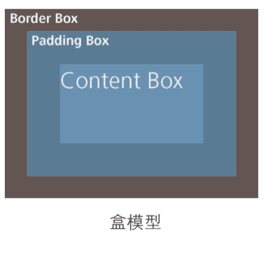
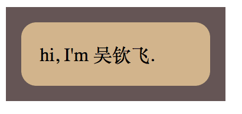

 # 背景与边框

## 1. 半透明边框

### 1.1. 难题

半透明颜色 rgba() 和 hsla()，早期主要用在背景上，原因：
* 没有把它当做真正的颜色，而是当做背景图片来使用
* 针对背景图片的回退很容易，只需要一张单像素的透明图片，而其他的只能回退到实色
* 其他属性（如边框）不太容易使用半透明色。

### 1.2. 解决方案

给容器设置白色的背景和半透明的边框，让body的背景能透过来：

    # 透不过来：透过来的是背景色
    .box1 {
        border: 10px solid rgba(255,255,255, 0.5);
        background: white;
    }
    # 透过来了：填充到padding
    .box2 {
        border: 10px solid rgba(255,255,255, 0.5);
        background: white;
        background-clip: padding-box;
    }
    # 透过来了：填充到内容
    .box3 {
        padding: 10px;
        border: 10px solid rgba(255,255,255, 0.5);
        background: white;
        background-clip: content-box;
    }

`background` 默认会填充到`border`的区域，可以使用`background-clip`控制背景填充的区域。

#### 1.2.1. 相关

示例：[./demo/2.1.html](./demo/2.1.html)

参考：[http://dabblet.com/gist/012289cc14106a1bd7a5](http://dabblet.com/gist/012289cc14106a1bd7a5)

规范：[CSS 背景与边框](http://w3.org/TR/css-backgrounds)

## 2. 多重边框

### 2.1. 难题

我们通常希望在CSS代码层面以更灵活的方式来调整边框样式

### 2.2. box-shadow 方案

    第一（偏移量x）、二个参数（偏移量y）为零，
    第三个参数（模糊值）为零则为不模糊（实心）。
    第四个参数（扩展半径）可指定投影的宽度，
    .box1 {
        box-shadow: 
            0 0 0 10px #665,
            0 0 0 20px deeppink,
            0 2px 5px 20px rgba(0,0,0,.6);
    }

`box-shadow` 可通过逗号叠加多层投影 和 第四个参数来模拟多层边框。

注意：
* 投影的行为与边框不一致，不影响布局。可通过内边距或外边距来模拟边框所需要的空间。
* 投影模拟的假边框不会响应鼠标事件（如悬停或点击）。可通过`inset`关键字将投影绘制在内圈，并添加内边距。

#### 2.2.1. 相关

示例：[./demo/2.2.html](./demo/2.2.html)

参考：[http://dabblet.com/gist/525eb8e9cdade71723c1](http://dabblet.com/gist/525eb8e9cdade71723c1)

规范：[CSS 背景与边框](http://w3.org/TR/css-backgrounds)

### 2.3. outline方案

如果你只需要两层边框，则可先使用常规边框，再加上outline（描边）来产生外层边框。

优点是比 box-shadow 更灵活：
* 产生虚线边框效果
* 通过 `outline-offset` 属性控制与元素边缘的距离。

注意：
* 只能用于双层边框的场景
* 不一定贴合圆角
* 不会影响盒模型，不响应鼠标事件

示例：

    // 双层边框
    .box2 {
        background: yellowgreen;
        border: 10px solid #655;
        outline: 5px solid deeppink;
    }
    // 缝线效果
    .box3 {
        background: #625552;
        outline: 1px dashed rgba(255,255,255,.8);
        outline-offset: -8px;
    }
    // 不能贴合圆角
    .box4 {
        background: deeppink;
        outline: 2px solid #000;
        outline-offset: 1px;
        border-radius: 10px;
    }

#### 2.3.1. 相关

示例：[./demo/2.2.html](./demo/2.2.html)

规范：[„CSS 背景与边框](http://w3.org/TR/css-backgrounds) 、[CSS 基本 UI 特性](http://w3.org/TR/css3-ui)

## 3. 灵活的背景定位

### 3.1. 难题

想针对容器某个角对背景图片做偏移定位，比如将背景图定位到右下角 且与边缘间隔10px。

对于具有固定尺寸的容器来说，使用CSS2.1是可以做到的，
但当容器元素的尺寸不固定时（因为内容往往是可变的），这就做不到了。

### 3.2. background-position 的扩展语法

background-position 属性已经得到扩展，
它允许我们指定背景图片距离任意角的偏移量，只要我们在偏移量前面指定关键字。

如果想让背景图片跟右边缘保持 20px 的偏移量，同时跟底边保持 10px 的偏移量，可以这样做：

    .box1 {
        /* 将 bottom right 写进 background，以提供回退 */
        background: url(code-pirate.svg)
                    no-repeat bottom right #58a;
        background-position: right 20px bottom 10px;
    }

#### 3.2.1. 相关

示例：[./demo/2.3.html](./demo/2.3.html)

参考：http://dabblet.com/gist/0f226e63595d1bef88cb

规范：[CSS 背景与边框(第三版)](http://w3.org/TR/css3-background)

### 3.3. background-origin 方案

在给背景图片设置距离某个角的偏移量时，有一种情况极其常见:偏移量与容器的内边距一致。

每个元素身上都存在三个矩形框：
* border box(边框的外沿框)
* padding box(内边距的外沿框)
* content box(内容区的外沿框)

`background-position: top left` 是以哪个角为基准的？

默认情况下，`background-position` 是以 padding box 为准的，这样边框才不会遮住背景图片。因此，`top left` 默认指的是 padding box 的左上角。

在背景与边框(第三版)(http://w3.org/TR/css3-background)中， 我们得到了一个新的属性 `background-origin`，可以用它来改变这种行为。

    background: url(code-pirate.svg)
                no-repeat bottom right #58a;
    background-origin: content-box;

#### 3.3.1. 相关

参考：http://dabblet.com/gist/0f19ac5d28d0aa7b6c60

### 3.4. calc() 方案

如果我们仍然以左上角偏移的思路来考虑，
其实就是希望它有一个 100% - 20px 的水平偏移量，
以及 100% - 10px 的垂直偏移量。
谢天谢地，`calc()` 函数允许我们执行此类运算，
它可以完美地在 `background-position` 属性中使用:

    background: url("code-pirate.svg") no-repeat; background-position: calc(100% - 20px) calc(100% - 10px);

注意：在 `calc()` 函数内部的 - 和 + 运算符的两侧各加一个空白符，否则会产生解析错误!

#### 3.4.1. 相关

参考：http://dabblet.com/gist/b5fcb42d055427ab6c1a

规范：[CSS 值与单位](http://w3.org/TR/css-values)

## 4. 边框内圆角

### 4.1. 难题

有时我们需要一个容器，只在内侧有圆角，而边框或描边的四个角在外部仍旧是直角，用两个元素可以实现。

    .outer { 
        background: #655;
        padding: .8em;
    }
    .inner {
        background: tan;
        border-radius: .8em;
    }
    

        
hi, I'm 吴钦飞.

    

有没有办法可以只用一个元素达成同样的效果呢?

### 4.2. 解决方案

**依据**：
* 描边（outline）不沿着圆角走，会留下空隙
* 投影（box-shadow）沿着圆角走，可以用描边的颜色填充空隙

这个办法有一些 hack 的味道，因为它依赖于描边不跟着圆角走的这个事实，但我们无法保证这种行为是永远不变的。

根据 CSS 工作组最近的讨论来看，未来规范将会明确地建议描边跟着圆角走。

    background: tan; 
    border-radius: .8em; 
    padding: 1em;
    box-shadow: 0 0 0 .6em #655; 
    outline: .6em solid #655;

**示例**：

    .box1 {
        border-radius: .8em;
        background: tan;
        outline: solid .8em #655;
    }
    .box2 {
        border-radius: .8em;
        background: tan;
        box-shadow: 0 0 0 .8em #655;
    }
    .box3 {
        border-radius: .8em;
        background: tan;
        outline: solid .8em #655;
        box-shadow: 0 0 0 .6em #655;
    }

    
box1，描边不沿着圆角走

    
box2，投影沿着圆角走

    
box3，结合描边和投影

#### 4.2.1. 相关

示例：[./demo/2.4.html](./demo/2.4.html)

参考：http://dabblet.com/gist/170fe436f290083cc24c

规范：[CSS 背景与边框](http://w3.org/TR/css-backgrounds) 、[CSS 基本 UI 特性](http://w3.org/TR/css3-ui)

