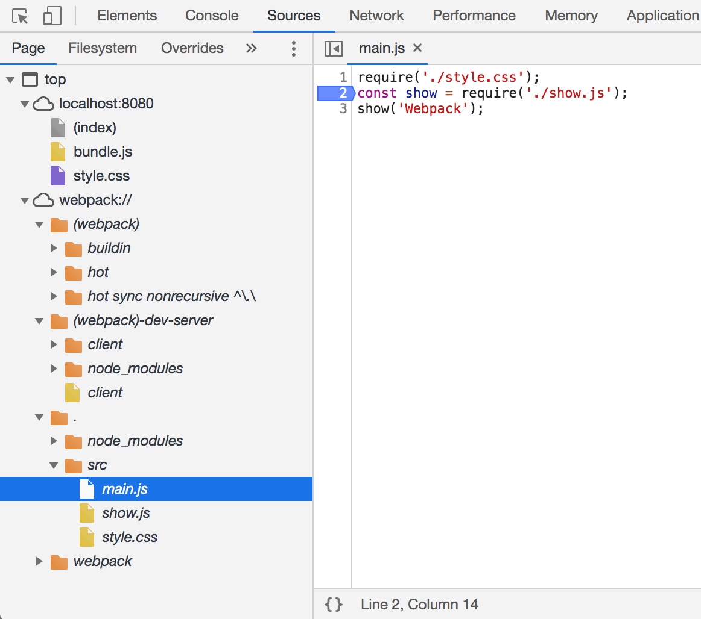

# 使用 DevServer

在实际开发中你可能会需要：

1. 通过 HTTP 访问网页，而不是使用本地文件预览
2. 监听文件的变化并自动刷新网页，做到实时预览
3. 支持 Source Map，以方便调试

Webpack 原生支持上述后面两点，官方提供的开发工具 DevServer 支持第 1 点。

DevServer 的作用：

* 启动一个 HTTP 服务器用于服务网页请求
* 启动 Webpack，Webpack 会开启监听模式
* 接收 Webpack 发出的文件更变信号，将 “dist” 编译到内存
* 通过 WebSocket 协议自动刷新网页做到实时预览

安装依赖：

```shell
npm i -D webpack-dev-server
```

DevServer 不会理会 webpack.config.js 里配置的 `output.path` 属性，所以要获取 bundle.js 的正确 URL 是 `http://localhost:8080/bundle.js`，对应的 index.html 应该修改为：

```html
<link rel="stylesheet" href="style.css">
<div id="app"></div>
<!--导入 Webpack 输出的 JavaScript 文件-->
<script src="bundle.js"></script>
```

启动 DevServer：

```shell
./node_modules/.bin/webpack-dev-server
```

## 1. 实时预览

修改 main.js 及其涉及到的所有文件，浏览器都会自动刷新以显示修改后的结果。其原理如下：

* 通过 DevServer 启动的 Webpack 会开启监听模式（`webpack --watch`）
* 当 `entry` 本身或其依赖的文件发生变化后，webpack 会重新将构建到内存
* DevServer 通过 WebSocket 控制网页刷新以请求最新的资源

修改 `index.html` 文件并保存，并不会触发上述机制，因为：

* Webpack 在启动时会以配置里的 `entry` 为入口去递归解析出 `entry` 所依赖的文件
* 只有 `entry` 本身和依赖的文件才会被 Webpack 添加到监听列表里
* `index.html` 文件是不在监听列表里的

## 2. 模块热替换

除了通过重新刷新整个网页来实现实时预览，DevServer 还有一种被称作模块热替换的刷新技术。

模块热替：

* 不重新加载整个网页
* 被更新过的模块会被替换掉，并重新执行一次，以显示最新的结果
* 响应更快，体验更好
* 通过 `webpack --hot` 开启热替换

## 3. 支持 Source Map

调试工具可以通过 Source Map 映射代码，让你在源代码上断点调试。

Webpack 支持生成 Source Map，只需在启动时带上 `--devtool source-map` 参数。

源码位置：

