 # 背景与边框

## 1. 半透明边框

### 1.1. 难题

半透明颜色 rgba() 和 hsla()，早期主要用在背景上，原因：
* 没有把它当做真正的颜色，而是当做背景图片来使用
* 针对背景图片的回退很容易，只需要一张单像素的透明图片，而其他的只能回退到实色
* 其他属性（如边框）不太容易使用半透明色。

### 1.2. 解决方案

给容器设置白色的背景和半透明的边框，让body的背景能透过来：

    # 透不过来：透过来的是背景色
    .box1 {
        border: 10px solid rgba(255,255,255, 0.5);
        background: white;
    }
    # 透过来了：填充到padding
    .box2 {
        border: 10px solid rgba(255,255,255, 0.5);
        background: white;
        background-clip: padding-box;
    }
    # 透过来了：填充到内容
    .box3 {
        padding: 10px;
        border: 10px solid rgba(255,255,255, 0.5);
        background: white;
        background-clip: content-box;
    }

`background` 默认会填充到`border`的区域，可以使用`background-clip`控制背景填充的区域。

#### 1.2.1. 相关

示例：[./demo/2.1.html](./demo/2.1.html)

参考：[http://dabblet.com/gist/012289cc14106a1bd7a5](http://dabblet.com/gist/012289cc14106a1bd7a5)

规范：[CSS 背景与边框](http://w3.org/TR/css-backgrounds)

## 2. 多重边框

### 2.1. 难题

我们通常希望在CSS代码层面以更灵活的方式来调整边框样式

### 2.2. box-shadow 方案

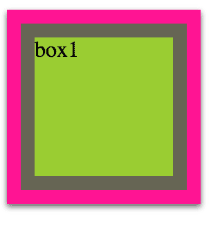

    第一（偏移量x）、二个参数（偏移量y）为零，
    第三个参数（模糊值）为零则为不模糊（实心）。
    第四个参数（扩展半径）可指定投影的宽度，
    .box1 {
        box-shadow: 
            0 0 0 10px #665,
            0 0 0 20px deeppink,
            0 2px 5px 20px rgba(0,0,0,.6);
    }

`box-shadow` 可通过逗号叠加多层投影 和 第四个参数来模拟多层边框。

注意：
* 投影的行为与边框不一致，不影响布局。可通过内边距或外边距来模拟边框所需要的空间。
* 投影模拟的假边框不会响应鼠标事件（如悬停或点击）。可通过`inset`关键字将投影绘制在内圈，并添加内边距。

#### 2.2.1. 相关

示例：[./demo/2.2.html](./demo/2.2.html)

参考：[http://dabblet.com/gist/525eb8e9cdade71723c1](http://dabblet.com/gist/525eb8e9cdade71723c1)

规范：[CSS 背景与边框](http://w3.org/TR/css-backgrounds)

### 2.3. outline方案

如果你只需要两层边框，则可先使用常规边框，再加上outline（描边）来产生外层边框。

优点是比 box-shadow 更灵活：
* 产生虚线边框效果
* 通过 `outline-offset` 属性控制与元素边缘的距离。

注意：
* 只能用于双层边框的场景
* 不一定贴合圆角
* 不会影响盒模型，不响应鼠标事件

示例：

    // 双层边框
    .box2 {
        background: yellowgreen;
        border: 10px solid #655;
        outline: 5px solid deeppink;
    }
    // 缝线效果
    .box3 {
        background: #625552;
        outline: 1px dashed rgba(255,255,255,.8);
        outline-offset: -8px;
    }
    // 不能贴合圆角
    .box4 {
        background: deeppink;
        outline: 2px solid #000;
        outline-offset: 1px;
        border-radius: 10px;
    }

#### 2.3.1. 相关

示例：[./demo/2.2.html](./demo/2.2.html)

规范：[„CSS 背景与边框](http://w3.org/TR/css-backgrounds) 、[CSS 基本 UI 特性](http://w3.org/TR/css3-ui)

## 3. 灵活的背景定位

### 3.1. 难题

想针对容器某个角对背景图片做偏移定位，比如将背景图定位到右下角 且与边缘间隔10px。

对于具有固定尺寸的容器来说，使用CSS2.1是可以做到的，
但当容器元素的尺寸不固定时（因为内容往往是可变的），这就做不到了。

### 3.2. background-position 的扩展语法

background-position 属性已经得到扩展，
它允许我们指定背景图片距离任意角的偏移量，只要我们在偏移量前面指定关键字。

如果想让背景图片跟右边缘保持 20px 的偏移量，同时跟底边保持 10px 的偏移量，可以这样做：

    .box1 {
        /* 将 bottom right 写进 background，以提供回退 */
        background: url(code-pirate.svg)
                    no-repeat bottom right #58a;
        background-position: right 20px bottom 10px;
    }

#### 3.2.1. 相关

示例：[./demo/2.3.html](./demo/2.3.html)

参考：http://dabblet.com/gist/0f226e63595d1bef88cb

规范：[CSS 背景与边框(第三版)](http://w3.org/TR/css3-background)

### 3.3. background-origin 方案

在给背景图片设置距离某个角的偏移量时，有一种情况极其常见:偏移量与容器的内边距一致。

每个元素身上都存在三个矩形框：
* border box(边框的外沿框)
* padding box(内边距的外沿框)
* content box(内容区的外沿框)

`background-position: top left` 是以哪个角为基准的？

默认情况下，`background-position` 是以 padding box 为准的，这样边框才不会遮住背景图片。因此，`top left` 默认指的是 padding box 的左上角。

在背景与边框(第三版)(http://w3.org/TR/css3-background)中， 我们得到了一个新的属性 `background-origin`，可以用它来改变这种行为。

    background: url(code-pirate.svg)
                no-repeat bottom right #58a;
    background-origin: content-box;

#### 3.3.1. 相关

参考：http://dabblet.com/gist/0f19ac5d28d0aa7b6c60

### 3.4. calc() 方案

如果我们仍然以左上角偏移的思路来考虑，
其实就是希望它有一个 100% - 20px 的水平偏移量，
以及 100% - 10px 的垂直偏移量。
谢天谢地，`calc()` 函数允许我们执行此类运算，
它可以完美地在 `background-position` 属性中使用:

    background: url("code-pirate.svg") no-repeat; background-position: calc(100% - 20px) calc(100% - 10px);

注意：在 `calc()` 函数内部的 - 和 + 运算符的两侧各加一个空白符，否则会产生解析错误!

#### 3.4.1. 相关

参考：http://dabblet.com/gist/b5fcb42d055427ab6c1a

规范：[CSS 值与单位](http://w3.org/TR/css-values)

## 4. 边框内圆角

### 4.1. 难题

有时我们需要一个容器，只在内侧有圆角，而边框或描边的四个角在外部仍旧是直角，用两个元素可以实现。

    .outer { 
        background: #655;
        padding: .8em;
    }
    .inner {
        background: tan;
        border-radius: .8em;
    }
    

        
hi, I'm 吴钦飞.

    

有没有办法可以只用一个元素达成同样的效果呢?

### 4.2. 解决方案

**依据**：
* 描边（outline）不沿着圆角走，会留下空隙
* 投影（box-shadow）沿着圆角走，可以用描边的颜色填充空隙

这个办法有一些 hack 的味道，因为它依赖于描边不跟着圆角走的这个事实，但我们无法保证这种行为是永远不变的。

根据 CSS 工作组最近的讨论来看，未来规范将会明确地建议描边跟着圆角走。

    background: tan; 
    border-radius: .8em; 
    padding: 1em;
    box-shadow: 0 0 0 .6em #655; 
    outline: .6em solid #655;

**示例**：

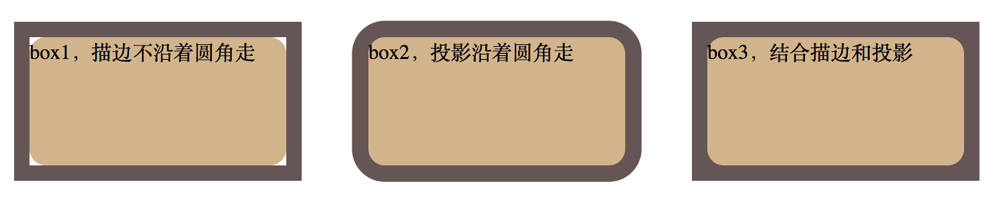

    .box1 {
        border-radius: .8em;
        background: tan;
        outline: solid .8em #655;
    }
    .box2 {
        border-radius: .8em;
        background: tan;
        box-shadow: 0 0 0 .8em #655;
    }
    .box3 {
        border-radius: .8em;
        background: tan;
        outline: solid .8em #655;
        box-shadow: 0 0 0 .6em #655;
    }

    
box1，描边不沿着圆角走

    
box2，投影沿着圆角走

    
box3，结合描边和投影

#### 4.2.1. 相关

示例：[./demo/2.4.html](./demo/2.4.html)

参考：http://dabblet.com/gist/170fe436f290083cc24c

规范：[CSS 背景与边框](http://w3.org/TR/css-backgrounds) 、[CSS 基本 UI 特性](http://w3.org/TR/css3-ui)

## 5. 条纹背景

### 5.1. 难题

使用CSS创建条纹图案。

### 5.2. 解决方案

>“如果多个色标具有相同的位置，它们会产生一个无限小的过渡区域， 过渡的起止色分别是第一个和最后一个指定值。从效果上看，颜色会在那个位置突然变化，而不是一个平滑的渐变过程。”  
>——CSS 图像(第三版)(http://w3.org/TR/css3-images)

将两个色标重合在一起就没有渐变了，只有两个纯色的色块；
渐变也是背景图片，默认是重复平铺的，通过设置条纹的尺寸以达到重复。

    .box1 {
        background: linear-gradient(red, green);
    }
    .box2 {
        background: linear-gradient(red 40%, green 60%);
    }
    .box3 {
        background: linear-gradient(red 50%, green 50%);
    }
    .box4 {
        background: linear-gradient(red 50%, green 50%);
        background-size: 100% 30px;
    }

>“如果某个色标的位置值比整个列表中在它之前的色标的位置值都要小，则该色标的位置值会被设置为它前面所有色标位置值的最大值。”   ——CSS 图像(第三版)(http://w3.org/TR/css3-images)

    background: linear-gradient(red 50%, green 50%);
    等价于：
    background: linear-gradient(red 50%, green 0);

也就是说，将第二个色标位置设置为零，则为前面最大的色标值50%。

创建不等宽的条纹：

    .box5 {
        background: linear-gradient(red 30%, green 0);
        background-size: 100% 30px;
    }

创建多条纹：

    .box6 {
        background: linear-gradient(
            /* 开始 -> 结束 */
            red 33.3%, green 0,
            /* 开始 -> 结束 */
            green 66.6%, blue 0
            );
        background-size: 100% 45px;
    }

### 5.3. 垂直条纹

指定渐变的方向即可：

    linear-gradient( to right, red 30%, green 0);
    或
    linear-gradient( 90deg   , red 30%, green 0);

    .box7 {
        background: linear-gradient(90deg, red 50%, green 50%);
        background-size: 30px 100%;
    }

### 5.4. 斜向条纹

斜向条纹的宽度需要计算：

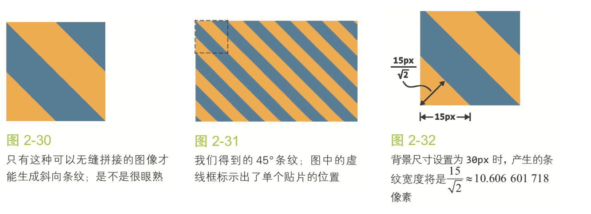

也就是说想让条纹的宽度变化为我们原本想要的 15px，就需要把 background-size 指定为 2 × 15 × 根号2 ≈ 42.426406871 像素。

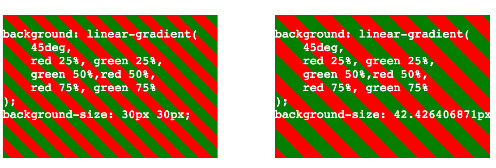

    .box8 {
        background: linear-gradient(
            45deg, 
            red 25%, green 25%,
            green 50%,red 50%,
            red 75%, green 75%
            );
        background-size: 30px 30px;
    }
    .box9 {
        background: linear-gradient(
            45deg, 
            red 25%, green 25%,
            green 50%,red 50%,
            red 75%, green 75%
            );
        background-size: 42.426406871px 42.426406871px;
    }

### 5.5. 更好的斜向条纹

 `linear-gradient()` 和 `radial-gradient()` 还各有一个循环式的加强版:`repeating-linear-gradient()` 和 `repeating-radial-gradient()`。

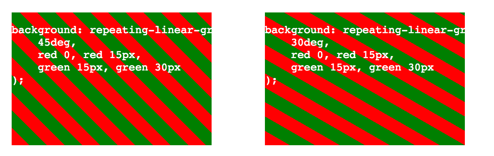

直接指定像素值就可以了，而且可以设置任意的渐变角度而无需计算了。

        background: linear-gradient(
            45deg, 
            red 25%, green 25%,
            green 50%,red 50%,
            red 75%, green 75%
            );
        background-size: 42.426406871px 42.426406871px;

        等价于：

        background: repeating-linear-gradient(
            45deg, 
            red 0, red 15px,
            green 15px, green 30px
        );

### 5.6. 灵活的同色条纹

在大多数情况下，我们想要的条纹图案并不是由差异极大的几种颜色组成的，这些颜色往往属于同一色系，只是在明度方面有着轻微的差异。

把最深的颜色指定为背景色，同时把半透明白色的条纹叠加在背景色之上来得到浅色条纹

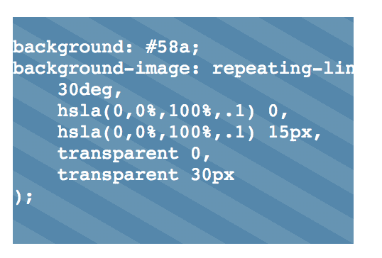

    .box12 {
        background: #58a;
        background-image: repeating-linear-gradient(
                30deg,
                hsla(0,0%,100%,.1) 0, hsla(0,0%,100%,.1) 15px,
                transparent 0, transparent 30px);
    }

### 5.7. 相关

示例：[./demo/2.5.html](./demo/2.5.html)

规范：[CSS 图像](http://w3.org/TR/css-images) 、[CSS 背景与边框](http://w3.org/TR/css-backgrounds)、[CSS 图像(第四版)](http://w3.org/TR/css4-images)

## 6. 复杂的背景图案

CSS3 图案库：http://lea.verou.me/css3patterns/

### 6.1. 难题

条纹只是几何图案中最简单的一种，我们还需要很多其他类型的图案，
如网格、波点、棋盘。

用CSS渐变来创建任何种类的几何图案都是可能的，
只不过有时这种方法不太实际。

### 6.2. 网格

把多个渐变图案组合起来，让它们透过彼此的透明区域显现。

**桌布（方格纹）图案**：

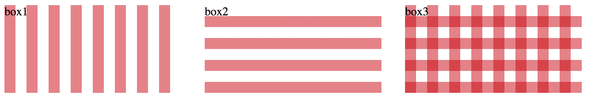

    .box1, .box2, .box3 {
        background: white;
        background-size: 30px 30px;
    }
    .box1 {
        background-image:
            linear-gradient( 90deg, 
                rgba(200,0,0,.5) 50%,
                transparent 0 );
    }
    .box2 {
        background-image:
            linear-gradient( 0deg, 
                rgba(200,0,0,.5) 50%,
                transparent 0 );
    }
    .box3 {
        background-image:
            linear-gradient( 0deg, 
                rgba(200,0,0,.5) 50%,
                transparent 0 ),
            linear-gradient( 90deg, 
                rgba(200,0,0,.5) 50%,
                transparent 0 );
    }

**蓝色网格图案**：

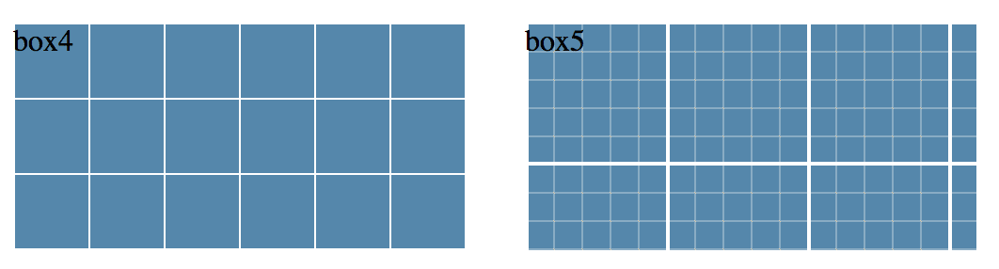

    .box4 {
        background: #58a;
        background-image:
            linear-gradient( 0deg, 
                white 1px, transparent 0 ),
            linear-gradient( 90deg, 
                white 1px, transparent 0 )
            ;
        background-size: 40px 40px;
    }
    .box5 {
        background: #58a; background-image:
            linear-gradient(0deg,
                white 2px, transparent 0),
            linear-gradient(90deg, 
                white 2px, transparent 0),

            linear-gradient(0deg,
                hsla(0,0%,100%,.3) 1px, transparent 0),
            linear-gradient(90deg,
                hsla(0,0%,100%,.3) 1px, transparent 0);

        background-size: 75px 75px, 75px 75px,
                            15px 15px, 15px 15px;
    }

### 6.3. 波点

径向渐变允许我们创建圆形、椭圆，或是它们的一部分。
径向渐变能够创建的最简单的图案是圆点的阵列。

**圆点的阵列**

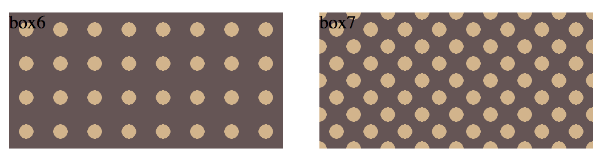

    .box6 {
        background: #655;
        background-image: 
            radial-gradient(tan 30%, transparent 0); 
        background-size: 30px 30px;
    }
    .box7 {
        background: #655;
        background-image: 
            radial-gradient(tan 30%, transparent 0),
            radial-gradient(tan 30%, transparent 0); 
        background-size: 30px 30px;
        background-position: 0 0, 15px 15px;
    }

为了达到效果，第二层背景的偏移定位值必须是贴片宽高的一半。
这意味着如果要改动贴片的尺寸，需要修改四处，
赶紧把它转换成这个 mixin 吧:

    # 创建
    @mixin polka($size, $dot, $base, $accent) {        
        background: $base;
        background-image:
        radial-gradient($accent $dot, transparent 0),
        radial-gradient($accent $dot, transparent 0); background-size: $size $size; 
        background-position: 0 0, $size/2 $size/2;
    }

    # 调用：
    @include polka(30px, 30%, #655, tan);

### 6.4. 棋盘

棋盘图案在很多场景下都会用到。
用两个直角三角形来拼合出我们想要的方块。

实现流程：

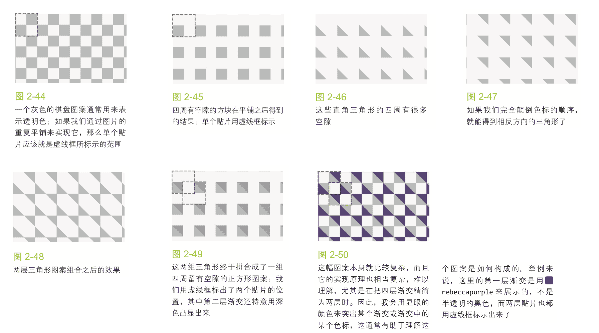

示例：

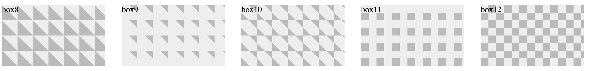

    .box8 {
        background: #eee; 
        background-image:
            linear-gradient(45deg, 
                #bbb 50%, transparent 0); 
        background-size: 30px 30px;
    }
    .box9 {
        background: #eee; 
        background-image:
            linear-gradient(45deg, 
                transparent 75%, #bbb 0); 
        background-size: 30px 30px;
    }
    .box10 {
        background: #eee; 
        background-image:
            linear-gradient(45deg, 
                #bbb 25%, transparent 0),
            linear-gradient(45deg, 
                transparent 75%, #bbb 0); 
        background-size: 30px 30px;
    }
    .box11 {
        background: #eee; 
        background-image:
            linear-gradient(45deg, 
                #bbb 25%, transparent 0),
            linear-gradient(45deg, 
                transparent 75%, #bbb 0); 
        background-position: 0 0, 15px 15px; 
        background-size: 30px 30px;
    }
    .box12 {
        background: #eee; 
        background-image:
            linear-gradient(45deg, 
                #bbb 25%, transparent 0),
            linear-gradient(45deg, 
                transparent 75%, #bbb 0),
            linear-gradient(45deg, 
                #bbb 25%, transparent 0),
            linear-gradient(45deg, 
                transparent 75%, #bbb 0);
        background-position: 
            0 0, 15px 15px,
            15px 15px, 30px 30px;
        background-size: 30px 30px;
    }

minx：

    @mixin checkerboard(
        $size, 
        $base, 
        $accent: rgba(0,0,0,.25)) 
    {
        background: $base; 
        background-image:
            linear-gradient(45deg,
                $accent 25%, 
                transparent 0,
                transparent 75%, 
                $accent 0), 
            linear-gradient(45deg,
                $accent 25%, 
                transparent 0,
                transparent 75%, 
                $accent 0); 
        background-position: 
                0 0, $size $size;
        background-size: 2*$size 2*$size;
    }

    # 使用
    @include checkerboard(15px, #58a, tan);

svg：

    <svg xmlns="http://www.w3.org/2000/svg" width="100" height="100" fill-opacity=".25" >
        <rect x="50" width="50" height="50" />
        <rect y="50" width="50" height="50" /> 
    </svg>

把 SVG 文件以 data URI 的方式内嵌到样式表中：

    background: #eee url('data:image/svg+xml,\
            <svg xmlns="http://www.w3.org/2000/svg" \
                 width="100" height="100" \
                 fill-opacity=".25">\
            <rect x="50" width="50" height="50" /> \
            <rect y="50" width="50" height="50" /> \
            </svg>');
    background-size: 30px 30px;

### 6.5. 相关规范

* CSS 图像：http://w3.org/TR/css-images 
* „CSS 背景与边框：http://w3.org/TR/css-backgrounds
* 可缩放矢量图形(SVG)：http://w3.org/TR/SVG
* „CSS 图像(第四版)：http://w3.org/TR/css4-images