 # 形状

## 1. 自适应的椭圆

### 1.1. 难题

给任何正方形元素设置一个足够大的 `border-radius`，就可以把它变成一个圆形。

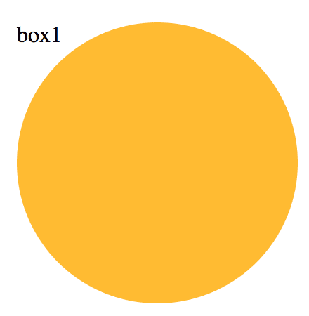

    .box1 {
        width: 200px;
        height: 200px;
        border-radius: 100px; /* >= 正方形边长的一半 */
    }

如果指定任何大于 100px 的半径，仍然可以得到一个圆形。规范特别指出了这其中的原因：

>“当任意两个相邻圆角的半径之和超过 border box 的尺寸时，用户代理必须按比例减小各个边框半径所使用的值，直到它们不会相互重叠为止。” <br>
>——CSS 背景与边框(第三版)(http://w3.org/TR/css3-background/#corner-overlap)

不过，我们往往不愿意对一个元素指定固定的宽度和高度，因为我们希望它能 **根据其内容自动调整并适应**

我们通常期望达到这个效果:**如果它的宽高相等，就显示为一个圆;如果宽高不等，就显示为一个椭圆**。

### 1.2. 小花絮

**为什么叫border-radius?**

可能有人会奇怪，border-radius 到底由何得名。这个属性并不需要边框来参与工作，似乎把它叫作 corner-radius 更贴切一些。这个名字乍听起来确实让人摸不着头脑，其实原因在于 border-radius 是对元素的 border box 进行切圆角处理的。当元素没有边框时，可能还看不出差异;当它有边框时，则以边框外侧的拐角作为切圆角的基准。边框内侧的圆角会稍小一些(严格来说内角半径将是 max(0, border-radius-border-width))。


### 1.3. 解决方案

`border-radius` 可以单独指定水平和垂直半径，只要用一个斜杠(`/`)分隔这两个值即可。

这个特性允许我们在拐角处创建椭圆圆角：

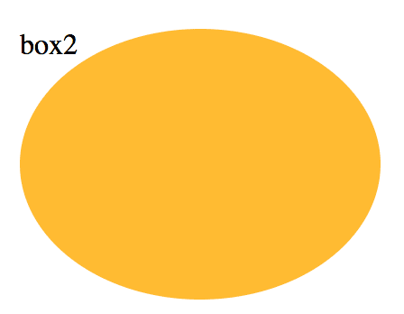

    .box2 {
        width: 200px;
        height: 150px;
        border-radius: 100px / 75px;
    }

这段代码存在一个很大的缺陷:只要元素的尺寸发生变化，`border-radius` 的值就得跟着改。

`border-radius` 这个属性还有另外一个鲜为人知的真相，它不仅可以接受长度值，还可以接受百分比值。

这个百分比值会基于元素的尺寸进行解析，即宽度用于水平半径的解析，而高度用于垂直半径的解析。这意味着相同的百分比可能会计算出不同的水平和垂直半径。因此，如果要创建一个自适应的椭圆，我们可以把这两个半径值都设置为 50%:

    border-radius: 50% / 50%;

由于斜杠前后的两个值现在是一致的(即使它们最终可能会被计算为不同的值)，我们可以把这行代码进一步简化为:

    border-radius: 50%;

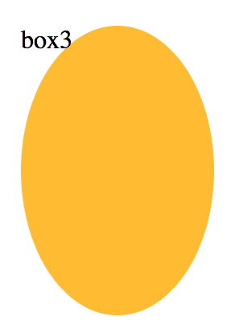

最终，只需要这一行代码，我们就可以得到一个自适应的椭圆了。

### 1.4. 半椭圆

半椭圆是沿纵轴对称，而不是沿横轴对称的，我们需要给每个角指定不同的半径。

border-radius 是一个简写属性，我们可以为元素的每个角指定不同的值

    border-top-left-radius
    border-top-right-radius
    border-bottom-right-radius
    border-bottom-left-radius

也可以仍旧使用 border-radius 这个简写属性：

    border-radius: 水平方向的半径 / 垂直方向的编辑;


在掌握了这个新发现的知识之后，现在让我们来重新审视半椭圆的问题。以这样的方式来指定 border-radius 真的可以生成我们想要的形状吗?试了才知道。让我们先来观察一些细节。

* 这个形状是垂直对称的，这意味着左上角和右上角的水平半径值应该是相同的;与此类似，左下角和右下角的水平半径值也应该是相同的。
* 顶部边缘并没有平直的部分(也就是说，整个顶边都是曲线)，这意味着左上角和右上角的水平半径之和应该等于整个形状的宽度。
* 基于前两条观察，我们可以推断出，左半径和右半径在水平方向上的值应该均为 50%。
* 再看看垂直方向，似乎顶部的两个圆角占据了整个元素的高度，而且底部完全没有任何圆角。因此，在垂直方向上 border-radius 的合理值似乎就是 100% 100% 0 0。
* 因为底部两个角的垂直圆角是零，那么它们的水平圆角是多少就完全不重要了，因为此时水平圆角总是会被计算为零。(你能想像一个 垂直半径为零而水平半径为正值的圆角吗?没错，连写规范的作者们都做不到。)

把所有这些结论综合起来，我们就可以很容易地写出 CSS 代码，来生成那样自适应的半椭圆:

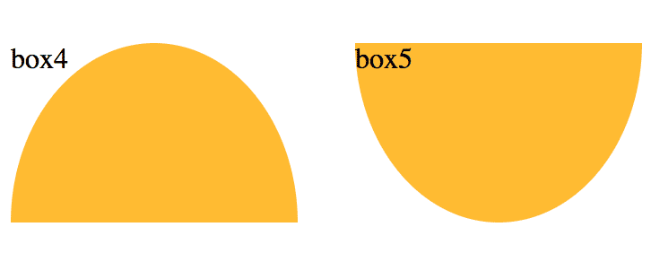

    .box4 {
        width: 160px;
        height: 100px;
        border-radius: 50% / 100% 100% 0 0;
    }
    .box5 {
        width: 160px;
        height: 100px;
        border-radius: 50% / 0 0 100% 100%;
    }

### 1.5. 四分之一椭圆

要创建一个四分之一椭圆，其中一个角的水平和垂直半径值都需要是 100%，而其他三个角都不能设为圆角。

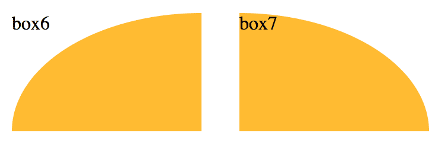

由于这四个角的半径在水平和垂直方向上都是相同的，我们甚至都不需要使用斜杠语法了。最终代码应该是这样的:

    .box6 {
        width: 160px;
        height: 100px;
        border-radius: 100% 0 0 0;
    }
    .box7 {
        width: 160px;
        height: 100px;
        border-radius: 0 100% 0 0;
    }

你不免还会顺着往下想，是不是还能用 border-radius 来生成椭圆的 其他切块(比如八分之一椭圆、三分之一椭圆)?很遗憾，你可能会失望了，因为 border-radius 属性是无法生成这些形状的。

### 1.6. 糖果按钮

http://simurai.com/archive/buttons/

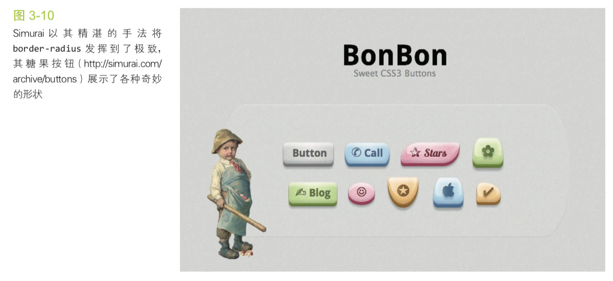

### 1.7. 相关规范

* [CSS 背景与边框](http://w3.org/TR/css-backgrounds)


## 2. 平行四边形

### 2.1. 难题

平行四边形其实是矩形的超集:它的各条边是两两平行的，但各个角则不一定都是直角。在视觉设计中，平行四边形往往可以传达出一种动感。

用 CSS 创建一个按钮状的平行四边形链接，可以通过 skew() 的变形属性来对这个矩形进行斜向拉伸：

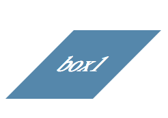

```CSS
.box1 {
    background: #58a;
    transform: skewX(-45deg);
}
```

但是，这导致它的内容也发生了斜向变形，有没有办法只让容器的形状倾斜，而保持其内容不变呢?

### 2.2. 嵌套元素方案

对内容再应用一次反向的 skew() 变形，从而抵消容器的变形效果。
不幸的是，这意味着我们将不得不使用一层额外的 HTML 元素来包裹内容：

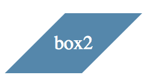

```html
<div class="box2">
    <span>box2</span>
</div>
```

```css
.box2 {
    background: #58a;
    transform: skewX(-45deg);
}
.box2 span {
    display: inline-block;
    transform: skewX(45deg);
}
```

如果你想把这个效果应用到一个默认显示为行内的元素，不要忘记把它的 display 属性设置为其他 值， 比如 inline-block 或 block，否则变形是不会生效的。这一点对它内层的元素也是适用的。

如果结构层的变更是不允许的，或者你希望严格保持结构层的纯净度，别担心，我们还有一个纯 CSS 的解决方案。

### 2.3. 伪元素方案

另一种思路是把所有样式(背景、边框等)应用到伪元素上，然后再对伪元素进行变形。因为我们的内容并不是包含在伪元素里的，所以内容并不会受到变形的影响。

我们希望伪元素保持良好的灵活性，可以自动继承其宿主元素的尺寸，甚至当宿主元素的尺寸是由其内容来决定时仍然如此。

一个简单的办法是 给宿主元素应用 `position: relative` 样式，并为伪元素设置 `position: absolute`，然后再把所有偏移量设置为零，以便让它在水平和垂直方向上都被拉伸至宿主元素的尺寸，并且给伪元素设置 `z-index: -1` 样式，这样它的堆叠层次就会被推到宿主元素之后。

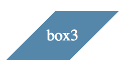

```html
<div class="box3">box3</div>
```

```css
.box3 {
    position: relative;
}
.box3:before {
    content: "";
    z-index: -1;
    position: absolute;
    top: 0; left: 0; right: 0; bottom: 0;
    background: #58a;
    transform: skewX(-45deg);
}
```

这个技巧不仅对 `skew()` 变形来说很有用，还适用于其他任何变形样式，当我们想变形一个元素而不想变形它的内容时就可以用到它。

这个技巧的关键在于，我们利用伪元素以及定位属性产生了一个方块，然后对伪元素设置样式，并将其放置在其宿主元素的下层。这种思路同样可以运用在其他场景中，从而得到各种各样的效果。

### 2.4. 相关规范

* [CSS 变形](http://w3.org/TR/css-transforms)

## 3. 菱形图片

### 3.1. 难题

在视觉设计中，把图片裁切为菱形是一种常见的设计手法，但在 CSS 中还没有一种简单直观的方法来实现它。事实上，直到最近，这种效果才基本成为可能。当网页设计师想要实现这种设计风格时，他们通常不希望在图像处理软件中预先把图片裁好。显然不用说你也知道，这个方法的可维护性并不好。如果未来有人想修改图片风格，将很难增加其他效果，而且最终往往会搞得一团糟。

### 3.2. 基于变形的方案

需要把图片用一个 `<div>` 包裹起来，然后对其应用相反的 `rotate()` 变形样式:

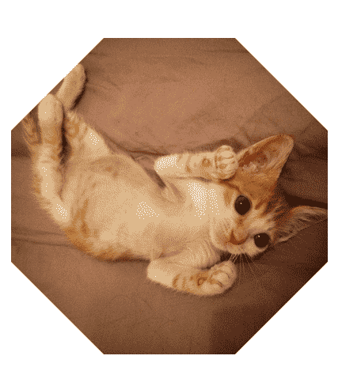

```html
<style>
    .picture1 {
        width: 200px;
        height: 200px;
        transform: rotate(45deg);
        overflow: hidden;
    }
    .picture1 > img {
        max-width: 100%;
        transform: rotate(-45deg);
    }
</style>

<div class="picture1">
    
</div>
```

它并没有一步到位地直接达到我们期望的效果，除非我们期望的效果是把它裁成一个八角形。

主要问题在于`max-width: 100%`这条声明。100%会被解析为容器 (.picture)的边长。
但是，我们想让图片的宽度与容器的对角线相等，而不是与边长相等。

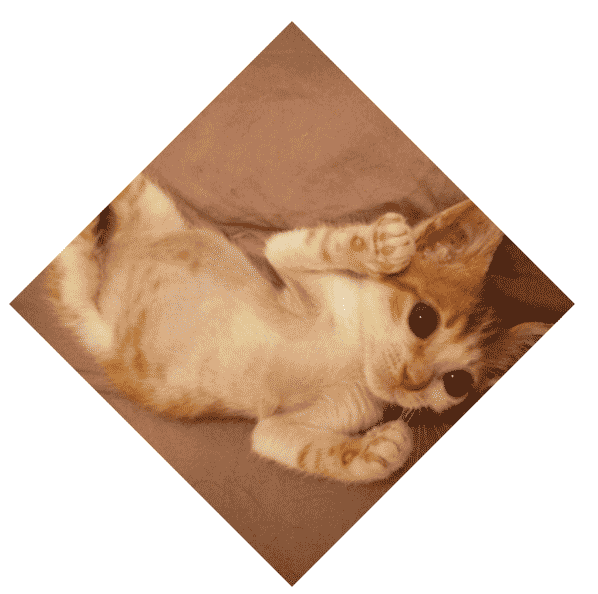

```html
<style>
    .picture2 {
        width: 200px;
        height: 200px;
        transform: rotate(45deg);
        overflow: hidden;
    }
    .picture2 > img {
        max-width: 100%;
        transform: rotate(-45deg) scale(1.42);
    }
</style>

<div class="picture2">
    
</div>
```

### 3.3. 裁切路径方案

上面的方法确实可以奏效，但它基本上是一个 hack。这个方法需要一层额外的 HTML 标签，这不够简洁；代码本身也不够直观；它甚至还不够健壮——如果我们碰巧要处理一张非正方形的图片，这个小把戏就会原形毕露。

事实上，我们还有一个更好的办法来完成这个任务。它的主要思路是使用 clip-path 属性。这个特性也是从 SVG 那里借鉴而来，已经可以应用在 HTML 元素上了(至少对于支持的浏览器来说是这样的)。

你可能比较熟悉图像处理软件(比如 Adobe Photoshop)中的裁切路径 功能。裁切路径允许我们把元素裁剪为我们想要的任何形状。在这个例子中，我们将会使用 polygon()(多边形)函数来指定一个菱形。实际上，它允许我们用一系列(以逗号分隔的)坐标点来指定任意的多边形。我们甚至可以使用百分比值，它们会解析为元素自身的尺寸。

clip-path 所能创造的奇迹还不止于此。这个属性甚至可以参与动画，只要我们的动画是在同一种形状函数(比如这里是 polygon())之间进行的，而且点的数量是相同的。因此，如果我们希望图片在鼠标悬停时平滑地扩展为完整的面积

```html
<style>
    img {
        width: 200px;
        clip-path: polygon(50% 0, 100% 50%, 50% 100%, 0 50%);
    }
    img:hover {
        clip-path: polygon(0 0, 100% 0,100% 100%, 0 100%);
    }
</style>


```

### 3.4. 相关

规范：
* [CSS 变形](http://w3.org/TR/css-transforms)
* [CSS 遮罩](http://w3.org/TR/css-masking)
* [CSS 过渡](http://w3.org/TR/css-transitions)

## 4. 切角效果

### 4.1. 难题

把角切掉一种非常流行的设计风格，不论是在印刷媒介还是在网页设计中都是如此。它最常见的形态是把元素的一个或多个角切成 45°的缺口(也称作斜面切角)。

尤其是在最近，当扁平化设计的风头完全盖过拟物化之后，这种效果就愈发流行了。当切角效果只应用在元素的某一侧，且切角的尺寸刚好达到元素高度的 50% 时，就会得到一个箭头形状，这在按钮和面包屑导航中的应用非常普遍。


但是，目前的 CSS 仍然无法做到只用一行简单直观的代码就生成这样的效果。这导致绝大多数网页开发者倾向于使用背景图片来达到目的，比如使用三角形盖住元素的顶角来模拟切角效果(当网页背景是纯色时)，或者使用一张或多张已经切过角的图片来作为整个元素的背景。

### 4.2. 解决方案

第一种方案来自于无所不能的 CSS 渐变。假设我们只需要一个角被切掉的效果，以右下角为例。这其中最大的窍门在于充分利用渐变的一大特性:渐变可以接受一个角度(比如 45deg)作为方向，而且色标的位置信息也可以是绝对的长度值，这一点丝毫不受容器尺寸的影响。

综合以上这些想法，我们只需要一个线性渐变就可以达到目标。这个渐变需要把一个透明色标放在切角处，然后在相同位置设置另一个色标，并且把它的颜色设置为我们想要的背景色。CSS 代码如下所示(假设切角的深度是15px):

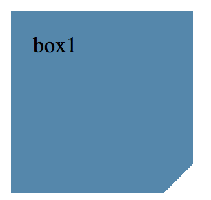

```html
<style>
    .box1 {
        background: #58a;
        background: 
            linear-gradient(-45deg,
                transparent 15px, #58a 0
            );
    }
</style>
<div class="box1">box1</div>
```

事实上，第一行声明并不是必需的，加上它是将其作为回退机制:如果某些浏览器不支持 CSS 渐变，那第二行声明会被丢弃，而此时我们至少还能得到一个简单的实色背景。

现在，假设我们想要两个角被切掉的效果，以底部的两个角为例。

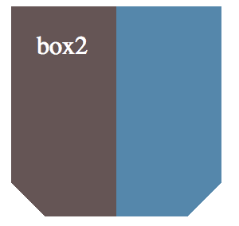

```html
<style>
    .box2 {
        background: #58a;
        background:
            linear-gradient(-45deg, 
                transparent 15px, #58a 0) right,
            linear-gradient(45deg, 
                transparent 15px, #655 0) left;
        /* 背景图片的尺寸都是 50%的宽和100%的高 */
        background-size: 50% 100%; 
        /* 避免背景图片平铺 */
        background-repeat: no-repeat;
    }
</style>
<div class="box2">box2</div>
```

把四个角都做出切角效果：

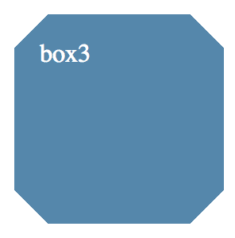

```html
<style>
    .box3 {
        background: #58a; 
        background:
            linear-gradient(135deg,  
                transparent 15px, #58a 0) top left,
            linear-gradient(-135deg, 
                transparent 15px, #58a 0) top right,
            linear-gradient(-45deg, 
                transparent 15px, #58a 0) bottom right,
            linear-gradient(45deg, 
                transparent 15px, #58a 0) bottom left;
        background-size: 50% 50%; 
        background-repeat: no-repeat;
    }
</style>
<div class="box3">box3</div>
```

我们在改变背景色时需要修改五处;而在改变切角尺寸时需要修改四处。使用预处理器的 mixin 可以帮助我们减少代码的重复度。

```scss
@mixin beveled-corners($bg,
    $tl:0, $tr:$tl, $br:$tl, $bl:$tr) {
    background: $bg; 
    background:
        linear-gradient(135deg, 
            transparent $tl, $bg 0) top left,
        linear-gradient(225deg, 
            transparent $tr, $bg 0) top right,
        linear-gradient(-45deg, 
            transparent $br, $bg 0) bottom right,
        linear-gradient(45deg, 
            transparent $bl, $bg 0) bottom left;
    background-size: 50% 50%;
    background-repeat: no-repeat; 
}

// 调用
@include beveled-corners(#58a, 15px, 5px);
```

### 4.3. 弧形切角

上述渐变技巧还有一个变种，可以用来创建弧形切角(很多人也把这种效果称为“内凹圆角”，因为它看起来就像是圆角的反向版本)。唯一的区别在于，我们会用径向渐变来替代上述线性渐变:

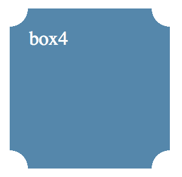

```html
<style>
    .box4 {
        background: #58a; 
        background:
            radial-gradient(circle at top left,
                transparent 15px, #58a 0) top left,
            radial-gradient(circle at top right,
                transparent 15px, #58a 0) top right,
            radial-gradient(circle at bottom right,
                transparent 15px, #58a 0) bottom right,
            radial-gradient(circle at bottom left,
                transparent 15px, #58a 0) bottom left;
        background-size: 50% 50%; 
        background-repeat: no-repeat;
    }
</style>
<div class="box4">box4</div>
```

### 4.4. 内联 SVG 与 border-image 方案

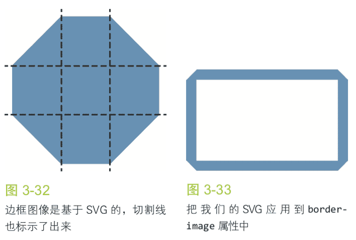

使用 border-image，并通过一个内联的 SVG 图像来产生切角效果。

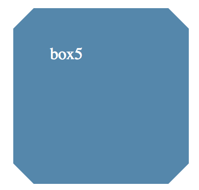

```html
<style>
    .box5 {
        border: 20px solid #58a; 
        border-image: 1 url('data:image/svg+xml,\
            <svg xmlns="http://www.w3.org/2000/svg" \
                width="3" height="3" fill="%2358a">\
                <polygon points="0,1 1,0 2,0 3,1 3,2 2,3 1,3 0,2"/>\
            </svg>'); 
        background: #58a;
        background-clip: padding-box;
    }
</style>
<div class="box5">box5</div>
```

我们甚至可以给它加上动画，因为 border-width 属性是支持动画的!

### 4.5. 裁切路径方案

前面所述的 border-image 方案确实非常紧凑，也比较 DRY，但它还是存在一些局限。举个例子，我们要么指定某个实色的背景，要么指定一个边缘接近某个实色的背景图案。假如我们想设置其他类型的背景(比如纹理、平铺图案或一道线性渐变)，又该如何?

有另外一种方法不存在这种局限，但有着它自已独有的局限。还记得我们在“菱形图片”中用到的 clip-path 属性吗? CSS 裁切路径最神奇的地方在于我们可以同时使用百分比数值(它会以元素自身的宽高作为基数度进行换算)和绝对长度值，从而提供巨大的灵活性。

```css
background: #58a; 
clip-path: polygon(
    20px 0, calc(100% - 20px) 0, 100% 20px,
    100% calc(100% - 20px), calc(100% - 20px) 100%,
    20px 100%, 0 calc(100% - 20px), 0 20px
);
```

这个方法最大的好处在于，我们可以使用任意类型的背景，甚至可以对替换元素(比如图片)进行裁切。

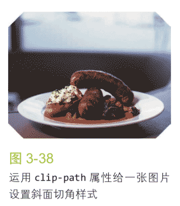

### 4.6. 关于未来的切角效果

未来，我们再也不需要费尽心机地动用 CSS 渐变、裁切或 SVG 来实现这个效果了。CSS 背景与边框(第四版)(http://dev.w3.org/csswg/css-backgrounds-4/)将引入一个全新的属性 `corner-shape`，可以彻底解决这个痛点。这个属性需要跟 `border-radius` 配合使用，从而产生各种不同形状的切角效果，而切角的尺寸正是 `border-radius` 的值。举例来说，为容器的四个角指定 15px 的斜面切角就是如此简单:

```css
border-radius: 15px; 
corner-shape: bevel;
```

### 4.7. 相关

规范：
* [CSS 背景与边框](http://w3.org/TR/css-backgrounds)
* [CSS 图像](http://w3.org/TR/css-images)
* [CSS 变形](http://w3.org/TR/css-transforms)
* [CSS 遮罩](http://w3.org/TR/css-masking)
* [CSS 过渡](http://w3.org/TR/css-transitions)
* [CSS 背景与边框(第四版)](http://dev.w3.org/csswg/css-backgrounds-4)


## 5. 梯形标签页

### 5.1. 难题

一直以来，梯形都是众所周知难以用 CSS 生成的形状，尽管它也十分常用，尤其是对于标签页来说。网页开发者如果没有用精心设计的背景图片来实现梯形，那多半就是在用边框来模拟梯形两侧的斜边(参见图 3-39)。

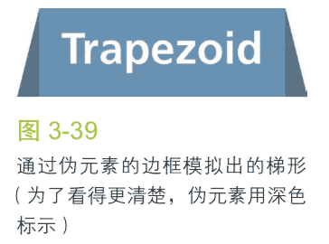

它还不是最佳方案，它用光了仅有的两个伪元素，而且在样式层面上也不够灵活。举个例子，当我们要给梯形标签页增加一圈边框、一层纹理背景，或者要在其顶部设置圆角时，就只能自求多福了。

### 5.2. 解决方案

如果有一组 2D 变形属性可以生成一个梯形，我们就可以利用“平行四边形”涉及的技巧来达到目的。然而遗憾的是并没有。

试想在现实的三维世界中旋转一个矩形。由于透视的关系，我们最终看到的二维图像往往就是一个梯形!谢天谢地，我们可以在 CSS 中用 3D 旋转来模拟出这个效果:

    transform: perspective(.5em) rotateX(5deg);

你可以在图 3-42 中看到这行代码所生成的梯形。当然，由于我们是对整个元素应用 3D 变形的，因此它上面的文字也变形了。对元素使用了 3D 变形之后，其内部的变形效应是“不可逆转”的，这一点跟 2D 变形不同。

因此，如果我们想发挥 3D 变形的功能来生成梯形，唯一可行的途径就是把变形效果作用在伪元素上。

```css
nav > a {
    position: relative; 
    display: inline-block; 
    padding: .3em 1em 0;
}
nav > a::before { 
    content: '';
    position: absolute;
    top: 0; right: 0; bottom: 0; left: 0; 
    z-index: -1;
    background: #ccc;
    background-image: 
        linear-gradient(
            hsla(0,0%,100%,.6),
            hsla(0,0%,100%,0)
        ); 
    border: 1px solid rgba(0,0,0,.4);
    border-bottom: none;
    border-radius: .5em .5em 0 0;
    box-shadow: 0 .15em white inset;
    transform: perspective(.5em) rotateX(5deg); 
    transform-origin: bottom;
}
```

如你所见，我们给它添加了背景、边框、圆角、投影等一系列样式。 它们都可以完美生效!不仅如此，我们只需要 `transform-origin` 改成 `bottom left` 或 `bottom right`，就可以立即得到左侧倾斜或右侧倾斜的标签页(参见图 3-49)!

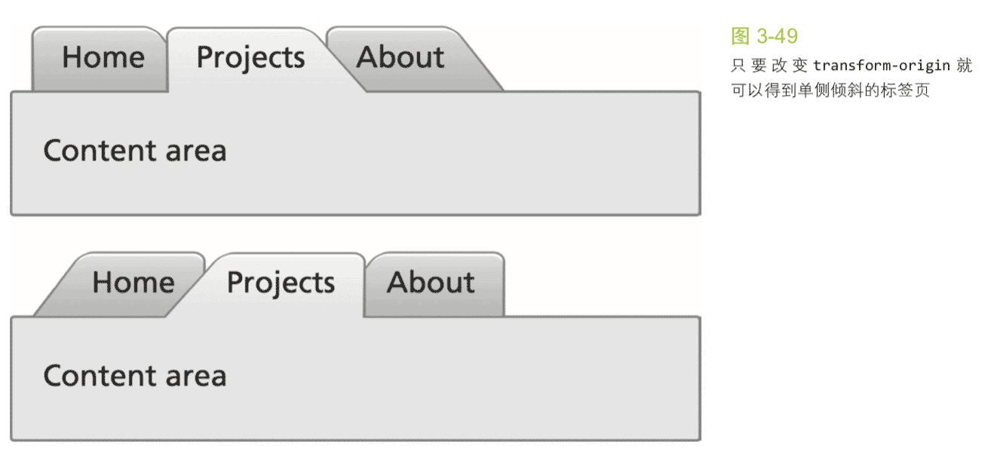

尽管优点多多，但这个技巧也不是完美无缺的。它存在一个非常大的缺点:斜边的角度依赖于元素的宽度。因此，当元素的内容长度不等时，想要得到斜度一致的梯形就很伤脑筋了。不过，对于宽度变化不大的多个元素(比如导航菜单)来说，这个方法还是非常管用的。在这种场景下，斜度的差异非常难以察觉。

参考：http://dabblet.com/gist/1345dc9399dc8e794502

### 相关

规范：
* [CSS 变形](http://w3.org/TR/css-transforms)