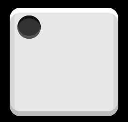
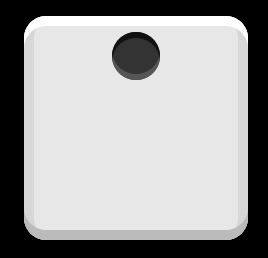

# 弹性布局：实例

## 1. 参考

* [Flex 布局教程：实例篇](http://www.ruanyifeng.com/blog/2015/07/flex-examples.html)

## 2. 骰子的布局

[codepen](http://codepen.io/LandonSchropp/pen/KpzzGo)上的 demo。

默认结构和样式：

```css
body {
  background: #000;
}

.box {
  width: 104px;
  height: 104px;
  padding: 4px;
  margin: 16px;
  background-color: #e7e7e7;
  border-radius: 10%;
  object-fit: contain;
  box-shadow:
    inset 0 5px white,
    inset 0 -5px #bbb,
    inset 5px 0 #d7d7d7,
    inset -5px 0 #d7d7d7;
}

.item {
  display: block;
  width: 24px;
  height: 24px;
  margin: 4px;
  background-color: #333;
  border-radius: 50%;
  box-shadow: inset 0 3px #111, inset 0 -3px #555;
}
```

```html
<div class="box">
  <span class="item"></span>
</div>
```

### 2.1. 单项目

首先，只有左上角1个点的情况。Flex布局默认就是首行左对齐，所以一行代码就够了。



```css
.box {
  display: flex;
}
```

设置项目的对齐方式，就能实现居中对齐和右对齐。



```css
.box {
  display: flex;
  justify-content: center;
}
```
