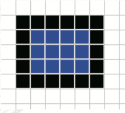
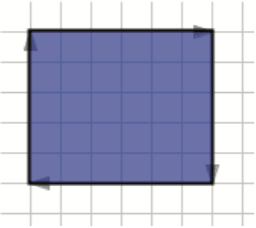
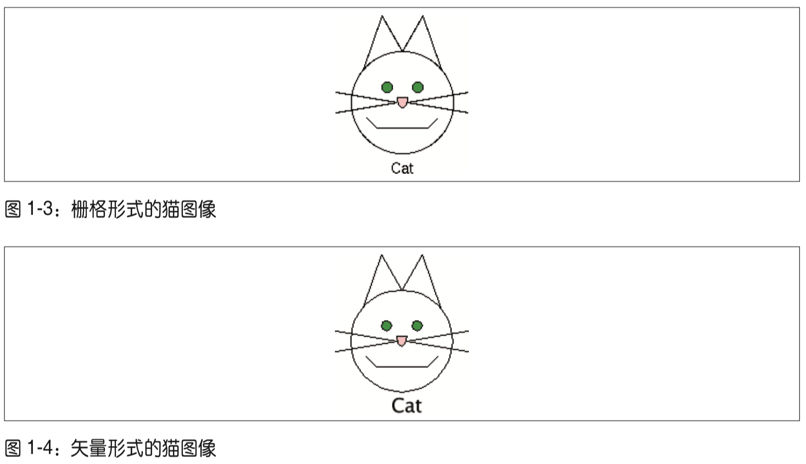
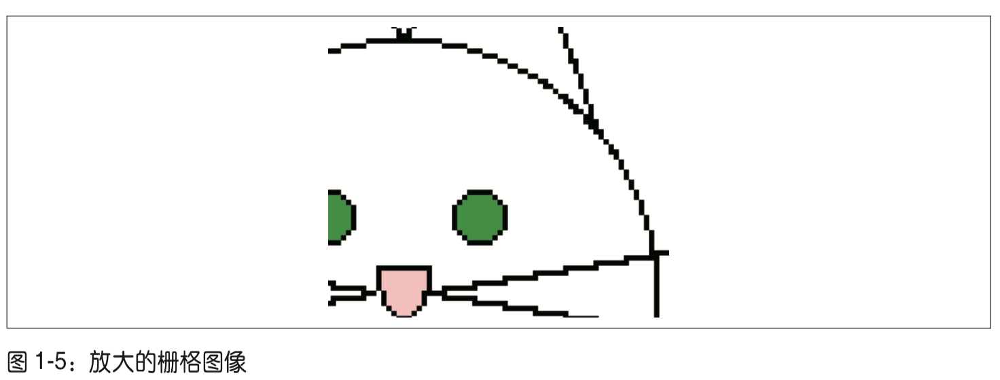
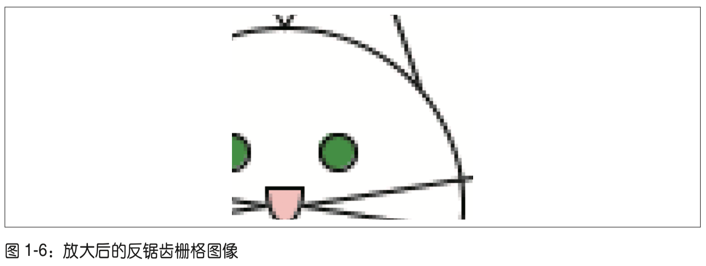
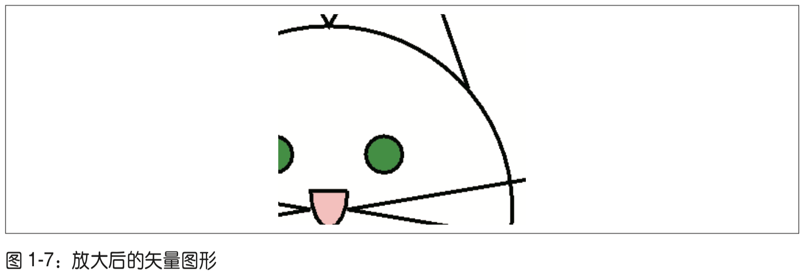
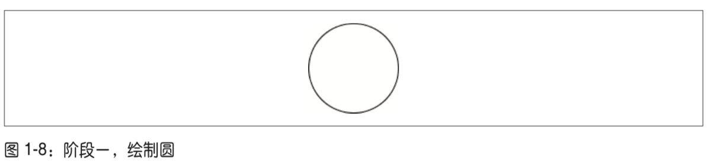
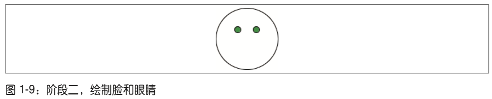

 # 入门指南

 SVG（Scalable Vector Graphics），是一种XML应用，
 以一种简洁、可移植的形式表示图形信息。

## 1. 图形系统

计算机描述图形信息的两大系统：
* 栅格图形（raster graphics）
* 矢量图形(vector graphics)

### 1.1. 栅格图形

在栅格图形系统中，图像被表示为图片像素的长方形数组。



每个像素用其 RGB 颜色值或者颜色表内的索引表示。

这一系列像素也称为位图(bitmap)，通常以某种压缩格式存储。由于大多数现代显示设备也是栅格设备，显示图像时仅需要一个阅读器将位图解压缩并将它传输到屏幕上。

### 1.2. 矢量图形

在矢量图形系统中，图像被描述为一系列几何形状。矢量图形阅读器接受在指定坐标集上绘制形状的指令，而不是接受一系列已经计算好的像素。



**比较**

栅格图形的工作就像是描述哪个方格应该填充什么颜色，而矢量图形的工作则像是描述要绘制从某个点到另一个点的直线或曲线。

有些人把矢量图形描述为一组绘图指令，而位图(栅格图形)则是在特定的位置填充颜色的点。

矢量图形“知道”它们是什么——方块“知道”它是一个方块，文本“知道”它是文本。由于矢量图形是对象而不是一系列像素，因此矢量对象可以改变它们的形状和颜色，而位图则不能。

此外，所有文本都是可搜索的，因为无论看起来是什么样子或者做了怎样的旋转或变换，它们实际上还是文本。

还可以将栅格图形想象为画布上的绘画，而矢量图形则是由可伸缩材料构成的直线和形状，它们可以在背景上移动。

### 1.3. 栅格图形的用途

栅格图像最适合用来表示照片，因为照片很少由明显的线条和曲线组成。

扫描的图像也通常被存储为位图，即使它最初可能是一张线图，但人们也希望存储的是整个图像，而并不关心它的各个组成部分。

比如传真机就不关心你绘制的是什么，它只是使用栅格图形将像素从一个地方传输到另一个地方。

创建栅格格式图像的工具很多，而且通常比许多矢量图形的工具更好用。压缩和存储栅格图像的方式(格式)有很多种，并且这些格式的内部规则都是公开的。用于读写 JPEG、 GIF 和 PNG 等压缩格式的程序库唾手可得。这也是 SVG 出现之前 Web 浏览器只支持栅格图像的部分原因。

### 1.4. 矢量图形的用途

矢量图形用于以下领域。

* 计算机辅助绘图(Computer Assisted Drafting，CAD)程序，因为精确地测量和放大绘图以便查看细节非常重要。
* 设计用于高分辨率打印图像的程序，例如 Adobe Illustrator。
* Adobe PostScript 打印和成像语言，打印的每个字符都用直线和曲线来描述。

大多数矢量图形的内部规则都是专用的，预览和创建这些图像需要对应的程序。

## 2. 可缩放

尽管矢量图形不像栅格图形那么流行，但它可以缩放而不损失图像质量，因而在许多应用程序中具有不可估量的价值。

例如，这里有两个猫图像。图 1-3 是栅格图像，图 1-4 是一个矢量图像。它们都显示在一个 PPI 为 72 的屏幕上。



### 2.1. 放大栅格图像

当显示程序放大栅格图像时，它必须以某种方式扩大每个像素。

要想将图像放大至四倍，最简单的方式就是让每个像素放大为原来的四倍。如图 1-5 所示，结果并不是很理想。



尽管可以使用边缘检测和反锯齿这类技术优化放大后的图像，但是这些技术很耗时。此外，由于栅格图像中的所有像素都是未知的，因此并不能保证相关算法能正确检测到边缘的形状。反锯齿的结果看起来如图 1-6 所示。



### 2.2. 放大矢量图像

另一方面，将矢量图像放大为原来的四倍时，只需图像显示程序将形状的所有坐标都乘以 4，然后用显示设备的完整分辨率重新绘制它们即可。因此，在如图 1-7 所示的 DPI 为 72 的屏幕截图中，线条边缘很清晰，与放大后的栅格图像相比，锯齿明显少多了。


 
## 3. SVG的作用

1998 年，万维网联盟成立了一个工作小组，负责开发作为 XML 应用的矢量图形表示方法。由于 SVG 是 XML 程序，所以图像的有关信息被存储为纯文本，而且它还具有 XML 的开放性、可移植性以及可交互性。

CAD 和图形设计程序通常使用特定的二进制格式存储绘图信息。当它们拥有导入和导出 SVG 格式图像的能力后，这类应用程序就有了一个通用的标准格式来交换信息。

由于 SVG 就是一个 XML 应用，因此它能与其他 XML 处理程序结合使用。例如，数学教科书可以使用 XSL 来对说明性文本进行格式化对象，使用 MathML 描述方程，以及使用 SVG 为方程生成图表。

SVG 工作组制订的规范是一个万维网联盟官方推荐规范。诸如 Adobe Illustrator 和 Inkscape 这类应用程序都可以导入和导出 SVG 格式的绘图。

在 Web 中，许多浏览器都原生支持 SVG，而且 SVG 具有很多与 HTML 中 CSS 样式相同的变换和动画能力。由于 SVG 文件 就是 XML，因此其中的文本可以被使用任何能够解析 XML 的用户代理读取显示。

## 4. 创建一个SVG图像

本节你会看到一个 SVG 文本，内容是本章前面见过的猫的图像。

### 4.1. 文档结构

查看：[./demo/1/1.结构.xml](./demo/1/1.结构.xml)

```xml
<?xml version="1.0"?>
<!DOCTYPE svg PUBLIC "-//W3C//DTD SVG1.1//EN"
    "http://www.w3.org/Graphics/SVG/1.1/DTD/svg11.dtd">
<svg width="140" height="170" xmlns="http://www.w3.org/2000/svg">
    <title>Cat</title>
    <desc>Stick Figure of a Cat</desc>
    <!-- 在这里绘制图像 -->
</svg>
```

`<svg>`
* 根元素
* width、height 指定了整个图像的宽高（单位px） 
* xmlns 属性定义了 SVG 的命名空间

`<title>`：内容可以被阅读器显示在标题栏上，作为鼠标指针指向图像时的提示

`<desc>`：定义完整的描述信息

### 4.2. 基本形状

你可以添加一个 `<circle>` 元素来绘制猫的脸部。

`<circle>`

* cx 属性指定中心点 x 坐标，cy 指定中心点 y 坐标
* 点 (0,0) 为图像的左上角
* 水平向右移动时 x 坐标增大，垂直向下移动时 y 坐 标增大

这个圆的位置和尺寸是绘图结构的一部分。绘图的颜色是表现(presentation)的一部分。 按照 XML 程序的惯例，为了保持最大的灵活性，应该分离结构和表现。表现信息包含在 style 属性中。它的值是一系列表现属性和值，正如附录 B 中所述。这里轮廓的画笔颜色为黑色，填充颜色为 none 以使猫的脸部透明。

查看：[./demo/1/2.基本形状--圆.xml](./demo/1/2.基本形状--圆.xml)

```xml
<?xml version="1.0"?>
<!DOCTYPE svg PUBLIC "-//W3C//DTD SVG1.1//EN"
    "http://www.w3.org/Graphics/SVG/1.1/DTD/svg11.dtd">
<svg width="140" height="170" 
    xmlns="http://www.w3.org/2000/svg">
    <title>Cat</title>
    <desc>Stick Figure of a Cat</desc>
    <circle cx="70" cy="95" r="50" 
        style="stroke: black; fill: none"/> 
</svg>
```



### 4.3. 指定样式属性

接下来添加两个圆作为眼睛。

虽然填充颜色和画笔颜色也是表现的一部 分，但是 SVG 允许我们使用单独的属性指定它们。

填充(fill)和轮廓画笔颜色(stroke)写在两个单独的属性中，而不是全部写在 style 属性中。

查看：[./demo/1/3.绘制脸和眼睛.xml](./demo/1/3.绘制脸和眼睛.xml)

```xml
<?xml version="1.0"?>
<!DOCTYPE svg PUBLIC "-//W3C//DTD SVG1.1//EN"
    "http://www.w3.org/Graphics/SVG/1.1/DTD/svg11.dtd">
<svg width="140" height="170" 
    xmlns="http://www.w3.org/2000/svg"> 
  <title>Cat</title>
  <desc>Stick Figure of a Cat</desc>
  <circle cx="70" cy="95" r="50" style="stroke: black; fill: none;"/> 
  <circle cx="55" cy="80" r="5" stroke="black" fill="#339933"/> 
  <circle cx="85" cy="80" r="5" stroke="black" fill="#339933"/>
</svg>
```

