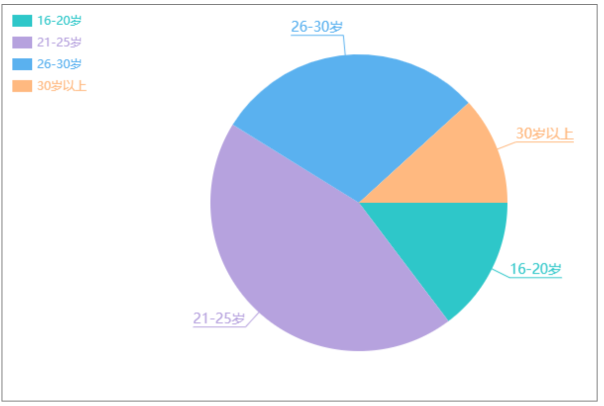
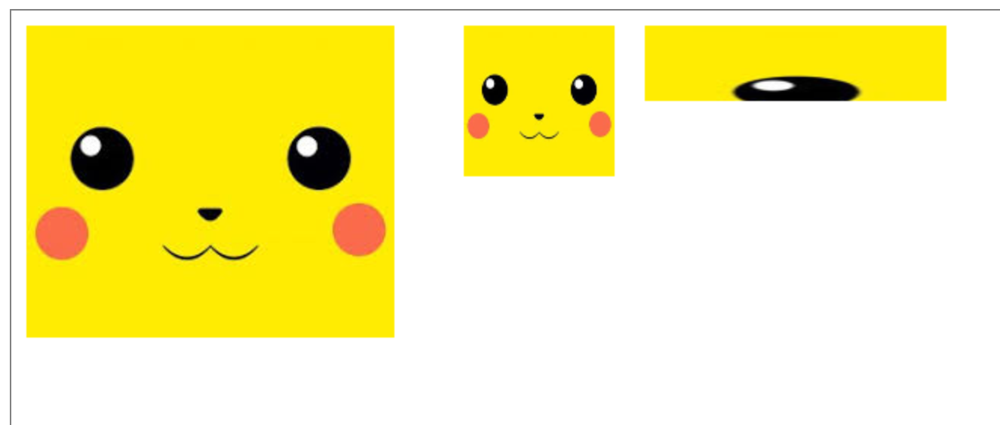

# canvas 教程

## 1. 参考

* [canvas - MDN](https://developer.mozilla.org/zh-CN/docs/Web/API/Canvas_API)

## 2. 引入

参考：[./src/01_hello_world.html](./src/01_hello_world.html)

```html
<style>
    canvas {border : solid 1px #cccccc;}
</style>
<!--
    1.准备画布
        * 画布是白色的，默认 300*150
        * 设置canvas元素的width和height属性来设置画布的大小
-->
<canvas width="400" height="300"></canvas>
<!--
    1. 准备绘制工具，进行绘图
-->
<script>
    // 获取画布
    var myCanvas = document.querySelector( "canvas" );
    // 获取上下文（绘制工具箱）
    var ctx = myCanvas.getContext( "2d" );
    // 移动画笔
    ctx.moveTo( 100, 100 );
    // 绘制直线的轨迹（路径）
    ctx.lineTo( 200, 100 );
    // 描边
    ctx.stroke();
</script>
```

说明：

* 通过样式设置画布的宽高，只是对画布元素进行拉伸。
* 画布的左上角为 原点，水平方向是 x 轴，垂直方向是 y 轴

## 3. 基础

### 3.1. 模糊的问题

**问题：**

线条默认 宽度1px 颜色黑色；但实际看到的却是 2px 灰色

**原因：**

线宽度的中心会与坐标轴的刻度对齐，因此把线分成两个0.5px，无法显示0.5px的色块，
所以颜色不饱和和增加宽度。

**解决：**

偏移 0.5px 即可。

### 3.2. 路径

绘图的轨迹。

移动画笔：`ctx.moveTo(x, y)`

绘制直线轨迹：`ctx.lineTo(x, y)`

### 3.3. 描边

对路径进行描边 `ctx.stroke()`

### 3.4. 开启新路径 ctx.beginPath()

开启新的路径后，对新路径的操作不会受别的影响。

```javascript
ctx.beginPath();

// 移动画笔 ctx.moveTo()
// 绘制路径 ctx.lineTo()
// 设置样式 ctx.strokeStyle ctx.lineWidth

ctx.stroke();
```

### 3.5. 闭合路径 ctx.closePath()

手动闭合的路径，描边时会产生问题，如图：


使用 `ctx.closePath()`，可解决闭合缺角的问题。

参考：[有缺陷的三角形](./src/02_三角形.html)

```javascript
ctx.beginPath();

ctx.moveTo( 100, 100 );
ctx.lineTo( 200, 100 );
ctx.lineTo( 200, 200 );
ctx.lineTo( 100, 100 );

// 不闭合路径，会造成闭合缺角
ctx.closePath();

ctx.lineWidth = 10;

// 描边
ctx.stroke();
```

### 3.6. 填充 ctx.fill()

对路径进行填充 `ctx.fill()`

### 3.7. 非零环绕填充规则

参考：[镂空的正方形](./src/03_镂空的正方形.html)


判断一块区域是否填充的方法：

1. 辅助线：做一条直线，起于区域内，终于无限远

2. 相交值：每个与辅助线相交（交叉）的轨迹
    * 如果是顺时针，则 +1
    * 如果是逆时针，则 -1

3. 得结果
    * 相交值 为0，则不填充
    * 相交值 为1，则填充

### 3.8. 画笔的状态

* `lineWidth` 线宽，默认 1px

   * `ctx.lineWidth = 30`

* `lineCap` 线末端类型， butt （默认）、 round 、square

  * `ctx.lineCap = 'round'`
  * 参考： [./src/04_lineCap.html](./src/04_lineCap.html)

* `lineJoin` 相交线的拐点， miter （默认，直角） 、 round （圆角）、 bevel （斜角）

  * `ctx.lineJoin = 'round'`
  * 参考： [./src/05.lineJoin.html](./src/05.lineJoin.html)

* `strokeStyle` 线的颜色

  * `ctx.strokeStyle = 'red'`

* `fillStyle` 填充颜色
  
  * `ctx.fillStyle = 'red'`

* `setLineDash()` 设置虚线

  * `ctx.setLineDash([10, 20, 30, 40, 50, 60])` 
  * 传排列方式 `[ 实线长, 虚线长, 实线长, 虚线长, ... ]`
  * 参考： [./src/06.dash_line.html](./src/06.dash_line.html)

* `getLineDash()` 获取虚线宽度集合

  * `console.log(ctx.getLineDash()); // [10, 20, 30, 40, 50, 60]`

* `lineDashOffset` 设置虚线偏移量（负值向右偏移）

### 3.9. 绘制渐变的线

从黑到白的线：

```javascript
const ctx = document.querySelector('canvas').getContext("2d");

// 线由点构成
for (let i = 0; i < 256; i++) {
  ctx.beginPath();
  ctx.moveTo(100 + i, 100);
  ctx.lineTo(100 + i + 1, 100);
  ctx.lineWidth = 30;
  ctx.strokeStyle = `rgb(${i},${i},${i})`;
  ctx.stroke();
}
```

参考： [./src/07.gradient_rectangle.html](./src/07.gradient_rectangle.html)

### 3.10. 折线图

#### 3.10.1. 获取画布的宽高

```javascript
// 通过 canvas 元素获取
canvas.width
canvas.height

// 上下文可以获取到 canvas，进而获取宽高
ctx.canvas.width
ctx.canvas.height
```

#### 3.10.2. 绘制网格

参考： [./src/08.line_chart__grid.html](./src/08.line_chart__grid.html)

```html
<canvas width="600" height="400" style="border: solid 1px gray;"></canvas>
<script>
  const canvas = document.querySelector('canvas');
  const ctx = canvas.getContext("2d");

  // 画布的宽高
  const canvasWidth = ctx.canvas.width;
  const canvasHeight = ctx.canvas.height;

  // 网格（单元格）的大小
  const gridSize = 10;

  // 画水平线（偏移 0.5px ，避免线虚）
  const xLineTotal = Math.floor(canvasHeight / gridSize);

  for (let i = 0; i <= xLineTotal; i++) {
    ctx.beginPath();

    ctx.moveTo(0 - 0.5, gridSize * i);
    ctx.lineTo(canvasWidth - 0.5, gridSize * i)

    ctx.strokeStyle = '#eee';
    ctx.stroke();
  }

  // 画垂直线
  const yLineTotal = Math.floor(canvasWidth / gridSize);

  for (let i = 0; i <= yLineTotal; i++) {
    ctx.beginPath();

    ctx.moveTo(gridSize * i - 0.5, 0);
    ctx.lineTo(gridSize * i - 0.5, canvasHeight);

    ctx.strokeStyle = '#eee';
    ctx.stroke();
  }
</script>
```

#### 3.10.3. 绘制坐标轴

参考： [./src/09.line_chart__axis.html](./src/09.line_chart__axis.html)

示例：

```html
<canvas width="600" height="400" style="border: solid 1px gray;"></canvas>
<script>
  const canvas = document.querySelector('canvas');
  const ctx = canvas.getContext("2d");

  // 画布的宽高
  const canvasWidth = ctx.canvas.width;
  const canvasHeight = ctx.canvas.height;

  // 网格（单元格）的大小
  const gridSize = 10;

  // 与画布边缘的距离
  const space = 20;
  // 箭头大小（底 10，高 10）
  const arrowSize = 10;

  // 原点
  const x0 = space - 0.5;
  const y0 = canvasHeight - space - 0.5;

  ctx.strokeStyle = '#000';

  // x 轴
  ctx.beginPath();
  ctx.moveTo(x0, y0);
  ctx.lineTo(canvasWidth - space, y0);
  ctx.stroke();

  // x arrow
  ctx.beginPath();
  ctx.moveTo(canvasWidth - space, y0);
  ctx.lineTo(canvasWidth - space - arrowSize, y0 - arrowSize / 2);
  ctx.lineTo(canvasWidth - space - arrowSize, y0 + arrowSize / 2);
  ctx.closePath();
  ctx.fill();
  

  // y 轴
  ctx.beginPath();
  ctx.moveTo(x0, y0);
  ctx.lineTo(x0, space);
  ctx.stroke();

  // y arrow
  ctx.beginPath();
  ctx.moveTo(x0, space);
  ctx.lineTo(x0 - arrowSize / 2, space + arrowSize);
  ctx.lineTo(x0 + arrowSize / 2, space + arrowSize);
  ctx.closePath();
  ctx.fill();
</script>
```

#### 3.10.4. 绘制点

参考： [./src/10.line_chart__dot.html](./src/10.line_chart__dot.html)

示例：

```html
<canvas width="600" height="400" style="border: solid 1px gray;"></canvas>
<script>
  const canvas = document.querySelector('canvas');
  const ctx = canvas.getContext("2d");

  const cooridate = {
    x: 100,
    y: 100
  };

  const dotSize = 200 - 2;

  // 以坐标点为 左上角 绘制，然后偏移一半的大小
  const offset = dotSize / 2;

  ctx.beginPath();
  ctx.moveTo(cooridate.x - offset, cooridate.y - offset);
  ctx.lineTo(cooridate.x + dotSize - offset, cooridate.y - offset);
  ctx.lineTo(cooridate.x + dotSize - offset, cooridate.y + dotSize - offset);
  ctx.lineTo(cooridate.x - offset, cooridate.y + dotSize - offset);
  ctx.closePath();
  ctx.fill();
</script>
```

#### 3.10.5. 折线图

参考： [./src/11.line_chart__class.html](./src/11.line_chart__class.html)

示例：

```html
<canvas width="600" height="400" style="border: solid 1px gray;"></canvas>
<script>
  class LineChart {
    constructor(canvasSelector) {
      const canvas = document.querySelector('canvas');
      const ctx = canvas.getContext("2d");

      this.canvas = canvas;
      this.ctx = ctx;

      this.gridSize = 10;

      this.axisMargin = 20;
      this.axisArrowSize = 10;

      this.dotSize = 6;

      this.x0 = this.axisMargin;
      this.y0 = canvas.height - this.axisMargin;
    }

    init(data) {
      this.draw(data);
    }

    draw(data) {
      this.drawGrid();
      this.drawAxis();
      this.drawDots(data);
    }

    drawGrid() {
      const { ctx, canvas, gridSize } = this;
      const horizontalLineTotal = Math.floor(canvas.height / gridSize);
      const vertialLineTotal = Math.floor(canvas.width / gridSize);

      ctx.strokeStyle = '#eee';

      for (let index = 1; index <= horizontalLineTotal; index++) {
        ctx.beginPath();
        ctx.moveTo(0, gridSize * index - 0.5);
        ctx.lineTo(canvas.width, gridSize * index - 0.5);
        ctx.stroke();
      }

      for (let index = 1; index <= vertialLineTotal; index++) {
        ctx.beginPath();
        ctx.moveTo(gridSize * index - 0.5, 0);
        ctx.lineTo(gridSize * index - 0.5, canvas.height);
        ctx.stroke();
      }
    }

    drawAxis() {
      const { ctx, canvas, axisMargin, axisArrowSize, x0, y0 } = this;
      
      ctx.strokeStyle = '#000';
      ctx.fillStyle = '#000';

      // x axis
      ctx.beginPath();
      ctx.moveTo(x0, y0 - 0.5);
      ctx.lineTo(canvas.width - axisMargin, y0 - 0.5);
      ctx.stroke();

      // x arrow
      ctx.beginPath();
      ctx.moveTo(canvas.width - axisMargin, y0 - 0.5);
      ctx.lineTo(canvas.width - axisMargin - axisArrowSize, y0 - 0.5 - axisArrowSize / 2);
      ctx.lineTo(canvas.width - axisMargin - axisArrowSize, y0 - 0.5 + axisArrowSize / 2);
      ctx.fill();

      // y axis
      ctx.beginPath();
      ctx.moveTo(x0 - 0.5, y0);
      ctx.lineTo(x0 - 0.5, axisMargin);
      ctx.stroke();

      // y arrow
      ctx.beginPath();
      ctx.moveTo(x0 - 0.5, axisMargin);
      ctx.lineTo(x0 - 0.5 - axisArrowSize / 2, axisMargin + axisArrowSize);
      ctx.lineTo(x0 - 0.5 + axisArrowSize / 2, axisMargin + axisArrowSize);
      ctx.fill();
    }

    drawDots(dots) {
      const { ctx, canvas, axisMargin, dotSize, x0, y0 } = this;
      const dotOffset = dotSize / 2;

      ctx.fillStyle = '#000';

      let prevDot = { canvasX: x0, canvasY: y0 };

      dots.forEach((dot) => {
        const { x, y } = dot;
        const { x: canvasX, y: canvasY } = this.convertToCanvasCooridate(x, y);

        // dot
        ctx.beginPath();
        ctx.moveTo(canvasX - dotOffset, canvasY - dotOffset);
        ctx.lineTo(canvasX + dotSize - dotOffset, canvasY - dotOffset);
        ctx.lineTo(canvasX + dotSize - dotOffset, canvasY + dotSize - dotOffset);
        ctx.lineTo(canvasX - dotOffset, canvasY + dotSize - dotOffset);
        ctx.fill();

        // connect prev dot
        ctx.beginPath();
        ctx.moveTo(prevDot.canvasX, prevDot.canvasY);
        ctx.lineTo(canvasX, canvasY);
        ctx.stroke();

        prevDot = { canvasX, canvasY };
      });
    }

    convertToCanvasCooridate(x, y) {
      const { x0, y0 } = this;

      return {
        x: x0 + x,
        y: y0 - y,  
      }
    }
  }

  const lineChart = new LineChart('canvas');

  lineChart.init([
    { x: 100, y: 100 },
    { x: 200, y: 140 },
    { x: 300, y: 280 },
    { x: 400, y: 80 },
    { x: 500, y: 40 },
  ]);
</script>
```

### 3.11. 绘制矩形

查看：[./src/12.rect.html](./src/12.rect.html) 

相关方法：

* `rect(x, y, w, h)` 没有独立路径（没有 beginPath）

  ```javascript
  // 绘制路径
  ctx.rect(100, 50, 100, 100);
  ctx.fillStyle = 'red'; // 被覆盖
  ctx.fill(); // 被覆盖

  ctx.rect(220, 50, 100, 100);
  ctx.fillStyle = 'green';
  ctx.fill();
  ```

* `strokeRect(x, y, w, h)` 有独立路径，不影响别的绘制

  ```javascript
  ctx.strokeStyle = 'red';
  ctx.strokeRect(100, 200, 100, 100);

  ctx.strokeStyle = 'green';
  ctx.strokeRect(220, 200, 100, 100);
  ```

* `fillRect(x, y, w, h)` 有独立路径，不影响别的绘制

  ```javascript
  ctx.fillStyle = 'red';
  ctx.fillRect(100, 350, 100, 100);

  ctx.fillStyle = 'green';
  ctx.fillRect(220, 350, 100, 100);
  ```
  
* `clearRect(x, y, w, h)` 擦除矩形区域


  ```javascript
  // 擦除指定区域
  ctx.clearRect(220, 350, 50, 50);

  // 擦除整个画布
  ctx.clearRect(0, 0, canvas.width, canvas.height);
  ```
  
### 3.12. 绘制渐变的矩形

查看：[./src/13.gradient_rect.html](./src/13.gradient_rect.html) 

```javascript
// 创建一个线性渐变的方案，跟 PS 拉渐变的线是一样的

// 画布上点，起点
const x0 = 100;
const y0 = 100;

// 画布上点，终点
const x1 = 500;
const y1 = 100;

const linearGradient = ctx.createLinearGradient(x0, y0, x1, y1);

// 0%, red
linearGradient.addColorStop(0, 'red');
// 50%, white
linearGradient.addColorStop(0.5, 'white');
// 100%, red
linearGradient.addColorStop(1, 'red');

ctx.fillStyle = linearGradient;

ctx.fillRect(100, 100, 400, 100);
```

### 3.13. 圆弧绘制

参考：

* [Canvas学习：绘制圆和圆弧](https://www.w3cplus.com/canvas/drawing-arc-and-circle.html)

整圆：

* 角度 360 deg
* 周长 2 * π * r
* 弧度 2 * π

弧度：

* 长度的描述单位
* 一弧度 == r 的长度
* 1deg == 2*π / 360

根据公式绘制线：

* 源码： [./src/14.curve_base.html](./src/14.curve_base.html)

* 示例：

  ```javascript
  // 公式： y = (x + 2) ^ 2
  // 抛物线
  ctx.beginPath()
  ctx.moveTo(0, 0);

  for (let x = 1; x <= 600; x++) {
    const y = Math.pow(x / 10 - 30, 2) + 400;
    ctx.lineTo(x, y)
  }

  ctx.stroke();


  // 公式： y = sin(x)
  // 波形
  ctx.beginPath()
  ctx.moveTo(0, 0);

  for (let x = 1; x <= 600; x++) {
    const y = 100 * Math.sin(x / 20) + 200;
    ctx.lineTo(x, y)
  }

  ctx.stroke();
  ```

#### 3.13.1. 圆弧API

参考： （ [./src/15.arc.html](./src/15.arc.html) ）

* `arc(x, y, r, startAngle, endAngle, anticlockwise)`
* 0, x 正半轴; π/2, y 负半轴
* anticlockwise 是否逆时针，默认 false
* 示例

  ```javascript
  const x = canvas.width / 2;
  const y = canvas.height / 2;
  const radius = 100;
  const startAngle = 0;
  const endAngle = Math.PI / 2;

  ctx.arc(x, y, radius, startAngle, endAngle);

  ctx.stroke();
  ```

#### 3.13.2. 绘制扇形

参考：（ [./src/16.sector.html](./src/16.sector.html) ）

```javascript
const x = canvas.width / 2;
const y = canvas.height / 2;
const radius = 100;
const startAngle = 0;
const endAngle = -Math.PI / 2;

ctx.moveTo(x, y);

ctx.arc(x, y, radius, startAngle, endAngle, true);

ctx.closePath();

ctx.stroke();
```

n等分随机颜色的圆：（ [./src/17.n_equal_circle.html](./src/17.n_equal_circle.html) ）

```javascript
const canvas = document.querySelector('canvas');
const ctx = canvas.getContext("2d");

const x0 = canvas.width / 2;
const y0 = canvas.height / 2;
const radius = 100;

const PI = Math.PI;
const n = 6;
const angle = 2 * PI / n;

const getRandomColor = () => {
  const r = Math.floor(Math.random() * 256);
  const g = Math.floor(Math.random() * 256);
  const b = Math.floor(Math.random() * 256);

  return `rgb(${r}, ${g}, ${b})`;
};

for (let i = 0; i < n; i++) {
  const startAngle = angle * i;
  const endAngle = angle * (i + 1);
  
  ctx.beginPath();
  ctx.moveTo(x0, y0);
  ctx.arc(x0, y0, radius, startAngle, endAngle, false);
  ctx.closePath();

  ctx.fillStyle = getRandomColor();
  ctx.fill();
}
```

根据数据绘制饼图：（[./src/18.pie.html](./src/18.pie.html)）

```javascript
const canvas = document.querySelector('canvas');
const ctx = canvas.getContext("2d");

const x0 = canvas.width / 2;
const y0 = canvas.height / 2;
const radius = 100;

const PI = Math.PI;

const getRandomColor = () => {
  const r = Math.floor(Math.random() * 256);
  const g = Math.floor(Math.random() * 256);
  const b = Math.floor(Math.random() * 256);

  return `rgb(${r}, ${g}, ${b})`;
};

const data = [1, 2, 3, 4];
const total = data.reduce((prev, curr) => prev + curr, 0);
const angleList = data.map(num => (num / total * 2 * PI));

let prevEndAngle = 0;

for (let i = 0; i < angleList.length; i++) {
  let startAngle = prevEndAngle;
  let endAngle = startAngle + angleList[i];

  prevEndAngle = endAngle;

  ctx.beginPath();
  ctx.moveTo(x0, y0);
  ctx.arc(x0, y0, radius, startAngle, endAngle, false);
  ctx.closePath();

  ctx.fillStyle = getRandomColor();
  ctx.fill();
}
```

#### 3.13.3. 绘制文本

* API:

  * ctx.font = '20px 微软雅黑'
  * strokeText(text, x, y, maxWidth) ：描边，maxWidth 偏小时 文本会压缩变形
  * fillText(text, x, y, maxWidth) ：填充
  * ctx.textAlign = 'left' | 'center' | 'right' | 'start' | 'end' ， 基于起点坐标来的
  * ctx.direction = 'rlt' | 'ltr'
  * ctx.textBaseline = 'top' | 'middle' | 'bottom' ：基线，按起始坐标来算
  * measureText() ：TextMetrics { width, ...}

* 注意

  * 起点位置在文字的左下角

* 示例： （ [./src/19.text.html](./src/19.text.html) ）

  ```javascript
  <canvas width="600" height="600" style="border: solid 1px gray;"></canvas>
  <script>
    const canvas = document.querySelector('canvas');
    const ctx = canvas.getContext("2d");

    const canvasWidth = ctx.canvas.width;
    const canvasHeight = ctx.canvas.height;

    const x0 = canvasWidth / 2;
    const y0 = canvasHeight / 2;

    ctx.strokeStyle = '#ddd';

    // x line
    ctx.beginPath();
    ctx.moveTo(0, y0 - 0.5);
    ctx.lineTo(canvasWidth, y0 - 0.5);
    ctx.stroke();

    // y line
    ctx.beginPath();
    ctx.moveTo(x0 - 0.5, 0);
    ctx.lineTo(x0 - 0.5, canvasHeight);
    ctx.stroke();

    ctx.beginPath();

    const text = '您好哇';
    const fontSize = 40;

    ctx.strokeStyle = '#000';

    // 字体：大小 字体
    ctx.font = `${fontSize}px Microsoft YaHei`;

    // 对齐方式： 基于起点坐标来的
    ctx.textAlign = 'center';

    ctx.textBaseline = 'middle'

    // 描边
    // ctx.strokeText(text, x0, y0);

    // 填充
    ctx.fillText(text, x0, y0)

    // 获取文本宽度
    const { 
      width: fontWidth, 
      actualBoundingBoxAscent, 
      actualBoundingBoxDescent,
      fontBoundingBoxAscent,
      fontBoundingBoxDescent,
    } = ctx.measureText(text);

    const space = 4;

    ctx.beginPath();
    ctx.moveTo(x0 - (fontWidth / 2 + space), y0 + (actualBoundingBoxDescent + space));
    ctx.lineTo(x0 + (fontWidth / 2 + space), y0 + (actualBoundingBoxDescent + space));
    ctx.lineTo(x0 + (fontWidth / 2 + space), y0 - (actualBoundingBoxAscent + space));
    ctx.lineTo(x0 - (fontWidth / 2 + space), y0 - (actualBoundingBoxAscent + space));
    ctx.closePath();
    ctx.stroke();
  </script>
  ```

#### 3.13.4. 绘制完整的饼状图

参考：（ [./src/20.pie_final.html](./src/20.pie_final.html) ）

* 

### 3.14. 绘制图片

#### 3.14.1. API

* `drawImage(img, x, y)`

  * 说明：将图片放到画布的 x、y 位置
  * img: img图片对象、canvas对象、video对象
  * x、y: 绘制在画布上的坐标，即图片的左上角位于画布的坐标


* `drawImage(img, x, y, w, h)`

  * 说明：将图片放到画布的 x、y 位置，并设置图片的宽高（即缩放）
  * img: img图片对象、canvas对象、video对象
  * x、y: 图片绘制的左上角
  * w、h: 图片绘制尺寸设置（图片缩放、不是截取）


* `drawImage(img, x, y, w, h, x1, y1, w1, h1)`

  * 说明：截取图片放到指定的区域
  * img: img图片对象、canvas对象、video对象
  * x、y、w、h: 图片中的一个矩形区域， w、h 是截取
  * x1、y1、w1、h1: 画布中的一个矩形区域， w1、h1 是缩放


#### 3.14.2. 加载图片

```javascript
// 加载图片1，加载到内存
const img = document.createElement('img');

img.onload = () => {

};

img.src = './images/1.jpg';


// 加载图片2
const img2 = new Image();

img2.onload = () => {

};

img2.src = './images/1.jpg';
```

#### 3.14.3. API 的用法

示例： （ [./src/21.image.html](./src/21.image.html) ）

```javascript
// 加载图片
const loadImg = (src) => {
  return new Promise((resolve) => {
    const img = new Image();

    img.onload = () => {
      resolve(img);
    };

    img.src = src;
  });
};

loadImg('./images/1.jpg').then((img) => {
  ctx.drawImage(
    img,
    10, 10, // 将图片放置在画布上，图片的左上角的坐标为 (10,10)
  );
  
  ctx.drawImage(
    img, 
    300, 10, 100, 100 // 将图片铺满画布的指定区域
  );

  ctx.drawImage(
    img, 
    0, 0, 100, 100,  // 在图片上截取矩形区域
    420, 10, 200, 50 // 铺满画布的指定区域
  );
});
```

图片：

