# SVG

>[走进SVG](https://www.imooc.com/learn/143)

## 1. SVG 入门

### 1.1. SVG 简介

* 使用 XML 描述的矢量文件

* W3C 标准（1.1） https://www.w3.org/TR/SVG11/

* 浏览器支持情况（ https://caniuse.com/ ）， IE9+

#### 1.1.1. 矢量图和位图

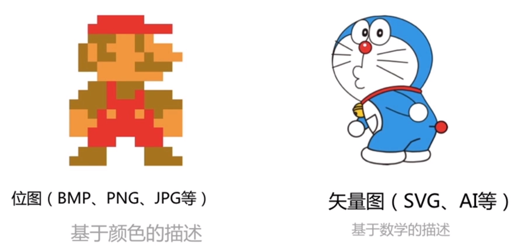

#### 1.1.2. 简单示例


```xml
<svg xmlns="http://www.w3.org/2000/svg" 
    width="200" height="200">
    <!--Face-->
    <circle cx="100" cy="100" r="90" fill="#39F" />
    <!--Eyes-->
    <circle cx="70" cy="80" r="20" fill="white" />
    <circle cx="130" cy="80" r="20" fill="white" />
    <circle cx="65" cy="75" r="10" fill="black" />
    <circle cx="125" cy="75" r="10" fill="black"/>
    <!--Smile-->
    <path d="M 50 140 A 60 60 0 0 0 150 140" 
        stroke="white" stroke-width="3" fill="none" />
</svg>
```

#### 1.1.3. 使用方式

在浏览器中直接打开：

* http://localhost:3000/static/simle.svg

在 HTML 中使用 `` 引入

* ``

在 HTML 中直接使用 `<svg>`

* `<svg ...> ... </svg>`

在 CSS 中当做图片背景使用

* `background-image: url(./images/simle.svg)`

### 1.2. SVG 的图像和属性

基本图形：

1. `<rect>`
2. `<circle>`
3. `<ellipse>`  : 椭圆
4. `<line>`
5. `<polyline>` : 折线
6. `<polygon>`  : 多边形

基本属性

* fill
* stroke
* stroke-width
* transform

#### 1.2.1. `<rect>`

属性：

* x : 矩形左上角坐标的 x
* y : 矩形左上角坐标的 y
* width  : 矩形的宽度
* height : 矩形的高度
* rx : 矩形的x轴圆角半径
* ry : 矩形的y轴圆角半径

注意：

* 如果 rx、ry 只有一个，则 r = rx = ry，即是一个圆

如图：

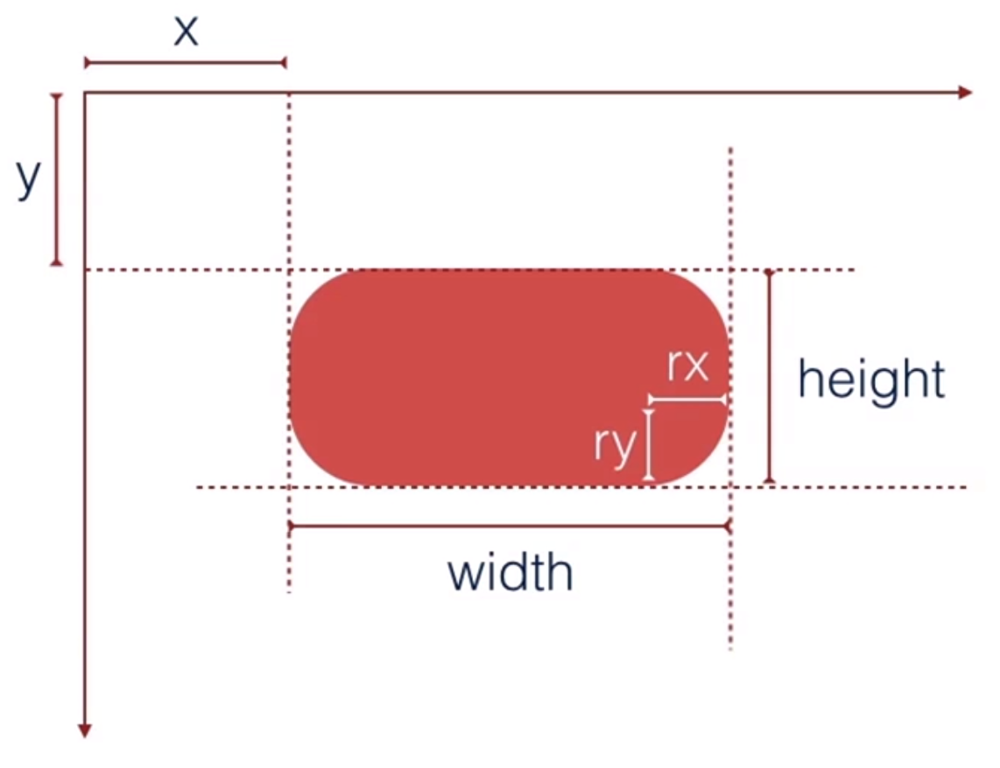


#### 1.2.2. `<circle>`

属性：

* cx : 圆心的坐标 x
* cy : 圆心的坐标 y
* r  : 圆的半径

如图：

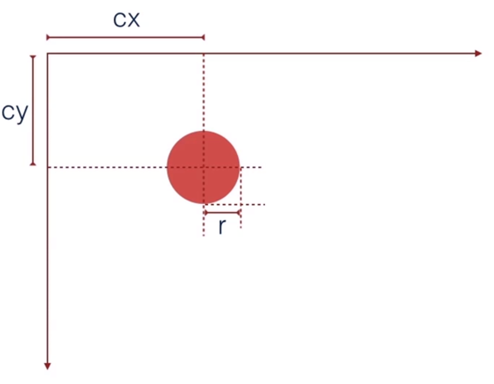

#### 1.2.3. `<ellipse>`

属性：

* cx : 圆心的坐标 x
* cy : 圆心的坐标 y
* rx : 圆的x轴半径
* ry : 圆的y轴半径


如图：

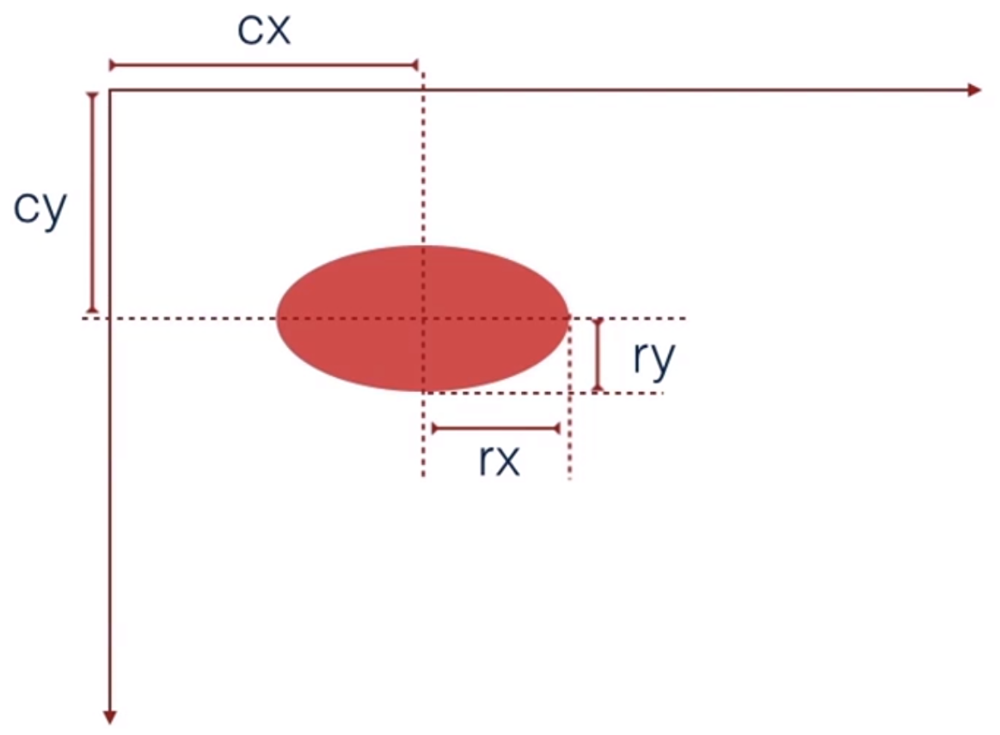

#### 1.2.4. `<line>`

属性：

* x1 : 起点坐标 x
* y1 : 起点坐标 y
* x2 : 终点坐标 x
* y2 : 终点坐标 y


如图：

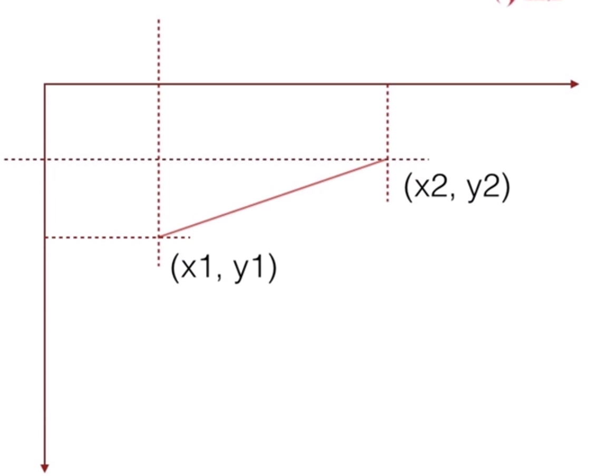


#### 1.2.5. `<polyline>`

属性：

* points : points="x1 y1 x2 y2 ... xn yn"
  * x1 : 第1个点的坐标 x
  * y1 : 第1个点的坐标 y
  * x2 : 第2个点的坐标 x
  * y2 : 第2个点的坐标 y
  * ...
  * xn : 第n个点的坐标 x
  * yn : 第n个点的坐标 y

注意：

* 首尾两个点会自动连接，形成一个闭合的多边形

如图：

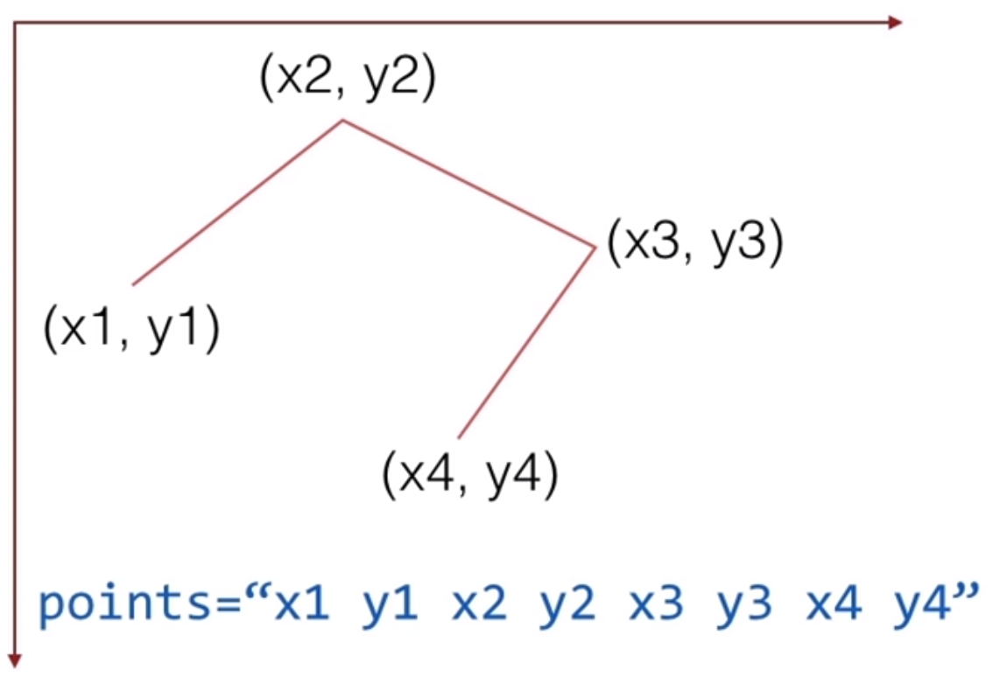


#### 1.2.6. `<polygon>`

属性：

* points : points="x1 y1 x2 y2 ... xn yn"
  * x1 : 第1个点的坐标 x
  * y1 : 第1个点的坐标 y
  * x2 : 第2个点的坐标 x
  * y2 : 第2个点的坐标 y
  * ...
  * xn : 第n个点的坐标 x
  * yn : 第n个点的坐标 y

如图：

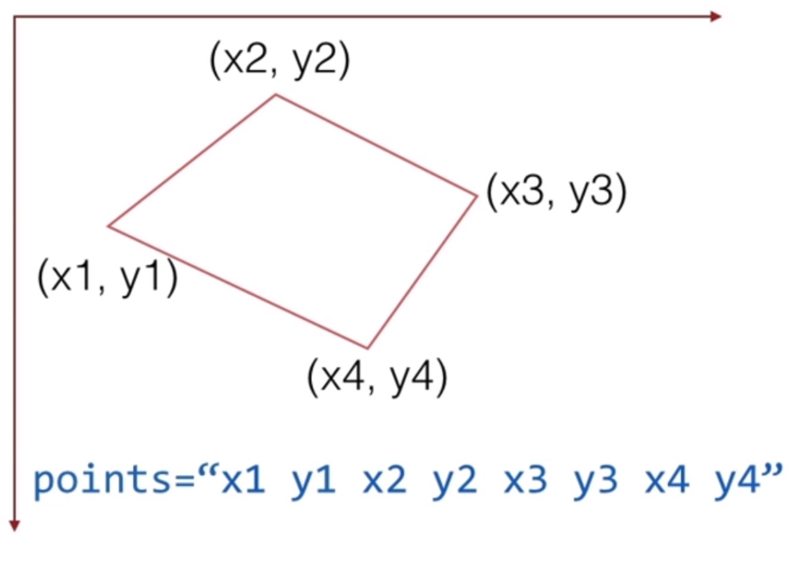

#### 1.2.7. 填充、描边、变换

* fill : 填充
* stroke : 描边
* stroke-width : 描边的宽度
* transform : 变换

#### 1.2.8. 示例

[./code/1/basic.svg](./code/1/basic.svg)

```xml
<svg xmlns="http://www.w3.org/2000/svg">
    <rect 
        x="10" 
        y="10" 
        rx="5" 
        ry="5" 
        width="150" 
        height="100" 
        stroke="red" 
        fill="none">
    </rect>

    <circle 
        cx="250" 
        cy="60" 
        r="50" 
        stroke="red" 
        fill="none">
    </circle>

    <ellipse 
        cx="400" 
        cy="60" 
        rx="70" 
        ry="50" 
        stroke="red" 
        fill="none">
    </ellipse>

    <line 
        x1="10" 
        y1="120" 
        x2="160" 
        y2="220" 
        stroke="red">
    </line>

    <polyline 
        points="250 120 
                300 220
                200 220"
        stroke="red"
        fill="none">
    </polyline>

    <polygon 
        points="250 120 
                300 220
                200 220"
        stroke="red"
        stroke-width="5"
        fill="yellow"
        transform="translate(150 0)">
    </polygon>
</svg>
```

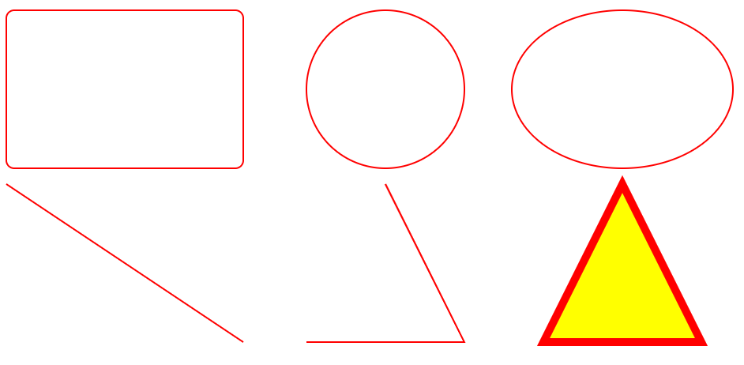

### 1.3. 基本操作 API

创建图形

* `document.createElementNS(ns, tagName);`

添加图形

* `element.appendChild(childElement)`

设置/获取 属性

* `element.setAttribute(name, value)`
* `element.getAttribute(name)`

### 1.4. 综合例子：简单SVG编辑器

[./code/1/svg-editor.html](./code/1/svg-editor.html)

## 2. SVG中的坐标系统

### 2.1. SVG的世界、视野、视窗的概念

#### 2.1.1. 视野与世界

* 世界是无穷大的
* 视野是观察世界的一个矩形区域

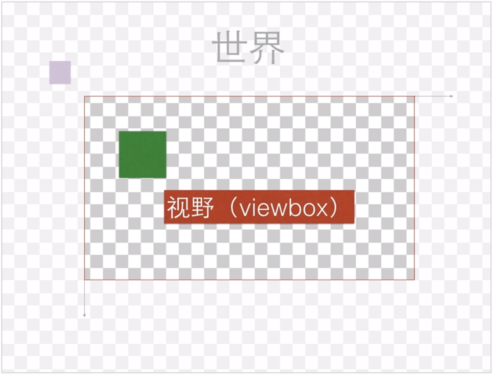

#### 2.1.2. 概念

```xml
<svg
    width="800" height="600"
    viewBox="0 0 400 300"
    preserveAspectRadio="xMidYMid meet"
></svg>
```

* width、height : 控制视窗 (svg 元素在网页中所占的区域)
* SVG 代码 : 定义世界
* viewBox、preserveAspectRadio : 控制视野 (世界中一个矩形区域)
  * preserveAspectRadio: 视野和视窗 宽高比不一样时的处理机制
  
### 2.2. SVG 中的图形分组

> 多个元素在逻辑上是一个整体，在代码里面如何体现？

* `<g>` 标签来创建分组
* 属性继承： 给分组设置描边、填充，分组内的元素会继承
* transform 属性定义坐标变换
* 可以嵌套使用

示例：

```xml
<svg xmlns="http://www.w3.org/2000/svg">
  <g stroke="red" fill="none" >
    <rect x="100" y="50" width="100" height="50"/>
    <rect x="140" y="100" width="20" height="120"/>
  </g>
</svg>
```

### 2.3. 坐标系统概述

* 笛卡尔直角坐标系： 给图形提供定位基准
* 原点
* 互相垂直的两条数轴
* 角度定义： 正方向，从 x 正半轴 到 y 正半轴的方向

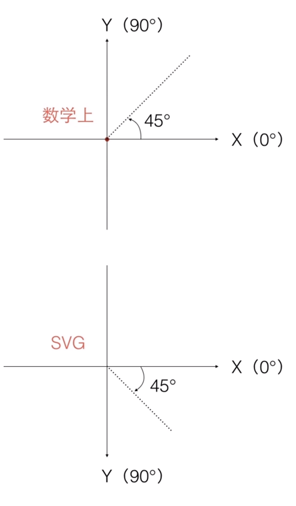

### 2.4. 四个坐标系

* 用户坐标系（User Coordinate）
  * 世界坐标系

* 自身坐标系（Current Coordinate）
  * 每个 图形元素或分组 独立与生俱来

* 前驱坐标系（Previous Coordinate）
  * 父容器的坐标系
  * 变换时，改变的是 自身的坐标系 在 父容器坐标系中 的位置

* 参考坐标系（Reference Coordinate）
  * 使用其他坐标系来考究自身的情况时使用

### 2.5. 坐标变换

* 定义
* 线性变换
* 线性变换列表
* transform 属性

#### 2.5.1. 定义

* 数学上： 坐标变换 是采用一定的数学方法将 一个坐标系的坐标 变换为 另一个坐标系的坐标 的过程。
* SVG 中， 坐标变换 是对一个坐标系到另一个坐标系的变换的描述。

#### 2.5.2. 线性变换

线性变换方程：

```text
X' = aX + cY + e
Y' = bX + dY + f
```

变换矩阵：

```text
a c e
b d f
0 0 1
```

示例：

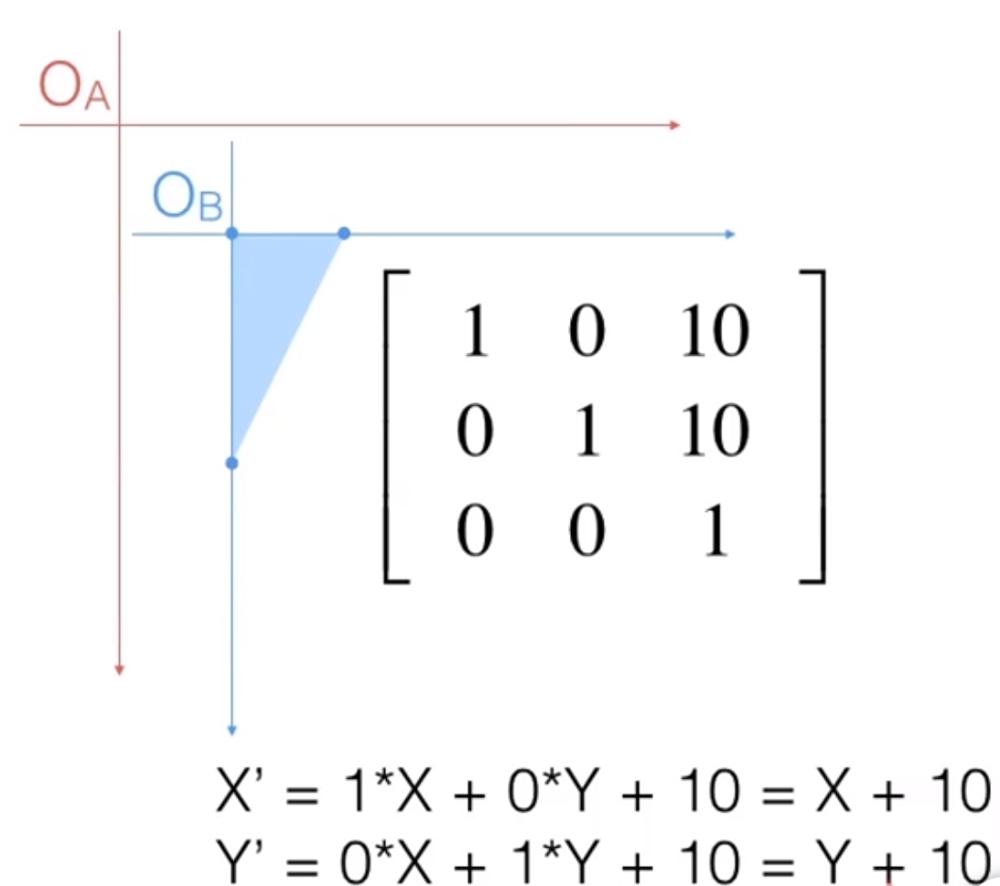

平移：

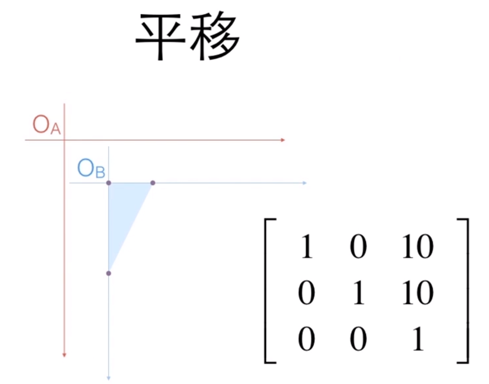

旋转：

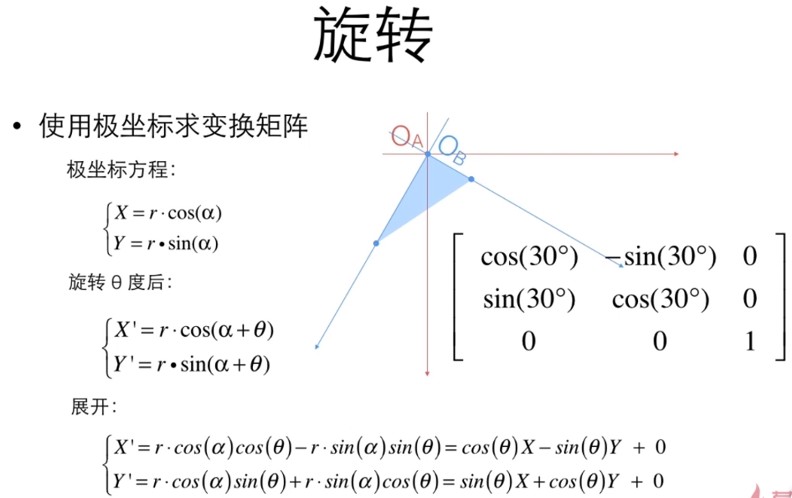

缩放：

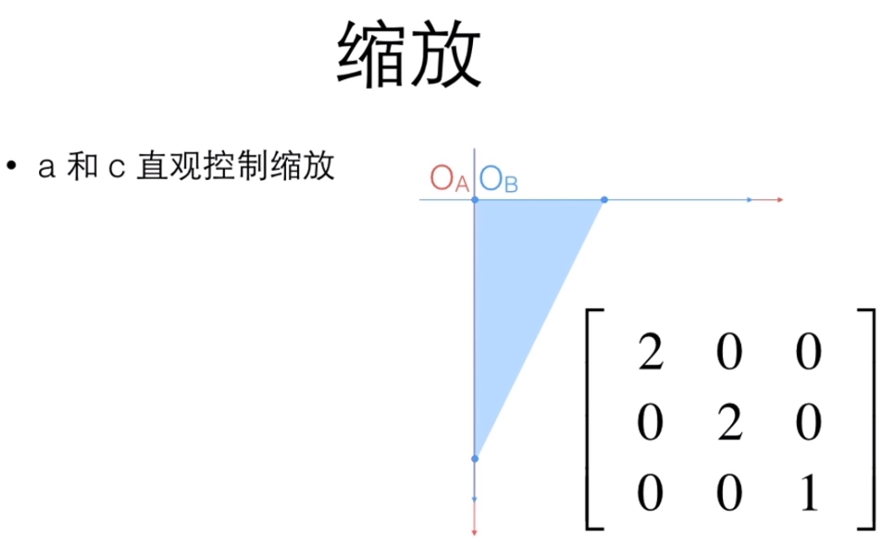

#### 2.5.3. 线性变换列表

表示一系列的变换，结果为变换的矩阵乘积：

```text
M = Mn * Mn-1 * ... * M2 * M1 * M0
```

后边的变换先乘

#### 2.5.4. transform 属性

定义前驱坐标系到自身坐标系的线性变换

语法：

* rotate(deg)
* translate(x, y)
* scale(sx, sy)
* matrix(a, b, c, d, e, f)

注意：

* 多个变换，变换的顺序对结果有影响

## 3. 颜色、渐变、笔刷

### 3.1. RGB 和 HSL

* 都是 CSS3 支持的颜色表示方法
* 互相转换的原理

#### 3.1.1. RGB

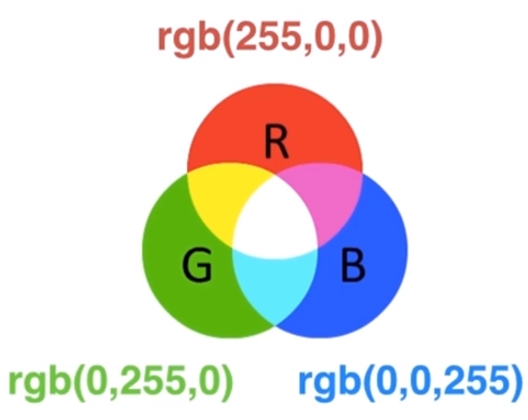

* 三个分量： 红、绿、蓝

* 表示方式： rgb(r, g, b) 或 #rrggbb

* 每个分量的取值范围： [0, 255]

* 优势： 显示器容易解析
* 劣势： 不符合人类描述颜色的习惯


#### 3.1.2. HSL

* 三个分量： 颜色（调色环）、饱和度（调鲜艳程度）、亮度（调明暗程度）

* 格式： hsl(h, s%, l%)

* 取值范围：
  * h: [0, 359]
  * s: [0, 100]
  * l: [0, 100]

* 优势： 符合人类描述颜色的习惯

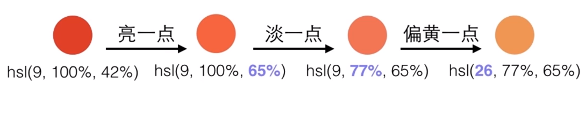

配色网站：

* http://paletton.com

#### 3.1.3. 透明度

* 带透明度的颜色： rgba(r, g, b, a) 和 hsla(h, s%, l%, a)

* opacity 属性： 表示元素的透明度

* a（alpha通道） 和 opacity 的赋值范围： [0, 1]

#### 3.1.4. 在 SVG 中应用颜色

```html
<rect fill="rgb(255, 0, 0)" opacity="0.5" />

<rect stroke="hsla(0, 50%, 60%, 0.5)" />
```

### 3.2. 渐变

* 让图形更丰满
* 线性渐变和径向渐变

#### 3.2.1. 线性渐变


* 标签： `<linearGradient>` 和 `<stop>`

* 起始位置

  ```text
  // 起点
  x1="0" // top
  y1="0" // left

  // 终点
  x2="1" // right
  y2="1" // botttom
  ```

* 关键点位置及颜色

  ```html
  <stop offset="0" stop-color="#1497fc"/>
  <stop offset="0.5" stop-color="#a469be"/>
  <stop offset="1" stop-color="#ff8c00"/>
  ```

* 单位： gradientUnits
  * objectBoundingBox: 起点、终点的值为盒子的宽高的百分比
  * userSpaceOnUse: 起点、终点的值为用户坐标系（世界坐标）的值， (0,0) is at the top/left of the object bounding box and (1,1) is at the bottom/right of the object bounding box

示例： （ [./code/3/linear-gradient.svg](./code/3/linear-gradient.svg) ）

```xml
<svg xmlns="http://www.w3.org/2000/svg" viewBox="0 0 512 512">
  <defs>
    <linearGradient
        id="grad1"

        gradientUnits="objectBoundingBox"

        x1="0"
        y1="0"

        x2="1"
        y2="1"
    >
      <stop offset="0" stop-color="#1497fc"/>
      <stop offset="0.5" stop-color="#a469be"/>
      <stop offset="1" stop-color="#ff8c00"/>
    </linearGradient>
  </defs>

  <rect
      x="100"
      y="100"
      fill="url(#grad1)"
      width="200"
      height="150"
  />
</svg>
```

#### 3.2.2. 径向渐变

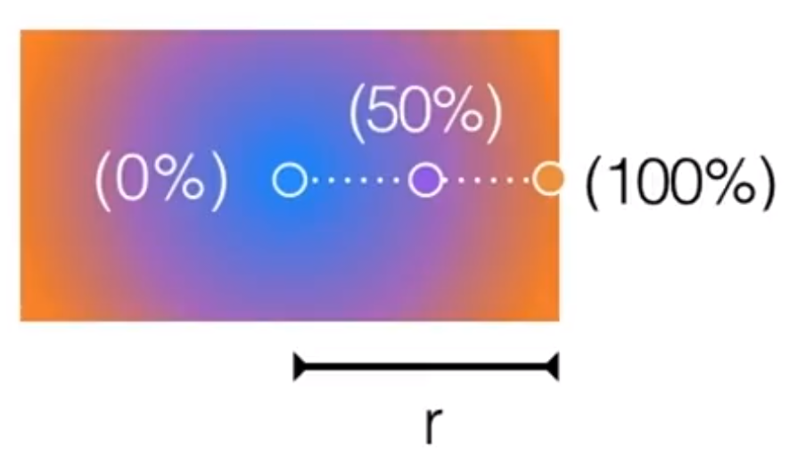

* 标签： `<radialGradient>` 和 `<stop>`

* 中心点和半径： cx cy r

* 焦点位置：fx fy

* 单位： gradientUnits
  
示例：（ [./code/3/radial-gradient.svg](./code/3/radial-gradient.svg) ）

```xml
<svg xmlns="http://www.w3.org/2000/svg" viewBox="0 0 512 512">
  <defs>
    <radialGradient
        id="grad1"

        cx="0.5"
        cy="0.5"
        r="0.5"

        fx="0.8"
        fy="0.2"
    >
      <stop offset="0" stop-color="#1497fc"/>
      <stop offset="0.5" stop-color="#a469be"/>
      <stop offset="1" stop-color="#ff8c00"/>
    </radialGradient>
  </defs>

  <rect
      x="100"
      y="100"
      fill="url(#grad1)"
      width="200"
      height="150"
  />
</svg>
```

### 3.3. 笔刷

* 绘制纹理： 重复填充

* `<pattern>`

* patternUnits: 笔刷的尺寸的单位
  * objectBoundingBox
  * userSpaceOnUse

* patternContentUnits: 笔刷里面内容的尺度单位
  * objectBoundingBox
  * userSpaceOnUse

示例：（ [./code/3/pattern.svg](./code/3/pattern.svg)  ）

```xml
<svg xmlns="http://www.w3.org/2000/svg">
  <defs>
    <pattern
      id="p1"
      x="0"
      y="0"
      width="0.2"
      height="0.2"
    >
      <circle cx="10" cy="10" r="5" fill="red"/>
      <polygon points="30 10 60 50 0 50" fill="green"/>
    </pattern>
  </defs>

  <rect
    x="100"
    y="100"
    width="800"
    height="300"
    fill="url(#p1)"
    stroke="blue"
  />
</svg>
```

## 4. Path

* path 概述

* 移动和直线命令

* 弧线命令

* 贝塞尔曲线命令

### 4.1. path 概述

* 强大的绘图工具

  * 可以绘制任意的图形

* 规范
  
  * http://www.w3.org/TR/SVG11/paths.html

* 由 命令及其参数 组成的字符串，如下

示例：（  [./code/4/path-line.svg](./code/4/path-line.svg)  ）

```xml
<svg xmlns="http://www.w3.org/2000/svg">
  <path
    d="M0,0L10,20C30-10,40,20,100,100"
    stroke="red"
    fill="transparent"
  />
</svg>
```

#### 4.1.1. path 字符串

格式如图：

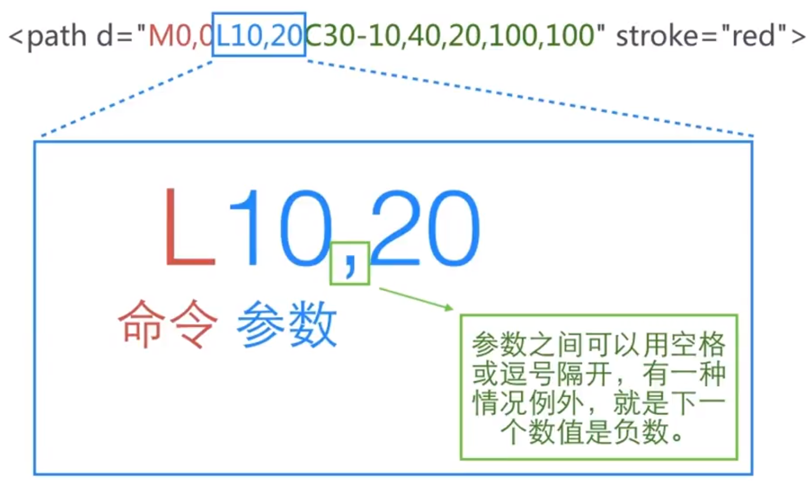

格式示例：

```text
格式一：

  d="M0,0L10,20C30-10,40,20,100,100"

格式二：
  
  d="M 0 0 L 10 20 C 30 -10 40 20 100 100"

格式三：
  
  d="M 0 0, L 10 20, C 30 -10 40 20 100 100"
```

#### 4.1.2. 命令汇总

* M/m (x, y)+

  * 移动，移动当前位置

* L/l (x, y)+

  * 直线，从 当前位置 到 (x,y) 绘制直接

* H/h (x)+

  * 水平线，从 当前位置 到 x坐标 绘制水平直接

* V/v (y)+

  * 垂直线，从 当前位置 到 y坐标 绘制垂直直接

* Z/z

  * 闭合， 闭合当前路径

* C/c (x1, y1, x2, y2, x, y)+

  * （绘制）三次贝塞尔曲线

* S/s (x2, y2, x, y)+

  * （光滑绘制）三次贝塞尔曲线

* Q/q (x2, y2, x, y)+

  * （绘制）二次贝塞尔曲线

* T/t (x, y)+

  * （光滑绘制）二次贝塞尔曲线

* A/a (rx, ry, xr, laf, sf, x, y)

  * 弧线

#### 4.1.3. 命令基本规律

* 区分大小写

  * 大写，绝对位置（画到哪个位置）
  * 小写，相对位置（上个命令的结束位置）

* 最后的参数（x, y）

  * 要到达的位置

* 起始位置

  * 上个命令的结束位置 就是 下个命令的开始位置

* 重复参数

  * 重复执行同一个命令
  * 无须再写命令前缀

### 4.2. 移动和直线命令

* M/m (x, y)+
* L/l (x, y)+
* H/h (x)+
* V/v (y)+

大写： 绝对位置，画到哪个位置

小写： 长度，绘制的长度

### 4.3. 弧线命令

* A (rx, ry, xr, laf, sf, x, y) ： 绘制弧线

* 最复杂的命令

  * rx ， radius x ， 弧线所在椭圆的 x 半轴长
  * ry ， radius y ， 弧线所在椭圆的 y 半轴长
  * xr ， xAxis rotation ， 弧线所在椭圆的长轴角度
  * laf ， large arc flag ， 是否选择弧长较长的那一段弧
  * sf ， sweep flag ， 是否选择顺时针方向的那一段弧
  * x,y ， 弧的终点位置

图解：

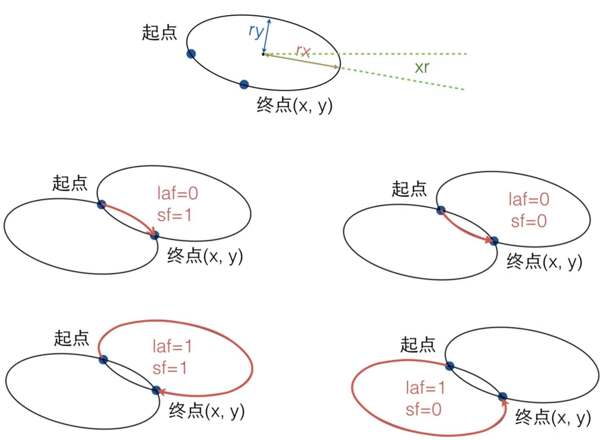

示例：（  [./code/4/arc.svg](./code/4/arc.svg)  ）

```xml
<svg xmlns="http://www.w3.org/2000/svg">
  <path
    d="M 200 100, h -100, v 100, M 200 100, A 100 100 0 0 1 100 200"
    stroke="red"
    fill="transparent"
  />
</svg>
```

### 4.4. 贝塞尔曲线命令

* 贝塞尔曲线（Bezier Curve）概念
* 四条贝塞尔曲线的命令

#### 4.4.1. 二次贝塞尔曲线

只需要一个控制点

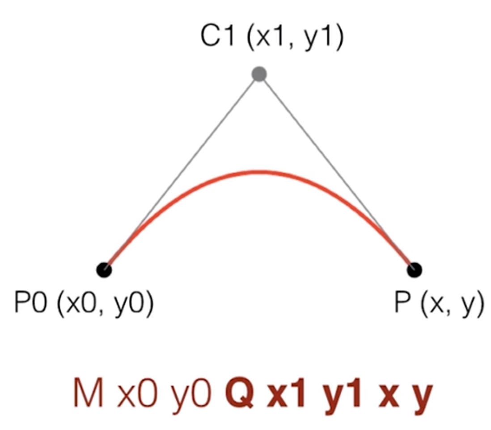

#### 4.4.2. 三次贝塞尔曲线

两个控制点

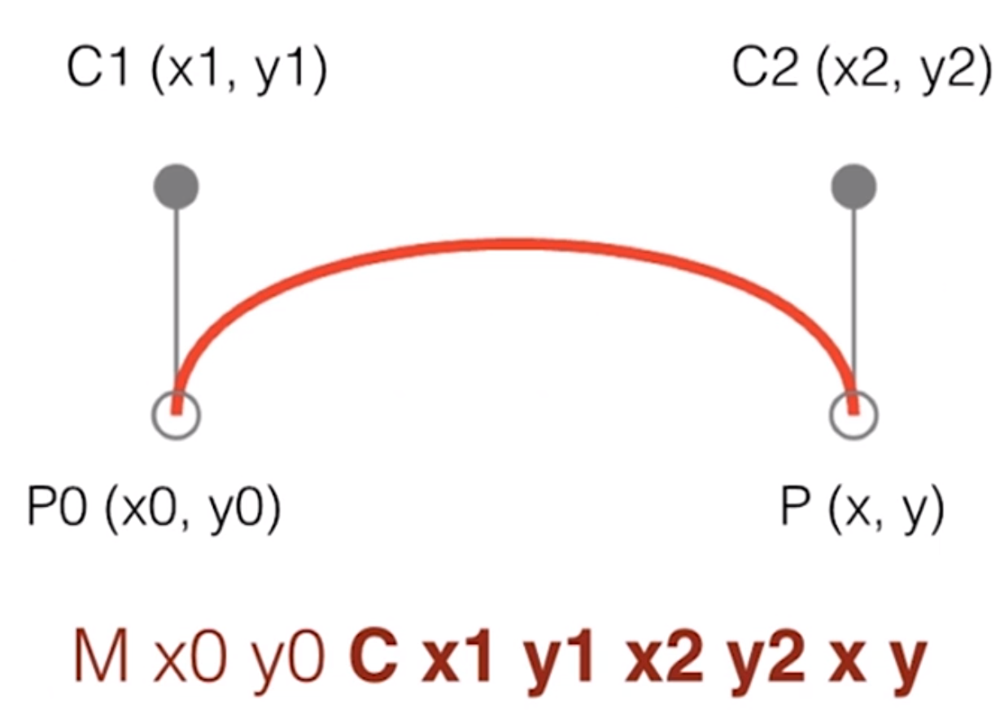

## 5. SVG 文本

### 5.1. `<text>` 和 `<tspan>`

x, y:

* 定位标准

dx, dy:

* 字形偏移

style:

* 设置样式

`<tspan>`：

* 给文本分块，单独设置属性和样式

示例：

```xml
<svg xmlns="http://www.w3.org/2000/svg">
  <defs>
    <pattern id="grid" 
      x="0" y="0" width="20" height="20"
      patternUnits="userSpaceOnUse"
    >
      <path d="M 0 0, H 20, V 20" fill="none" stroke="#F0F0F0" />
    </pattern>
  </defs>

  <!-- 网格线 -->
  <rect width="100%" height="100%" fill="url(#grid)"/>

  <text 
    x="100" y="100"
    style="font-family: arial; font-size: 40px;"
  >
    X每天进步一点点。x
  </text>

  <!-- 辅助线 -->
  <path d="M 100 0, V 1000, M 0 100, H 1000" stroke="rgba(255, 0, 0, 0.2)" />

  <!-- 对第一个字母设置偏移量 -->
  <text 
    x="100" y="200"
    dx="20" dy="20"
    style="font-family: arial; font-size: 40px;"
  >
    ABCDE
  </text>
  <path d="M 100 0, V 1000, M 0 200, H 1000" stroke="rgba(255, 0, 0, 0.2)" />


  <!-- 挨个字母设置偏移量（相对前一个字母的位置） -->
  <text 
    x="100" y="300"
    dx="20 40 60 80 100" dy="20 40 60 80 100"
    style="font-family: arial; font-size: 40px;"
  >
    ABCDE
  </text>
  <path d="M 100 0, V 1000, M 0 300, H 1000" stroke="rgba(255, 0, 0, 0.2)" />

</svg>
```

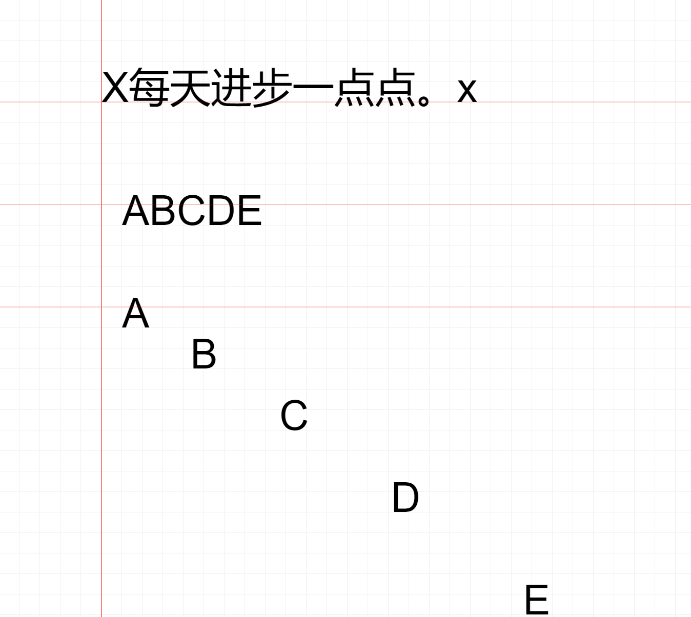

### 5.2. 垂直居中问题

* text-anchor , 水平方向对齐方式属性

* dominant-baseline 属性

* SVGGraphicsElement.getBBox()

  * 获取元素的 rect
  * 通过 dx、dy 设置偏移量的方式调整对齐方式