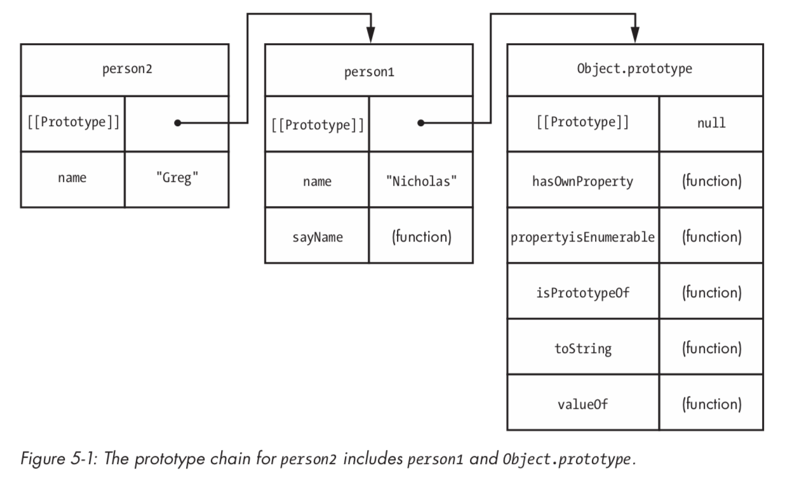
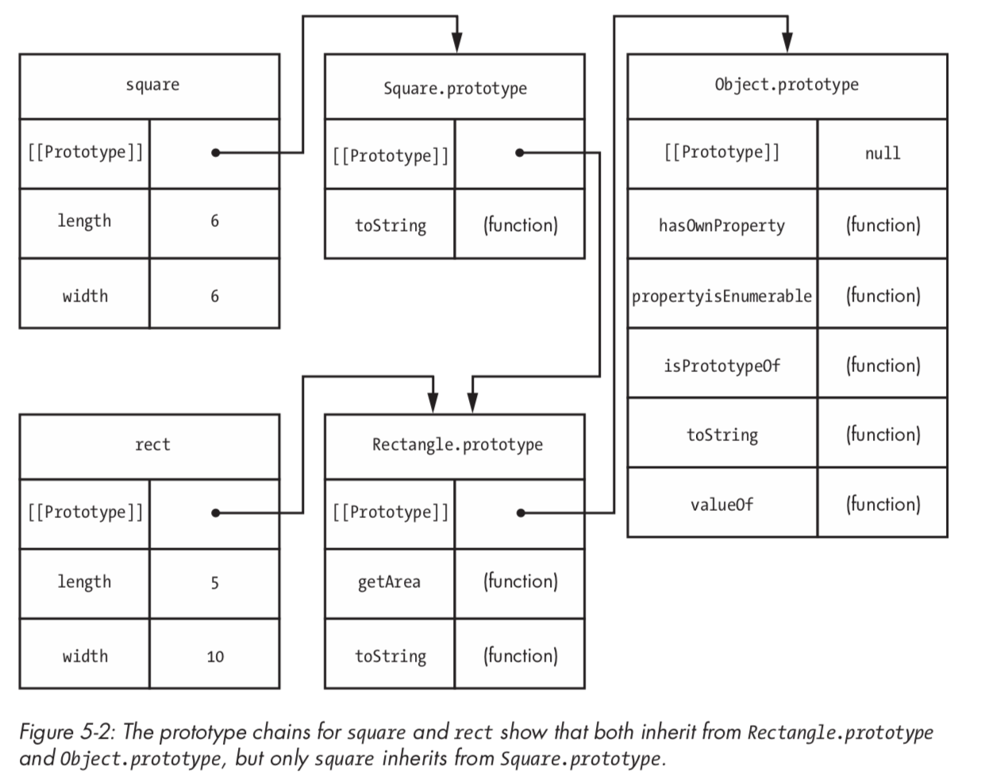

# 继承

学习如何创建对象是理解面向对象编程的第一步。 第二步是了解继承。 在传统的面向对象语言中，类继承其他类的属性。但是，在 JavaScript 中，可以在没有定义关系的类结构的对象之间进行继承。 这种继承的机制是你已经熟悉的机制：原型。

## 1. 原型链和 `Object.prototype`

JavaScript 的内置继承方法称为原型链接或原型继承。 正如您在第 4 章中学到的，原型属性可以自动在对象实例上使用，这是一种继承形式。 对象实例从原型继承属性。 因为原型也是一个对象，它有自己的原型并继承了原型。 这是原型链：一个对象继承自其原型，而该原型又继承自其原型，依此类推。

除非您另行指定，否则所有对象（包括您自己定义的对象）都会自动从 `Object` 继承（本章稍后将对此进行讨论）。 更具体地说，所有对象都继承自 `Object.prototype`。 通过对象字面量定义的任何对象都将其 `[[Prototype]]` 设置为 `Object.prototype`，这意味着它从 `Object.prototype` 继承属性，就像本例中的 `book` 一样：

```javascript
var book = {
    title: "The Principles of Object-Oriented JavaScript"
};

var prototype = Object.getPrototypeOf(book);

console.log(prototype === Object.prototype);        // true
```

这里，`book` 有一个等于 `Object.prototype` 的原型。 不需要额外的代码来实现这一点，因为这是创建新对象时的默认行为。 这种关系意味着该书自动从 `Object.prototype` 接收方法。

### 1.1. `Object.prototype` 上的方法

过去几章中使用的几种方法实际上是在 `Object.prototype` 上定义的，因此被所有其他对象继承。 那些方法是：

* `hasOwnProperty()` : 确定是否存在具有给定名称的自有属性
* `propertyIsEnumerable()` : 确定自己的属性是否可枚举
* `isPrototypeOf()` : 确定对象是否是另一个对象的原型
* `valueOf()` : 返回对象的值表示形式
* `toString()` : 返回对象的字符串表示形式

这五种方法通过继承出现在所有对象上。 当您需要在 JavaScript 中使对象一致地工作时，最后两个是很重要的，有时您可能想要自己定义它们。

#### 1.1.1. `valueOf()`

只要在对象上使用运算符，就会调用 `valueOf()` 方法。 默认情况下，`valueOf()` 只返回对象实例。 原始包装器类型覆盖 `valueOf()` ，以便它返回 `String` 的字符串，`Boolean` 的布尔值和 `Number` 的数字。 同样，`Date` 对象的 `valueOf()` 方法以毫秒为单位返回纪元时间（就像 `Date.prototype.getTime()`  一样）。 这使您可以编写比较日期的代码，例如：

```javascript
var now = new Date();
var earlier = new Date(2010, 1, 1);

console.log(now > earlier); // true
```

在此示例中，`now` 是表示当前时间的日期，而 `earlier` 是过去的固定日期。 当使用大于运算符（`>`）时，在执行比较之前，会在两个对象上调用 `valueOf()` 方法。 您甚至可以从另一个日期中减去一个日期，因为 `valueOf()` 返回纪元开始的毫秒数。

如果要将对象用于运算符，则始终可以定义自己的 `valueOf()` 方法。 如果确实定义了 `valueOf()` 方法，请记住，您不是要更改运算符的工作方式，而是仅使用运算符默认行为的值。

#### 1.1.2. `toString()`

每当 `valueOf()` 返回引用值而不是原始值时，`toString()` 方法被称为回退。 每当 JavaScript 期待一个字符串时，它也会隐式调用原始值。 例如，当一个字符串用作加运算符的一个操作数时，另一个操作数将自动转换为字符串。 如果另一个操作数是原始值，则将其转换为字符串表示形式（例如，`true` 变为 `"true"`），但如果它是引用值，则调用 `valueOf()` 。 如果 `valueOf()` 返回引用值，则调用 `toString()` 并使用返回的值。 例如：

```javascript
var book = {
    title: "The Principles of Object-Oriented JavaScript"
};

var message = "Book = " + book;

console.log(message); // "Book = [object Object]"
```

此代码通过将 `"Book ="` 与 `book` 结合来构造字符串。 由于 `book` 是一个对象，因此调用其 `toString()` 方法。 该方法继承自 `Object.prototype`，并在大多数 `JavaScript` 引擎中返回默认值 `"[object Object]"`。 如果您对该值感到满意，则无需更改对象的 `toString()` 方法。 但是，有时候定义自己的 `toString()` 方法会很有用，这样字符串转换就会返回一个提供更多信息的值。 例如，假设您希望以前的脚本记录该书的标题：

```javascript
var book = {
    title: "The Principles of Object-Oriented JavaScript",
    toString: function() {
        return "[Book " + this.title + "]"
    }
};

var message = "Book = " + book;

// "Book = [Book The Principles of Object-Oriented JavaScript]"
console.log(message);
```

此代码为 · 定义了一个自定义 `toString()` 方法，该方法返回比继承版本更有用的值。 您通常不需要担心定义自定义 `toString()` 方法，但最好知道必要时可以这样做。

### 1.2. 修改 `Object.prototype`

默认情况下，所有对象都从 `Object.prototype` 继承，因此对 `Object .prototype` 的更改会影响所有对象。 那是一个非常危险的情况。 在第 4 章中，建议您不要修改内置对象原型，并且对于 `Object.prototype` 该加倍小心。 看看会发生什么：

```javascript
Object.prototype.add = function(value) {
    return this + value;
};

var book = {
    title: "The Principles of Object-Oriented JavaScript"
};

console.log(book.add(5)); // "[object Object]5"
console.log("title".add("end")); // "titleend"

// in a web browser
console.log(document.add(true)); // "[object HTMLDocument]true"
console.log(window.add(5)); // "[object Window]true"
```

添加 `Object.prototype.add()` 会导致所有对象都有 `add()` 方法，无论它是否真的有意义。 这个问题不仅是开发人员的问题，也是 JavaScript 语言委员会的问题：它必须将新方法放在不同的位置，因为向 `Object.prototype` 添加方法会产生无法预料的后果。

此问题的另一个方面涉及向 `Object.prototype` 添加可枚举属性。 在前面的示例中，`Object.prototype.add()` 是一个可枚举的属性，这意味着它将在您使用 `for-in` 循环时显示，例如：

```javascript
var empty = {};

for (var property in empty) {
    console.log(property);
}
```

在这里，一个空对象仍然会输出 `"add"` 作为属性，因为它存在于原型上并且是可枚举的。 考虑到在 JavaScript 中使用 `for-in` 的频率，使用可枚举属性修改 `Object.prototype` 可能会影响很多代码。 因此，[Douglas Crockford](http://crockford.com/javascript/) 建议始终在 `for-in` 循环中使用 `hasOwnProperty()`，例如：

```javascript
var empty = {};

for (var property in empty) {
    if (empty.hasOwnProperty(property)) {
        console.log(property);
    }
}
```

虽然这种方法对于可能不需要的原型属性是有效的，但它也限制了 `for-in` 仅用于自有属性的用途，这可能是你想要的，也可能不是你想要的。 最灵活的最佳选择是不修改 `Object.prototype`。

## 2. 对象继承

最简单的继承类型是在对象之间。 您所要做的就是指定哪个对象应该是新对象的 `[[Prototype]]`。 对象字面量将 `[[Prototype]]` 隐式设置为 `Object.prototype`，但您也可以使用 `Object.create()` 方法显式指定 `[[Prototype]]`。

`Object.create()` 方法接受两个参数。 第一个参数指定新对象的 `[[Prototype]]` 的值。 可选的第二个参数指定属性描述符对象，跟 `Object.defineProperties()` 使用的相同格式的（参见第 3 章）。 考虑以下：

```javascript
var book = {
    title: "The Principles of Object-Oriented JavaScript"
};
// is the same as
var book = Object.create(Object.prototype, {
    title: {
        configurable: true,
        enumerable: true,
        value: "The Principles of Object-Oriented JavaScript",
        writable: true
    }
});
```

这段代码中的两个声明实际上是相同的。 第一个声明使用对象字面量来定义具有名为 `title` 的单个属性的对象。 该对象自动从 `Object.prototype` 继承，并且该属性默认设置为可配置、可枚举、可写。 第二个声明做同样的事，但使用 `Object.create()` 显式声明。 每个声明中生成的 `book` 对象的行为完全相同。 但是您可能永远不会直接编写从 `Object.prototype` 继承的代码，因为默认情况下会得到它。 继承其他对象更有趣：

```javascript
var person1 = {
    name: "Nicholas",
    sayName: function() {
        console.log(this.name);
    }
};

var person2 = Object.create(person1, {
    name: {
        configurable: true,
        enumerable: true,
        value: "Greg",
        writable: true
    }
});

person1.sayName(); // outputs "Nicholas"
person2.sayName(); // outputs "Greg"

console.log(person1.hasOwnProperty("sayName")); // true
console.log(person1.isPrototypeOf(person2)); // true
console.log(person2.hasOwnProperty("sayName")); // false
```

此代码使用 `name` 属性和 `sayName()` 方法创建一个对象 `person1`。 `person2` 对象继承自 `person1`，因此它继承了 `name` 和 `sayName()` 。 但是，`person2` 是通过 `Object.create()` 定义的，它还为 `person2` 定义了自己的 `name` 属性。 这个属性屏蔽了同名的 `prototype` 属性，并在该对象上可以使用。 因此，`person1.sayName()` 输出 `"Nicholas"`，而 `person2.sayName()`  输出 `"Greg"`。 请记住，`sayName()` 仍然只存在于 `person1` 上，并且由 `person2` 继承。

此示例中 `person2` 的继承链比 `person1` 更长。 `person2` 对象继承自 `person1` 对象，`person1` 对象继承自 `Object.prototype`。 见图 5-1。



在对象上访问属性时，JavaScript 引擎会经历搜索过程。 如果在实例上找到该属性（即，如果它是自己的属性），则使用该属性值。 如果在实例上找不到该属性，则继续搜索 `[[Prototype]]`。 如果仍未找到该属性，则搜索继续到该对象原型的 `[[Prototype]]`，依此类推，直到到达链的末尾。 该链通常以 `Object.prototype` 结尾，其 `[[Prototype]]` 设置为 `null`。

您还可以通过 `Object.create()` 创建其值为 `null` 的 `[[Prototype]]` 的对象，例如：

```javascript
var nakedObject = Object.create(null);

console.log("toString" in nakedObject); // false
console.log("valueOf" in nakedObject); // false
```

此示例中的 `nakedObject` 是没有原型链的对象。 这意味着对象上不存在诸如 `toString()` 和 `valueOf()` 之类的内置方法。 实际上，此对象是一个完全空白的白板，没有预定义的属性，这使得它非常适合创建查找哈希，而不会与继承的属性名称发生潜在的命名冲突。 像这样的对象没有太多其他用途，你不能像使用 `Object.prototype` 那样使用它。 例如，无论何时在 `nakedObject` 上使用运算符，您都会遇到“无法将对象转换为原始值”的错误。但是，这是 JavaScript 语言的一个有趣的怪癖，您可以创建一个无原型的对象。

## 3. 构造函数继承

JavaScript 中的对象继承也是构造函数继承的基础。 回忆一下第 4 章，几乎每个函数都有一个可以修改或替换的原型属性。 该 `prototype` 属性被自动分配为一个新的通用对象，它继承自 `Object.prototype` 并具有一个名为 `constructor` 的自有属性。 实际上，JavaScript 引擎会为您执行以下操作：

```javascript
// you write this
function YourConstructor() {
    // initialization
}

// JavaScript engine does this for you behind the scenes
YourConstructor.prototype = Object.create(Object.prototype, {
    constructor: {
        configurable: true,
        enumerable: true,
        value: YourConstructor
        writable: true
    }
});
```

因此，在不做任何额外操作的情况下，此代码将构造函数的 `prototype` 属性设置为从 `Object.prototype` 继承的对象，这意味着 `YourConstructor` 的任何实例也都从 `Object.prototype` 继承。 `YourConstructor` 是 `Object` 的子类型，`Object` 是 `YourConstructor` 的超型。

因为 `prototype` 属性是可写的，所以可以通过覆盖它来更改原型链。 请考虑以下示例：

```javascript
function Rectangle(length, width) {
    this.length = length;
    this.width = width;
}

Rectangle.prototype.getArea = function() {
    return this.length * this.width;
};

Rectangle.prototype.toString = function() {
    return "[Rectangle " + this.length + "x" + this.width + "]";
};

// inherits from Rectangle
function Square(size) {
    this.length = size;
    this.width = size;
}

Square.prototype = new Rectangle();
Square.prototype.constructor = Square;

Square.prototype.toString = function() {
    return "[Square " + this.length + "x" + this.width + "]";
};

var rect = new Rectangle(5, 10);
var square = new Square(6);

console.log(rect.getArea()); // 50
console.log(square.getArea()); // 36

console.log(rect.toString()); // "[Rectangle 5x10]"
console.log(square.toString()); // "[Square 6x6]"

console.log(rect instanceof Rectangle); // true
console.log(rect instanceof Object); // true

console.log(square instanceof Square); // true
console.log(square instanceof Rectangle); // true
console.log(square instanceof Object); // true
```

在此代码中，有两个构造函数：`Rectangle` 和 `Square`。 `Square` 构造函数的原型属性用 `Rectangle` 实例覆盖。 此时没有参数传递给 `Rectangle`，因为它们不需要使用，如果传递了实参，则 `Square` 的所有实例将共享相同的尺寸。 要以这种方式更改原型链，您始终需要确保构造函数不会在未提供参数时抛出错误（许多构造函数包含可能需要参数的初始化逻辑）并且构造函数不会更改任何类型的全局状态，例如跟踪已创建的实例数。 在覆盖原始值之后，将在 `Square.prototype` 上恢复构造函数属性。

之后，`rect` 被创建为 `Rectangle` 的一个实例，`square` 被创建为 `Square` 的一个实例。 两个对象都有 `getArea()` 方法，因为它继承自 `Rectangle.prototype`。 `square` 变量被认为是 `Square` 的实例以及 `Rectangle` 和 `Object` 的实例，因为 `instanceof` 使用原型链来确定对象类型。 见图 5-2。



但是，`Square.prototype` 实际上并不需要用 `Rectangle` 对象覆盖; `Rectangle` 构造函数没有 `Square` 所需的任何操作。 实际上，唯一相关的部分是 `Square.prototype` 需要以某种方式链接到 `Rectangle.prototype` 以便继承发生。 这意味着您可以再次使用 `Object.create()` 来简化此示例。

```javascript
// inherits from Rectangle
function Square(size) {
    this.length = size;
    this.width = size;
}

Square.prototype = Object.create(Rectangle.prototype, {
    constructor: {
        configurable: true,
        enumerable: true,
        value: Square,
        writable: true
    }
});

Square.prototype.toString = function() {
    return "[Square " + this.length + "x" + this.width + "]";
};
```

在此版本的代码中，`Square.prototype` 被一个从 `Rectangle.prototype` 继承的新对象覆盖，并且不需要调用 `Rectangle` 构造函数。 这意味着您不必担心调用构造函数时不传参数而导致错误。 此代码的行为与前面的代码完全相同。 原型链保持不变，因此 `Square` 的所有实例都继承自 `Rectangle.prototype`，并且构造函数以相同的步骤恢复。

始终确保在向其添加属性之前覆盖原型，否则在发生覆盖时将丢失添加的方法。

## 4. 构造函数窃取

因为继承是通过 JavaScript 中的原型链完成的，所以您不需要调用对象的超类构造函数。 如果您确实想从子类构造函数中调用超类构造函数，那么您需要利用 JavaScript 函数的工作方式。

在第 2 章中，您了解了 `call()` 和 `apply()` 方法，这些方法允许使用不同的 `this` 值调用函数。 这正是构造函数窃取的工作方式。 您只需使用 `call()` 或 `apply()` 从子类构造函数中调用超类构造函数即可传入新创建的对象。 实际上，您正在窃取自己对象的超类构造函数，如下例所示：

```javascript
function Rectangle(length, width) {
    this.length = length;
    this.width = width;
}

Rectangle.prototype.getArea = function() {
    return this.length * this.width;
};

Rectangle.prototype.toString = function() {
    return "[Rectangle " + this.length + "x" + this.width + "]";
};

// inherits from Rectangle
function Square(size) {
    Rectangle.call(this, size, size);
    // optional: add new properties or override existing ones here
}

Square.prototype = Object.create(Rectangle.prototype, {
    constructor: {
        configurable: true,
        enumerable: true,
        value: Square,
        writable: true
    }
});

Square.prototype.toString = function() {
    return "[Square " + this.length + "x" + this.width + "]";
};

var square = new Square(6);

console.log(square.length); // 6
console.log(square.width); // 6
console.log(square.getArea()); // 36
```

在 `Square` 构造函数调用 `Rectangle` 构造函数并传入 `this` 和两次 `size`（一次为长度，一次为宽度）。 这样做会在新对象上创建 `length` 和 `width` 属性，并使每个属性等于 `size`。 这可以避免在子类构造函数中再次定义超类构造函数中已经定义的实例属性。 您可以在应用超类构造函数后添加新属性或覆盖现有属性。

当您需要在自定义类型之间完成继承时，这个两步过程非常有用。 您将始终需要修改构造函数的原型，并且您可能还需要从子类构造函数中调用超类构造函数。 通常，您将修改方法继承的原型并使用构造函数窃取属性。 这种方法通常被称为伪传统继承，因为它模仿基于类的语言的传统继承。