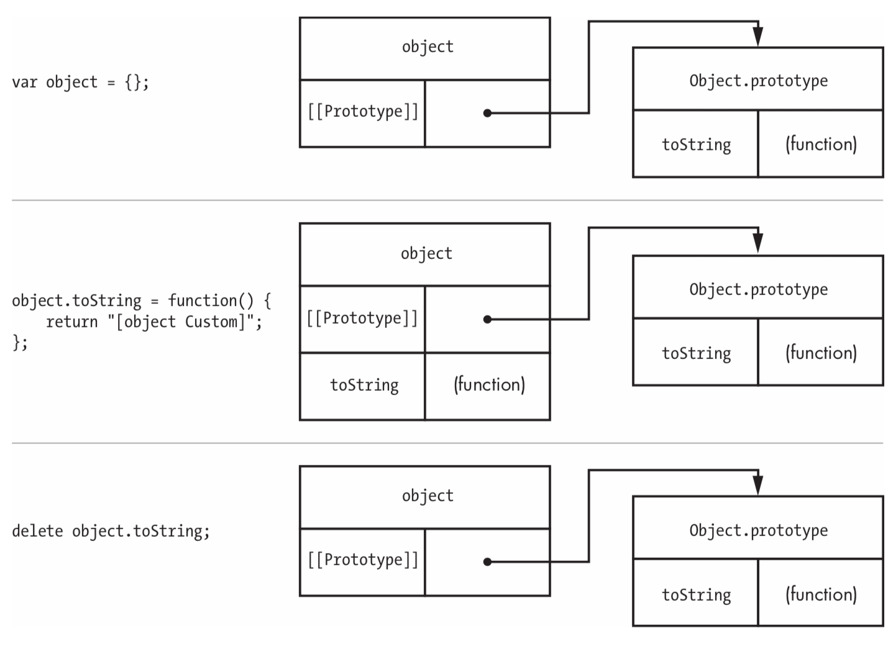
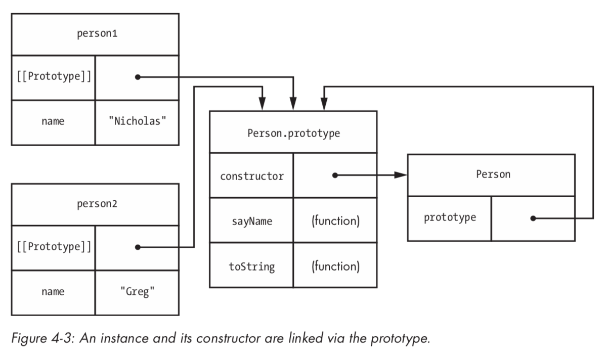

# 第 4 章 构造器和原型

>《JavaScript 面向对象精要》—— Nicholas C. Zakas

在没有理解构造函数和原型的情况下，您可能已经能够在 JavaScript 中走得很远，
但是如果没有很好地掌握这些构造函数和原型，您就不可能真正理解 JavaScript 语言。
因为 JavaScript 缺少类，所以它转向构造函数和原型来为对象提供类似的行为。
但是仅仅因为某些模式与类相似，并不意味着它们的行为方式相同。
在本章中，您将详细探讨构造器和原型，以了解JavaScript如何使用它们创建对象。

## 1. 构造器

构造函数只是一个与 `new` 一起使用来创建对象的函数。 
到目前为止，您已经看到了几个内置的 JavaScript 构造函数，例如 `Object`、`Array`、`Function`。 
构造函数的优点是使用相同构造函数创建的对象包含相同的属性和方法。 
如果要创建多个类似的对象，可以创建自己的构造函数，从而创建自己的引用类型。

因为构造函数只是一个函数，所以您可以用相同的方式定义它。 
唯一的区别是构造函数名称应以大写字母开头，以区别于其他函数。 
例如，查看以下空的 `Person` 函数：

```javascript
function Person() {
    // intentionally empty
}
```

这个函数是一个构造函数，但是这个函数和任何其他函数之间绝对没有语法差异。 
`Person` 是一个构造函数的线索在名称中 —— 第一个字母是大写的。

定义构造函数后，您可以开始创建实例，如以下两个 `Person` 对象：

```javascript
var person1 = new Person();
var person2 = new Person();
```

如果没有参数传递给构造函数，您甚至可以省略括号：

```javascript
var person1 = new Person;
var person2 = new Person;
```

尽管 `Person` 构造函数没有显式返回任何内容，但 `person1` 和 `person2` 都被视为新 `Person` 类型的实例。 
`new` 运算符自动创建给定类型的对象并返回它。 
这也意味着您可以使用 `instanceof` 运算符来推断对象的类型。 
以下代码显示了对新创建的对象的 `instanceof` 操作：

```javascript
console.log(person1 instanceof Person); // true
console.log(person2 instanceof Person); // true
```

因为 `person1` 和 `person2` 是使用 `Person` 构造函数创建的，
所以 `instanceof` 在检查这些对象是否是 `Person` 类型的实例时返回 `true` 。

您还可以使用 `constructor` 属性检查实例的类型。 
每个对象实例都是使用 `constructor` 属性自动创建的，该属性包含对创建它的构造函数的引用。 
对于通用对象（通过对象字面量或对象构造函数创建的对象），`constructor` 属性的值为 `Object`; 
对于使用自定义构造函数创建的对象，`constructor` 属性的值指向该构造函数。 
例如，`Person` 是 `person1` 和 `person2` 的 `constructor` 属性性：

```javascript
console.log(person1.constructor === Person); // true
console.log(person2.constructor === Person); // true
```

在两种情况下，`console.log` 函数都输出 `true`，因为两个对象都是使用 `Person` 构造函数创建的。

即使实例与其构造函数之间存在这种关系，仍然建议您使用 `instanceof` 来检查实例的类型。 
这是因为构造函数属性可以被覆盖，因此可能不完全准确。

当然，空构造函数不是很有用。 
构造函数的重点是使用相同的属性和方法创建更多对象变得容易。 
要做到这一点，只需在构造函数中的 `this` 上添加您想要的任何属性，如下例所示：

```javascript
function Person(name) {
    this.name = name;
    this.sayName = function() {
        console.log(this.name);
    };
}
```

此版本的 `Person` 构造函数接受一个命名参数 `name`，并将其赋值给 `this` 对象的 `name` 属性。 
构造函数还向 `this` 添加 `sayName()`方法。 
当您调用构造函数时， `this` 对象由 `new` 自动创建，它是构造函数类型的实例。 
（在这种情况下，`this` 是 `Person` 的一个实例。）
不需要从函数返回值，因为 `new` 运算符产生返回值。

现在，您可以使用 `Person` 构造函数来创建具有初始化 `name` 属性的对象：

```javascript
var person1 = new Person("Nicholas");
var person2 = new Person("Greg");

console.log(person1.name); // "Nicholas"
console.log(person2.name); // "Greg"
person1.sayName(); // outputs "Nicholas"
person2.sayName(); // outputs "Greg"
```

每个对象都有自己的 `name` 属性，因此 `sayName()` 应根据您使用它的对象返回不同的值。

您还可以在构造函数中显式调用 `return`。 
如果返回的值是对象，则将返回它而不是新创建的对象实例。 
如果返回的值是基本类型值，则使用新创建的对象，并忽略返回的值。

构造函数允许您以一致的方式初始化类型的实例，在使用对象之前执行必需的属性设置。 
例如，您可以在构造函数中使用 `Object.defineProperty()` 来帮助初始化实例：

```javascript
function Person(name) {
    Object.defineProperty(this, "name", {
        get: function() {
            return name;
        },
        set: function(newName) {
            name = newName;
        },
        enumerable: true,
        configurable: true
    });

    this.sayName = function() {
        console.log(this.name);
    };
}
```

在此版本的 `Person` 构造函数中，`name` 属性是一个访问器属性，它使用 `name` 参数存储实际名称。 
这是可能的，因为命名参数就像局部变量一样。

确保始终使用 `new` 调用构造函数; 否则，您可能会更改全局对象而不是新创建的对象。 
考虑以下代码中发生的情况：

```javascript
var person1 = Person("Nicholas"); // note: missing "new"
console.log(person1 instanceof Person); // false
console.log(typeof person1); // "undefined"
console.log(name); // "Nicholas"
```

当 `Person` 作为没有 `new` 的函数被调用时，构造函数内部的值等于全局 `this` 对象。 
变量 `person1` 不包含值，因为 `Person` 构造函数依赖 `new` 来提供返回值。 
没有 `new`，`Person` 只是一个没有 `return` 语句的函数。 
对 `this.name` 的赋值实际上创建了一个名为 `name` 的全局变量，该变量存储了传递给 `Person` 的名称。 
第 6 章描述了这个问题和更复杂的对象组合模式的解决方案。

如果在严格模式下调用 `Person` 构造函数而不使用 `new`，则会发生错误。 
这是因为严格模式不会将给 `this` 分配给全局对象。 
相反，这仍然 `this` 的是 `undefined`，每当您尝试在 `undefined` 上创建属性时都会发生错误。

构造函数允许您配置具有相同属性的对象实例，但仅构造函数不会消除代码冗余。 
在目前为止的示例代码中，每个实例都有自己的 `sayName()` 方法，即使 `sayName()` 没有更改。 
这意味着如果你有一个对象的 100 个实例，那么就有 100 个函数副本完成同样的事情，只是使用不同的数据。

如果所有实例共享一个方法，那么它将更高效，然后该方法可以使用 `this.name` 来检索适当的数据。 
这就是使用原型的时机。

## 2. 原型

您可以将原型视为对象的配方。 
几乎每个函数（除了一些内置函数）都有一个在创建新实例期间使用的 `prototype` 属性。 
该原型在所有对象实例之间共享，并且这些实例可以访问原型的属性。 
例如，`hasOwnProperty()` 方法是在 `Object` 的原型上定义的，但它可以从任何对象访问，就好像它是一个自己的属性一样，
如下例所示：

```javascript
var book = {
    title: "The Principles of Object-Oriented JavaScript"
};

console.log("title" in book); // true
console.log(book.hasOwnProperty("title")); // true
console.log("hasOwnProperty" in book); // true
console.log(book.hasOwnProperty("hasOwnProperty")); // false
console.log(Object.prototype.hasOwnProperty("hasOwnProperty")); // true
```

即使书上没有 `hasOwnProperty()` 的定义，该方法仍然可以通过 `book.hasOwnProperty()` 访问，因为该定义确实存在于 `Object.prototype` 上。 
请记住，`in` 运算符对原型属性和自己的属性都返回 `true`。

您可以使用以下函数确定属性是否在原型上：

```javascript
function hasPrototypeProperty(object, name) {
return name in object && !object.hasOwnProperty(name);
}
console.log(hasPrototypeProperty(book, "title")); // false
console.log(hasPrototypeProperty(book, "hasOwnProperty")); // true
```

如果属性在对象中但 `hasOwnProperty()` 返回 `false`，则属性在原型上。

### 2.1. `[[Prototype]]` 属性

实例通过名为 `[[Prototype]]` 的内部属性跟踪其原型。 
此属性是指向实例正在使用的原型对象的指针。 
使用 `new` 创建新对象时，构造函数的 `prototype` 属性将分配给该新对象的 `[[Prototype]]` 属性。 
图 4-1 显示了 `[[Prototype]]` 属性如何让对象类型的多个实例引用相同的原型，这可以减少代码重复。

![Figure 4-1: The [[Prototype]] properties for person1 and person2 point to the same prototype.](./images/4-1.png)

您可以通过在对象上使用 `Object.getPrototypeOf()` 方法来读取 `[[Prototype]]` 属性的值。 
例如，以下代码检查通用空对象的 `[[Prototype]]`。

```javascript
var object = {};
var prototype = Object.getPrototypeOf(object);

console.log(prototype === Object.prototype); // true
```

对于像这样的任何通用对象，`[[Prototype]]` 始终是对 `Object.prototype` 的引用。

一些 JavaScript 引擎还支持所有对象上名为 `__proto__` 的属性。 
此属性允许您读取和写入 `[[Prototype]]` 属性。 
Firefox、Safari、Chrome、Node.j 都支持此属性，而 `__proto__` 有望进入 ECMAScript 6 标准。

您还可以使用 `isPrototypeOf()` 方法测试一个对象是否是另一个对象的原型，该方法包含在所有对象中：

```javascript
var object = {};

console.log(Object.prototype.isPrototypeOf(object));    // true
```

因为 `object` 只是一个通用对象，它的原型应该是 `Object.prototype`，这意味着 `isPrototypeOf()` 应该返回 `true`。

在对象上读取属性时，JavaScript 引擎首先查找具有该名称的自有属性。 
如果引擎找到了正确命名的属性，则返回该值。 
如果目标对象上不存在具有该名称的自有属性，则 JavaScript 会搜索 `[[Prototype]]` 对象。 
如果存在具有该名称的 `prototype` 属性，则返回该属性的值。 
如果搜索结束而未找到具有正确名称的属性，则返回 `undefined`。

请考虑以下内容，其中首先创建一个没有任何属性的对象：

```javascript
var object = {};

console.log(object.toString()); // "[object Object]"

object.toString = function() {
    return "[object Custom]";
};

console.log(object.toString()); // "[object Custom]"

// delete own property
delete object.toString;

console.log(object.toString()); // "[object Object]"

// no effect - delete only works on own properties
delete object.toString;
console.log(object.toString());    // "[object Object]"
```

在此示例中，`toString()` 方法来自原型并默认返回 `"[object Object]"`。 
如果您随后定义了一个名为 `toString()` 的属性，则只要再次对该对象调用 `toString()`，就会使用该属性。 
自己的属性会影响 `prototype` 属性，因此不再使用同名的 `prototype` 属性。 
仅当从对象中删除了自己的属性时，才会再次使用 `prototype` 属性。 
（请记住，您无法从实例中删除原型属性，因为 `delete` 运算符仅对自己的属性起作用。）
图 4-2 显示了此示例中发生的情况。

此示例还突出显示了一个重要概念：您无法从实例为原型属性赋值。 
正如您在图 4-2 的中间部分所看到的，为 `toString` 赋值会在实例上创建一个新的属性，而原型上的属性不会受到影响。



### 2.2. 通过构造函数使用原型

原型的共享特性使它们非常适合为给定类型的所有对象定义一次方法。 
因为方法往往对所有实例都做同样的事情，所以没有理由每个实例都需要自己的方法集。

将方法放在原型上然后使用它来访问当前实例会更高效。 例如，考虑以下新的 `Person` 构造函数：

```javascript
function Person(name) {
    this.name = name;
}

Person.prototype.sayName = function() {
    console.log(this.name);
};

var person1 = new Person("Nicholas");
var person2 = new Person("Greg");

console.log(person1.name); // "Nicholas"
console.log(person2.name); // "Greg"

person1.sayName(); // outputs "Nicholas"
person2.sayName(); // outputs "Greg"
```

在这个版本的 `Person` 构造函数中，`sayName()` 是在原型而不是在构造函数中定义的。 
对象实例与本章前面的示例完全相同，即使 `sayName()` 现在是原型属性而不是自己的属性。 
因为 `person1` 和 `person2` 都是对 `sayName()` 调用的基本引用，所以 `this` 值分别赋值 `person1` 和 `person2`。

您还可以在原型上存储其他类型的数据，但在使用引用值时要小心。 
由于这些值是跨实例共享的，因此您可能不希望一个实例能够更改另一个实例将访问的值。 
此示例显示了当您不注意引用值指向的位置时可能发生的情况：

```javascript
function Person(name) {
    this.name = name;
}

Person.prototype.sayName = function() {
    console.log(this.name);
};

Person.prototype.favorites = [];

var person1 = new Person("Nicholas");
var person2 = new Person("Greg");

person1.favorites.push("pizza");
person2.favorites.push("quinoa");

console.log(person1.favorites);     // "pizza,quinoa"
console.log(person2.favorites);     // "pizza,quinoa"
```

`favorites` 属性在原型上定义，这意味着 `person1.favorites` 和 `person2.favorites` 指向同一个数组。 
您添加到任何一个人的 `favorites` 中的任何值都将是原型中该数组中的元素。 
这可能不是您实际需要的行为，因此请务必非常小心您在原型上定义的内容。

即使您可以逐个向原型添加属性，但许多开发人员使用更简洁的模式，即使用对象字面量替换原型：

```javascript
function Person(name) {
    this.name = name;
}

Person.prototype = {
    sayName: function() {
        console.log(this.name);
    },

    toString: function() {
        return "[Person " + this.name + "]";
    }
};
```

此代码在原型上定义了两个方法，`sayName()` 和 `toString()` 。 
这种模式已经变得非常流行，因为它不需要多次输入 `Person.prototype`。 
但是，有一个副作用需要注意：

```javascript
var person1 = new Person("Nicholas");

console.log(person1 instanceof Person); // true
console.log(person1.constructor === Person); // false
console.log(person1.constructor === Object); // true
```

使用对象字面量覆盖原型会更改 `constructor` 属性，导致它指向 `Object` 而不是 `Person`。
发生这种情况是因为 `constructor` 属性存在于原型上，而不存在于对象实例上。 
创建函数时，将使用与函数相等的 `constructor` 属性创建其原型属性。 
此模式完全覆盖原型对象，这意味着 `constructor` 属性将被赋予 `Person.prototype` 新创建的（通用）对象。
要避免这种情况，请在覆盖原型时将 `constructor` 属性恢复为正确的值：

```javascript
function Person(name) {
    this.name = name;
}

Person.prototype = {
    constructor: Person,

    sayName: function() {
        console.log(this.name);
    },
    toString: function() {
        return "[Person " + this.name + "]";
    }
};

var person1 = new Person("Nicholas");
var person2 = new Person("Greg");

console.log(person1 instanceof Person); // true
console.log(person1.constructor === Person); // true
console.log(person1.constructor === Object); // false

console.log(person2 instanceof Person); // true
console.log(person2.constructor === Person); // true
console.log(person2.constructor === Object); // false
```

在此示例中，专门在原型上指定 `constructor` 属性。 
最好将它作为原型的第一个属性，这样你就不会忘记包含它。

也许构造函数，原型和实例之间关系中最有趣的方面是实例和构造函数之间没有直接的链接。 
但是，实例和原型之间以及原型和构造函数之间存在直接联系。 图 4-3 说明了这种关系。



这样的关系意味着实例和原型之间的任何中断也会在实例和构造函数之间造成中断。

### 2.3. 改变原型

因为特定类型的所有实例都引用了共享原型，所以您可以随时将所有这些对象一起扩充。 
请记住，`[[Prototype]]` 属性只包含一个指向原型的指针，对原型的任何更改都可以立即在引用它的任何实例上使用。 
这意味着您可以随时在原型中添加新成员，并将这些更改反映在现有实例上，如下例所示：

```javascript
function Person(name) {
    this.name = name;
}

Person.prototype = {
    constructor: Person,

    sayName: function() {
        console.log(this.name);
    },

    toString: function() {
        return "[Person " + this.name + "]";
    }
};

var person1 = new Person("Nicholas");
var person2 = new Person("Greg");

console.log("sayHi" in person1); // false
console.log("sayHi" in person2); // false

// add a new method
Person.prototype.sayHi = function() {
    console.log("Hi");
};

person1.sayHi(); // outputs "Hi"
person2.sayHi(); // outputs "Hi"
```

在此代码中，`Person` 类型仅以两个方法开始， `sayName()` 和 `toString()`。
创建了两个 `Person` 实例，然后将 `sayHi()` 方法添加到原型中。 
在那之后，两个实例现在都可以访问 `sayHi()` 。 
每次访问该属性时都会搜索命名属性，因此体验是无缝的。

随时修改原型的能力对密封和冷冻对象有一些有趣的影响。 
在对象上使用 `Object.seal()` 或 `Object.freeze()` 时，您只能处理对象实例和自己的属性。
您无法在冻结对象上添加新的属性或更改现有的属性，但您仍然可以在原型上添加属性并继续扩展这些对象，如下面的清单所示。

```javascript
var person1 = new Person("Nicholas");
var person2 = new Person("Greg");

Object.freeze(person1);

Person.prototype.sayHi = function() {
    console.log("Hi");
};

person1.sayHi(); // outputs "Hi"
person2.sayHi(); // outputs "Hi"
```

在此示例中，有两个 `Person` 实例。 
第一个（`person1`）被冻结，而第二个是普通对象。 
当你将 `sayHi()` 添加到原型时，`person1` 和 `person2` 都获得了一种新的方法，看似与 `person1` 的冻结状态相矛盾。 
`[[Prototype]]` 属性被认为是实例的自己的属性，虽然属性本身被冻结，但值（对象）不是。

实际上，在使用 JavaScript 进行开发时，您可能不会经常以这种方式使用原型。 
但是，了解对象与其原型之间存在的关系非常重要，而像这样的奇怪示例有助于阐明这些概念。

### 2.4. 内置对象的原型

此时，您可能想知道原型是否也允许您修改 JavaScript 引擎中标准的内置对象。 答案是肯定的。 
所有内置对象都有构造函数，因此，它们具有可以更改的原型。 
例如，添加一个在所有数组上使用的新方法只需要简单地修改 `Array.prototype`。

```javascript
Array.prototype.sum = function() {
    return this.reduce(function(previous, current) {
         return previous + current;
    });
};

var numbers = [ 1, 2, 3, 4, 5, 6 ];
var result = numbers.sum();

console.log(result); // 21
```

此示例在 `Array.prototype` 上创建一个名为 `sum()` 的方法，该方法只是将数组中的所有项目相加并返回结果。 
`numbers` 数组可以通过原型自动访问该方法。 
在 `sum()` 中，`this` 指向 `numbers`，它是 `Array` 的一个实例，因此该方法可以自由使用其他数组方法，如 `reduce()` 。

您可能还记得，字符串、数字和布尔值都具有内置的原始包装类型，用于访问原始值，就像它们是对象一样。 
如果您在此示例中修改原始包装类型原型，则实际上可以为这些原始值添加更多功能：

```javascript
String.prototype.capitalize = function() {
    return this.charAt(0).toUpperCase() + this.substring(1);
};

var message = "hello world!";
console.log(message.capitalize());  // "Hello world!"
```

此代码为字符串创建一个名为 `capitalize()` 的新方法。 
`String` 类型是字符串的原始包装器，修改其原型意味着所有字符串都会自动获得这些更改。

虽然修改内置对象以试验功能可能既有趣又有趣，但在生产环境中这样做并不是一个好主意。 
开发人员期望内置对象以某种方式运行并具有某些方法。 
故意改变内置对象违反了这些期望，并使其他开发人员不确定对象应该如何工作。

## 3. 总结

构造函数只是使用 `new` 操作符调用的常规函数。 
您可以在想要创建具有相同属性的多个对象时随时定义自己的构造函数。 
您可以使用 `instanceof` 或通过直接访问其 `constructor` 函数属性来标识从构造函数创建的对象。

每个函数都有一个 `prototype` 属性，用于定义所有实例共享的任何属性。 
共享方法和原始值属性通常在原型上定义，而所有其他属性在构造函数中定义。 
`constructor` 属性实际上是在原型上定义的，因为它在对象实例之间共享。

对象的原型存储在 `[[Prototype]]` 属性的内部。 
此属性是引用，而不是副本。 
如果您在任何时间点更改原型，由于 JavaScript 查找属性的方式，这些更改将在所有实例上发生。 
当您尝试访问对象上的属性时，将使用您指定的名称搜索该对象的任何属性。 
如果找不到自己的属性，则搜索原型。 
此搜索机制意味着原型可以继续更改，引用该原型的对象实例将立即反映这些更改。

内置对象的原型也可以修改。 虽然不建议在生产中执行此操作，但它可能有助于实验和新功能的概念证明。