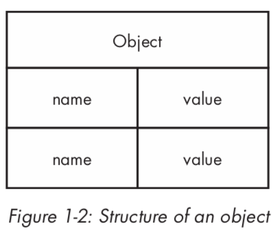
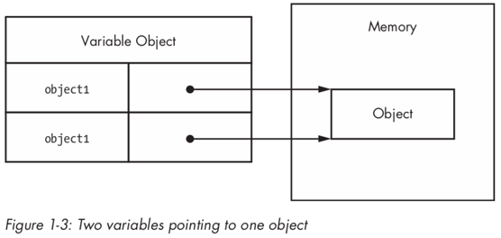

# 基本类型和引用类型

大多数开发者通过基于类的语言（如 Java、C#）来学习面向对象编程，当他们开始学习 JavaScript 时，由于 JavaScript 没有对类的正式支持，他们会感到很迷茫。使用 JavaScript 时，不用一开始就定义类，您可以根据需要编写代码并创建数据结构。因为 JavaScript 缺少类，所以它也缺少诸如包之类的类分组。

而在像 Java 这样的语言中，包和类名既定义了您使用的对象类型，也定义了项目中文件和文件夹的布局（结构），JavaScript 中的编程就像从白纸开始：您可以按您想要的方式组织事物。

一些开发人员选择模仿来自其他语言的结构，而另一些开发人员则利用 JavaScript 的灵活性想出一些全新的东西。对于初学者来说，这种自由选择会无所适从，而一旦您习惯了，就会发现 JavaScript 是一种非常灵活的语言，可以非常容易地适应您的偏好。

为了更容易地从传统的面向对象语言的惯性中转变过来，JavaScript 将对象作为语言的核心。JavaScript 中的几乎所有数据都是对象，或者是通过对象访问的。事实上，在 JavaScript 中，甚至函数都表示为对象，这使它们成为一流函数。

处理和理解对象是理解 JavaScript 整体的关键。您可以在任何时候创建对象，并在需要时从对象中添加或删除属性。此外，JavaScript 对象非常灵活，并且具有创建在其他语言中根本不可能的独特和有趣模式的能力。

本章重点介绍如何识别和使用两种主要的 JavaScript 数据类型：基本类型和引用类型。虽然两者都是通过对象访问的，但是它们的行为方式不同，理解它们很重要。

## 1. 什么是类型？

尽管 JavaScript 没有类的概念，但它仍然使用两种类型：基本类型和引用类型。基本类型存储简单数据。引用类型存储对象，它们实际上只是对内存地址的引用。

棘手的一点是，JavaScript 允许您像对待引用类型那样对待基本类型，以便使语言对于开发人员更加一致。

虽然其他编程语言通过在堆中存储引用类型数据和在栈中存储基本类型数据来区分基本和引用类型，但是 JavaScript 完全消除了这个概念：它使用变量对象跟踪特定范围的变量。基本类型值直接存储在变量对象上，而引用类型值作为指针放在变量对象中，该指针指向内存中存储对象的地址。然而，正如您在本章后面将看到的，基本类型值和引用类型值的行为完全不同，尽管它们最初看起来可能相同。

当然，基本类型和引用类型之间也存在其他差异。

## 2. 基本类型

基本类型表示按原样存储的简单数据片段，如 true 和 25。JavaScript 中有五种基本类型：

| 类型 | 说明 |
|-|-|
| Boolean | `true` 或 `false` |
| Number | 任何整数或浮点数值 |
| String | 由单引号或双引号分隔的字符或字符序列（JavaScript 没有单独的字符类型） |
| Null | 只有一个值的基本类型，为 `null`。 |
| Undefined | 只有 `undefined` 的一个值的基本类型（`undefined` 是赋给未初始化的变量的值） |

前三种类型（布尔、数字和字符串）以相似的方式工作，而后两种（空和未定义）的表现稍有不同，这将在本章中讨论。所有基本类型都具有它们的值的字面量表示。字面量表示不存储在变量中的值，例如硬编码的名称或价格。下面是使用其字面量形式的每种类型的一些示例：

```javascript
// strings
var name = "Nicholas";
var selection = "a";

// numbers
var count = 25;
var cost = 1.51;

// boolean
var found = true;

// null
var object = null;

// undefined
var flag = undefined;
var ref;  // 自动赋值 undefined
```

在 JavaScript 中，与许多其他语言中一样，保存基本类型值的变量直接拥有基本类型值（而不是指向对象的指针）。当将基本类型值赋给变量时，该值将复制到该变量中。这意味着，如果将一个变量设置为等于另一个变量，则每个变量将获得其自己的数据副本。例如：

```javascript
var color1 = "red";
var color2 = color1;
```


这里，`color1` 被指定为 `"red"` 值。然后给变量 `color2` 赋值`color1`，即将 `"red"` 赋值给 `color2`。尽管 `color1` 和 `color2` 包含相同的值，但是它们彼此完全隔离，并且您可以在不影响 `color2` 的情况下更改 `color1` 的值，反之亦然。这是因为它们存在不同的存储位置。图 1-1 说明了这个代码片段的变量对象。

因为每个包含基本类型值的变量都使用自己的存储空间，所以对一个变量的更改不会反映在另一个变量上。例如：

```javascript
var color1 = "red";
var color2 = color1;

console.log(color1);  // "red"
console.log(color2);  // "red"

color1 = "blue";

console.log(color1);  // "blue"
console.log(color2);  // "red"
```

在此代码中，`color1` 更改为 `"blue"`，`color2` 保留其原始值 `"red"`。

### 2.1. 识别基本类型

识别基础类型的最佳方法是使用 `typeof` 操作符，它能处理任何变量，并返回表示数据类型的字符串。`typeof` 操作可以处理字符串、数字、布尔值、`undefined`。下面显示了在不同基本类型值上使用 `typeof` 的输出：

```javascript
console.log(typeof "Nicholas"); // "string"
console.log(typeof 10);         // "number"
console.log(typeof 5.1);        // "number"
console.log(typeof true);       // "boolean"
console.log(typeof undefined);  // "undefined"
```

正如您所预期的，`typeof` 在值是字符串时返回 `"string"`；在值是数字时返回 `"number"`（无论是整数还是浮点值）；在值是布尔值时返回 `"boolean"`，在值初始化时返回 `"undefined"`。

麻烦的是区分 `null`。

您不会是第一个被这行代码的结果弄糊涂的开发人员：

```javascript
console.log(typeof null); // "object"
```

当运行 `typeof null` 时，结果是 `"object"`。但是，当类型为 `null` 时，为什么会有对象呢？（事实上，设计和维护 JavaScript 的委员会 TC39 已经承认这是一个错误。您可以认为 `null` 是一个空对象指针，`"object"` 是逻辑返回值，但这仍然令人困惑。

确定值是否为 `null` 的最佳方法是直接将它与 `null` 进行比较，如下所示：

```javascript
console.log(value === null);  // true or false
```

无强转的比较（comparing without coercion）。

注意，这段代码使用三个等于运算符（===）而不是双等于运算符。原因是，三个等于进行比较时不会将变量强制转换成另一种类型。要理解这一点为什么重要，请思考下面的代码：

```javascript
console.log("5" == 5);  // true
console.log("5" === 5); // false

console.log(undefined == null);   // true
console.log(undefined === null);  // false
```

当使用双等于时，字符串 `"5"` 和数字 `5` 被认为是相等的，因为双等于在比较之前将字符串转换为数字。三等于运算符不认为这些值相等，因为它们是两种不同的类型。同样，当你比较 `undefined` 和 `null`  时，双等号表示它们是等价的，而三等号表示它们不是等价的。在尝试标识 `null` 时，使用三等于号，以便正确标识类型。

### 2.2. 基本类型的方法

尽管它们是基本类型，字符串、数字和布尔实际上都有方法。（`null` 和 `undefined` 类型没有方法。）尤其是字符串，有许多方法可以帮助您使用它们。例如：

```javascript
var name = "Nicholas";
var lowercaseName = name.toLowerCase();  // convert to lowercase
var firstLetter = name.charAt(0);        // get first character
var middleOfName = name.substring(2, 5); // get characters 2-4

var count = 10;
var fixedCount = count.toFixed(2);        // convert to "10.00"
var hexCount = count.toString(16);        // convert to "a"

var flag = true;
var stringFlag = flag.toString();         // convert to "true"
```

注意：尽管它们具有方法，但基本类型值本身不是对象。JavaScript 使它们看起来像对象，以提供语言中一致的体验，正如您将在本章后面看到的。

## 3. 引用类型

引用类型在 JavaScript 中表示对象，并且是最接近于类的东西。引用值是引用类型的实例，并且是对象的同义词（本章其余部分将引用值简单地称为对象）。对象是由名称（总是字符串）、值对组成的无序属性列表。当一个属性的值是一个函数时，它被称为方法。函数本身实际上是 JavaScript 中的引用值，因此包含数组的属性与包含函数的属性之间几乎没有区别，只是可以执行函数。

当然，必须先创建对象，然后才能开始使用它们。

### 3.1. 创建对象

有时，将 JavaScript 对象看作哈希表是有一点帮助，如图 1-2 所示。



有两种方法来创建或实例化对象。第一种是使用新的运算符和构造函数。(构造函数只是使用 `new` 创建对象的函数，任何函数都可以是构造函数。)按照惯例， JavaScript 中的构造函数以大写字母开头，以区别于非构造函数。例如，此代码实例化一个通用对象并在对象中存储对它的引用：

```javascript
var object = new Object();
```

引用类型不直接将对象存储到分配给它的变量中，因此本示例中的对象变量实际上不包含对象实例。相反，它存储的是存放对象的内存的地址的指针（或引用）。这是对象和基本类型值之间的主要区别，因为基本类型直接存储在变量中。

当你把一个对象分配给一个变量时，你实际上是在分配一个指针。这意味着，如果将一个变量分配给另一个变量，则每个变量都获得指针的副本，并且两个变量仍然在内存中引用相同的对象。例如：

```javascript
var object1 = new Object();
var object2 = object1;
```

此代码首先（通过 `new`）创建一个对象并在 `object1` 中存储引用。接下来，将 `object1` 的值赋给 `object2`。此时，对象实例只有一个（在第一行中创建的），但是两个变量现在都指向该对象，如图 1-3 所示。



### 3.2. 取消对象的引用

JavaScript 语言有垃圾回收机制，因此在使用引用类型时，不必担心内存分配。但是，最好取消对您不再需要的对象的引用，以便垃圾收集器可以释放该内存。最好的方法是将对象变量设置为 `null`。

```javascript
var object1 = new Object();

// do something

object1 = null;     // dereference
```

在这里，`object1` 被创建和使用，然后最终被设置为 `null`。当内存中不再引用对象时，垃圾收集器可以将该内存用于其他内容。（取消对象的引用在使用数百万对象的非常大的应用程序中尤其重要。）

### 3.3. 添加或删除属性

JavaScript 中对象的另一个有趣的方面是，您可以随时添加和删除属性。例如：

```javascript
var object1 = new Object();
var object2 = object1;

object1.myCustomProperty = "Awesome!";
console.log(object2.myCustomProperty);     // "Awesome!"
```

在这里，`myCustomProperty` 属性被添加到 `object1` 中，其值为 `"Awesome!"`。在 `object2` 上也可以访问该属性，因为 `object1` 和 `object2` 都指向同一个对象。

注意：这个示例演示了 · 的一个特别独特的方面：您可以随时修改对象的属性，即使一开始没有在对象中定义这些属性。还有一些方法可以防止这种修改，你将会在本书后面会学到的。

除了通用对象引用类型之外，JavaScript 还有其他一些内置类型可供您使用。

## 4. 实例化内置类

您已经看到了如何用 `new Object()` 创建通用对象。`Object` 类型只是 JavaScript 提供的少量内置引用类型中的一种。其他内置类型用于特殊场景，并且可以在任何时候进行实例化。

内置类型为：

| 内置类型 | 说明 |
| - | - |
| Array | 数值索引值的有序列表 |
| Date | 日期和时间 |
| Error | 运行时错误（也有几个更具体的错误子类型） |
| Function | 函数 |
| Object | 通用对象 |
| RegExp | 正则表达式 |

你可以通过 `new` 来实例化内置引用类型，如下：

```javascript
var items = new Array();
var now = new Date();
var error = new Error("Something bad happened.");
var func = new Function("console.log('Hi');");
var object = new Object();
var re = new RegExp("\\d+");
```

### 4.1. 字面量形式（Literal Forms）

一些内置引用类型具有字面量形式。字面量值是一种语法，它允许您使用 `new` 运算符和对象的构造函数，在不显式创建对象的情况下定义引用值。（在本章前面，您看到了基本类型字面量的示例，包括字符串字面量、数字字面量、布尔字面量、`null` 字面量和 `undefined` 的字面量。）

### 4.2. 对象和数组字面量

要通过对象字面量来创建对象，可以在大括号（`{ }`）内定义新对象的属性。属性由标识符(或字符串)、冒号、值组成，多个属性用逗号分隔。例如：

```javascript
var book = {
    name: "The Principles of Object-Oriented JavaScript",
    year: 2014
};
```

还可以使用字符串字面量作为属性名，这在希望属性名具有空格或其他特殊字符时很有用：

```javascript
var book = {
    "name": "The Principles of Object-Oriented JavaScript",
    "year": 2014
};
```

尽管有句法上的差异，这个例子与前一个例子是等价的。这两个示例在逻辑上也等价于以下内容：

```javascript
var book = new Object();
book.name = "The Principles of Object-Oriented JavaScript";
book.year = 2014;
```

前面三个例子中的结果都是一样的：一个具有两个属性的对象。选取哪种创建对象的模式的取决于您，因为功能最终是相同的。

注意：使用对象字面量创建的对象，跟使用 `new Object()` 创建的对象，对于 JavaScript 引擎来说创建对象的步骤是一样的。所有的引用字面量都是这样的。

定义数组字面量的方式：将任意数量的值（以逗号分隔）置于方括号（`[ ]`）内。例如：

```javascript
var colors = [ "red", "blue", "green" ];
console.log(colors[0]);     // "red"
```

上面的代码，等价于：

```javascript
var colors = new Array("red", "blue", "green")
console.log(colors[0]);     // "red"
```

### 4.3. 函数字面量

您几乎总是使用字面量形式定义函数。事实上，由于维护、阅读和调试字符串形式的代码很麻烦，通常不鼓励使用构造函数，因此在代码中很少看到它。

在使用字面量形式时，创建函数更容易，而且不易出错。例如：

```javascript
function reflect(value) {
    return value;
}
// is the same as
var reflect = new Function("value", "return value;");
```

上面的代码定义了 `reflect()` 函数，它返回传递给它的任何值。即使定义这个简单函数，字面量形式也比构造函数形式更容易编写和理解。此外，没有调试以构造函数形式创建的函数的好方法：JavaScript 调试器无法识别这些函数，因此在应用程序中就是黑盒子。

### 4.4. 正则表达式字面量

JavaScript 还具有正则表达式字面量，允许您在不使用 `RegExp` 构造函数的情况下定义正则表达式。正则表达式字面量看起来非常类似于 Perl 中的正则表达式：模式包含在两个正斜杠（`/`）之间，任何附加选项都紧跟在第二个斜杠之后。例如：

```javascript
var numbers = /\d+/g;

// is the same as

var numbers = new RegExp("\\d+", "g");
```

JavaScript 中正则表达式的字面量形式比构造函数形式更简单，因为您不需要担心字符串中的转义字符。当使用 `RegExp` 构造函数时，将模式作为字符串传入时，必须转义任何反斜杠（`\`）。（这就是为什么在字面量中使用 `\d`，在构造函数中使用 `\\d`。）在 JavaScript 中，正则表达式字面量形式优于构造函数形式，除非正则表达式是由一个或多个字符串动态地构造出来的。

也就是说，除了 `Function` 之外，实际上没有任何正确或错误的方法来实例化内置类型。许多开发人员喜欢字面量形式，而有些开发者更喜欢构造函数。选择你觉得更舒适的方法。

## 5. 属性访问

属性是存储在对象上的名称/值对。点（`.`）表示法是 JavaScript 中最常见的访问属性的方法（与许多面向对象语言中一样），但是您也可以通过使用带字符串的中括号（`[ ]`）表示法来访问 JavaScript 对象上的属性。

例如，您可以编写此代码，该代码使用点表示法：

```javascript
var array = [];
array.push(12345);
```

使用括号表示法，方法的名称现在包含在由方括号括起来的字符串中，如本示例所示：

```javascript
var array = [];
array["push"](12345);
```

当您想动态地决定访问哪个属性时，这个语法非常有用。例如，这里括号表示法允许使用变量而不是字符串文字来指定要访问的属性。

```javascript
var array = [];
var method = "push";
array[method](12345);
```

在上面的示例中，变量 `method` 的值为 `"push"`，因此可在数组上调用 `push()`。这种能力是非常有用的，正如你将从这本书中看到的那样。需要记住的一点是，除了语法之外，点符号和括号符号之间唯一的性能或其他方面的区别是括号符号允许在属性名称中使用特殊的字符。开发者更倾向于使用点标记，因为更容易阅读，你会发现它比括号符号使用得更频繁。

## 6. 识别引用类型

函数是最容易识别的引用类型，因为在函数上使用 `typeof` 操作符时，操作符会返回`"function"`：

```javascript
function reflect(value) {
    return value;
}
console.log(typeof reflect);    // "function"
```

其他引用类型很难识别，因为对于除了函数之外的所有引用类型，`typeof` 都返回`"object"`。当你处理很多不同的引用类型时，这并不是很有用。为了更容易地识别引用类型，可以使用 JavaScript 的 `instanceof` 操作符。

操作符 `instanceof` 以对象和构造函数作为参数。当指定的对象是指定的构造函数构造出来的时，`instanceof` 返回 `true`；否则，它返回 `false`，如下所示：

```javascript
var items = [];
var object = {};
function reflect(value) {
    return value;
}
console.log(items instanceof Array); // true
console.log(object instanceof Object); // true
console.log(reflect instanceof Function); // true
```

在这个例子中，使用 `instanceof` 和构造函数测试了几个值。通过使用 `instanceof` 和表示其真实类型的构造函数（即使构造函数没有用于创建对象），可以正确地识别每个引用类型。

操作符的实例可以标识继承的类型。这意味着每个对象实际上是 `Object` 的实例，因为每个引用类型都继承自 `Object`。

为了进行演示，以下代码检查之前用 `instanceof` 创建的三个引用：

```javascript
var items = [];
var object = {};
function reflect(value) {
    return value;
}

console.log(items instanceof Array); // true
console.log(items instanceof Object); // true
console.log(object instanceof Object); // true
console.log(object instanceof Array); // false
console.log(reflect instanceof Function); // true
console.log(reflect instanceof Object); // true
```

每个引用类型都被正确地标识为对象的实例，所有引用类型都从该实例继承。

## 7. 识别数组

虽然 `instanceof` 可以识别数组，但是影响 Web 开发人员的一个例外是： JavaScript 值可以在同一网页中的框架（`<iframe>`）之间来回传递。只有在您试图标识引用值的类型时，这才会成为一个问题，因为每个网页都有自己的全局上下文——自己的 `Object`、`Array` 所有其他内置的类型。因此，当将数组从一个 `<iframe>` 传递到另一个 `<iframe>` 时，`instanceof` 无法工作，因为数组实际上是来自不同 `<iframe>` 的 `Array` 的实例。

为了解决这个问题，ECMAScript 5 引入了 `Array.isArray()` ，它明确地将值标识为 `Array` 的实例，而不管值的来自哪里。当该方法接受一个数组类型的参数，无论该数组来自哪里，它都返回 `true`。如果您的环境是兼容 ECMAScript 5，则 `Array.isArray()` 是识别数组的最好方法：

```javascript
var items = [];
console.log(Array.isArray(items)); // true
```

在大多数环境中，无论是在浏览器中还是在 Node.js，都支持 `Array.isArray()` 方法。在 Internet Explorer 8 以及更早的版本中不支持此方法。