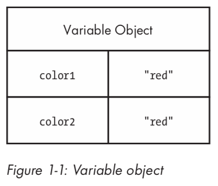

# 基本类型和引用类型

大多数开发者通过基于类的语言（如 Java、C#）来学习面向对象编程，当他们开始学习 JavaScript 时，由于 JavaScript 没有对类的正式支持，他们会感到很迷茫。使用 JavaScript 时，不用一开始就定义类，您可以根据需要编写代码并创建数据结构。因为 JavaScript 缺少类，所以它也缺少诸如包之类的类分组。

而在像 Java 这样的语言中，包和类名既定义了您使用的对象类型，也定义了项目中文件和文件夹的布局（结构），JavaScript 中的编程就像从白纸开始：您可以按您想要的方式组织事物。

一些开发人员选择模仿来自其他语言的结构，而另一些开发人员则利用 JavaScript 的灵活性想出一些全新的东西。对于初学者来说，这种自由选择会无所适从，而一旦您习惯了，就会发现 JavaScript 是一种非常灵活的语言，可以非常容易地适应您的偏好。

为了更容易地从传统的面向对象语言的惯性中转变过来，JavaScript 将对象作为语言的核心。JavaScript 中的几乎所有数据都是对象，或者是通过对象访问的。事实上，在 JavaScript 中，甚至函数都表示为对象，这使它们成为一流函数。

处理和理解对象是理解 JavaScript 整体的关键。您可以在任何时候创建对象，并在需要时从对象中添加或删除属性。此外，JavaScript 对象非常灵活，并且具有创建在其他语言中根本不可能的独特和有趣模式的能力。

本章重点介绍如何识别和使用两种主要的 JavaScript 数据类型：基本类型和引用类型。虽然两者都是通过对象访问的，但是它们的行为方式不同，理解它们很重要。

## 1. 什么是类型？

尽管 JavaScript 没有类的概念，但它仍然使用两种类型：基本类型和引用类型。基本类型存储简单数据。引用类型存储对象，它们实际上只是对内存地址的引用。

棘手的一点是，JavaScript 允许您像对待引用类型那样对待基本类型，以便使语言对于开发人员更加一致。

虽然其他编程语言通过在堆中存储引用类型数据和在栈中存储基本类型数据来区分基本和引用类型，但是 JavaScript 完全消除了这个概念：它使用变量对象跟踪特定范围的变量。基本类型值直接存储在变量对象上，而引用类型值作为指针放在变量对象中，该指针指向内存中存储对象的地址。然而，正如您在本章后面将看到的，基本类型值和引用类型值的行为完全不同，尽管它们最初看起来可能相同。

当然，基本类型和引用类型之间也存在其他差异。

## 2. 基本类型

基本类型表示按原样存储的简单数据片段，如 true 和 25。JavaScript 中有五种基本类型：

| 类型 | 说明 |
|-|-|
| Boolean | `true` 或 `false` |
| Number | 任何整数或浮点数值 |
| String | 由单引号或双引号分隔的字符或字符序列（JavaScript 没有单独的字符类型） |
| Null | 只有一个值的基本类型，为 `null`。 |
| Undefined | 只有 `undefined` 的一个值的基本类型（`undefined` 是赋给未初始化的变量的值） |

前三种类型（布尔、数字和字符串）以相似的方式工作，而后两种（空和未定义）的表现稍有不同，这将在本章中讨论。所有基本类型都具有它们的值的文本表示。文本表示不存储在变量中的值，例如硬编码的名称或价格。下面是使用其文本形式的每种类型的一些示例：

```javascript
// strings
var name = "Nicholas";
var selection = "a";

// numbers
var count = 25;
var cost = 1.51;

// boolean
var found = true;

// null
var object = null;

// undefined
var flag = undefined;
var ref;  // 自动赋值 undefined
```

在 JavaScript 中，与许多其他语言中一样，保存基本类型值的变量直接拥有基本类型值（而不是指向对象的指针）。当将基本类型值赋给变量时，该值将复制到该变量中。这意味着，如果将一个变量设置为等于另一个变量，则每个变量将获得其自己的数据副本。例如：

```javascript
var color1 = "red";
var color2 = color1;
```



这里，`color1` 被指定为 `"red"` 值。然后给变量 `color2` 赋值`color1`，即将 `"red"` 赋值给 `color2`。尽管 `color1` 和 `color2` 包含相同的值，但是它们彼此完全隔离，并且您可以在不影响 `color2` 的情况下更改 `color1` 的值，反之亦然。这是因为它们存在不同的存储位置。图 1-1 说明了这个代码片段的变量对象。

因为每个包含基本类型值的变量都使用自己的存储空间，所以对一个变量的更改不会反映在另一个变量上。例如：

```javascript
var color1 = "red";
var color2 = color1;

console.log(color1);  // "red"
console.log(color2);  // "red"

color1 = "blue";

console.log(color1);  // "blue"
console.log(color2);  // "red"
```

在此代码中，`color1` 更改为 `"blue"`，`color2` 保留其原始值 `"red"`。

### 2.1. 区分基本类型

识别基础类型的最佳方法是使用 `typeof` 操作符，它能处理任何变量，并返回表示数据类型的字符串。`typeof` 操作可以处理字符串、数字、布尔值、`undefined`。下面显示了在不同基本类型值上使用 `typeof` 的输出：

```javascript
console.log(typeof "Nicholas"); // "string"
console.log(typeof 10);         // "number"
console.log(typeof 5.1);        // "number"
console.log(typeof true);       // "boolean"
console.log(typeof undefined);  // "undefined"
```

正如您所预期的，`typeof` 在值是字符串时返回 `"string"`；在值是数字时返回 `"number"`（无论是整数还是浮点值）；在值是布尔值时返回 `"boolean"`，在值初始化时返回 `"undefined"`。

麻烦的是区分 `null`。

您不会是第一个被这行代码的结果弄糊涂的开发人员：

```javascript
console.log(typeof null); // "object"
```

当运行 `typeof null` 时，结果是 `"object"`。但是，当类型为 `null` 时，为什么会有对象呢？（事实上，设计和维护 JavaScript 的委员会 TC39 已经承认这是一个错误。您可以认为 `null` 是一个空对象指针，`"object"` 是逻辑返回值，但这仍然令人困惑。

确定值是否为 `null` 的最佳方法是直接将它与 `null` 进行比较，如下所示：

```javascript
console.log(value === null);  // true or false
```

无强转的比较（comparing without coercion）。

注意，这段代码使用三个等于运算符（===）而不是双等于运算符。原因是，三个等于进行比较时不会将变量强制转换成另一种类型。要理解这一点为什么重要，请思考下面的代码：

```javascript
console.log("5" == 5);  // true
console.log("5" === 5); // false

console.log(undefined == null);   // true
console.log(undefined === null);  // false
```

当使用双等于时，字符串 `"5"` 和数字 `5` 被认为是相等的，因为双等于在比较之前将字符串转换为数字。三等于运算符不认为这些值相等，因为它们是两种不同的类型。同样，当你比较 `undefined` 和 `null`  时，双等号表示它们是等价的，而三等号表示它们不是等价的。在尝试标识 `null` 时，使用三等于号，以便正确标识类型。