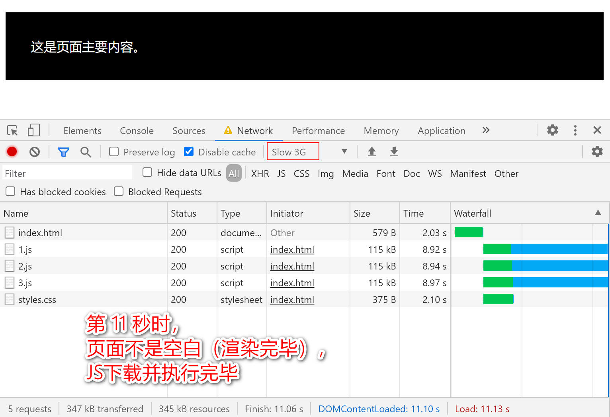
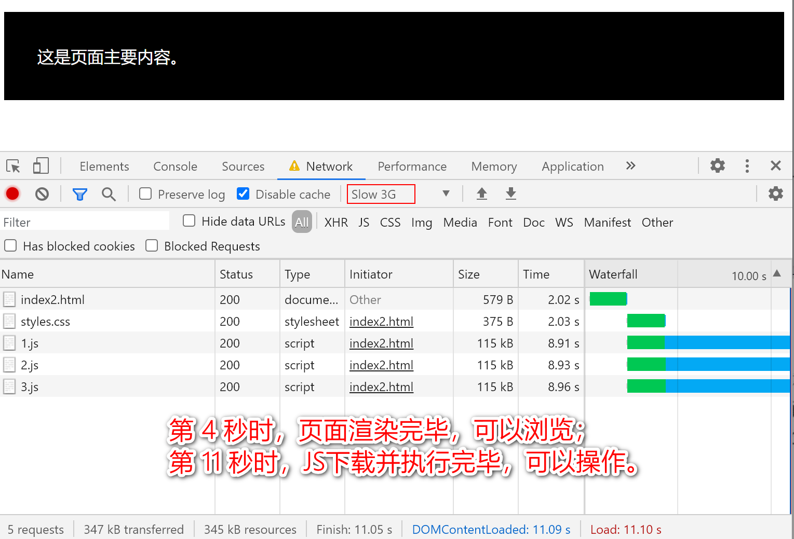

# 第 1 章 加载和执行

>《高性能 JavaScript》—— Nicholas C. Zakas

在浏览器中，使用一个线程刷新用户界面和执行 JS；
也就是说，同一时刻，要么执行JS（UI被冻结），要么响应用户输入（JS不能执行）。

## 1. `<script>` 的位置

浏览器从上往下解析 HTML 文档，遇到 `<script>` 时，会停止渲染界面而去（下载）执行 JS 代码；

如果把 `<script>` 放在页面顶部（`<head>`中），JS 代码执行完毕之前 页面都是空白的；

如果把 `<script>` 放在页面底部（`</body>`前），会先呈现界面再去执行 JS，不会让人感觉明显的延迟。

### 1.1. `<script>` 放在页面顶部

```html
<html>
  <head>
    <script src="1.js"></script>
    <script src="2.js"></script>
    <script src="3.js"></script>
    <link href="styles.css" rel="stylesheet" type="text/css">    
  </head>
  <body>
    <p>这是页面主要内容。</p>
  </body>
</html>
```

瀑布图如下：




### 1.2. `<script>` 放在页面底部

```html
<!DOCTYPE html>
<html>
  <head>
    <link rel="stylesheet" href="styles.css">
  </head>
  <body>
    <p>这是页面主要内容。</p>
    <script src="1.js"></script>
    <script src="2.js"></script>
    <script src="3.js"></script>
  </body>
</html>
```

瀑布图如下：



页面的大部分内容已经下载并并显示给用户，因此页面下载不会显得太慢。

## 2. 无阻塞的脚本

将 `<script>` 放在页面底部仍会对页面的渲染有一定影响。

无阻塞，即不阻塞页面的渲染，页面加载完成后才加载 JS。
也就是说， `window 的 load` 或 `document 的 DOMContentLoaded` 触发时再加载执行 JS。

### 2.1. 延迟的脚本

示例：

```html
<script src="jquery.js" defer></script>
<script src="main.js" defer></script>
```

说明：

* 异步（在“后台”）加载 JS
* 等到 `DOMContentLoaded` 后再执行
* 多个 `<script defer>`，按出现在文档的顺序执行

应用：

* 多个 JS 文件有依赖关系的情况

### 2.2. 异步的脚本

示例：

```html
<script src="advertisement.js" async></script>
```

说明：

* 异步（在“后台”）加载 JS
* 加载完成后立刻执行
* 多个 `<script async>`，谁先下载完谁先执行

应用：

* 可独立运行的 JS，如广告

### 2.3. 动态插入 `<script>`

说明：

* 通过 JS 创建 `<script src="1.js">`，将其插入到 `<head>` 元素中。

好处：

* `<script>` 插入后，立马加载并执行，不会阻塞页面

示例：

```javascript
function loadScript(url, onload) {
  var script = document.createElement('script')
  script.type = 'text/javascript';

  if (script.readyState) { // IE
    script.onreadystatechange = function () {
      if (script.readyState === 'loaded' || script.readyState === 'complete') {
        script.onreadystatechange = null;
        onload();
      }
    };
  } else { // Others
    script.onload = function () {
      onload();
    };
  }

  script.src = url;

  // 动态创建的 <script>， 其 async 属性默认为 true
  // script.async = true;

  document.getElementsByTagName('head')[0].appendChild(script);
}

loadScript('1.js', function () {
  console.log('load success');
});
```

### 2.4. XMLHttpRequest 脚本注入

说明：

* 通过 Ajax 获取脚本内容并注入页面。

好处：

* 可以控制下载 JS 代码何时执行。

缺点：

* 受同源策略限制，不能从 CDN 下载。

示例：

```javascript
var xhr = new XMLHttpRequest();

xhr.open("get", "1.js", true);

xhr.onreadystatechange = function(){
  if (xhr.readyState === 4){
    if (xhr.status >= 200 && xhr.status < 300 || xhr.status === 304){
      var script = document.createElement("script");

      script.type = "text/javascript";
      script.text = xhr.responseText;
      document.body.appendChild(script);
    }
  }
};

xhr.send(null);
```

### 2.5. 无阻赛模式

向页面中添加大量 JS，推荐的做法是：

1. 先加载 loader
2. 再通过 loader 加载业务代码

示例：

```html
<script src="loader.js"></script>
<script>
  loadScript('main.js', function () {
    app.init();
  });
</script>
```

YUI3 的方式：

```html
<script type="text/javascript"
  src="http://yui.yahooapis.com/combo?3.0.0/build/yui/yui-min.js"></script>

<script>
YUI().use("dom", function(Y) {
 Y.DOM.addClass(docment.body, "loaded");
});
</script>
```

## 3. 小结

执行 JS 代码会阻塞浏览器的其他处理过程（如 UI 绘制）。
每次解析到 `<script>` ，浏览器都要先下载并执行JS代码，然后继续处理其他部分。

有几种方法可以降低 JS 对性能的影响：

* `<script>` 放在页面底部，保证页面已经渲染完毕再执行 JS
* 合并脚本
* 无阻塞式下载 JS：
  * defer 、 async
  * 动态创建 `<script>` 元素
  * 通过 Ajax 下载 JS 并注入