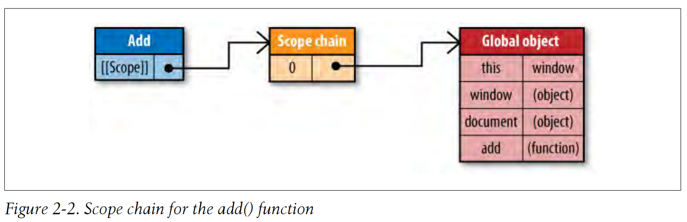
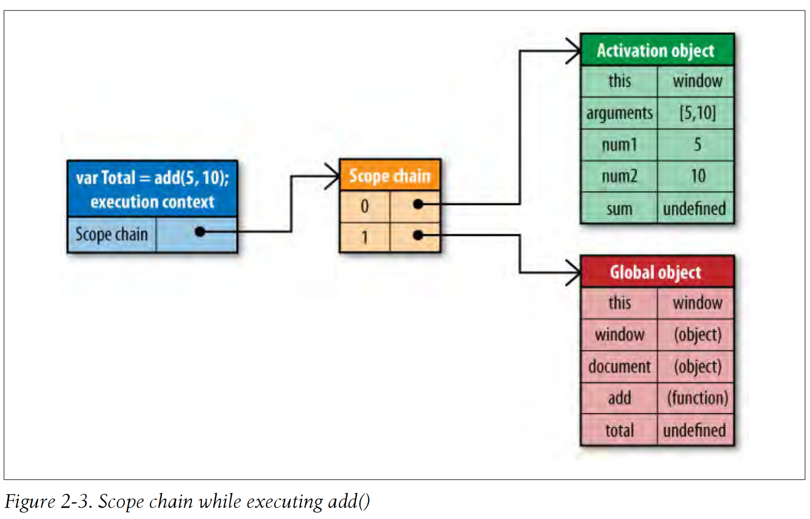

# 第 2 章 数据访问

>《高性能 JavaScript》—— Nicholas C. Zakas

存储数据的位置关系到代码执行过程中数据的检索速速。

JS 有 4 中基本的数据存储位置：

**1.字面量**，代表自身，有： 字符串、数字、布尔值、对象、数组、函数、正则、 `null`、 `undefined`

**2.变量**，开发人员使用 `var` 定义的

**3.数组元素**，存储在 JS 数组中，以数字作为索引

**4.对象成员**，存储在 JS 对象中，以字符串作为索引

字面量和局部变量的访问速度较快。

## 1. 作用域

在函数里，作用域决定哪些变量可以访问 以及 `this` 如何赋值。

### 1.1. 作用域链

JS 中的函数是对象（`Function` 类的实例），
有一个内部属性 `[[Scope]]`，这个属性即为 作用域链，它决定哪些数据可以被函数访问，
作用域链中元素称为 变量对象（variable object），由键值对组成。

当函数创建时，函数所在作用域的数据将会赋值给变量对象；
也就是说，定义函数的那个作用域的所有变量都会塞到 `[[Scope]]` 中的变量对象上。

如下：

```javascript
function add(num1, num2) {
  var sum = num1 + num2;

  return sum;
}
```

以上代码执行完后，`add()` 函数被创建， 该函数所在作用域为全局作用域（顶级作用域），
全局作用域变量对象用 `global object` 表示，该变量对象中有 `window`、`document`、全局变量等，
如下图：



**创建函数时的作用域链**将在**函数调用**时用到，如下代码：

```javascript
var total = add(5, 10);
```

执行 `add` 函数时，会创建一个内部对象，该内部对象称为 执行上下文（execution context）。
执行上下文 就是函数执行时的环境，每次调用函数都会创建一个新的执行上下文，
函数调用完毕后 执行上下文 会被销毁。

执行上下文 有自己的作用域链，用于解析标识符；
执行上下文 一旦创建，就用函数创建时的 `[[Scope]]` 会拷贝到自己的作用域链，
拷贝 `[[Scope]]` 后，会创建一个 `activation object`（活动对象）变量对象，并置于作用域链的顶端，
`activation object` 包含 局部变量、命名参数、`arguments` 对象、`this`。
如下图所示：



### 1.2. 解析标识符

在函数执行时，遇到（读写）变量（标识符），会在 执行上下文 的作用域链中找，
找到了则返回，找不到则视为 `undefined`。
这个过程影响性能。

作用域链由一个个变量对象组成，变量对象包含各个作用域的标识符；
查找的标识符（所在变量对象），越靠前 查找越快。
