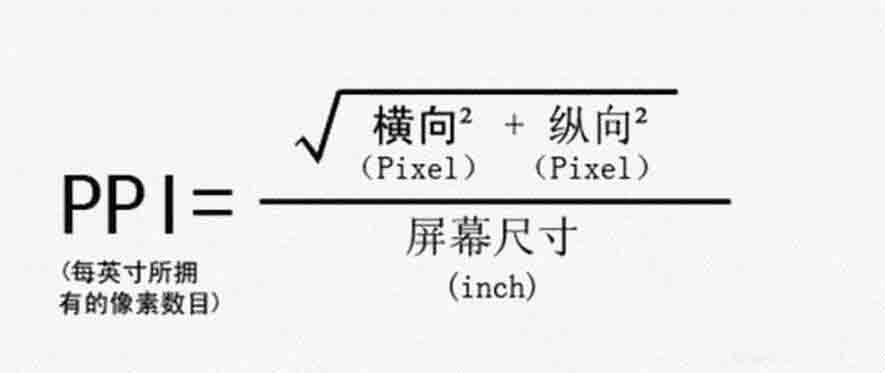
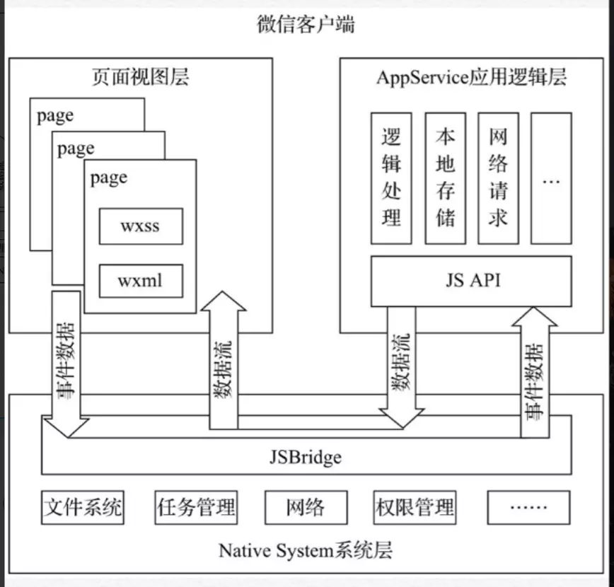
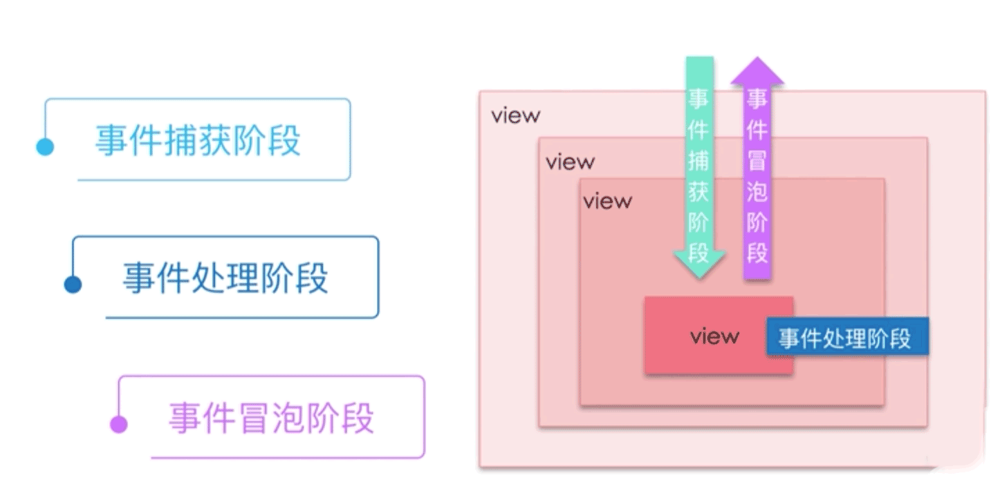

# 微信小程序开发框架

## 1. 基本构成

* wxml：内容
* wxss：样式
* wxs
* JavaScript：逻辑

## 2. wxml

### 2.1. 语法

说明：

* WXML：Weixin Markup Language
* 是框架设计的一套标签语言，结合组件、WXS、事件系统，可以构建出页面的结构

语法：

```xml
<标签名 属性名1="属性值1" 属性名2="属性值2" ...>
  ...
</标签名>
```

注意：

* 标签严格闭合
* 属性大小写敏感

### 2.2. 语言特性

* 数据绑定
* 列表渲染
* 条件渲染
* 模板引用

### 2.3. 数据绑定

mustache 语法：

* index.wxml

  ```xml
  <!-- 文本绑定 -->
  <view>{{ message }}</view>

  <!-- 属性值绑定 -->
  <text data-name="{{ name }}"></text>

  <view hidden="{{ flag ? true : false }}">
    表达式
  </view>
  ```

* index.js

  ```javascript
  Page({
    data: {
      message: 'Hello world!',
      name: '吴钦飞',
      flag: true,
    },
  });
  ```

### 2.4. 属性

所有标签都有的属性：

| 属性名 | 类型 | 描述 | 注解 |
| - | - | - | - |
| id | String | 唯一标志 | 保持整个页面唯一 |
| class | String | 样式类 | 在对于的 WXSS 中定义的样式类 |
| style | String | 内联样式 | 可动态设置 |
| hidden | Boolean | 是否显示 | 默认显示 |
| data-* | Any | 自定义属性 | 组件上触发事件时，会发送给事件处理函数 |
| bind* / catch* | EventHandler | 组件的事件 | 参考“事件” |

### 2.5. 列表渲染

* `index.wxml`

  ```xml
  <block wx:for="{{ items }}" wx:for-item="item" wx:key="item.id">
    <view>{{ index }} - {{ item.name }}</view>
  </block>
  ```

* `index.js`

  ```javascript
  Page({
    data: {
      items: [
        { id: 1, name: '哇哈哈' },
        { id: 2, name: '酸酸奶' },
        { id: 3, name: '优酸乳' },
      ],
    },
  });
  ```

### 2.6. 条件渲染

* `index.wxml`

  ```xml
  <view wx:if="{{ condition === 1 }}">条件 1</view>
  <view wx:elif="{{ condition === 2 }}">条件 2</view>
  <view wx:else>条件 3</view>
  ```

* `index.js`

  ```javascript
  Page({
    data: {
      condition: Math.floor(Math.random() * 3 + 1),
    },
  });
  ```

与 `hidden` 属性的区别：

* `hidden` 可类比 vue 中的 `v-show`
* `wx:if` 可类比 vue 中的 `v-if`

### 2.7. 模板引用

文件引用：

* `<import src="1.wxml" />` 只引入模板内容，且模板有独立的作用域
* `<include src="1.wxml" />` 只引入非模板内容

import：

* `layout.wxml`

  ```xml
  <view>页头</view>
  <template name="body">
    {{ message }}
  </template>
  <view>页脚</view>
  ```

* `import.wxml`：只引入模板

  ```xml
  <import src="/templates/layout.wxml" />
  <template is="body" data="{{ message }}"/>
  ```

* `include.wxml`：只引入非模板内容

  ```xml
  <include src="/templates/layout.wxml" />
  <template is="body" data="{{ message }}"/>
  ```

## 3. WXSS

### 3.1. 介绍

说明：

* CSS：是描述 HTML、XML 文档呈现的样式语言
* WXSS(WeiXin Style Sheets)
  * 是描述 WXML 的组件样式的样式语言
  * WXSS 覆盖了 CSS 绝大部分属性，并且做了部分修改和补充

区别：

* 尺寸单位 rpx
* 样式导入
* 内联样式
* 选择器

### 3.2. 尺寸单位 rpx

关于单位：

* 设备像素（device pixels）：设备上一个一个固定不动的点
* CSS 像素（CSS pixels）：样式表中使用的逻辑像素
* PPI/DPI（pixel per inch）：一英寸上有多少个CSS 像素
* DPR（device pixel ratio）：设备像素与CSS像素之比
* RPX（pesponse pixel）：规定屏幕宽度 750rpx，进行自适应

PPI 的计算公式：

* 
* 以 iPhone 6 为例

  ```javascript
  Math.sqrt(Math.pow(750, 2) + Math.pow(1334, 2)) / 4.7
  // 325.6122832234166
  ```

### 3.3. 样式导入

用于静态样式。

语法：

```scss
@import './base.wxss';
@import './public.wxss';
@import './layout.wxss';
```

注意：

* 样式导入，从上到下执行

### 3.4. 内联样式

用于动态样式。

* `index.wxml`

  ```xml
  <view style="color: #999; font-size: {{ fontSize }};">
  鲜橙多
  </view>
  ```

* `index.js`

  ```javascript
  Page({
    data: {
      fontSize: '12px',
    },
  });
  ```

### 3.5. 选择器

支持的选择器：

| 选择器 | 样例 | 描述 |
| - | - | - |
| `.class` | `.intro { color: 'red' }` | `<view class="intro">` |
| `#id` | `#user { color: 'red' }` | `<view id="user">` |
| `element` | `view { color: 'red' }` | `<view>` |
| `element,element` | `view,checkbox { color: 'red' }` | `<view><checkbox>` |
| `::after` | `view::after { color: 'red' }` | `<view>` 之后插入内容 |
| `::bofore` | `view::after { color: 'red' }` | `<view>` |

优先级（权重）：

* `!important`：无限大
* `style`：1000
* `#id`：100
* `.class`：10
* `element`：1

## 4. JavaScript

### 4.1. 介绍

JavaScript 是一种轻量的、解释型的、面向对象的头等函数语言，是一种动态的基于原型和多范式的脚本语言，支持面向对象、命令式、函数式的编程风格。

### 4.2. 比较

浏览器中的 JavaScript：

* ECMAScript
* DOM（文档 API）
* BOM（浏览器 API）

Nodejs 中的 JavaScript：

* ECMAScript
* Native（服务器端 API）
* NPM

小程序中的 JavaScript：

* ECMAScript
* 小程序框架
* 小程序 API

共同点：

* 都是 ECMAScript 的实现

### 4.3. 小程序中 JavaScript 的运行环境

* IOS：JavaScriptCore
* Android：X5内核
* 微信开发者工具：nwjs

JavaScriptCore 对 ES6 支持程度不高，需要转 ES5 并真机调试。

## 5. WXS

WXS：WeiXin Script。对 ES5 进行封装和限制。

* ES5
* 模块：遵循 CommonJS 2 模块标准
* 结尾注释
* 不支持 `try...catch`

## 6. MINA 框架

参考：[https://www.jianshu.com/p/aba6920eb34d](https://www.jianshu.com/p/aba6920eb34d)

如图：



说明：

* 小程序提供的开发框架为MINA框架，它类似于淘宝Weex、Vue框架。MINA框架经过大量底层的优化设计，有着接近原生App的运行速度，对Android端和iOS端做到了高度一致的呈现，具有完备的开发和调试工具。
* MINA框架通过封装微信客户端提供的文件系统、网络通信、任务管理、数据安全等基础功能，对上层提供一整套JavaScript API,让开发者能够非常方便地使用微信客户端提供的各种基础功能与能力，快速构建一个应用。
* 非单线程：UI 线程，脚本线程，不会页面冻结。

## 7. 运行机制

启动：

* 冷启动
  * 小程序首次打开，或被销毁后再次打开的情况。
  * 主动销毁的情形：进入后台超过 5 分钟
* 热启动：
  * 已经打开过该小程序，在一定时间内再次打开，只需要将小程序从后台切换到前台

## 8. 生命周期

分为：

* [应用生命周期](https://developers.weixin.qq.com/miniprogram/dev/reference/api/App.html)
* [页面生命周期](https://developers.weixin.qq.com/miniprogram/dev/framework/app-service/page-life-cycle.html)

应用生命周期：

* onLaunch：监听小程序初始化
* onShow：小程序启动，或从后台进入前台显示时触发
* onHide：小程序从前台进入后台时触发
* onError：小程序发生脚本错误或 API 调用报错时触发
* onPageNotFound：小程序要打开的页面不存在时触发

页面生命周期：

* onLoad
* onShow
* onReady
* onHide
* onUnload
* 

## 9. 路由

查看：[https://developers.weixin.qq.com/miniprogram/dev/framework/app-service/route.html](https://developers.weixin.qq.com/miniprogram/dev/framework/app-service/route.html)

### 9.1. 页面栈

框架以栈的形式维护了当前的所有页面。 当发生路由切换的时候，页面栈的表现如下：

* 初始化：
  * 新页面 A 入栈
  * 栈：A
* 打开新页面：
  * 新页面 B 入栈
  * 栈：A - B
* 页面重定向：
  * 当前页面 B 出栈，新页面 C 入栈
  * 栈：A - C
* 页面返回：
  * 当前页 C 出栈
  * 栈：A
* Tab 切换：
  * 页面全部出栈，只留下新的 Tab 页面
* 重加载：
  * 页面全部出栈，只留下新的页面

开发者可以使用 `getCurrentPages()` 函数获取当前页面栈。

### 9.2. 路由方式

对于路由的触发方式以及页面生命周期函数如下：

| 路由方式 | 触发时机 | 路由前页面 | 路由后页面 |
| - | - | - | - |
| 初始化 | 小程序打开的第一个页面 | - | onLoad, onShow |
| 打开新页面 | 调用 API [wx.navigateTo](https://developers.weixin.qq.com/miniprogram/dev/api/route/wx.navigateTo.html) <br> 使用组件 [`<navigator open-type="navigateTo"/>`](https://developers.weixin.qq.com/miniprogram/dev/component/navigator.html) | onHide | onLoad, onShow |
| 页面重定向 | 调用 API [wx.redirectTo](https://developers.weixin.qq.com/miniprogram/dev/api/route/wx.redirectTo.html) <br> 使用组件 [`<navigator open-type="redirectTo"/>`](https://developers.weixin.qq.com/miniprogram/dev/component/navigator.html) | onUnload | onLoad, onShow |
| 页面返回 | 调用 API [`wx.navigateBack`](https://developers.weixin.qq.com/miniprogram/dev/api/route/wx.navigateBack.html) <br> 使用组件 [`<navigator open-type="navigateBack">`](https://developers.weixin.qq.com/miniprogram/dev/component/navigator.html) <br> 用户按左上角返回按钮 | onUnload | onShow |
| Tab 切换 | 调用 API [`wx.switchTab`](https://developers.weixin.qq.com/miniprogram/dev/api/route/wx.switchTab.html) <br> 使用组件 [`<navigator open-type="switchTab"/>`](https://developers.weixin.qq.com/miniprogram/dev/component/navigator.html) <br> 用户切换 Tab | - | 各种情况请参考下表 |
| 重启动 | 调用 API [`wx.reLaunch`](https://developers.weixin.qq.com/miniprogram/dev/api/route/wx.reLaunch.html)  <br> 使用组件 [`<navigator open-type="reLaunch"/>`](https://developers.weixin.qq.com/miniprogram/dev/component/navigator.html) | onUnload | onLoad, onShow |

## 10. 事件

### 10.1. 介绍

* 事件是视图层到逻辑层的通讯方式
* 事件可以将用户的行为反馈到逻辑层进行处理
* 事件可以绑定在组件上，触发事件后，就会执行逻辑层中对应的事件处理函数
* 事件对象可以携带额外信息

参考：[https://developers.weixin.qq.com/miniprogram/dev/framework/view/wxml/event.html](https://developers.weixin.qq.com/miniprogram/dev/framework/view/wxml/event.html)

示例：

* `index.wxml`

  ```xml
  <!-- 事件 -->
  <view bindtap="clickMe">点我啊</view>
  ```

* `index.js`

  ```javascript
  Page({
    clickMe(e) {
      console.log(e);
    }
  });
  ```

### 10.2. 事件模型

事件是三个阶段：

* 事件捕获阶段
* 事件处理阶段
* 事件冒泡阶段



### 10.3. 事件类型

可捕获事件：

* touchstart
* touchmove
* touchcancel
* touchend
* tap
* longpress
* longtap

可冒泡事件：

* touchstart
* touchmove
* touchcancel
* touchend
* tap
* longpress
* longtap
* transitionend
* animationstart
* animationiteration
* animationend
* touchforcechange

绑定方式：

* `<view bindtap="clickMe">` 会冒泡
* `<view bind:tap="clickMe">` 会冒泡
* `<view catch:tap="clickMe">` 不会冒泡
