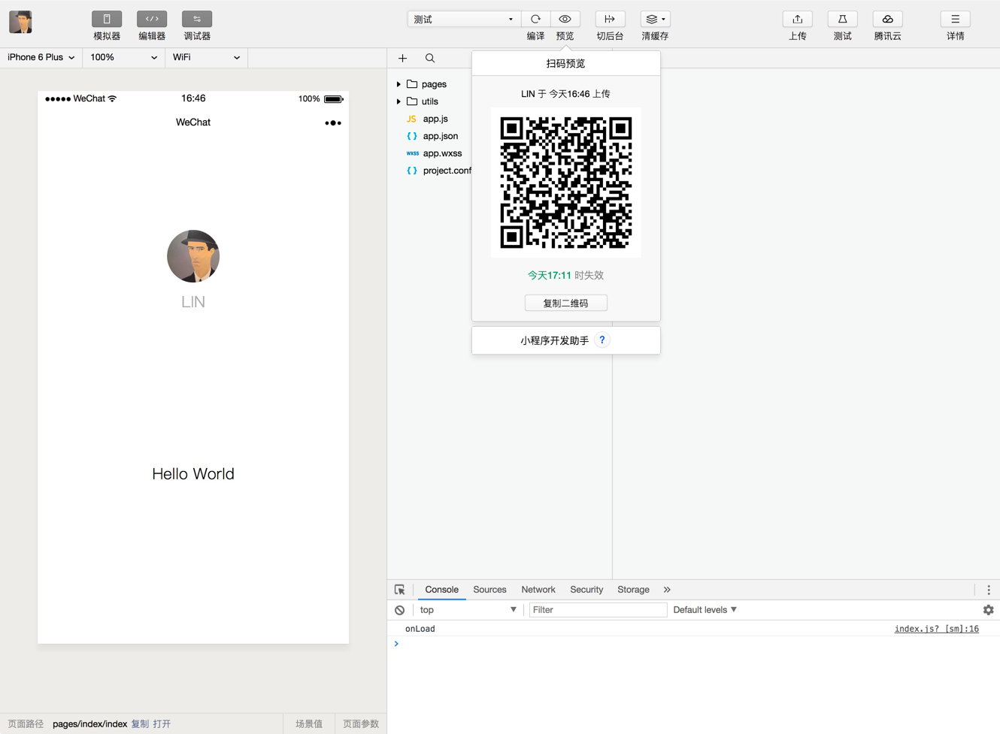

# 第 5 章：小程序的协同工作和发布

在中大型的公司里，人员的分工非常仔细，一般会有不同岗位角色的员工同时参与同一个小程序项目。考虑到这样的情况，小程序平台设计了不同的权限管理使得项目管理者可以更加高效管理整个团队的协同工作。

以往我们在开发完网页之后，需要把网页的代码和资源放在服务器上，让用户通过互联网来访问。在小程序的平台里，开发者完成开发之后，需要在开发者工具提交小程序的代码包，然后在小程序管理平台[1]发布小程序，用户可以通过搜索或者其他入口来进入该小程序。

在这一章我们会把团队的协同工作的注意事项和小程序发布前后涉及的概念和流程做一些介绍。

## 1. 协同工作

### 1.1. 人员组织结构和权限分配

多数情况下，一个团队多人同时参与同一个小程序项目，每个角色所承担的工作或者权限不一样，中大公司的分工更为仔细。为了更形象的表达团队不同角色的关系以及权限的管理，我们通过虚拟一个项目成员组织结构来描述日常如何协同合作完成一个小程序的发布，组织关系如图 5-1 所示。

图5-1 虚拟小程序项目组：

* 

项目管理成员负责统筹整个项目的进展和风险、把控小程序对外发布的节奏，产品组提出需求，设计组与产品讨论并对需求进行抽象，设计出可视化流程与图形，输出设计方案。开发组依据设计方案，进行程序代码的编写，代码编写完成后，产品组与设计组体验小程序的整体流程，测试组编写测试用例并对小程序进行各种边界测试。项目一般的成员构成与工作流程如图5-2所示。

图5-2 提需求到发布小程序的流程:

* 

为了便于管理，小程序平台给不同角色定义了 7 种权限，如表5-1所示。

表5-1 小程序平台的7种权限:

| 权限 | 说明 |
| - | - |
| 开发者权限 | 可使用小程序开发者工具及开发版小程序进行开发 |
| 体验者权限 | 可使用体验版小程序 |
| 登录 | 可登录小程序管理后台，无需管理员确认 |
| 数据分析 | 使用小程序数据分析功能查看小程序数据 |
| 开发管理 | 小程序提交审核、发布、回退 |
| 开发设置 | 设置小程序服务器域名、消息推送及扫描普通链接二维码打开小程序 |
| 暂停服务设置 | 暂停小程序线上服务 |

管理者可以很方便分配这些权限给项目的各个组织成员，小程序的管理比传统的网页开发和App应用开发更为简单便捷。图5-1展示的虚拟组织的成员权限可以按照表5-2进行分配：

表5-2 虚拟组织成员的权限分配:

| 成员 | 权限分配 |
| - | - |
| 项目管理组成员 | 拥有所有权限 |
| 开发组成员 | 开发者权限 / 体验者权限 / 数据分析 |
| 产品组成员 | 体验者权限 / 数据分析 |
| 测试组成员 | 体验者权限 |

需要留意，项目管理者控制整个小程序的发布、回退、下架等敏感操作，不应把敏感操作的权限分配给不相关人员。

### 1.2. 小程序的版本

一般的软件开发流程，开发者编写代码自测开发版程序，直到程序达到一个稳定可体验的状态时，开发者会把这个体验版本给到产品经理和测试人员进行体验测试，最后修复完程序的Bug后发布供外部用户正式使用。小程序的版本根据这个流程设计了小程序版本的概念，如表5-2所示。

表5-3 小程序的版本:

| 权限 | 说明|
| - | - |
| 开发版本 | 使用开发者工具，可将代码上传到开发版本中。 开发版本只保留每人最新的一份上传的代码。点击提交审核，可将|代| 码提交审核。开发版本可删除，不影响线上版本和审核中版本的代码。|
| 体验版本 | 可以选择某个开发版本作为体验版，并且选取一份体验版。|
| 审核中版本 | 只能有一份代码处于审核中。有审核结果后可以发布到线上，也可直接重新提交审核，覆盖原审核版本。|
| 线上版本 | 线上所有用户使用的代码版本，该版本代码在新版本代码发布后被覆盖更新。|

考虑到项目是协同开发的模式，一个小程序可能同时由多个开发者进行开发，往往开发者在小程序开发者工具上编写完代码后需要到手机进行真机体验，所以每个开发者拥有自己对应的一个开发版本。因为处于开发中的版本是不稳定的，开发者随时会修改代码覆盖开发版，为了让测试和产品经理有一个完整稳定的版本可以体验测试，小程序平台允许把其中一个开发版本设置成体验版，因此建议在项目开发阶段特殊分配一个开发角色，用于上传稳定可供体验测试的代码，并把他上传的开发版本设置成体验版。

刚刚说到开发者需要真机调试开发版本时，可以点击开发者工具的预览按钮，此时开发者工具会打包当前项目，并上传到微信服务器生成一个二维码，开发者使用当前开发身份的微信扫描二维码就可以在手机上体验对应的开发版本，如图5-3所示。

图5-3 预览小程序开发版：

* 

在小程序管理平台上可以选取某个开发版作为体验版本，操作成功之后可以得到一个体验版的二维码，当前项目有权限的体验者均可用其对应的微信号进行扫码体验。

## 2. 用户体验审视

在小程序发布之前，我们建议开发者务必对小程序做认真严格的用户体验审视。有创造性的产品思路、友好流畅的用户体验和稳定谨慎的运营也是一款优秀小程序能够脱颖而出的关键因素。

本小节将从产品和设计两方面，帮助开发者在小程序发布之前审视自身产品设计和用户体验情况，达到较高的用户体验水准，且是对用户友好的一款产品。

### 2.1. 产品和运营思路

我们希望开发者能坚持“一切以用户价值为依归” 这一产品观，让创造发挥价值。产品设计过程中，开发者亦需要保持一定的克制心态。繁复的需求和商业行为，在用户利益前都需要谨慎平衡。

在运营行为上，小程序需要遵从微信小程序运营规范。若开发者的小程序违反了其中的条款、相关平台规则或法律法规，或对公众平台、开放平台造成了影响，可能会被强制处罚。条款将根据新问题、相关法律法规或产品运营需要对其内容进行修改并更新，详细条款请查阅[小程序运营文档](https://developers.weixin.qq.com/miniprogram/product/)
