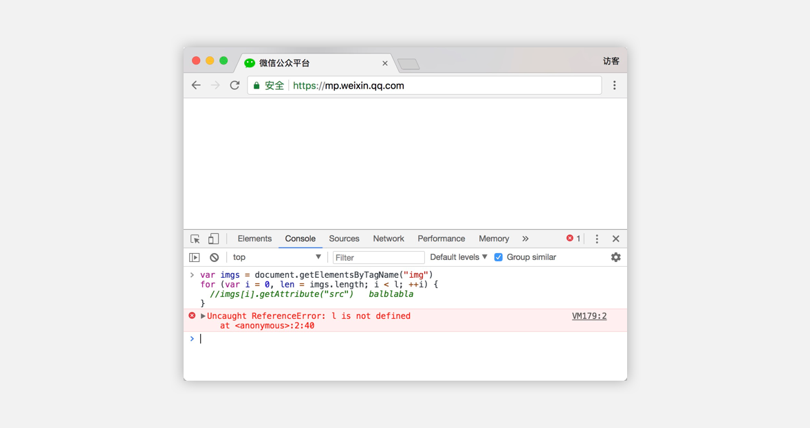
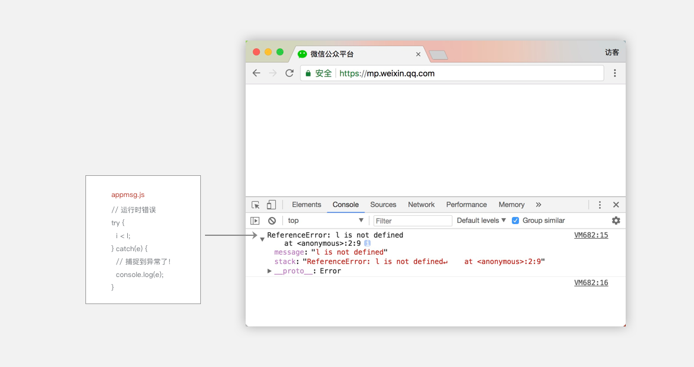
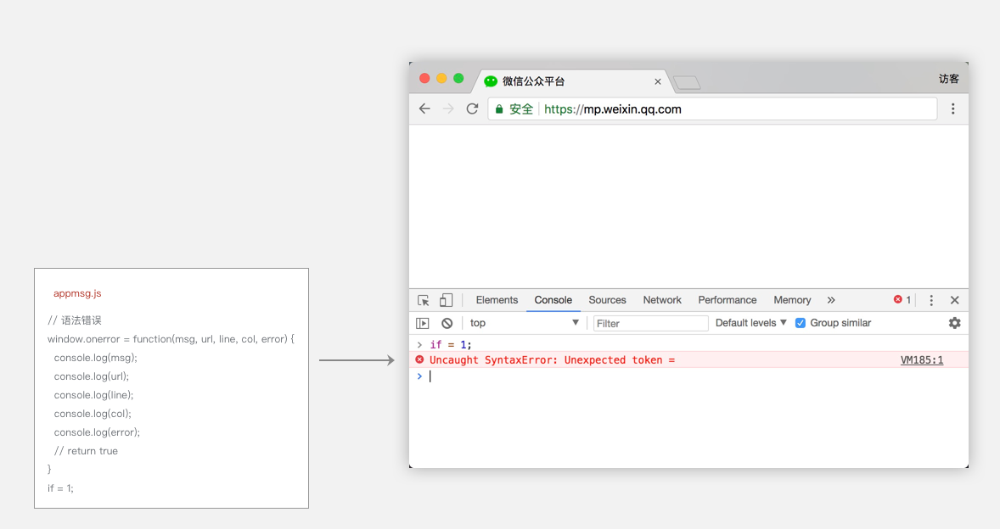

# 第 8 章：小程序基础库的更新迭代

小程序平台正式发布后，收到许多开发者的反馈，其中有Bug类的反馈，也有向我们提出某些具体需求的。程序总有出错的时候，小程序的底层也有出现重大 Bug 的现象发生，一旦这种Bug出现，会影响到很多小程序的正常工作，因此我们需要迅速进行修复。同时，我们也以小步快跑的方式发布很多新的能力供开发者使用，所以小程序的底层基础库迭代速度是非常快。在这一章我们会介绍小程序基础库是如何进行更新迭代的。

## 1. 小程序基础库

我们在第三章提到过小程序的运行环境是分成渲染层和逻辑层的，我们在渲染层可以用各类组件组建界面的元素，在逻辑层可以用各类API来处理各种逻辑，这里提到的组件、API其实都是小程序基础库进行包装提供的，基础库的职责还要处理数据绑定、组件系统、事件系统、通信系统等一系列框架逻辑，才能让整个小程序有序的运作起来。小程序的基础库是JavaScript编写的，它可以被注入到渲染层和逻辑层运行。为了叙述方便，下文我们把小程序基础库简称为基础库。

### 1.1. 基础库载入时机

我们在开发网页时，经常会引用很多开源的JS库，在使用到这些库所提供的 API 前，我们需要先在业务代码前边引入这些库，如代码 8-1 所示，我们在使用 jQuery 库的$函数前，需要在业务代码前用 script 标签先引入 jQuery.js。

代码清单8-1 在HTML引入其他JS库:

```html
<script src="jQuery.js"></script>
<script src="Vue.js"></script>
<script>
  $(function() {
    // console.log("ready")
  })
</script>
```

同样道理，为了让小程序业务代码能够调用 `wx.navigateTo` 等 API 以及组件，就需要在启动小程序后先载入基础库，接着再载入业务代码。由于小程序的渲染层和逻辑层是两个线程管理，渲染层 WebView 层注入的称为 WebView 基础库，逻辑层注入的称为 AppService 基础库，如果没有特殊声明，后文提到基础库的概念指的是 WebView 基础库和 AppService 基础库两个的组合。

显然，所有小程序在微信客户端打开的时候，都需要注入相同的基础库 ，所以，小程序的基础库不会被打包在某个小程序的代码包里边，它会被提前内置在微信客户端。这样做的好处有两点：

* 降低业务小程序的代码包大小。
* 可以单独修复基础库中的 Bug，无需修改到业务小程序的代码包。

### 1.2. 基础库的版本号

小程序基础库版本号使用 semver 规范，格式为 `Major.Minor.Patch`，其中 `Major`、`Minor`、`Patch`均为整数，`1.9.901`、`2.44.322`、`10.32.44` 都是符合 semver 风格的版本号。通常我们月度发布版本会把 `Minor` 提升一位，例如从 `1.9.x` 升级到 `1.10.x`，如果是修正版本，会把 `Patch` 提升一位，例如 `1.10.0` 升级到 `1.10.1`。`Major 位则是重大特性发布时才会被提升一位。

在小程序中，可以通过 `wx.getSystemInfo()` 或者 `wx.getSystemInfoSync()` 方法获取小程序版本号，如代码8-2所示。

代码清单8-2 用字符串直接比较版本号

```javascript
var info = wx.getSystemInfoSync()
console.log("小程序基础库版本号为：" + info.SDKVersion)
```

我们还要再强调一点，不少开发者会使用错误的版本号比较方法，例如直接用字符串比较，`parseInt` 比较等，往后当基础库版本号提升上去后，会引发一些逻辑错误，如代码8-3所示。

代码清单8-3 用字符串直接比较版本号:

```javascript
var info = wx.getSystemInfoSync() // info.SDKVersion == "1.11.0"
if (info.SDKVersion > "1.9.0") { // 此时条件为false，无法进入if分支
  // 处理高版本小程序的逻辑
}
```

代码8-4给出了正确的比较版本号的方法，后续小程序基础库会内置版本比较的API，建议查阅小程序官方文档使用该方法。

代码清单8-4 正确比较版本号的方法

```javascript
function compareVersion(v1, v2) {
  v1 = v1.split('.')
  v2 = v2.split('.')
  var len = Math.max(v1.length, v2.length)

  while (v1.length < len) {
    v1.push('0')
  }
  while (v2.length < len) {
    v2.push('0')
  }

  for (var i = 0; i < len; i++) {
    var num1 = parseInt(v1[i])
    var num2 = parseInt(v2[i])

    if (num1 > num2) {
      return 1
    } else if (num1 < num2) {
      return -1
    }
  }
  return 0
}

compareVersion('1.11.0', '1.9.9') // => 1 // 1表示 1.11.0比1.9.9要新
compareVersion('1.11.0', '1.11.0') // => 0 // 0表示1.11.0和1.11.0是同一个版本
compareVersion('1.11.0', '1.99.0') // => -1 // -1表示1.11.0比 1.99.0要老
```

## 2. 异常

程序不可避免会出现运行时错误，JavaScript 语言是一种非常灵活的脚本语言，由于没有静态编译的过程，在运行时就更容易出现异常现象，例如错误的把某个字符串类型变量当做整数类型去做处理等。

### 2.1. JS 运行异常

我们在网页开发中，如果在 Chrome 运行代码 8-5 片段，在 Chrome 浏览器的开发者工具 里的 Console 面板中出现脚本运行异常的错误信息，示例中 `for` 循环的条件表达式 `i < l` 中的 `l` 变量没定义，运行后出现异常，如图 8-1 所示。

代码清单8-5 运行时产生异常的代码示例

```javascript
var imgs = document.getElementsByTagName("img")
for (var i = 0, len = imgs.length; i < l; ++i) {
  //imgs[i].getAttribute("src")   balblabla
}
```

图8-1 网页JS运行错误:

* 

一般语法错误以及运行时错误，浏览器都会在 Console 里边显示对应的错误信息，以及出错的文件、行号、堆栈信息。

### 2.2. 捕捉JS异常的方法

在 WebView 层有两种方法可以捕捉 JS 异常：

* `try, catch` 方案。你可以针对某个代码块使用 `try,catch` 包装，这个代码块运行时出错时能在 `catch` 块里边捕捉到。
* `window.onerror` 方案。也可以通过 `window.addEventListener("error", function(evt){})`，这个方法能捕捉到语法错误跟运行时错误，同时还能知道出错的信息，以及出错的文件，行号，列号。

图8-2和8-3分别展示了两个方案的使用方法以及出错呈现。

图8-2 利用try-catch捕捉JS运行异常:

* 

图8-3 通过window.onerror捕捉JS运行异常:

* 

这两个方案都无法捕捉代码的语法错误，但是一般在开发阶段，工具就已经能够显示出脚本的语法错误，因此这类异常完全是可以在开发阶段消除，运行阶段并不会有此类异常发生。对比 `window.onerror` 的方案，`try-catch` 的方案有个缺点：没法捕捉到全局的错误事件，也即是只有 `try,catch` 的块里边代码运行出错才会被捕捉到。逻辑层不存在 `window` 对象，因此逻辑层 AppService 侧无法通过 `window.onerror` 来捕捉异常。

所以小程序基础库在 WebView 侧使用 `window.onerror` 方案进行捕捉异常，在逻辑层 AppService 侧通过把 `App` 实例和 `Page` 实例的各个生命周期等方法包裹在 `try-catch` 里进行捕捉异常。同时在 `App` 构造器里提供了 `onError` 的回调，当业务代码运行产生异常时，这个回调被触发，同时能够拿到异常的具体信息，开发者自己根据业务情况处理对应的容错逻辑。

我们在基础库里捕捉到的运行时异常会上报到我们的服务器，然后产生类似图8-4所示的监控曲线，通过这个监控图来观察基础库的运行情况。

图8-4 基础库异常监控曲线:

* 

## 3. 基础库的更新

前边我们已经提到了什么是基础库，以及我们如何检测基础库运行时异常的方法，现在我们结合这两点来说说我们如何进行基础库的更新。

### 3.1. 基础库版本变动

小程序的很多能力需要微信客户端来支撑，例如蓝牙、直播能力、微信运动等，可以说，小程序基础库的迭代离不开微信客户端的发布。

为了更方便叙述，我们来虚拟这样一个需求迭代的场景：当前微信版本为 `6.5.10`，小程序基础库版本为 `1.6.0`，我们需要往微信即将发布的 `6.5.11` 加入小程序的直播组件能力。由于有新的能力依赖微信客户端的月度发布版本提供，我们下一个要发布的基础库版本定为 `1.7.0`。

为了避免新版本的基础库给线上小程序带来未知的影响，微信客户端都是携带上一个稳定版的基础库发布的。也就是微信客户端正式发布 `6.5.11` 的版本依旧内置 `1.6.0` 版本的基础库。等到微信客户端正式发布后，我们会开始灰度 推送 `1.7.0` 版本的基础库到 `6.5.11` 的微信客户端里，在这个过程需要仔细监控各类异常现象以及开发者和用户的反馈，一般灰度时长为 12 小时，灰度结束后，用户设备上就会有新版本的基础库。如果存在重大 Bug，那此次推送会被回退，也就是基础库版本回到 1.6.0 版本。

当 1.7.0 版本推送稳定后，我们会更新小程序文档，开发者就可以在小程序中使用 1.7.0 版本所提供的新能力——直播组件，在这之后如果小程序基础库出现任何 Bug，我们推送 Patch 版本进行修复，此时基础库版本号的 Patch 位会被提升一位，也就是 1.7.1 版本。

### 3.2. 推送基础库过程

小程序基础库的迭代速度非常快，但是基础库的变更会影响到所有小程序的运行，如果基础库出现重大Bug我们没有及时发现时，会引起很多小程序无法正常使用，所以我们在更新基础库时会非常谨慎。

首先，在正式灰度推送新版本基础库前，我们内部有严格的自动化测试流程，保证已有的测试用例全部能通过，同时还会在带有最新版本库的测试机上运行访问量较高的一些小程序并检测他们是否存在一些白屏等异常现象。

接着进行灰度推送，一般灰度时长是12个小时，遇到一些重大代码改动时可能灰度时间会更久。推送过程中，我们会观察前边图8-4所示的监控曲线是否有异动，也会仔细分析对应的上报日志是否存在致命的错误。

灰度推送完成后，我们会发布新能力的文档，此时我们也会关注微信开发者社区的Bug反馈，根据情况再决定是否要推送Patch版本进行一些Bug的修复。

## 4. 本章小结

在本章中我们介绍了如何进行小程序日常能力的迭代发布，在发布新版本基础库的过程，我们需要有检测异常现象的能力，避免故障的发生。正是这样严格的迭代流程使得小程序框架能够稳定运行在各个版本的微信客户端中，同时这种小步快跑的迭代速度让开发者可以使用新能力去完善他们的小程序交互。在下一章我们会一起来了解微信开发者工具是如何在PC端模拟小程序调试的。
