# 第 9 章：微信开发者工具

本章主要介绍微信开发者工具如何编译小程序代码，如何实现小程序模拟器以及如何调试小程序。

## 1. 简介

虽然在开发语言层面小程序与传统的网页差别不大：是使用 JavaScript 脚本语言编写逻辑代码、使用类似于 HTML 的 WXML 来描述页面的结构、使用类似于 CSS 的 WXSS 来描述节点的样式，但是由于小程序渲染和逻辑分离的运行机制与传统的网页存在差异，所以无法使用传统的网页的开发调试工具，因此我们推出了小程序开发生态一站式 IDE ——微信开发者工具。开发者可以借助微信开发者工具完成小程序的代码开发、编译运行、界面和逻辑调试、真机预览和提交发布版本等功能。

图9-1 微信开发者工具:

* 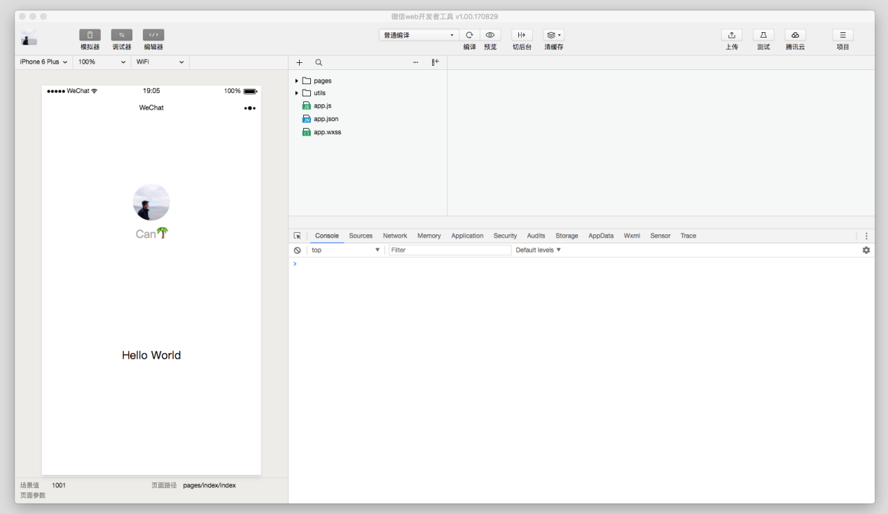

微信开发者工具是一个基于 `nw.js` ，使用 `node.js`、`chromium` 以及系统 API 来实现底层模块，使用 `React`、`Redux` 等前端技术框架来搭建用户交互层，实现同一套代码跨 Mac 和Windows 平台使用。

图9-2 微信开发者工具底层框架

* 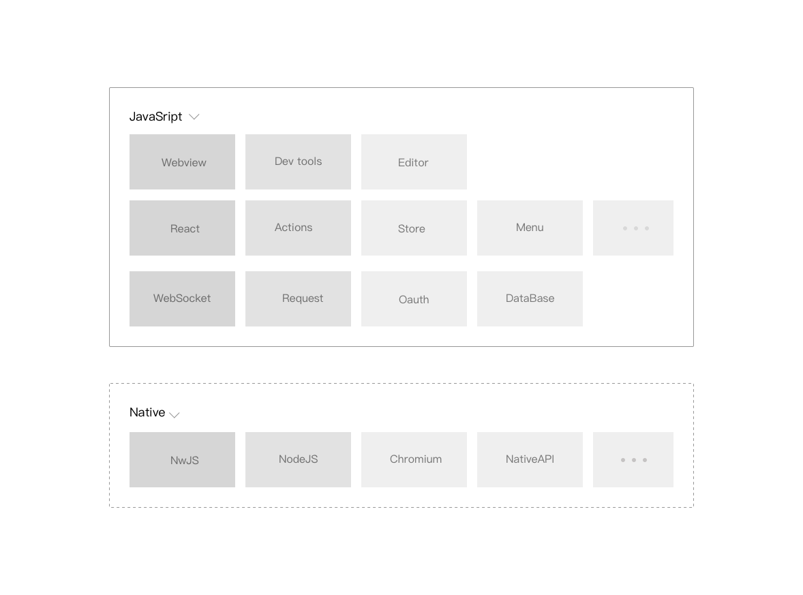

## 2. 代码编译

微信开发者工具和微信客户端都无法直接运行小程序的源码，因此我们需要对小程序的源码进行编译。代码编译过程包括本地预处理、本地编译和服务器编译。为了快速预览，微信开发者工具模拟器运行的代码只经过本地预处理、本地编译，没有服务器编译过程，而微信客户端运行的代码是额外经过服务器编译的。

### 2.1. 编译 WXML

WXML（WeiXin Markup Language）是小程序框架设计的一套标签语言，用于构建出页面的结构。小程序的渲染层的运行环境是一个 WebView，而 WebView 无法直接理解 WXML 标签，所以需要经过编译。

微信开发者工具内置了一个二进制的 WXML 编译器，这个编译器接受 WXML 代码文件列表，处理完成之后输出 JavaScript 代码，这段代码是各个页面的结构生成函数。

图9-3 WXML的编译过程：

* 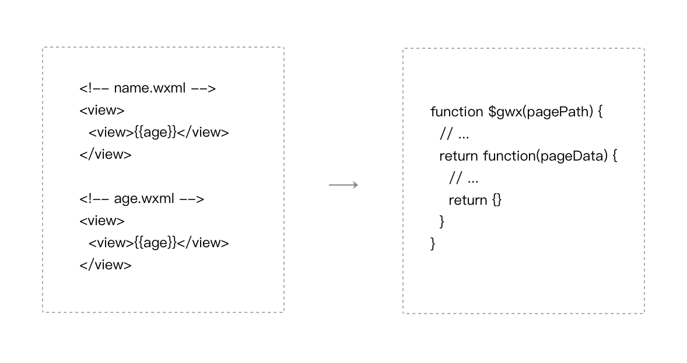

编译过程将所有的 WXML 代码最终变成一个 JavaScript 函数，预先注入在 WebView 中。在运行时确定了页面路径之后，将路径作为参数传递给这个函数得到该页面的结构生成函数，页面结构生成函数接受页面数据，输出一段描述页面结构的 JSON，最终通过小程序组件系统生成对应的 HTML。

代码清单10-1 如何使用页面结构生成函数

```javascript
// $gwx 是 WXML 编译后得到的函数
// 根据页面路径获取页面结构生成函数
var generateFun = $gwx('name.wxml')

// 页面结构生成函数接受页面数据，得到描述页面结构的 JSON
var virtualTree = generateFun({
   name:  'miniprogram'
})

/**
virtualTree == {
   tag: 'view'，
   children: [{
       tag: 'view',
       children: ['miniprogram']
     }]
 }
 **/

 // 小程序组件系统在虚拟树对比后将结果渲染到页面上
virtualDom.render(virtualTree)
```

上传代码时，微信开发者工具直接将本地的 WXML 代码文件提交到后台，由后台进行 WXML 编译，后台的 WXML 编译器和开发者工具本地内置的 WXML 编译器是同一套代码生成的。

### 2.2. 编译 WXSS

WXSS (WeiXin Style Sheets) 是一套样式语言，用来决定 WXML 的组件应该怎么显示。为了适应广大的前端开发者，WXSS 具有 CSS 大部分特性。同时为了更适合开发微信小程序，WXSS 对 CSS 进行了扩充以及修改。与 CSS 相比，WXSS 扩展的一些特性，包括 rpx 尺寸单位和样式导入语法，这些特性都是 WebView 无法直接理解的。

微信开发者工具内置了一个二进制的 WXSS 编译器，这个编译器接受 WXSS 文件列表，分析文件之间的引用关系，同时预处理 rpx，输出一个样式信息数组，如图 10-4，每个 WXSS 文件对应于这个数组中的一项。

图9-4 WXSS的编译过程:

* 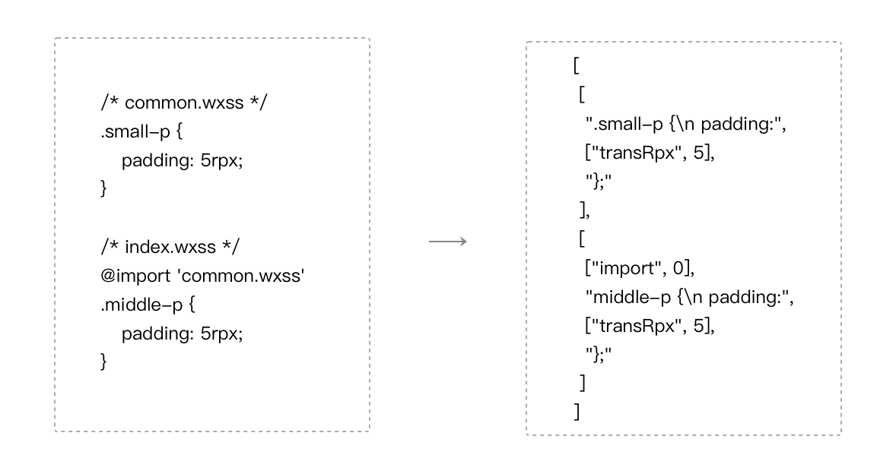

在运行时，根据当前的屏幕宽度，计算出 1rpx 对应多少像素单位，然后将样式信息数组转换成最终的样式添加到页面中。

由于样式在微信客户端存在兼容性问题，为了方便开发者，微信开发者工具提供了上传代码时样式自动补全的功能，利用 PostCSS 对 WXSS 文件进行预处理，自动添加样式前缀。

### 2.3. 编译 JavaScript

微信客户端在运行小程序的逻辑层的时候只需要加载一个 JS 文件（我们称为 `app-service.js`），而小程序框架允许开发者将 JavaScript 代码写在不同的文件中，所以在代码上传之前，微信开发者工具会对开发者的 JS 文件做一些预处理，包括 ES6 转 ES5 和代码压缩（开发者可以选择关闭预处理操作），在服务器编译过程将每个 JS 文件的内容分别包裹在 define 域中，再按一定的顺序合并成 `app-service.js` 。其中对于页面 JS 和 `app.js` 需要主动 require。

图9-5 JavaScript的编译过程:

* 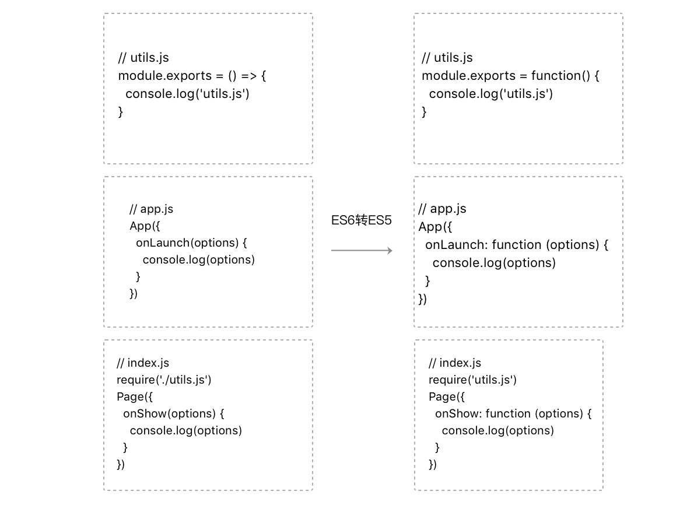
* 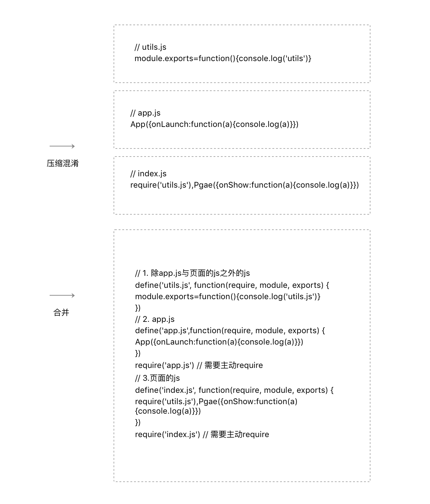

## 3. 模拟器

小程序模拟器模拟小程序在微信客户端的逻辑和界面表现，方便开发者实时查看代码效果。由于系统差异以及微信客户端特有的一些交互流程，少部分的API无法在模拟器上进行模拟，但对于绝大部分的 API 均能够在模拟器上呈现出正确的状态。同时微信开发者工具提供多种机型尺寸以及自定义机型尺寸功能，方便开发者进行界面样式的机型适配。

图9-6 小程序模拟器：

* 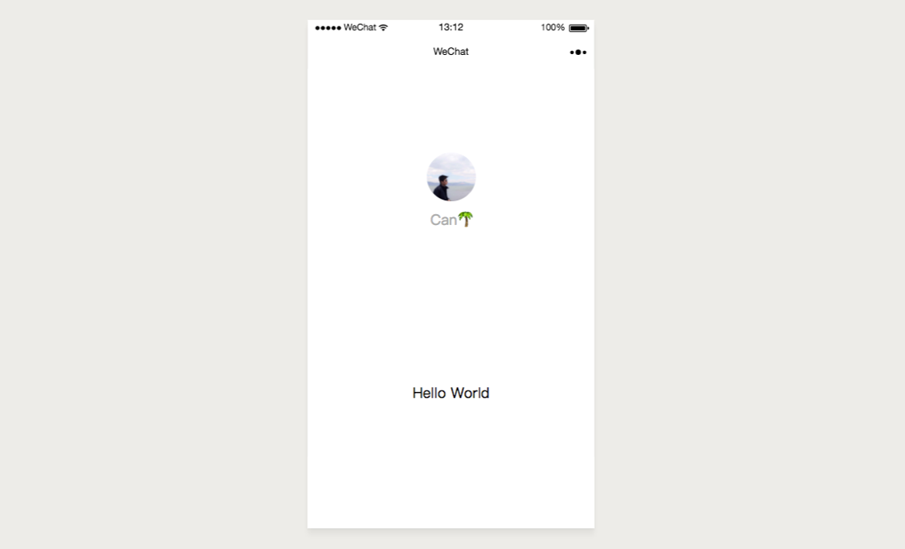

### 3.1. 逻辑层模拟

在iOS微信客户端上，小程序的 JavaScript 代码是运行在 JavaScriptCore 中，在 Android 微信客户端上，小程序的 JavaScript 代码是通过 X5 JSCore 来解析的。而在微信开发者工具上我们采用了一个隐藏着的 Webivew 来模拟小程序的逻辑运行环境。

图9-7 微信客户端小程序运行环境模型简图：

* 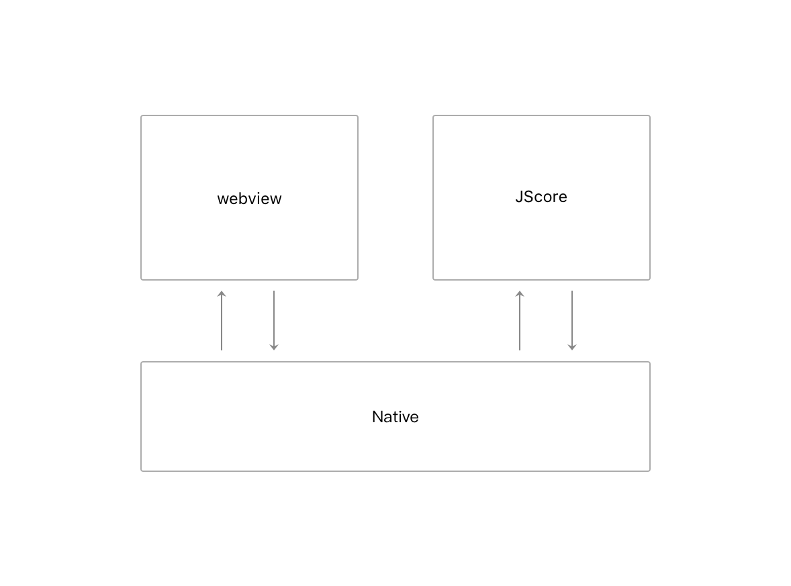

图9-8 微信开发者工具小程序运行环境模型简图:

* 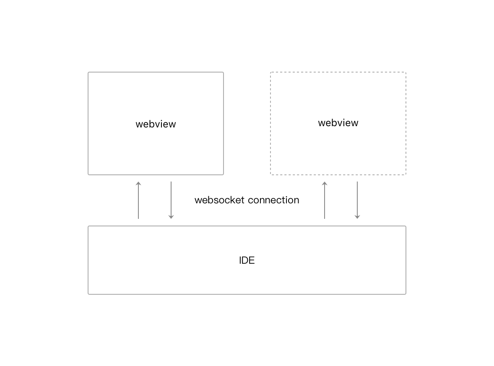

在微信开发者工具上 WebView 是一个 chrome 的 `<webview />` 标签。与 `<iframe />` 标签不同的是，`<webview/>` 标签是采用独立的线程运行的。

用于模拟小程序逻辑层的 `<webview/>` 加载的链接是

```text
http://127.0.0.1:9973/appservice/appservice
```

我们在开发者工具底层搭建了一个本地HTTP服务器来处理小程序模拟器的网络请求。其中：

* `./__asdebug/asdebug.js`： 是开发者工具注入的脚本。
* `./__dev__/WAService.js`：是小程序逻辑层基础库。
* `./util.js`、`./app.js`、`./index.js`：开发者 JS 代码。

WebView 在请求开发者 JS 代码时，开发者工具读取JS代码进行必要的预处理后，将处理结果返回，然后由 WebView 解析执行。虽然开发者工具上是没有对 JS 代码进行合并的，但是还是按照相同的加载顺序进行解析执行。

图9-9 appservice 内容:

* 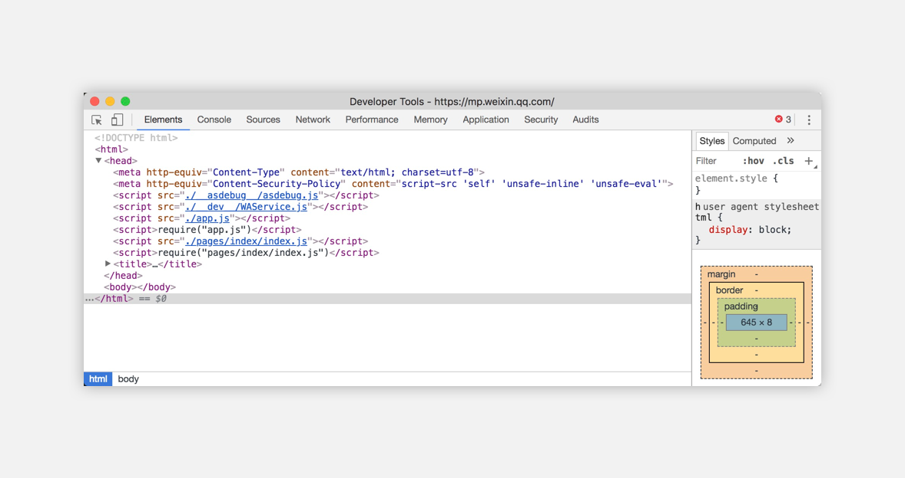

WebView 是一个浏览器环境，而 JsCore 是一个单纯的脚本解析器，浏览器中的 BOM 对象无法在 JSCore 中使用，开发者工具做了一个很巧妙的工作，将开发者的代码包裹在 define 域的时候，将浏览器的 BOM 对象局部变量化，从而使得在开发阶段就能发现问题。

图9-10 BOM对象局部变量化:

* 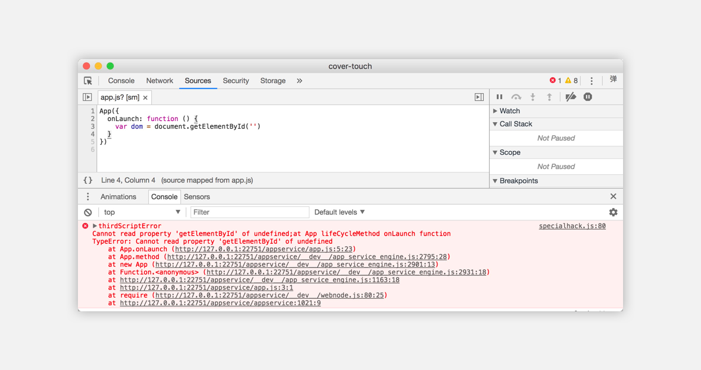

### 3.2. 渲染层模拟

微信开发者工具使用chrome的 `<webview />` 标签来加载渲染层页面，每个渲染层 WebView 加载

```text
http://127.0.0.1:9973/pageframe/pageframe.html
```

开发者工具底层搭建的 HTTP 本地服务器在收到这个请求的时候，就会编译 WXML 文件和 WXSS 文件，然后将编译结果作为 HTTP 请求的返回包。当确定加载页面的路径之后，如 index 页面，开发工具会动态注入如下一段脚本：

```javascript
// 改变当前webview 的路径，确保之后的图片网络请求能得到正确的相对路径
history.pushState('', '', 'pageframe/index')

// 创建自定义事件，将页面结构生成函数派发出去，由小程序渲染层基础库处理
document.dispatchEvent(new CustomEvent("generateFuncReady", {
   detail: {
     generateFunc: $gwx('./index.wxml')
   }
}))

// 注入对应页面的样式，这段函数由WXSS编译器生成
setCssToHead()
```

### 3.3. 客户端模拟

微信客户端为丰富小程序的功能提供了大量的 API。在微信开发者工具上，通过借助 BOM（浏览器对象模型）以及 node.js 访问系统资源的能力，同时模拟客户端的 UI 和交互流程，使得大部分的 API 能够正常执行。

借助 BOM，如 `wx.request` 使用 `XMLHttpRequest` 模拟、`wx.connectSocket` 使用 `WebSocket`、`wx.startRecord` 使用 `MediaRecorder`、`wx.playBackgroundAudio` 使用 `<audio/>` 标签；

借助 node.js，如使用 fs 实现 `wx.saveFile`、`wx.setStorage`、`wx.chooseImage` 等 API 功能。

借助模拟 UI 和交互流程，实现 `wx.navigateTo`、`wx.showToast`、`wx.openSetting`、`wx.addCard` 等。

### 3.4. 通讯模拟

上文已经叙述了小程序的逻辑层、渲染层以及客户端在微信开发者工具上的模拟实现，除此之外，我们需要一个有效的通讯方案使得小程序的逻辑层、渲染层和客户端之间进行数据交流，才能将这三个部分串联成为一个有机的整体。

微信开发者工具的有一个消息中心底层模块维持着一个 WebSocket 服务器，小程序的逻辑层的 WebView 和渲染层页面的 WebView 通过 WebSocket 与开发者工具底层建立长连，使用 WebSocket 的 protocol 字段来区分 Socket 的来源。

代码清单10-2 逻辑层中的消息模块

```javascript
// <webview/>的userAgent是可定制的
// 通过userAgent中获取开发者工具WebSocket服务器监听的端口
var port = window.navigator.userAgent.match(/port\/(\d*)/)[1]

// 通过指定 protocol == 'APPSERVICE' 告知开发者工具这个链接是来自逻辑层
var ws = new WebSocket(`ws://127.0.0.1:${port}`, 'APPSERVICE')

ws.onmessage = (evt) => {
  let msg = JSON.parse(evt.data)
  // …处理来自开发者工具的信息
}

// 调用API接口 wx.navigateBack
ws.send(JSON.stringify({
  command: 'APPSERVICE_INVOKE'，
  data: {
     api: 'navigateBack',
     args: {}
  }
}))
```

## 4. 调试器

代码调试是开发者工具的最主要的功能之一，包括界面调试和逻辑调试。`nw.js` 对 `<webview/>` 提供打开 Chrome Devtools 调试界面的接口，使得开发者工具具备对小程序的逻辑层和渲染层进行调试的能力。同时为了方便调试小程序，开发者工具在 Chrome Devtools 的基础上进行扩展和定制。

代码清单10-3 如何调试 webview

```javascript
// 用于渲染的webview
var webview = document.createElement('webview')

//用于显示调试器的WebView
var devtoolsWebView = document.createElement('webview')

// 显示调试器
webview.showDevTools(ture, devtoolsWebView)
```

开发者工具上显示的调试器是调试逻辑层WebView，主要使用 Chrome Devtools 的 Sources 面板调试逻辑层 JS 代码。Chrome Devtools 自带的 Element 面板并不能调试当前渲染层页面的节点（实际上是调试逻辑层 WebView 的节点），所以我们通过在 devtoolsWebView 中注入脚本的方式将 Chrome Devtools 的 Element 面板隐藏，同时开发了 Chrome Devtools 插件 WXML 面板（可以参考如何开发Chrome 插件，本文不做展开），用于展示渲染层界面调试的用户交互界面。

开发者工具会在每个渲染层的 WebView 中注入界面调试的脚本代码，负责获取 WebView 中的 DOM 树、获取节点样式、监听节点变化、高亮选中节点、处理界面调试命令。并将界面调试信息通过 WebSocket 经由开发者工具转发给 WXML 面板进行处理。

如图10-11及图10-12所示，开发者写的 WXML 源码与真实的 DOM 树之间存在较大的差异，需要经过一个最小树算法，如图10-13所示，将非小程序组件节点剔除后才能呈现出与 WXML 源码一致的效果。

图9-11 WXML源码:

* 

图9-12 真实的DOM树:

* 

图9-13 最小树算法示例:

* 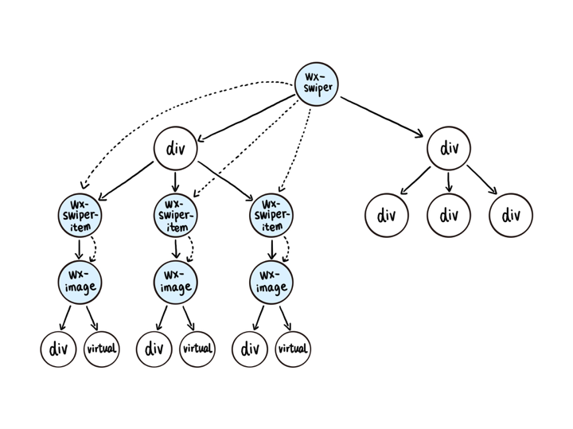

图9-14 WXML面板的最终效果:

* 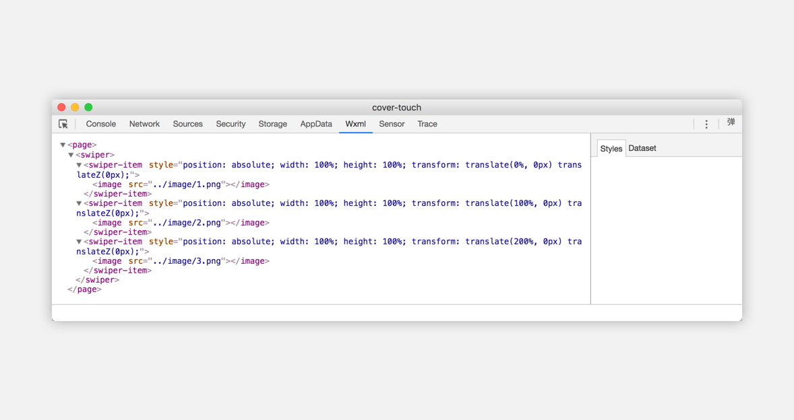

