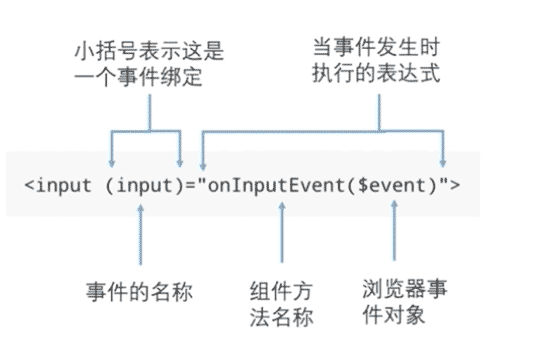

 # 数据绑定

默认单向绑定，双向绑定变为可选。

## 1. 事件绑定

语法：`(事件名)="模板语句"`

## 2. DOM属性绑定

插值表达式（`{{ }}`）会被转换成属性绑定，即

    # 两者等价：
    
    

HTML特性与DOM属性：

    <input value="a" (input)="doInput($event)">

    $event.target.value : DOM属性
    $event.target.getAttribute( "value" ) : HTML特性

    Angular 与 DOM属性 做绑定，不关心HTML特性。

## 3. HTML特性绑定

### 3.1. 基本

    [attr.特性名称]="表达式"

    <td [attr.colspan]="tableColspan">

### 3.2. CSS类绑定

    # 绑定类名列表。表达式的值为字符串（类名列表）
    

    # 绑定单个类名。表达式的值为布尔值
    

    # 绑定多个类。表达式的值为一个对象
    

### 3.3. 样式绑定

    # 绑定单个。表达式的值为字符串（样式属性的值）
    

    # 绑定多个。表达式的值一个对象
    

## 4. 双向绑定

### 4.1. 表单控件

    <input [(ngModel)]="name">

    <input [value]="name" (input)="onInput($event)">

    @Component({})
    export class xxComponent {
        name;
        onInput($event) {
            this.name = $event.target.value;
        }
    }

### 4.2. 非表单控件

    # app.component.ts
    class AppComponent {
        parentNum = 3;
    }

    # app.component.html
    

        <app-sub [(num)]="parentNum"></app-sub>
        {{ parentNum }}
    

    # sub.component.ts
    class SubComponent {
        @Input()
        num: number;
        @Output()
        numChange: EventEmitter<number> = new EventEmitter();

        changeNum() {
            this.numChange.emit( Math.random() * 100 );
        }
    }

    # sub.component.html
    <button type="button" (click)="changeNum()"></button>