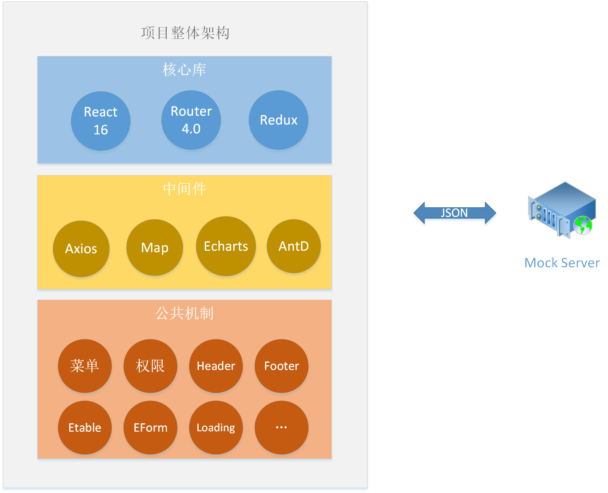

# 介绍

## 1. 引入

拿到产品需求后：

* 技术选型？
* 项目架构？
* 项目规范？
* 封装项目公共机制？
* 提高开发效率？

## 2. 概述

* React 全家桶
  * 基础知识、生命周期
  * Router 4.0
  * Redux 集成开发（类似 vuex）
* AntD UI 组件
  * 基础组件
  * AntD 栅格系统
  * ETable 组件封装
  * BaseForm 组件封装
  * 单选、复选组件封装
* 公共机制封装
  * axios 插件封装
  * API 封装
  * 错误拦截
  * 权限、菜单封装
  * 日期、金额、手机号封装
  * loading、分页、mock

## 3. 项目特色

* 前言技术栈
  * Vue
  * React
* 健全的架构
  * 高扩展性
  * 业务版本的迭代
* 丰富的 UI 组件
* 共享单车项目

## 4. 项目整体架构

## 5. 安排

* React 基础知识
  * 第一章
* 主页面架构
  * 第二章
* Router 4.0
  * 第三章
* UI 组件
  * 第四章
  * 第五章
  * 第六章
* 单车业务基本功能开发
  * 第七章
  * 第八章
* 项目工程化开发
  * 第九章
* 单车业务核心功能模块开发
  * 第十章
  * 第十一章
  * 第十二章
  * 第十三章
  * 第十四章
* Redux 集成
  * 第十五章

## 6. 收获

* 掌握 React 全家桶
* 掌握地图和 React 集成技能
* 掌握前端图表开发技巧
* 掌握基于 React 的 UI 框架 AntD
* 前后端架构设计、公共机制封装、后台管理系统开发经营
