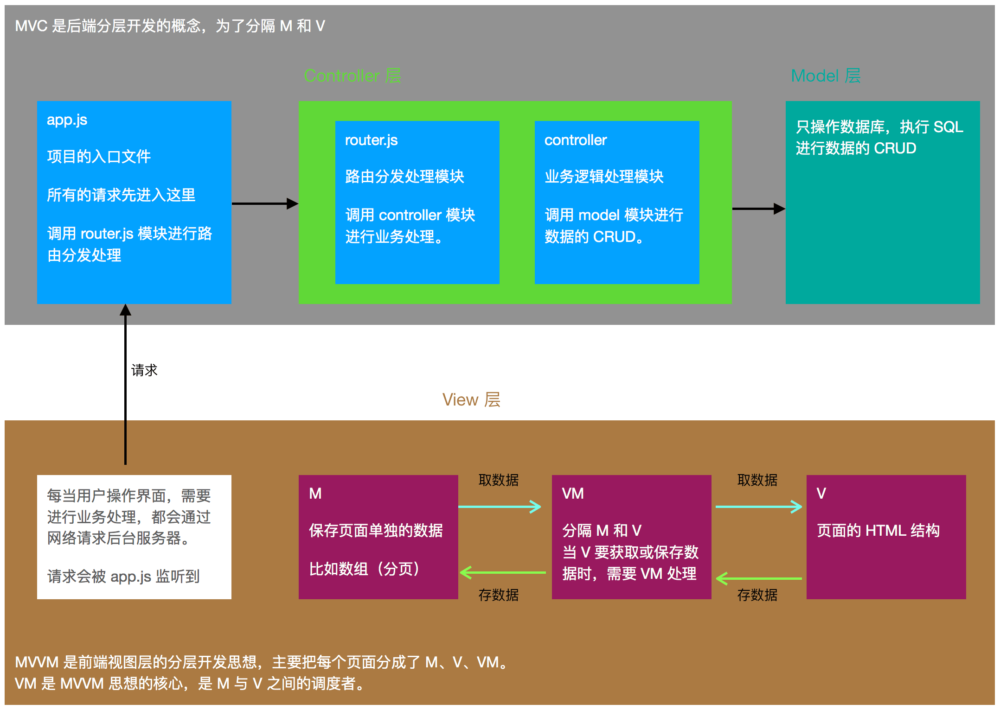

 # 介绍

## 1. 什么是 Vue.js

* Vue.js 是目前最火的一个前端框架， React 是最流行的一个前端框架
* Vue.js 是前端的主流框架之一，和 Angular.js 、 React.js 一起，并称为前端三大主流框架
* Vue.js 是一套构建用户界面的框架，只关注视图层，它不仅易于上手，还便于与第三方库或既有项目整合。
  
>前端主要工作就是和界面打交道，来制作前端页面效果。

## 2. 为什么要学习流行框架

* 企业为了提高开发效率：在企业中，时间就是效率，效率就是金钱。
* 提高开发效率的发展历程
  1. 原生 JS：存在浏览器兼容性问题 
  2. jQuery之类的类库：屏蔽浏览器兼容性问题 
  3. 前端模板引擎
  4. Angular.js / Vue.js：减少不必要的 DOM 操作，提高渲染效率；双向数据绑定的概念。
* 在 Vue 中，一个核心的概念，就是让用户不再操作 DOM 元素，解放了用户的双手，更专注于业务。
* 增强自身竞争力

## 3. 框架和库的区别

* 框架：是一套完整的解决方案。对项目的侵入性较大，项目如果需要更换框架，则需要重新架构整个项目
  * node 中的 express
* 库（插件）：提供某一个小功能。对项目的侵入性较小，如果某个库无法完成某些需求，可以很容易切换到其他库以实现需求。
  * jQuery => Zepto
  * ejs => art-template

## 4. 后端中的 MVC 与前代中的 MVVM 之间的区别

如图：



* MVC 是后端的分层开发概念
  * M：模型层，处理数据的 CRUD
  * V：视图层，页面
  * C：业务逻辑层，路由也是其中的一部分
* MVVM 是前端视图层的概念
  * 主要关注视图层的分离，也就是说 MVVM 把前端的视图层分为了三部分
  * Model、View、VM（ViewModel）

## 5. Vue 中的 MVVM

查看：[./code/01-Vue的基本代码.html](./code/01-Vue的基本代码.html)

```html
<!-- vm 控制的这个元素（#app）区域，就是 MVVM 中的 V -->
<div id="app">
  <p>{{ msg }}</p>
</div>

<script>
  // Vue 的实例就是 MMVVM 中的 VM（调度者）
  let vm = new Vue({
    el: '#app',
    // vm.data 就是 MVVM 中的 M
    data: {
      msg: 'hello Vue.js!'
    }
  });
</script>
```

## 6. Vue 中的 this

```javascript
let vm = new Vue({
  // 这里里面的 this 都指向 vm
  // methods、data 的属性都挂载到了 vm
})
```

## 7. Vue Dev Tool

1. 通过 Chrome Web Store 安装
2. 在该插件的 “Details” 界面，开启 “Allow access to file URLs”
