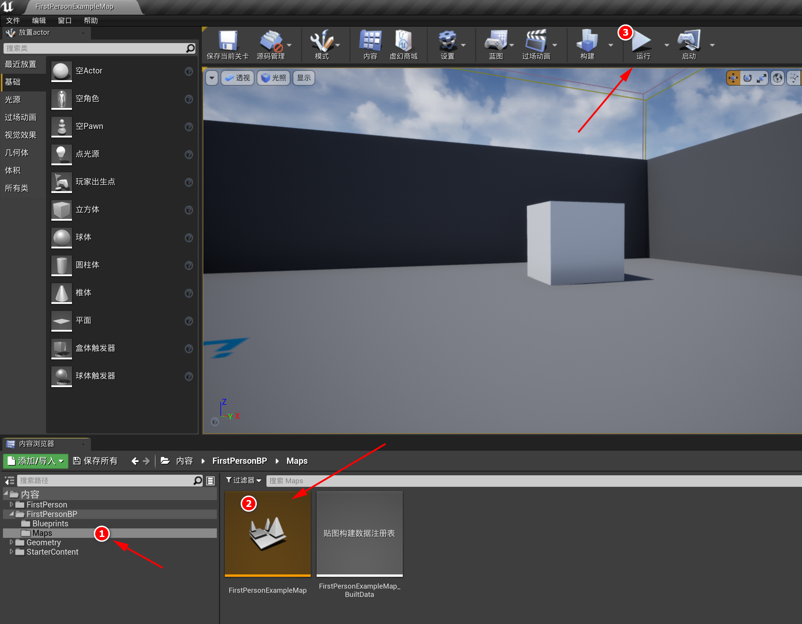

# UE4

> 【虚幻4】UE4初学者系列教程合集-全中文新手入门教程 https://www.bilibili.com/video/BV164411Y732

## 1. 安装

下载： 

  * 官网： https://www.unrealengine.com/zh-CN/

## 2. 修改缓存路径

默认（公共）缓存位置：

* C:\Users\“用户名”\AppData\Local\UnrealEngine\Common\DerivedDataCache
* 所有项目共用，会占用非常多的空间

设置某个引擎的缓存位置：

* 会将 DerivedDataCache 保存到单独的项目里
* 修改 D:\install\EpicGames\UE_4.26\Engine\Config\BaseEngine.ini 文件

  ```text
  修改 [InstalledDerivedDataBackendGraph] 的 Local 变量：

    之前：

      Local=(Type=FileSystem, ..., Path="%ENGINEVERSIONAGNOSTICUSERDIR%DerivedDataCache",..)
  
    之后：

      Local=(Type=FileSystem, ..., Path="%GAMEDIR%DerivedDataCache",..)
  ```

## 3. 创建项目

### 3.1. 创建自己的工程

高版本的引擎可以打开低版本（引擎）的项目

1. 打开 UE_4.26\Engine\Binaries\Win64\UE4Editor.exe

2. 创建新项目的空白项目

   * 蓝图项目： 使用蓝图脚本实现功能，不用写代码，但底层还是 C++
   * C++ 项目： 使用 C++ 实现功能，要先安装 VS2019

创建 “第一人称游戏”

### 3.2. 工程目录结构

```text
N01_helloworld/   # 项目名称

  Config/           # 存放 配置文件： 项目设置、键盘输入 等

  Content/          # 存放 引擎或游戏的内容： 地图、贴图、模型、材质、蓝图 等

  DerivedDataCache/ # 存放 缓存文件： 在第 2 节中有介绍

  Intermediate/     # 存放 临时文件： 编译引擎或游戏时生成的临时文件

  Saved/            # 存放 保存的文件： 自动保存的内容、配置、日志

  N01_helloworld.uproject # 项目启动程序： 双击即可运行
```

### 3.3. 运行游戏



1. 打开 Maps 文件夹
  
  * 内容浏览器（底部） -> 内容 -> FirstPersonBP -> Maps

2. 打开关卡

  * FirstPersonExampleMap（双击）

3. 点击运行


### 3.4. 初学者内容包

### 3.5. 快速添加功能或内容包

### 3.6. 模板介绍