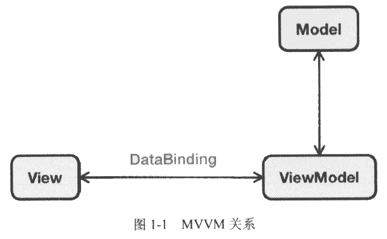

# 1. 第一章 认识Vue.js

本章介绍Vue.js有关的概念、技术、工作原理，以及搭建一个Vue.js的应用。

## 1.1. Vue.js 是什么

官方文档的介绍：简单小巧的核心，渐进式技术栈，足以应付任何规模的应用。
* **简单小巧**：压缩后只有17KB。
* **渐进式（Progressive）**：一步一步、有阶段性的使用Vue.js，不必一开始就使用所有的东西。

使web开发变得更简单，颠覆了传统前端开发模式，提供web开发中常见功能：
* 解耦视图和数据
* 可复用的组件
* 前端路由
* 状态管理
* 虚拟DOM（Virtual DOM）

### 1.1.1. MVVM模式

MVVM模式由经典软件架构MVC衍生而来。
当View（视图层）变化时，会自动更新到ViewModel（视图模型），反之亦然。
View和ViewModel之间通过双向绑定（data-binding）建立联系，如图 1-1。

### Vue.js 有什么不同

Vue.js通过MVVM的模式拆分为视图和数据，将其分离。
因此你只需要关系数据即可，DOM的事情由Vue.js做。

传统：

    if ( showBtn ) {
        var btn = $( "<button>Click me!</button" );
        btn.on( "click", function () {
            console.info( "Clicked!" );
        } );
        $( "#app" ).append( btn );
    }

Vue：

    

        <button v-if="showBtn" 
                v-on:click="handleClick">click me</button>
    

    
