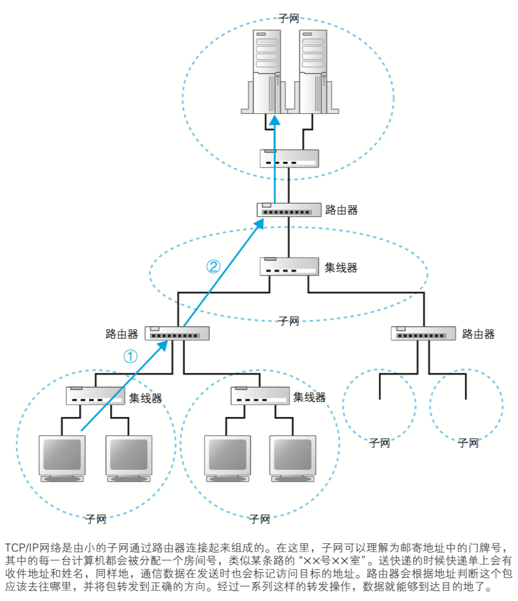
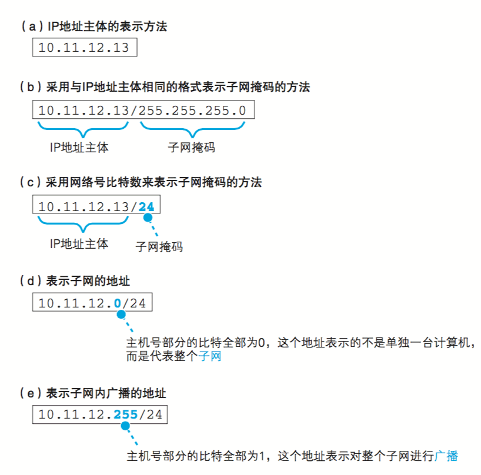
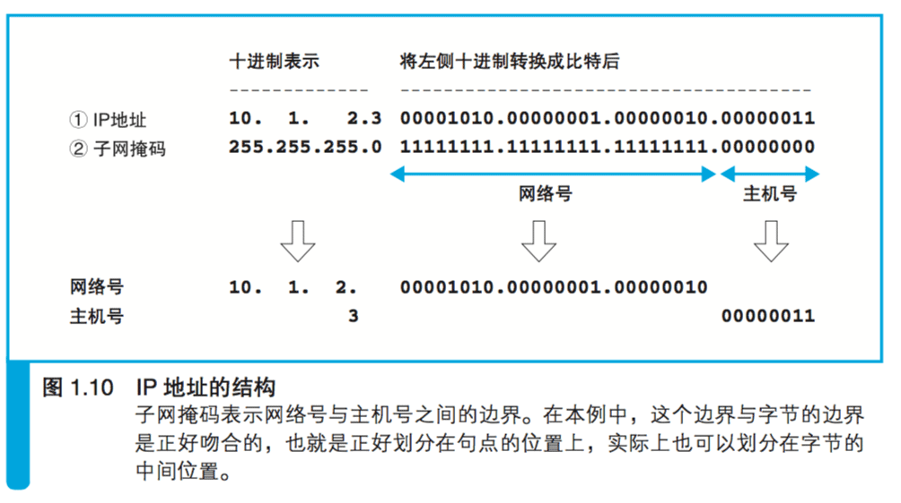

## 1.2.1 IP 地址的基本知识

### 委托操作系统发送消息

 * 生成 HTTP 消息之后,接下来我们需要􏰀托操作系统将消息发送给 Web 服务器。
 * 尽管浏览器能够解析网址并生成 HTTP 消息,
   但它本身并不具备将消息发送到网络中的功能,因此这一功能需要􏰀托操作系统来实现。
 * 发送消息的功能对于所有的应用程序来说都是通用的,
   因此让操作系统来实现这一功能,其他应用程序委托操作系统来进行操作,
   这是一个比较合 理的做法。  
 * 在进行这一操作时,我们还有一个工作需要完成,
   那就是查询网址中服务器域名对应的 IP 地址。
 * 在􏰀托操作系统发送消息时,必须要提供的不是通信对象的域名,
   而是它的 IP 地址 
 * 因此,在生成 HTTP 消息之后,下一个步骤就是根据域名查询 IP 地址。
 
###  TCP/IP 的基本思路

 * 互联网和公司内部的局域网都是基于 TCP/IP 的思路来设计的,
   所以我们先来了解 TCP/IP 的基本思路。
 * TCP/IP 的结构如图 1.8 所示,
   就是由一些小的子网,通过路由器连接起来组成一个大的网络。
   这里的子网可以理解为用集线器连接起来的几台计算机,
   我们将它看作一个单位,称为子网。
   将子网通过路由器连接起来,就形成了一个网络 。
 * 在网络中,所有的设备都会被分配一个地址。
   这个地址就相当于现实中某条路上的“×× 号 ×× 室”。
   其中“号”对应的号码是分配给整个子网的,
   而“室”对应的号码是分配给子网中的计算机的,这就是网络中的地址。
   “号”对应的号码称为网络号,
   “室”对应的号码称为主机号,
   这个地址的整体称为 IP 地址。
 * 通过 IP 地址我们可以判断出访问对象服务器的位置,
   从而将消息发送到服务器。
   
#### 解释  
 * 路由器:一种对包进行转发的设备。
 * 集线器:一种对包进行转发的设备,分为中继式集线器和交换式集线器两种
 * 当计算机数量较少时,可以用一台集线器连接起来;当计算机数量较多时,
   一台集线器可能无法连接这么多计算机,可以增加集线器数量并将集线器相互连接起来,
   这时,凡是通过集线器连接起来的所有设备都属于同一个子网。
 * 一些家用路由器中已经内置了集线器功能,  
   因此大家可以理解为这种路由器内部同时包含路由器和集线器两种设备,
   它们在里面已经连接起来了。
 * 数据是以包的形式传送的

#### 消息传送的过程

 * 发送者发出的消息首先经过子网中的集线器，
   转发到距离发送者最近的路由器上
 * 接下来, 路由器会根据消息的目的地判断下一个路由器的位置,
   然后将消息发送到下一个路由器，
   即消息再次经过子网内的集线器被转发到下一个路由器
 * 上面的过程不断重复，最终消息就被传送到了目的地。
 
#### 实际的IP地址

 * 实际的 IP 地址是一串 32 比特的数字,
   按照 8 比特(1 字节)为一组分成 4 组, 分别用十进制表示 然后再用圆点隔开。
 * 这就是我们平常经常见到的 IP 地址格式,
   但仅凭这一串数字我们无法区分哪部分是网络号,哪部分是主机号。
 * 在 IP 地址的规则中,网络号和主机号连起来总共是 32 比特,
   但这两部分的具体结构是不固定的。
   
#### 子网掩码

   
 * 在组建网络时,用户可以自行决定它们之间的分配关系,
   因此,我们还需要另外的附加信息来表示 IP 地址的内部结构。
 * 这一附加信息称为子网掩码。
 * 子网掩码是一串与 IP 地址长度相同的 32 比特数字,
   其左边一半都是 1,右边一半都是 0。
 * 其中,子网掩码为 1 的部分表示网络号,
   子网掩码为 0 的部分表示主机号。
 * 将子网掩码按照和 IP 地址一样的方式
   以每 8 比特为单位用圆点分组后 
   写在 IP 地址的右侧。
   10.11.12.13/255.255.255.0
 * 这种写法太长,
   我们也可以把 1 的部分的比特数用十进制表示并写在 IP 地址的右侧。
   10.11.12.13/24

#### IP 地址的主机号

 * 全 0: 表示整个子网。10.11.12.0/24
 * 全 1: 表示向子网上所有设备发送包,即“广播”。10.11.12.255/24
 
### 1.2.2 域名和IP地址并用的理由

 * TCP/IP 网络是通过 IP 地址来确定通信对象的,
   因此不知道 IP 地址就无法将消息发送给对方,
   这和我们打电话的时候必须要知道对方的电话号 码是一个道理。
   因此,在􏰀托操作系统发送消息时,必须要先查询好对方的IP地址。
   
#### “既然如此,那么在网址中不写服务器的名字,直接写 IP 地址不就好了吗?”

 * 实际上,如果用 IP 地址来代替服务器名称也是能够正常工作的；
   如果 Web 服务器使用了虚拟主机功能,有可能无法通过 IP 地址来访问。
 * 然而,就像你很难记住电话号码一样,要记住一串由数字组成的 IP 地址也非常困难。
   因此,相比 IP 地址来说,网址中还是使用服务器名称比较好。
   
#### “既然如此,那干脆不要用 IP 地址,而是用名称来确定通信对象不就好了吗”
 
 * 实际上真的存在以名称来确定通信对象的网络,
   Windows 网络的原型 PC-Networks 就是其中的一个例子
 * 不过从运行效率上来看,这并不能算是一个好主意
 * 互联网中存在无数的路由器,它们之间相互配合,
   根据 IP 地址来判断应该把数据传送到什么地方。
 * 那么如果我们不用 IP 地址而是改用名称会怎么样呢?
   IP 地址的长度 为 32 比特，也就是 4 字节,
   相对地,域名最短也要几十个字节,最长甚至可以达到 255 字节。
 * 换句话说,使用 IP 地址只需要处理 4 字节的数字,
   而域名则需要处理几十个到 255 个字节的字符,
   这增加了路由器的负担,传送数据也会花费更长的时间
 * 域名并不仅是长,而且其长度是不固定的。
   处理长度不固定的数据比处理长度固定的数据要复杂,
   这也是造成效率低下的重要原因之一
   
#### “那使用高性能路由器不就能解决这个问题了吗?”

 * 然而,路由器的速度是有极限的,
   而互联网内部流动的数据量已然让路由器疲于应付了,
   因此我们不应该再采用效率更低的设计。
 * 随着技术的发展,路由器的性能也会不断提升,
   但与此同时,数据量也在以更快的速度增长,
   在可预见的未来,这样的趋势应该不会发生变化。
 * 出于这样的原因,使用名称本身来确定通信对象并不是一个聪明的设计
 
#### 所以 DNS 应运而生

 * 现在我们使用的方案是让人来使用名称，让路由器来使用 IP 地址
 * 为了填补两者之间的障碍,
   需要有一个机制能够通过名称来查询 IP 地址,
   或者通过 IP 地址来查询名称
 * 这样就能够在人和机器双方都不做出牺牲的前提下完美地解决问题
 * 这个机制就是 DNS
 
 * DNS:Domain Name System,域名服务系统。
   将服务器名称和IP地址进行关联是 DNS 最常见的用法,
   但 DNS 的功能并不仅限于此,
   它还可以将邮件地址和邮件服务器进行关联, 以及为各种信息关联相应的名称。
   
### 1.2.3 Socket 库提供查询 IP 地址的功能

 * 查询 IP 地址的方法非常简单,
   只要询问最近的 DNS 服务器“www.lab.glasscom.com 的 IP 地址是什么”就可以了,
   DNS 服务器会回答说“该服务器的 IP 地址为 xxx.xxx.xxx.xxx”。
 * 向 DNS 服务器发出查询,
   也就是向 DNS 服务器发送查询消息,并接收服务器返回的响应消息。
 * 换句话说,对于 DNS 服务器,我们的计算机上一定有相应的 DNS 客户端,
   而 DNS 客户端称为 DNS 解析器,或者简称解析器。
 * 通过 DNS 查询 IP 地址的操作称为域名解析,
   因此负责执行解析(resolution)这一操作的就叫解析器(resolver)了