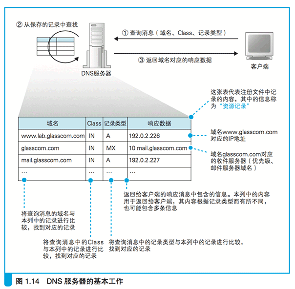

#1.3 全世界 DNS 服务器的大接力

##1.3.1 DNS 服务器的基本工作

* 接收来自客户端的查询消息,然后根据消息的内容返回响应。
* 根据需要查询的域名和记录类型查找相关的记录,并向客户端返回响应消息。
* DNS 服务器会从域名与 IP 地址的对照表中查找相应的记录,并返回 IP 地址。

### 来自客户端的查询消息包含以下 3 种信息。

1. 域名

    服务器、邮件服务器(邮件地址中 @ 后面的部分)的名称
    
2. Class

    在最早设计 DNS 方案时,DNS 在互联网以外的其他网络中的应用
    也被考虑到了,而 Class 就是用来识别网络的信息。
    不过,如今除了互联网并没有其他的网络了,
    因此 Class 的值永远是代表互联网的 IN

3. 记录类型

    表示域名对应何种类型的记录。 例如,
    当类型为 A 时,表示域名对应的是 IP 地址;
    当类型为 MX 时,表示域名对应的是邮件服务器。
    对于不同的记录类型,服务器向客户端返回的信息也会不同。
    A 是 Address 的缩写。MX:Mail eXchange,邮件交换。
    
DNS 服务器上事先保存有前面这 3 种信息对应的记录数据,
如图 1.14 所示。DNS 服务器就是根据这些记录 查找符合查询请求的内容 并对客户端作出响应的。

### 查A类型的域名

* 如果要查询 www.baidu.com 这个域名对应的 IP 地址,
  客户端会向 DNS 服务器发送包含以下信息的查询消息。
    1. 域名 = www.baidu.com
    2. Class = IN
    3. 记录类型 = A
* 然后,DNS 服务器会从已有的记录中 查找域名、Class、记录类型 全部匹配的记录。

在查询 IP 地址时我们使用 A 这个记录类型, 而查询邮件服务器时则 要使用 MX 类型。
这是因为在 DNS 服务器上,IP 地址是保存在 A 记录中的,
而邮件服务器则是保存在 MX 记录中的。

### 查MX类型的域名

 * 对于一个邮件地址 tone@glasscom.com,
   当需要知道这个地址对应的邮件服务器时,我们需要提供 @ 后面的那一串名称。
   查询消息的内容如下:
   1. 域名 = glasscom.com
   2. Class = IN
   3. 记录类型 = MX
 * DNS 服务器会返回 10 和 mail.glasscom.com 这两条信息。

* 当记录类型为 MX 时,DNS 服务器会在记录中保存两种信息, 
  分别是邮件服务器的域名和优先级。 
* 优先级：当一个邮件地址对应多个邮件服务器时,需要根据优先级来判断哪个邮件服务器是优先的。
  优先级数值较小的邮件服务器代表更优先。
* MX 记录的返回消息还包括邮件服务器 mail.glasscom.com 的 IP 地址

### 其他记录类型

 * 根据 IP 地址反查域名的 PTR 类型
 * 查询域名相关别名的 CNAME 类型
 * 查询 DNS 服务器 IP 地址的 NS 类型
 * 询域名属性信息的 SOA 类型