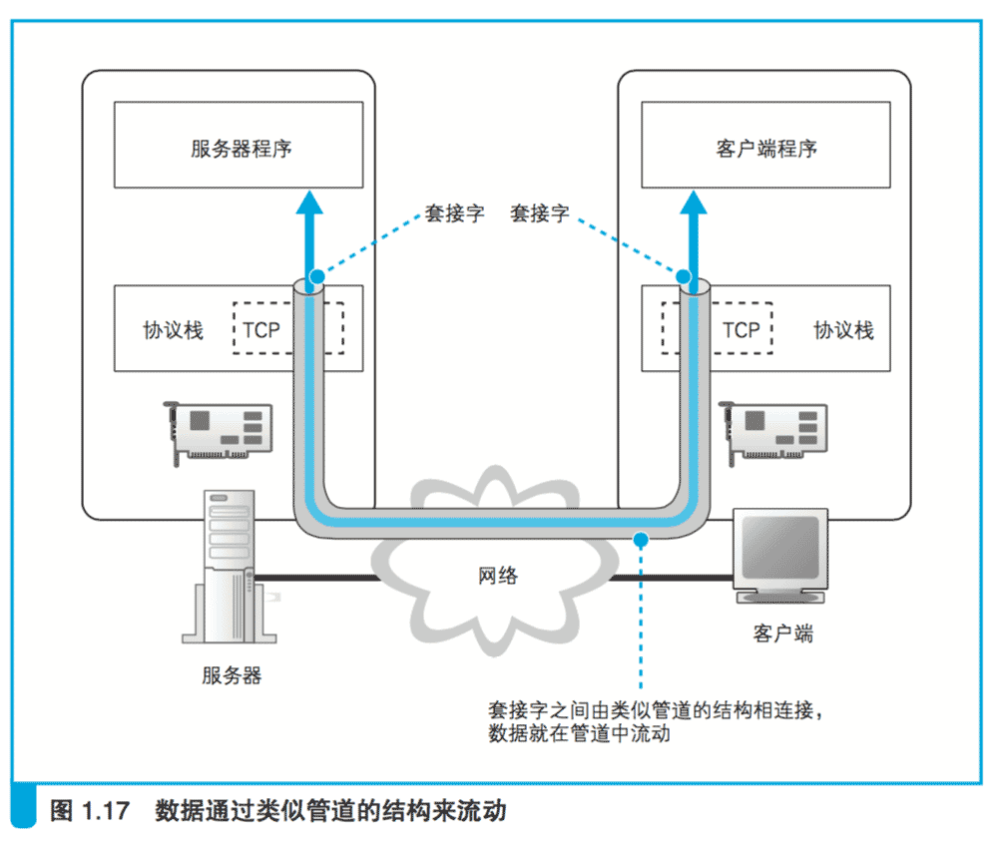

# 1.4 委托协议栈发送消息

## 1.4.1 数据收发操作概览

知道了 IP 地址之后,就可以􏰀托操作系统内部的协议栈向这个目标 IP 地址,
也就是我们要访问的 Web 服务器发送消息了。

要发送给 Web 服务器的HTTP消息是一种数字信息(digital data),
因此也可以说是􏰀托协议栈来发送数字信息。

收发数字信息这一操作不仅限于浏览器,
对于各种使用网络的应用程序来说都是共通的。

因此,这一操作的过程也不仅适用于 Web,而是适用于任何网络应用程序,
通过 DNS 服务器查询 IP 地址的操作也同样适用于所有网络应用程序。

下面就来一起探索这一操作的过程。

 

和向 DNS 服务器查询 IP 地址的操作一样,
这里也需要使用 Socket 库中 的程序组件。

不过,查询 IP 地址只需要调用一个程序组件就可以了,
而这里需要按照指定的顺序调用多个程序组件,这个过程有点复杂。

发送数据是一系列操作相结合来实现的,
如果不能理解这个操作的全貌,就无法理解其中每个操作的意义。
因此,我们先来介绍一下收发数据操作的整体思路。

 

向操作系统内部的协议栈发出委托时,
需要按照指定的顺序来调用 Socket 库中的程序组件。

使用 Socket 库来收发数据的操作过程如图 1.17 所示

简单来说,收发数据的两台计算机之间连接了一条数据通道,
数据沿着这条通道流动,最终到达目的地。

我们可以把数据通道想象成一条管道,
将数据从一端送入管道,数据就会到达管道的另一端然后被取出。
数据可以从任何一端被送入管道,数据的流动是双向的。

不过,这并不是说现实中真的有这么一条管道,
只是为了帮助大家理解数据收发操作的全貌。

 

收发数据的整体思路就是这样,但还有一点也非常重要。

光从图上来看,这条管道好像一开始就有,实际上并不是这样,
在进行收发数据操作之前,双方需要先建立起这条管道才行。

建立管道的关键在于管道两端的数据出入口,这些出入口称为**套接字**。

我们需要先创建套接字,然后再将套接字连接起来形成管道。

实际的过程是下面这样的。
首先,服务器一方先创建套接字,然后等待客户端向该套接字连接管道。

当服务器进入等待状态时,客户端就可以连接管道了。

具体来说,客户端也会先创建一个套接字,
然后从该套接字延伸出管道,最后管道连接到服务器端的套接字上。

当双方的套接字连接起来之后,通信准备就完成了。

接下来,就像我们刚刚讲过的一样,只要将数据送入套接字就可以收发数据了。

 

我们再来看一看收发数据操作结束时的情形。

当数据全部发送完毕之后,连接的管道将会被断开。

管道在连接时是由客户端发起的,但在断开时可以由客户端或服务器任意一方发起。

其中一方断开后,另一方也会随之断开,当管道断开后,套接字也会被删除。

到此为止,通信操作就结束了。

 

综上所述,收发数据的操作分为若干个阶段,可以大致总结为以下 4 个。

1. 创建套接字(创建套接字阶段) 
2. 将管道连接到服务器端的套接字上(连接阶段) 
3. 收发数据(通信阶段) 
4. 断开管道并删除套接字(断开阶段)

在每个阶段,Socket 库中的程序组件都会被调用来执行相关的数据收发操作。

不过,在探索其具体过程之前,我们来补充一点内容。

前面这 4 个操作都是由操作系统中的协议栈来执行的,
浏览器等应用程序并不会自己去做连接管道、放入数据这些工作,
而是􏰀托协议栈来代劳。

本章将要介绍的只是这个“􏰀委􏰀托”的操作。
关于协议栈收到委􏰀托之后具体是如何连接管道和放入数据的,
我们将在第 2 章介绍。

此外,这些􏰀托的操作都是通过调用 Socket 库中的程序组件来执行的,
但这些数据通信用的程序组件其实仅仅充当了一个桥梁的角色,
并不执行任何实质性的操作,应用程序的􏰀委托内容最终会被原原本本地传递给协议栈。

因此,我们无法形象地展示这些程序组件到底完成了怎样的工作,
与其勉强强调 Socket 库的存在,
还不如将 Socket 库和协议栈看成一个整体并讲解它们的整体行为 让人更容易理解。
因此,后文将会采用这样的讲法。

不过,请大家不要忘记 Socket 库这一桥梁的存在