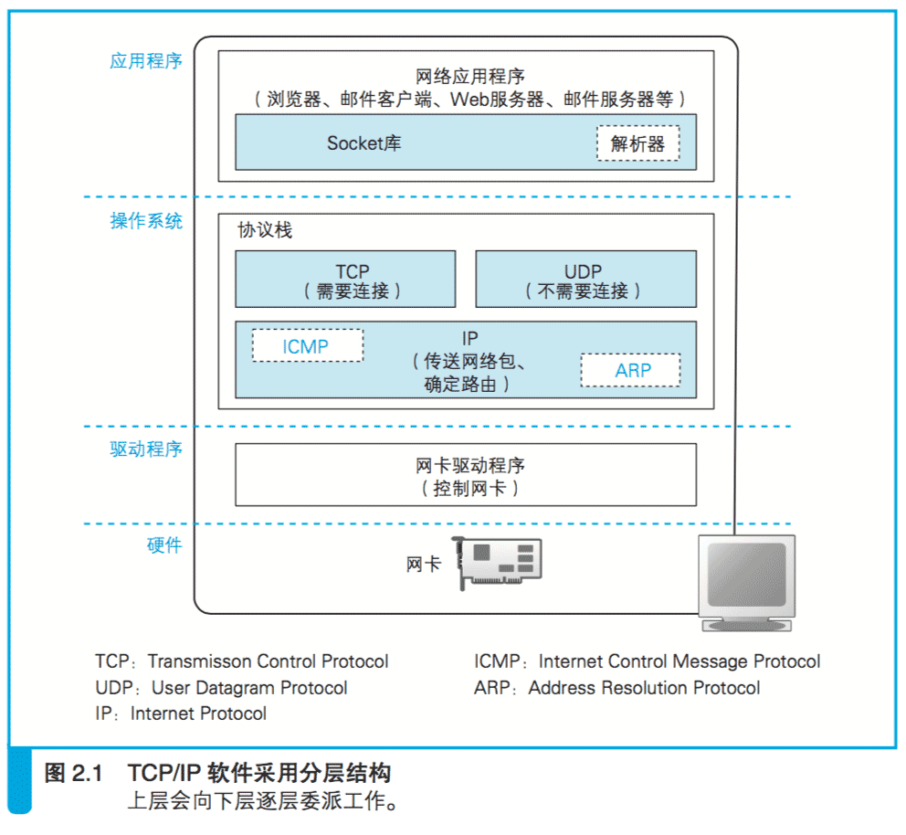
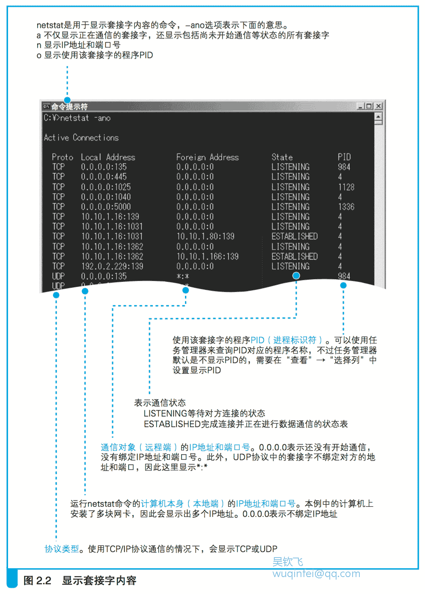

# 2.1 创建套接字

## 2.1.1 协议栈的内部结构

本章我们将探索操作系统中的网络控制软件(协议栈)和网络硬件(网卡)是如何将浏览器的消息发送给服务器的。

和浏览器不同的是,协议栈的工作我们从表面上是看不见的,可能比较难以想象。
因此,在实际探索之前,我们先来对协议栈做个解剖,看看里面到底有些什么。

协议栈的内部如图 2.1 所示,分为几个部分,分别承担不同的功能。

这张图中的上下关系是有一定规则的,上面的部分会向下面的部分􏰀派工作,
下面的部分接受􏰀派的工作并实际执行,这一点大家在看图时可以参考一下。

当然,这一上下关系只是一个总体的规则,
其中也有一部分上下关系不明确,或者上下关系相反的情况,所以也不必过于纠结。

此外,对于图中的每个部分以及它们的工作方式,本章将按顺序进行介绍,
因此对于里面的细节现在看不明白也没关系,只要大体上看出有哪些组成要素就可以了。

下面我们从上到下来看一遍。

图中最上面的部分是网络应用程序,
也就是浏览器、电子邮件客户端、Web 服务器、电子邮件服务器等程序,
它们会将收发数据等工作􏰀派给下层的部分来完成。

当然,除了浏览器之外, 其他应用程序在网络上收发数据的操作也都是类似上面这样的,
也就是说, 尽管不同的应用程序收发的数据内容不同,但收发数据的操作是共通的。

因此,下面介绍的内容不仅适用于浏览器,也适用于各种应用程序。

应用程序的下面是 **Socket 库**,其中包括解析器,
解析器用来向 DNS 服务器发出查询,它的工作过程我们在第 1 章已经介绍过了。

再下面就是操作系统内部了,其中包括**协议栈**。
协议栈的上半部分有两块,分别是负责用 TCP 协议收发数据的部分和负责用 UDP 协议收发数据的部分,
它们会接受应用程序的􏰀托执行收发数据的操作。
关于 TCP 和 UDP 我们将在后面讲解,现在大家只要先记住下面这句话就可以了:
像浏览器、邮件等一般的应用程序都是使用 TCP 收发数据的,
而像 DNS 查询 等收发较短的控制数据的时候则使用 UDP。

下面一半是用 IP 协议控制网络包收发操作的部分。
在互联网上传送数据时,数据会被切分成一个一个的网络包,
而将网络包发送给通信对象的操作就是由 IP 来负责的。

此外,IP 中还包括 ICMP 协议和 ARP 协议。
ICMP 用于告知网络包传送过程中产生的错误以及各种控制消息,
ARP 用 于根据 IP 地址查询相应的以太网 MAC 地址。

IP 下面的网卡驱动程序负责控制网卡硬件,
而最下面的网卡则负责完成实际的收发操作,
也就是对网线中的信号执行发送和接收的操作。

## 2.1.2 套接字的实体就是通信控制信息

我们已经了解了协议栈的内部结构,而对于在数据收发中扮演关键角色的套接字,
让我们来看一看它具体是个怎样的东西。

在协议栈内部有一块用于存放控制信息的内存空间,
这里记录了用于控制通信操作的控制信息,
例如通信对象的 IP 地址、端口号、通信操作的进行状态等。

本来套接字就只是一个概念而已,并不存在实体,
如果一定要赋予它一个实体,我们可以说这些控制信息就是套接字的实体,
或者说存放控制信息的内存空间就是套接字的实体。

协议栈在执行操作时需要参阅这些控制信息。
例如,在发送数据时, 需要看一看套接字中的通信对象 IP 地址和端口号,
以便向指定的 IP 地址和端口发送数据。

在发送数据之后,协议栈需要等待对方返回收到数据的响应信息,
但数据也可能在中途丢失,永远也等不到对方的响应。

在这样的情况下,我们不能一直等下去,需要在等待一定时间之后重新发送丢失的数据,
这就需要协议栈能够知道执行发送数据操作后过了多长时间。

为此,套接字中必须要记录是否已经收到响应,以及发送数据后经过了多长时间,
才能根据这些信息按照需要执行重发操作。

**协议栈是根据套接字中记录的控制信息来工作的。**

上面说的只是其中一个例子。
套接字中记录了用于控制通信操作的各种控制信息,
协议栈则需要根据这些信息判断下一步的行动,这就是套接字的作用。

讲了这么多抽象的概念,可能大家还不太容易理解,所以下面来看看真正的套接字。
在 Windows 中可以用 netstat 命令显示套接字内容(图 2.2)。

图中每一行相当于一个套接字,
当创建套接字时,就会在这里增加一行新的控制信息,赋予“即将开始通信”的状态,并进行通信的准备工作,
如分配用于临时存放收发数据的缓冲区空间。

既然有图,我们就来讲讲图上这些到底都是什么意思。
比如第 8 行, 它表示 PID 为 4 的程序正在使用 IP 地址为 10.10.1.16 的网卡
与 IP 地址为 10.10.1.18 的对象进行通信。
此外我们还可以看出,本机使用 1031 端口, 对方使用 139 端口,
而 139 端口是 Windows 文件服务器使用的端口,
因此我们就能够看出这个套接字是连接到一台文件服务器的。
我们再来看第 1 行,这一行表示 PID 为 984 的程序正在 135 端口等待另一方的连接,
其中 本地 IP 地址和远程 IP 地址都是 0.0.0.0,
这表示通信还没开始,IP 地址不确定。