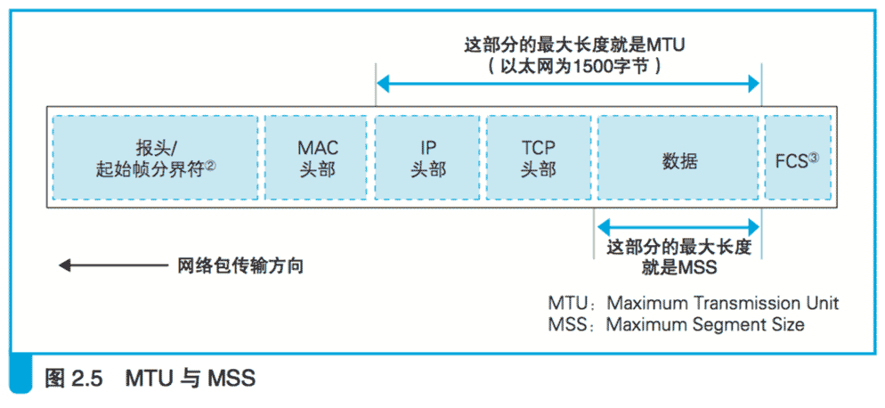
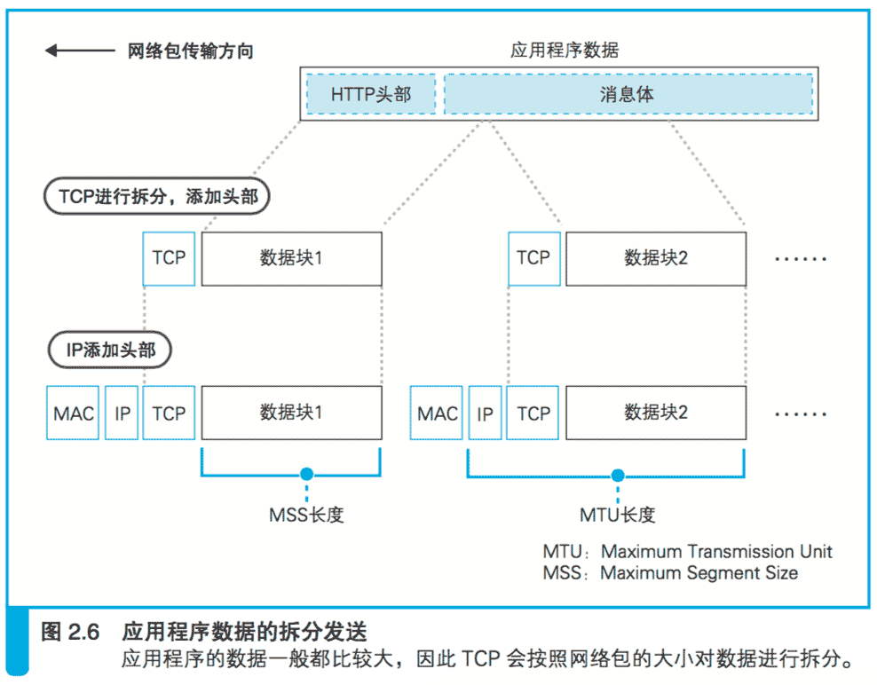
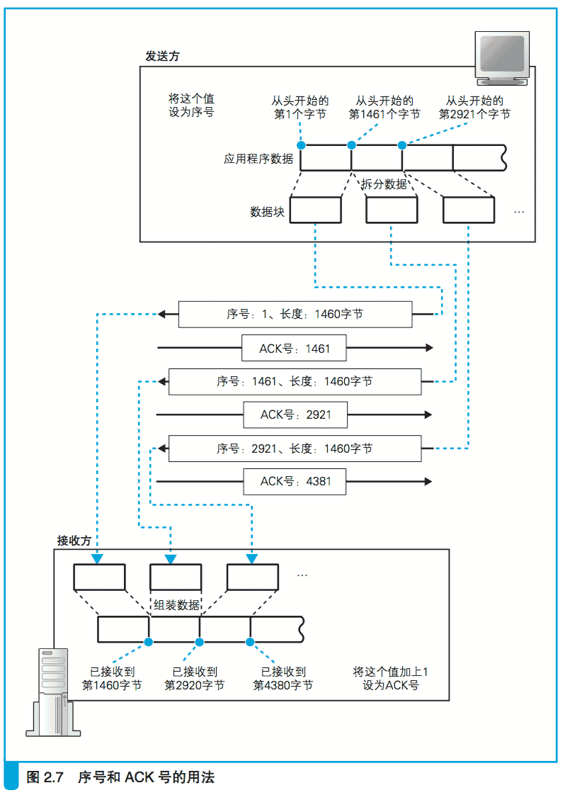
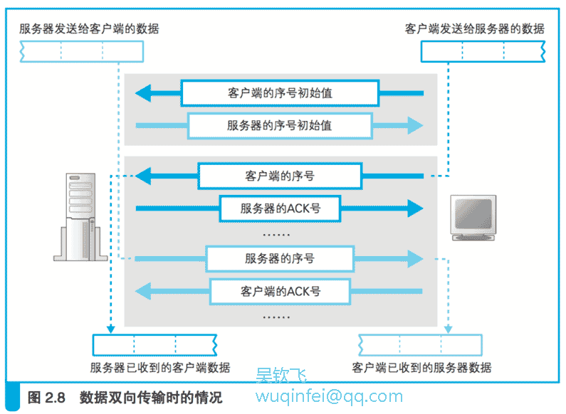
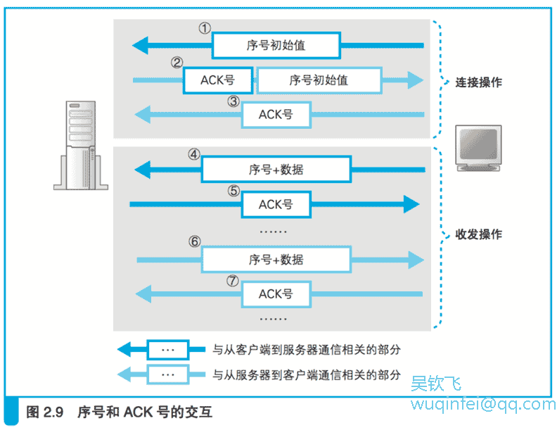
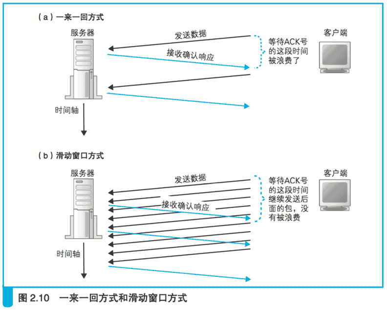
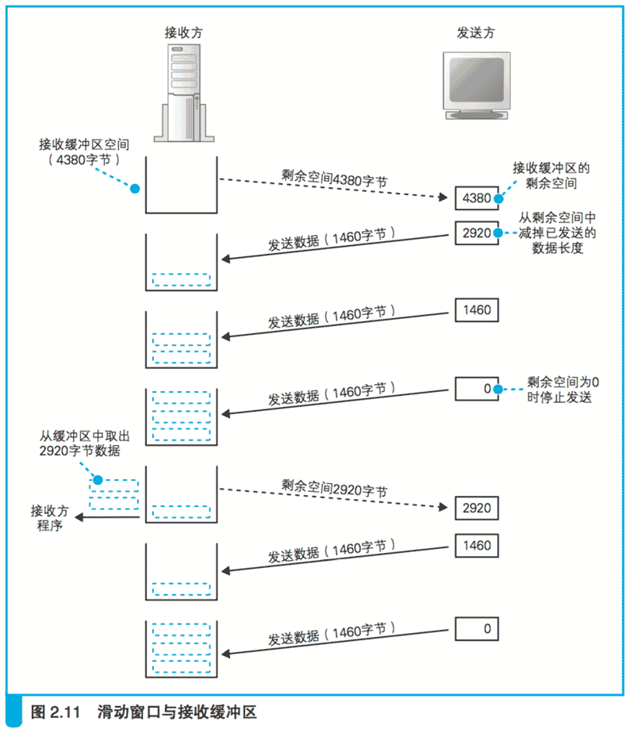

# 2.3 收发数据

# 2.3.1 将 HTTP 请求消息交给协议栈

当控制流程从 connect 回到应用程序之后,接下来就进入数据收发阶段了。

数据收发操作是从应用程序调用 write 将要发送的数据交给协议栈开始的(图 2.3③),
协议栈收到数据后执行发送操作,这一操作包含如下要点。

首先,协议栈并不关心应用程序传来的数据是什么内容。
应用程序在调用 write 时会指定发送数据的长度,

在协议栈看来,要发送的数据就是一定长度的二进制字节序列而已。

其次,协议栈并不是一收到数据就马上发送出去,
而是会将数据存放在内部的发送缓冲区中,并等待应用程序的下一段数据。

这样做是有道理的。

应用程序交给协议栈发送的数据长度是由应用程序本身来决定的,
不同的应用程序在实现上有所不同,有些程序会一次性传递所有的数据,
有些程序则会逐字节或者逐行传递数据。

总之,一次将多少数据交给协议栈是由应用程序自行决定的,协议栈并不能控制这一行为。

在这样的情况下, 如果一收到数据就马上发送出去,
就可能会发送大量的小包,导致网络效率下降,
因此需要在数据积累到一定量时再发送出去。

至于要积累多少数据才能发送,不同种类和版本的操作系统会有所不同,不能一概而论,
但都是根据下面几个要素来判断的。

**第一个判断要素是每个网络包能容纳的数据长度,协议栈会根据一个 叫作 MTU 的参数来进行判断。**

（Maximum Transmission Unit,最大传输单元。）

MTU 表示一个网络包的最大长度,在以太 网中一般是 1500 字节(图 2.5)。

（在使用 PPPoE 的 ADSL 等网络中,需要额外增加一些头部数据,因此MTU 会小于 1500 字节。）

MTU 是包含头部的总长度,因此需要从 MTU 减去头部的长度,
然后得到的长度就是一个网络包中所能容纳的最大数据长度,这一长度叫作 MSS。

（MSS:Maximum Segment Size,最大分段大小。 
TCP 和 IP 的头部加起来一般是 40 字节,因此 MTU 减去这个长度就是 MSS。
例如,在以太网中,MTU 为 1500,因此 MSS 就是 1460。
TCP/IP 可以使用一些可选参数 (protocol option),如加密等,这时头部的长度会增加,
那么 MSS 就会随着头部长度增加而相应缩短。）

当从应用程序收到的数据长度超过或者接近 MSS 时再发送出去,
就可以避免发送大量小包的问题了。

    MTU:一个网络包的最大长度,以太网中一般为 1500 字节。 
    MSS:除去头部之后,一个网络包所能容纳的 TCP 数据的最大长度。

**另一个判断要素是时间。**

当应用程序发送数据的频率不高的时候,如果每次都等到长度接近 MSS 时再发送,
可能会因为等待时间太长而造成发送延迟,这种情况下,
即便缓冲区中的数据长度没有达到 MSS,也应该果断发送出去。

为此,协议栈的内部有一个计时器,当经过一定时间之后, 就会把网络包发送出去。

判断要素就是这两个,但它们其实是互相矛盾的。

如果长度优先,那么网络的效率会提高,但可能会因为等待填满缓冲区而产生延迟;
相反地, 如果时间优先,那么延迟时间会变少,但又会降低网络的效率。

因此,在进行发送操作时需要综合考虑这两个要素以达到平衡。

不过,TCP 协议规格中并没有告诉我们怎样才能平衡,
因此实际如何判断是由协议栈的开发者来决定的,
也正是由于这个原因,不同种类和版本的操作系统在相关操作上也就存在差异。

正如前面所说,如果仅靠协议栈来判断发送的时机可能会带来一些问题,
因此协议栈也给应用程序保留了控制发送时机的余地。
应用程序在发送数据时可以指定一些选项,
比如如果指定“不等待填满缓冲区直接发送”,则协议栈就会按照要求直接发送数据。
像浏览器这种会话型的应用程序在向服务器发送数据时,等待填满缓冲区导致延迟会产生很大影响,
因此一般会使用直接发送的选项。

## 2.3.2 对较大的数据进行拆分

HTTP 请求消息一般不会很长,一个网络包就能装得下,
但如果其中要提交表单数据,长度就可能超过一个网络包所能容纳的数据量,
比如在博客或者论坛上发表一篇长文就属于这种情况。

这种情况下,发送缓冲区中的数据就会超过 MSS 的长度,
这时我们当然不需要继续等待后面的数据了。
发送缓冲区中的数据会被以 MSS 长度为单位进行拆分,
拆分出来的每块数据会被放进单独的网络包中。

根据发送缓冲区中的数据拆分的情况,
当判断需要发送这些数据时,就在每一块数据前面加上 TCP 头部,
并根据套接字中记录的控制信息标记发送方和接收方的端口号,
然后交给 IP 模块来执行发送数据的操作(图 2.6)。

（IP 模块会在网络包前面添加 IP 头部和以太网的 MAC 头部后发送网络包, 
这些操作我们将稍后讲解。）

## 2.3.3 使用 ACK 号确认网络包已收到

到这里,网络包已经装好数据并发往服务器了,但数据发送操作还没有结束。
TCP 具备确认对方是否成功收到网络包,以及当对方没收到时进行重发的功能,
因此在发送网络包之后,接下来还需要进行确认操作。

我们先来看一下确认的原理(图 2.7)。

**“序号”**

首先,TCP 模块在拆分数据时, 
会先算好每一块数据相当于从头开始的第几个字节,
接下来在发送这一块数据时,将算好的字节数写在 TCP 头部中,
“序号”字段就是派在这个用场上的。

**发送数据的长度**

然后,发送数据的长度也需要告知接收方,不过这个并不是放在 TCP 头部里面的,
因为用整个网络包的长度减去头部的长度就可以得到数据的长度,
所以接收方可以用这种方法来进行计算。

有了上面两个数值, 我们就可以知道发送的数据是从第几个字节开始,长度是多少了。

通过这些信息,接收方还能够检查收到的网络包有没有遗漏。

例如, 假设上次接收到第 1460 字节,那么接下来如果收到序号为 1461 的包,说明中间没有遗漏;
但如果收到的包序号为 2921,那就说明中间有包遗漏了。

**ACK 号**

像这样,如果确认没有遗漏,接收方会将到目前为止接收到的数据长度加起来,
计算出一共已经收到了多少个字节,然后将这个数值写入 TCP 头部的 ACK 号中发送给发送方

（返回 ACK 号时,除了要设置 ACK 号的值以外,还需要将控制位中的 ACK 比特设为 1,
这代表 ACK 号字段有效,接收方也就可以知道这个网络包是用来告知 ACK 号的。）

**确认响应**

简单来说,发送方说的是“现在发送的 是从第 ×× 字节开始的部分,一共有 ×× 字节哦!”
而接收方则回复说,“到第 ×× 字节之前的数据我已经都收到了哦!”
这个返回 ACK 号的操作被称为确认响应,
通过这样的方式,发送方就能够确认对方到底收到了多少数据。

然而,图 2.7 的例子和实际情况还是有些出入的。
在实际的通信中, 序号并不是从 1 开始的,而是需要用随机数计算出一个初始值,
这是因为如果序号都从 1 开始,通信过程就会非常容易预测,有人会利用这一点来发动攻击。
但是如果初始值是随机的,那么对方就搞不清楚序号到底是从多少开始计算的,
因此需要在开始收发数据之前将初始值告知通信对象。

**SYN**

大家应该还记得在我们刚才讲过的连接过程中,
有一个将 SYN 控制位设为 1 并发送给服务器的操作,就是在这一步将序号的初始值告知对方的。
实际上,在将 SYN 设为 1 的同时,还需要同时设置序号字段的值,而这里的值就代表序号的初始值。

（我们在前面讲连接操作的时候说过 SYN 为 1 表示进行连接,
这是因为将 SYN 设为 1 并告知初始序号这一操作仅在连接过程中出现,
因此发送 SYN 为 1 的网络包就表示发起连接的意思。
实际上,SYN 是 Synchronize(同步)的缩写,意思是通过告知初始序号使通信双方保持步调一致,
以便完成后续的数据收发检查,这才是 SYN 原本的含义。）

前面介绍了通过序号和 ACK 号来进行数据确认的思路,但仅凭这些还不够,
因为我们刚刚只考虑了单向的数据传输,但 TCP 数据收发是双向的,
在客户端向服务器发送数据的同时,服务器也会向客户端发送数据, 因此必须要想办法应对这样的情况。

不过,这其实也不难,图 2.7 中展示的客户端向服务器发送数据的情形,
我们只要增加一种左右相反的情形就可以了,如图 2.8 所示。

首先客户端先计算出一个序号,然后将序号和数据一起发送给服务器,
服务器收到之后会计算 ACK 号并返回给客户端;
相反地,服务器也需要先计算出另一个序号,然后将序号和数据一起发送给客户端,
客户端收到之后计算 ACK 号并返回给服务器。

此外,如图所示, 客户端和服务器双方都需要各自计算序号,
因此双方需要在连接过程中互相告知自己计算的序号初始值。

明白原理之后我们来看一下实际的工作过程(图 2.9)。

首先,客户端在连接时需要计算出与从客户端到服务器方向通信相关的序号初始值,
并将这个值发送给服务器(图 2.9 ①)。

接下来,服务器会通过这个初始值计算出 ACK 号并返回给客户端(图 2.9 ②)。

初始值有可能在通信过程中丢失,因此当服务器收到初始值后需要返回 ACK 号作为确认。

同时,服务器也需要计算出与从服务器到客户端方向通信相关的序号初始值,
并将这个值发送给客户端(图 2.9 ②)。

接下来像刚才一样,客户端也需要根据服务器发来的初始值计算出 ACK 号并返回给服务器(图 2.9 ③)。

到这里,序号和 ACK 号都已经准备完成了,接下来就可以进入数据收发阶段了。

数据收发操作本身是可以双向同时进行的,但 Web 中是先由客户端向服务器发送请求,
序号也会跟随数据一起发送(图 2.9 ④)。

然后,服务器收到数据后再返回 ACK 号(图 2.9 ⑤)。

从服务器向客户端发送数据的过程则正好相反(图 2.9 ⑥⑦)。

TCP 采用这样的方式确认对方是否收到了数据,
在得到对方确认之前,发送过的包都会保存在发送缓冲区中。
如果对方没有返回某些包对应的 ACK 号,那么就重新发送这些包。

这一机制非常强大。
通过这一机制,我们可以确认接收方有没有收到某个包,
如果没有收到则重新发送,这样一来,无论网络中发生任何错误, 
我们都可以发现并采取补救措施(重传网络包)。
反过来说,有了这一机制,我们就不需要在其他地方对错误进行补救了。

因此,网卡、集线器、路由器都没有错误补偿机制,一旦检测到错误就直接丢弃相应的包。

应用程序也是一样,因为采用 TCP 传输,即便发生一些错误对方最终也能够收到正确的数据,
所以应用程序只管自顾自地发送这些数据就好了。

不过,如果发生网络中断、服务器宕机等问题,那么无论 TCP 怎样重传都不管用。
这种情况下,无论如何尝试都是徒劳,因此 TCP 会在尝试几次重传无效之后强制结束通信,并向应用程序报错。

    通过“序号”和“ACK 号”可以确认接收方是否收到了网络包。

## 2.3.4 根据网络包平均往返时间调整 ACK 号等待时间

前面说的只是一些基本原理,实际上网络的错误检测和补偿机制非常复杂。

下面来说几个关键的点,首先是返回 ACK 号的等待时间(这个等待时间叫超时时间)。

当网络传输繁忙时就会发生拥塞,ACK 号的返回会变慢,
这时我们就必须将等待时间设置得稍微长一点,
否则可能会发生已经重传了包之后, 前面的 ACK 号才姗姗来迟的情况。

这样的重传是多余的,看上去只是多发一个包而已,但它造成的后果却没那么简单。

（如果某一个包被重复发送多次,接收方可以根据序号判断出这个包是重复的,因此并不会造成网络异常。）

因为 ACK 号的返回变慢大多是由于网络拥塞引起的,
因此如果此时再出现很多多余的重传,对于本来就很拥塞的网络来说无疑是雪上加霜。

那么等待时间是不是越长越好呢?也不是。
如果等待时间过长,那么包的重传就会出现很大的延迟,也会导致网络速度变慢。

看来等待时间需要设为一个合适的值,不能太长也不能太短,但这谈何容易。

根据服务器物理距离的远近,ACK 号的返回时间也会产生很大的波动,
而且我们还必须考虑到拥塞带来的影响。
例如,在公司里的局域网环境下,几毫秒就可以返回 ACK 号,
但在互联网环境中,当遇到拥塞时需要几百毫秒才能返回 ACK 号也并不稀奇。

正因为波动如此之大,所以将等待时间设置为一个固定值并不是一个好办法。
因此,TCP 采用了动态调整等待时间的方法,这个等待时间是根据 ACK 号返回所需的时间来判断的。

具体来说,TCP 会在发送数据的过程中持续测量 ACK 号的返回时间,
如果 ACK 号返回变慢,则相应延长等待时间;
相对地,如果 ACK 号马上就能返回,则相应缩短等待时间。

（由于计算机的时间测量精度较低,ACK 返回时间过短时无法被正确测量, 
因此等待时间有一个最小值,这个值在每个操作系统上不一样,基本上是在0.5秒到1秒之间。）

## 2.3.5 使用窗口有效管理 ACK 号

如图 2.10(a)所示,每发送一个包就等待一个 ACK 号的方式是最简单也最容易理解的,
但在等待 ACK 号的这段时间中,如果什么都不做那实在太浪费了。

为了减少这样的浪费,TCP 采用图 2.10(b)这样的滑动窗口方式来管理数据发送和 ACK 号的操作。

所谓滑动窗口,就是在发送一个包之后,不等待 ACK 号返回,而是直接发送后续的一系列包。
这样一来,等待 ACK 号的这段时间就被有效利用起来了。

虽然这样做能够减少等待 ACK号 的时间浪费,但有一些问题需要注意。

在一来一回方式中,接收方完成接收操作后返回 ACK 号,
然后发送方收到 ACK 号之后才继续发送下一个包,
因此不会出现发送的包太多接收方处理不过来的情况。
但如果不等返回 ACK 号就连续发送包,
就有可能会出现发送包的频率超过接收方处理能力的情况。

下面来具体解释一下。
当接收方的 TCP 收到包后,会先将数据存放到接收缓冲区中。
然后,接收方需要计算 ACK 号,将数据块组装起来还原成原本的数据并传递给应用程序,
如果这些操作还没完成下一个包就到了,
也不用担心,因为下一个包也会被暂存在接收缓冲区中。

如果数据到达的速率比处理这些数据并传递给应用程序的速率还要快,
那么接收缓冲区中的数据就会越堆越多,最后就会溢出。

缓冲区溢出之后,后面的数据就进不来了,因此接收方就收不到后面的包了,
这就和中途出错的结果是一样的,也就意味着超出了接收方处理能力。

我们可以通过下面的方法来避免这种情况的发生。
首先,接收方需要告诉发送方自己最多能接收多少数据, 
然后发送方根据这个值对数据发送操作进行控制,这就是滑动窗口方式的基本思路。

关于滑动窗口的具体工作方式,还是看图更容易理解(图 2.11)。

在这张图中,接收方将数据暂存到接收缓冲区中并执行接收操作。

当接收操作完成后,接收缓冲区中的空间会被释放出来,也就可以接收更多的数据了, 
这时接收方会通过 TCP 头部中的窗口字段将自己能接收的数据量告知发送方。
这样一来,发送方就不会发送过多的数据,导致超出接收方的处理能力了。

此外,单从图上看,大家可能会以为接收方在等待接收缓冲区被填满之前似乎什么都没做,实际上并不是这样。
这张图是为了讲解方便,故意体现一种接收方来不及处理收到的包,导致缓冲区被填满的情况。

实际上, 接收方在收到数据之后马上就会开始进行处理,
如果接收方的性能高,处理速度比包的到达速率还快,
缓冲区马上就会被清空,并通过窗口字段告知发送方。

还有,图 2.11 中只显示了从右往左发送数据的操作,
实际上和序号、 ACK 号一样,发送操作也是双向进行的。

前面提到的能够接收的最大数据量称为窗口大小,
它是 TCP 调优参数中非常有名的一个。