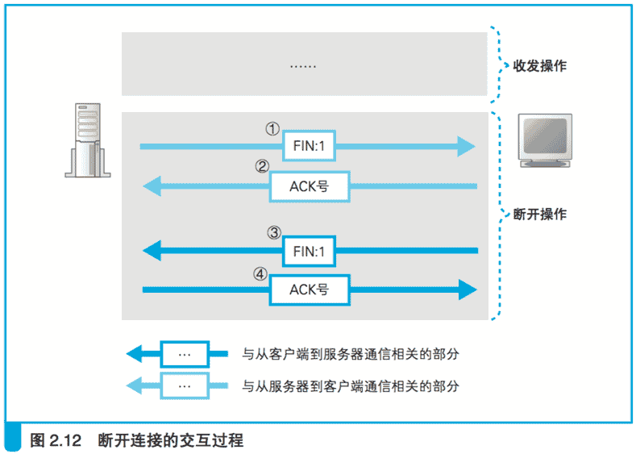
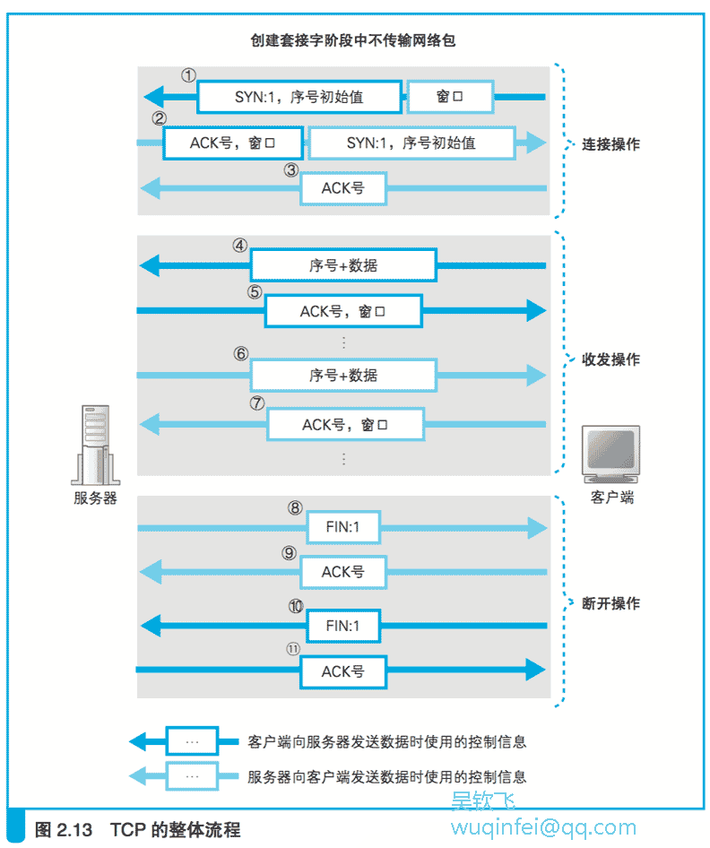

# 2.4 从服务器断开并删除套接字

## 2.4.1 数据发送完毕后断开连接

既然我们已经讲解到了这里,那么索性把数据收发完成后协议栈要执行的操作也讲一讲吧。
这样一来,从创建套接字到连接、收发数据、断开 连接、删除套接字这一系列关于收发数据的操作就全部讲完了。

毫无疑问,收发数据结束的时间点应该是应用程序判断所有数据都已经发送完毕的时候。
这时,数据发送完毕的一方会发起断开过程,但不同的应用程序会选择不同的断开时机。

以 Web 为例,浏览器向 Web 服务器 发送请求消息,Web 服务器再返回响应消息,这时收发数据的过程就全部 结束了,服务器一方会发起断开过程。(这里讲的是 HTTP1.0 的情形,在 HTTP1.1 中,服务器返回响应消息之后, 
客户端还可以继续发起下一个请求消息,如果接下来没有请求要发送了,客户端一方会发起断开过程。)

当然,可能也有一些程序是客户端发送完数据就结束了,不用等服务器响应,
这时客户端会先发起断开过程。

这一判断是应用程序作出的,协议栈在设计上允许任何一方先发起断开过程。

无论哪种情况,完成数据发送的一方会发起断开过程,这里我们以服务器一方发起断开过程为例来进行讲解。

首先,服务器一方的应用程序会调用 Socket 库的 close 程序。

然后,服务器的协议栈会生成包含断开信息的 TCP 头部,
具体来说就是将控制位中的 FIN 比特设为 1。

接下来,协议栈会委􏰀托 IP 模块向客户端发送数据(图 2.12 ①)。
同时,服务器的套接字中也会记录下断开操作的相关信息。

接下来轮到客户端了。当收到服务器发来的 FIN 为 1 的 TCP 头部时, 
客户端的协议栈会将自己的套接字标记为进入断开操作状态。

然后,为了告知服务器已收到 FIN 为 1 的包,客户端会向服务器返回一个 ACK 号(图 2.12 ②)。
这些操作完成后,协议栈就可以等待应用程序来取数据了。

过了一会儿,应用程序就会调用 read 来读取数据（应用程序有可能在收到 FIN 为 1 的包之前就来读取数据,
这时读取数据的操作会被挂起,等到 FIN 包到达再继续执行）。
这时,协议栈不会向应用程序传递数据（如果接收缓冲区中还有剩余的已接收数据,则这些数据会被传递给应用程序。）,
而是会告知应用程序(浏览器)来自服务器的数据已经全部收到了。

根据规则,服务器返回请求之后,Web 通信操作就全部结束了,
因此只要收到服务器返回的所有数据,客户端的操作也就随之结束了。

因此,客户端应用程序会调用 close 来结束数据收发操作,
这时客户端的协议栈也会和服务器一样,生成一个 FIN 比特为 1 的 TCP 包,
然后委托 IP 模块发送给服务器(图 2.12 ③)。
一段时间之后,服务器就会返回 ACK 号(图 2.12 ④)。
到这里,客户端和服务器的通信就全部结束了。

## 2.4.2 删除套接字

和服务器的通信结束之后,用来通信的套接字也就不会再使用了,这时我们就可以删除这个套接字了。
不过,套接字并不会立即被删除,而是会等待一段时间之后再被删除。

等待这段时间是为了防止误操作,引发误操作的原因有很多,这里无法全部列举,下面来举一个最容易理解的例子。
假设和图 2.12 的过程相反,客户端先发起断开,则断开的操作顺序如下。

    (1)客户端发送 FIN 
    (2)服务器返回 ACK 号 
    (3)服务器发送 FIN 
    (4)客户端返回 ACK 号

如果最后客户端返回的 ACK 号丢失了,结果会如何呢?
这时,服务器没有接收到 ACK 号,可能会重发一次 FIN。

如果这时客户端的套接字已经删除了,会发生什么事呢?
套接字被删除,那么套接字中保存的控制信息也就跟着消失了,套接字对应的端口号就会被释放出来。

这时,如果别的应用程序要创建套接字,新套接字碰巧又被分配了同一个端口号
（客户端的端口号是从空闲的端口号中随意选择的）,
而服务器重发的 FIN 正好到达,会怎么样呢?

本来这个 FIN 是要发给刚刚删除的那个套接字的,但新套接字具有相同的端口号,
于是这个 FIN 就会错误地跑到新套接字里面,新套接字就开始执行断开操作了。

之所以不马上删除套接字,就是为了防止这样的误操作。

至于具体等待多长时间,这和包重传的操作方式有关。
网络包丢失之后会进行重传,这个操作通常要持续几分钟。
如果重传了几分钟之后依然无效,则停止重传。
在这段时间内,网络中可能存在重传的包,也就有可能发生前面讲到的这种误操作,因此需要等待到重传完全结束。
协议中对于这个等待时间没有明确的规定,一般来说会等待几分钟之后再删除套接字。

## 2.4.3 数据收发操作小结

到这里,用 TCP 协议收发应用程序数据的操作就全部结束了。
这部分内容的讲解比较长,所以最后我们再整理一下。

**数据收发操作的第一步是创建套接字。**

一般来说,服务器一方的应用程序在启动时就会创建好套接字并进入等待连接的状态。
客户端则一般是在用户触发特定动作,需要访问服务器的时候创建套接字。
在这个阶段, 还没有开始传输网络包。

**创建套接字之后,客户端会向服务器发起连接操作。**

首先,客户端会生成一个 SYN 为 1 的 TCP 包并发送给服务器(图 2.13 ①)。
这个 TCP 包 的头部还包含了客户端向服务器发送数据时使用的初始序号,
以及服务器向客户端发送数据时需要用到的窗口大小。

（如图 2.11 所示,窗口大小是由接收方告知发送方的,
因此,在最初的这个包中,客户端告诉服务器的窗口大小是服务器向客户端发送数据时使用的。
窗口大小的更新和序号以及 ACK 号一样,都是双向进行的。图 2.13 显示了窗口的双向交互。）

当这个包到达服务器之后,服务器会返回一个 SYN 为 1 的 TCP 包(图 2.13 ②)。
和图 2.13 ①一样,这个包的头部中也包含了序号和窗口大小,此外还包含表示确认已收到包①的 ACK 号。

当这个包到达客户端时,客户端会向服务器返回一个包含表示确认的 ACK 号的 TCP 包(图 2.13 ③)。
到这里,连接操作就完成了,双方进入数据收发阶段。

**数据收发阶段的操作根据应用程序的不同而有一些差异**,
以 Web 为例,首先客户端会向服务器发送请求消息。

TCP 会将请求消息切分成一定大小的块,并在每一块前面加上 TCP 头部,
然后发送给服务器(图 2.13 ④)。

TCP 头部中包含序号,它表示当前发送的是第几个字节的数据。

当服务器收到数据时,会向客户端返回 ACK 号(图 2.13 ⑤)。

在最初的阶段,服务器只是不断接收数据,
随着数据收发的进行,数据不断传递给应用程序, 接收缓冲区就会被逐步释放。

这时,服务器需要将新的窗口大小告知客户端。
当服务器收到客户端的请求消息后,会向客户端返回响应消息,
这个过程和刚才的过程正好相反(图 2.13 ⑥⑦)。

**服务器的响应消息发送完毕之后,数据收发操作就结束了,这时就会开始执行断开操作。**

以 Web 为例,服务器会先发起断开过程（在 HTTP1.1 中,有可能是客户端发起断开过程）。

在这个过程中,服务器先发送一个 FIN 为 1 的 TCP 包(图 2.13 ⑧),
然后客户端返回一个表示确认收到的 ACK 号(图 2.13 ⑨)。

接下来,双方还会交换一组方向相反的 FIN 为 1 的 TCP 包(图 2.13 ⑩)和包含 ACK 号的 TCP 包(图 2.13 11)。

最后,在等待一段时间后,套接字会被删除。