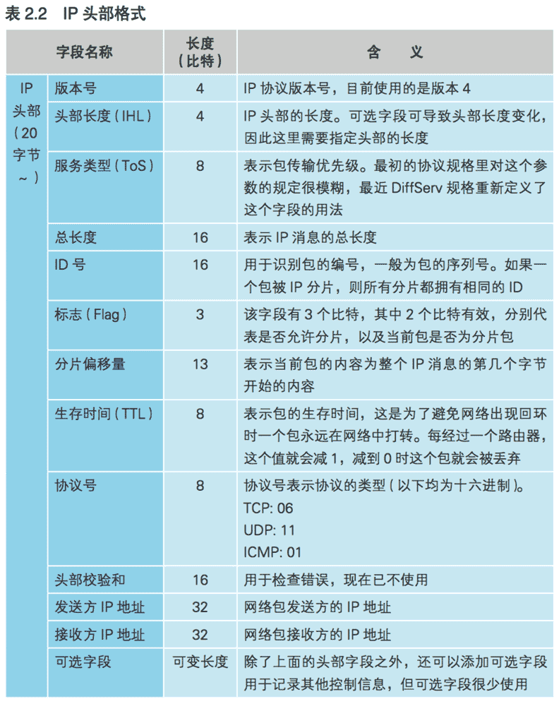
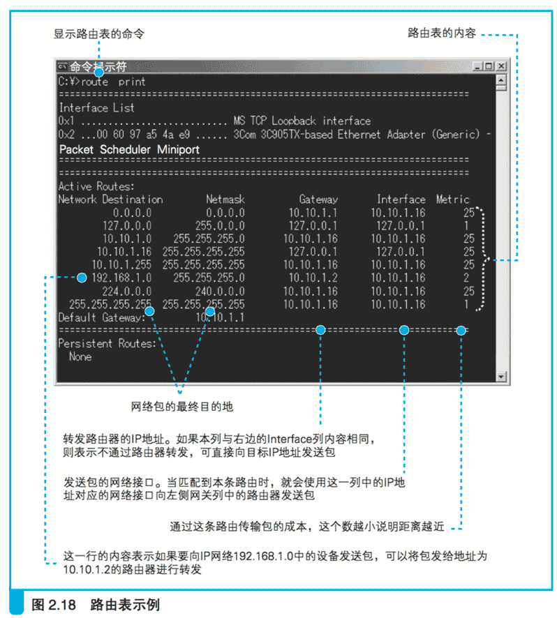

# 2.5 IP 与以太网的包收发操作

## 2.5.1 包的基本知识

TCP 模块在执行连接、收发、断开等各阶段操作时,都需要􏰀托 IP 模块将数据封装成包发送给通信对象。
我们在 TCP 的讲解中也经常提到 IP, 下面就来讨论一下 IP 模块是如何将包发送给对方的。

正式开始这个话题之前,我们先来介绍一下关于网络包的一些基本知识。

[图 2.14 网络包的结构](images/2.14.png)

首先,包是由头部和数据两部分构成的(图 2.14(a)。
头部包含目的地址等控制信息,大家可以把它理解为快递包裹的快递单;
头部后面就是􏰀委托方要发送给对方的数据,也就相当于快递包裹里的货物。

一个包发往目的地的过程如图 2.15 所示。

[图 2.15 发送方、接收方和转发设备](images/2.15.png)

首先,发送方的网络设备会负责创建包,
创建包的过程就是生成含有正确控制信息的头部,然后再附加上要发送的数据。

接下来,包会被发往最近的网络转发设备。

当到达最近的转发设备之后,转发设备会根据头部中的信息判断接下来应该发往哪里。

这个过程需要用到一张表,这张表里面记录了每一个地址对应的发送方向,
也就是按照头部里记录的目的地址在表里进行查询,
并根据查到的信息判断接下来应该发往哪个方向。

比如, 如果查表的结果是“目标地址为 ×××× 的包应该发到 ×××× 号线路”,
那么转发设备就会把这个包发到 ×××× 号线路去。

接下来,包在向目的地移动的过程中,又会到达下一个转发设备,
然后又会按照同样的方式被发往下一个转发设备。

就这样,经过多个转发设备的接力之后,包最终就会到达接收方的网络设备。

当然,发送方 向 接收方 发送一个包,接收方可能也会向发送方返回一个包,
此时的发送方到了接下来的某个时刻就会变成接收方。

因此,我们不需要把发送方和接收方明确区分开来,在这里我们把发送方和接收方统称为终端节点。
（相应地,转发设备被称为转发节点或者中间节点。）

前面介绍的这些基本知识,对于各种通信方式都是适用的,当然也适用于 TCP/IP 网络。

不过,TCP/IP 包的结构是在这个基本结构的基础上扩展出来的,因此更加复杂。

在第 1 章 1.2.1 节,我们讲过子网的概念,
还讲过网络中有路由器和集线器两种不同的转发设备,
它们在传输网络包时有着各自的分工。
 1. 路由器根据目标地址判断下一个路由器的位置
 2. 集线器在子网中将网络包传输到下一个路由

实际上,集线器是按照以太网规则传输包的设备,
而路由器是按照 IP 规则传输包的设备,因此我们也可以作如下理解。
 1. IP 协议根据目标地址判断下一个 IP 转发设备的位置
 2. 子网中的以太网协议将包传输到下一个转发设备

具体来说,如图 2.14(b)所示,TCP/IP 包包含如下两个头部。
 1. MAC 头部(用于以太网协议)
 2. IP 头部(用于 IP 协议)

这两个头部分别具有不同的作用。

[图 2.16 IP 网络包的传输方式](images/2.16.png)

首先,发送方将包的目的地,也就是要访问的服务器的 IP 地址写入 IP 头部中。

这样一来,我们就知道这个包应该发往哪里,IP 协议就可以根据这一地址查找包的传输方向,
从而找到下一个路由器的位置,也就是图 2.16 中的路由器 R1。

接下来,IP 协议会委􏰀托以太网协议将包传输过去。
这时,IP 协议会查找下一个路由器的以太网地址(MAC 地址),并将这个地址写入 MAC 头部中。
这样一来,以太网协议就知道要将这个包发到哪一个路由器上了。

网络包在传输过程中(图 2.16 ①)会经过集线器,集线器是根据以太网协议工作的设备。

为了判断包接下来应该向什么地方传输,集线器里有一张表(用于以太网协议的表),
可根据以太网头部中记录的目的地信息查出相应的传输方向。

这张图中只有一个集线器,当存在多个集线器时,网络包会按顺序逐一通过这些集线器进行传输。

接下来,包会到达下一个路由器(图 2.16 ②)。
路由器中有一张 IP 协议的表,
可根据这张表以及 IP 头部中记录的目的地信息查出接下来应该发往哪个路由器。

为了将包发到下一个路由器,我们还需要查出下一个路由器的 MAC 地址,
并记录到 MAC 头部中,大家可以理解为改写了 MAC 头部。
（更准确地说,收到包的时候 MAC 头部会被舍弃,而当再次发送的时候又会加上包含新 MAC 地址的新 MAC 头部。）

这样,网络包就又被发往下一个节点了。

再往后的过程图上就没有画出来了。
网络包会通过路由器到达下一个路由器 R2。
这个过程不断重复,最终网络包就会被送到目的地,当目的地设备成功接收之后,网络包的传输过程就结束了。

前面介绍的就是在 TCP/IP 网络中,一个网络包从出发 到 到达目的地 的全过程。

虽然看起来有点复杂,不过设计这样的分工是有原因的。
前面讲了 IP 和以太网的分工,其中以太网的部分也可以替换成其他的东西,
例如 无线局域网、ADSL、FTTH 等,
它们都可以替代以太网的角色帮助 IP 协议来传输网络包。
（当使用除以太网之外的其他网络进行传输时,MAC 头部也会被替换为适合所选通信规格的其他头部。）

因此,将 IP 和负责传输的网络分开,可以更好地根据需要使用各种通信技术。

像互联网这样庞大复杂的网络,在架构上需要保证灵活性,这就是设计这种分工方式的原因。

## 2.5.2 包收发操作概览

了解了整体流程之后,下面来讲一讲在协议栈中 IP 模块是如何完成包收发操作的。

尽管我们说 IP 模块负责将包发给对方,
但实际上将包从发送方传输到接收方的工作是由集线器、路由器等网络设备来完成的,
因此 IP模块仅仅是整个包传输过程的入口而已。

即便如此,IP 模块还是有很多工作需要完成,首先我们先粗略地整理一下。

[图 2.17 包收发操作的整体过程](images/2.17.png)

包收发操作的起点是 TCP 模块􏰀托 IP 模块发送包的操作(图 2.17 中 的“①发送”)。

这个􏰀托的过程就是 TCP 模块在数据块的前面加上 TCP 头部,
然后整个传递给 IP 模块,这部分就是网络包的内容。

与此同时, TCP 模块还需要指定通信对象的 IP 地址,
也就是需要写清楚“将什么内 容发给谁”。

收到􏰀托后,IP 模块会将包的内容当作一整块数据,在前面加上包含控制信息的头部。

刚才我们讲过,IP 模块会添加 IP 头部和 MAC 头部这两种头部。

IP 头部中包含 IP 协议规定的、根据 IP 地址将包发往目的地所需的控制信息;
MAC 头部包含通过以太网的局域网将包传输至最近的路由器所需的控制信息。

（凡是局域网所使用的头部都叫 MAC 头部,但其内容根据局域网的类型有所不同。
此外,对于除局域网之外的其他通信技术,还有不同名称的各种头部,
但它们只是名字不叫 MAC 头部而已,承担的作用和 MAC 头部是相同的。）

关于 IP 头部和 MAC 头部的区别以及其中包含的控制信息的含义,我们将稍后介绍。
总之,加上这两个头部之后,一个包就封装好了,这些就是 IP 模块负责的工作。

    IP 模块负责添加如下两个头部。
    (1) MAC 头部:以太网用的头部,包含 MAC 地址 
    (2) IP 头部:IP 用的头部,包含 IP 地址
    
接下来,封装好的包会被交给网络硬件(图 2.17 中的“②发送”),例如以太网、无线局域网等。

网络硬件可能是插在计算机主板上的板卡,也可能是笔记本电脑上的 PCMCIA 卡,
或者是计算机主板上集成的芯片,不同形态的硬件名字也不一样,本书将它们统称为网卡。

（把集成在主板上的网络硬件叫作“网卡”可能听上去有些奇怪,从这个意义上来看应该叫作“网络接口”比较准确。
不过,也有接在 USB 接口上的网卡,在计算机的领域中,“接口”这个词有时候会带来更多的歧义。 
在计算机和网络行业中,有很多术语的用法其实都比较混乱。）

传递给网卡的网络包是由一连串 0 和 1 组成的数字信息,
网卡会将这些数字信息转换为电信号或光信号,并通过网线(或光纤)发送出去,
然后这些信号就会到达集线器、路由器等转发设备,再由转发设备一步一步地送达接收方。

包送达对方之后,对方会作出响应。
返回的包也会通过转发设备发送回来,然后我们需要接收这个包。

接收的过程和发送的过程是相反的,信息先以电信号的形式从网线传输进来,
然后由网卡将其转换为数字信息并传递给 IP 模块(图 2.17 中的“③接收”)。

接下来,IP 模块会将 MAC 头部 和 IP 头部后面的内容,
也就是 TCP 头部加上数据块,传递给 TCP 模块。

接下来的操作就是我们之前讲过的 TCP 模块负责的部分了。

在这个过程中,有几个关键的点。

TCP 模块在收发数据时会分为好几个阶段,并为各个阶段设计了实现相应功能的网络包,
但 IP 的包收发操作都是相同的,并不会因包本身而有所区别。

因为 IP 模块会将 TCP 头部和数据块看作一整块二进制数据,
在执行收发操作时并不关心其中的内容, 
也不关心这个包是包含 TCP 头部和数据两者,还是只有 TCP 头部而没有数据。

当然,IP 模块也不关心 TCP 的操作阶段,对于包的乱序和丢失也一概不知。

总之,IP 的职责就是将􏰀托的东西打包送到对方手里,或者是将对方送来的包接收下来,仅此而已。

因此,接下来我们要讲的这些关于 IP 的工作方式,可适用于任何 TCP 􏰀派的收发操作。

    无论要收发的包是控制包还是数据包,IP 对各种类型的包的收 发操作都是相同的。

## 2.5.3 生成包含接收方 IP 地址的 IP 头部

下面来看一看 IP 模块的具体工作过程。

IP 模块接受 TCP 模块的􏰀委托 负责包的收发工作,它会生成 IP 头部并附加在 TCP 头部前面。

IP 头部包含的内容如表 2.2 所示,其中最重要的内容就是 IP 地址,它表示这个包应该发到哪里去。

这个地址是由 TCP 模块告知的,而 TCP 又是在执行连接操作时从应用程序那里获得这个地址的,
因此这个地址的最初来源就是应用程序。

IP 不会自行判断包的目的地,而是将包发往应用程序指定的接收方,
即便应用程序指定了错误的 IP 地址,IP 模块也只能照做。

当然,这样 做肯定会出错,但这个责任应该由应用程序来承担。

（在连接操作中发送第一个 SYN 包时就可能发生这样的情况,
一旦 TCP 连接完毕,就已经确认能够正常和对方进行包的收发,
这时就不会发生这样的情况了。）

IP 头部中还需要填写发送方的 IP 地址,大家可以认为是发送方计算机的 IP 地址,
实际上“计算机的 IP 地址”这种说法并不准确。

（设置窗口或者配置文件中设置的 IP 地址,或者是由 DHCP 服务器自动分配的 IP 地址。
无论哪种情况,分配的 IP 地址都会保存在计算机中,
一般在计算机启动的操作系统初始化过程中,协议栈会根据这些信息进行配置。）

一般的客户端计算机上只有一块网卡,因此也就只有一个 IP 地址,
这种情况下我们可以认为这个 IP 地址就是计算机的 IP 地址,
但如果计算机上有多个网卡, 情况就没那么简单了。

IP 地址实际上并不是分配给计算机的,而是分配给网卡的,
因此当计算机上存在多块网卡时,每一块网卡都会有自己的 IP 地址。

很多服务器上都会安装多块网卡,这时一台计算机就有多个 IP 地址, 
在填写发送方 IP 地址时就需要判断到底应该填写哪个地址。

这个判断相当于在多块网卡中判断应该使用哪一块网卡来发送这个包,
也就相当于判断应该把包发往哪个路由器,因此只要确定了目标路由器,
也就确定了应该使用哪块网卡,也就确定了发送方的 IP 地址。

    IP 头部的“接收方 IP 地址”填写通信对象的 IP 地址。
    发送方 IP 地址需要判断发送所使用的网卡,并填写该网卡的 IP 地址。

那么,我们应该如何判断应该把包交给哪块网卡呢?

其实和图 2.16 中 路由器使用 IP 表判断下一个路由器位置的操作是一样的。

因为协议栈的 IP 模块与路由器中负责包收发的部分都是根据 IP 协议规则来进行包收发操作的,
所以它们也都用相同的方法来判断把包发送给谁。

这个“IP 表”叫作路由表,我们将在第 3 章探索路由器时详细介绍它的用法,这里先简单讲个大概。

如图2.18所示,我们可以通过 route print 命令来显示路由表,下面来边看边讲。

首先,我们对套接字中记录的目的地IP地址与路由表左侧的Network Destination栏进行比较,找到对应的一行。

例如,TCP 模块告知的目标 IP 地址为 192.168.1.21,
那么就对应 图 2.18 中的第 6 行,因为它和 192.168.1 的部分相匹配。

如果目标 IP 地址 为 10.10.1.166,
那么就和 10.10.1 的部分相匹配,所以对应第 3 行。

以此类推,我们需要找到与 IP 地址左边部分相匹配的条目,找到相应的条目之后,
接下来看从右边数第 2 列和第 3 列的内容。

右起第 2 列,也就是 Interface 列,表示网卡等网络接口,这些网络接口可以将包发送给通信对象。

此外,右起第 3 列,即 Gateway 列表示下一个路由器的 IP 地址,
将包发给这个 IP 地址,该地址对应的路由器就会将包转发到目标地址。

（Gateway(网关)在 TCP/IP 的世界里就是路由器的意思。）

（如果 Gateway 和 Interface 列的 IP 地址相同,
就表示不需要路由器进行转发,可以直接将包发给接收方的 IP 地址。）

路由表的第 1 行中,目标地址和子网掩码都是 0.0.0.0,这表示默认网关,
如果其他所有条目都无法匹配,就会自动匹配这一行。

（子网掩码:用来判断 IP 地址中网络号与主机号分界线的值,我们在 1.2.1 节介绍过。）