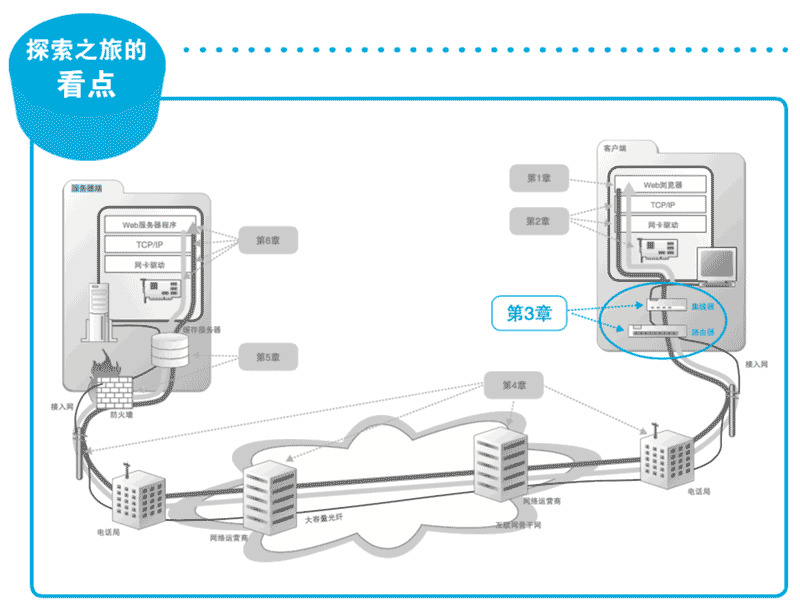

# 3. 从网线到网络设备——探索集线器、交换机和路由器

**前情提要**

上一章,我们探索了客户端中的协议栈和网卡,介绍了发送网络包,也就是将网络包转换成电信号通过网线传输出去的过程。
本章我们将继续跟着上一章的脚步,看一看通过网线传输出去的包是如何经过集线器、交换机和路由器等网络设备,最终进入互联
网的。

**探索之旅的看点**

(1)信号在网线和集线器中传输

信号从计算机中流出之后,会在网线中经过集线器等设备前进。
此时, 信号是如何在网线和集线器传输的,就是我们的第一个看点。
信号在传输 过程中会衰减,还会受到噪声干扰而失真,如何抑制这些影响是我们的另一个看点。

(2)交换机的包转发操作

交换机的工作方式也是本章看点之一。
交换机并不只是简单地让信号流过,而是先接收信号并将其还原为数字信息,然后再重新转换成信号并发送出去的过程。
这里我们将详细探索这一过程。

(3)路由器的包转发操作

路由器和交换机一样也负责对包进行转发,但它们的工作方式有一些差异。
交换机是基于以太网规格工作的设备,而路由器是基于 IP 工作的, 它们之间的差异也是本章看点之一。

(4)路由器的附加功能

位于互联网接入端的路由器通常还会提供一些附加功能,
例如将私有地址转换为公有地址的地址转换功能,以及阻止危险网络包的包过滤功能等。
本章最后将介绍一下这些功能,这样我们就会对路由器有较全面的认识。

