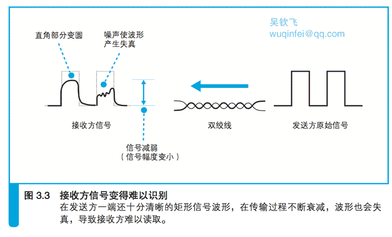

# 3.1 信号在网线和集线器中传输

## 3.1.1 每个包都是独立传输的

从计算机发送出来的网络包会通过集线器、路由器等设备被转发,最终到达目的地。

我们在第 2 章的 2.5.1 节和 2.5.2 节讲过,转发设备会根据包头部中的控制信息,
在转发设备内部一个写有转发规则的表中进行查询, 以此来判断包的目的地,然后将包朝目的地的方向进行转发。

邮递员在送信的时候只看信封,不看里面的内容,同样地,转发设备在进行转发时也不看数据的内容。

因此,无论包里面装的是应用程序的数据或者是 TCP 协议的控制信息,都不会对包的传输操作本身产生影响。

换句话说,HTTP 请求的方法,TCP 的确认响应和序号,客户端和服务器之间的关系,这一切都与包的传输无关。

因此,所有的包在传输到目的地的过程中都是独立的,相互之间没有任何关联。

记住这个概念之后,本章我们来探索一下网络包在进入互联网之前经历的传输过程。

这里我们假设客户端计算机连接的局域网结构是像图 3.1 这样的。

也就是说,网络包从客户端计算机发出之后,要经过集线器、交换机和路由器最终进入互联网。

实际上,我们家里用的路由器已经集成了集线器和交换机的功能,像图上这样使用独立设备的情况很少见。

不过, 把每个功能独立出来更容易理解,而且理解了这种模式之后,也就能理解集成了多种功能的设备了,
因此我们这里将所有功能独立出来,逐个来进行探索。

## 3.1.2 防止网线中的信号衰减很重要

本章的探索从信号流出网卡进入网线开始。

网卡中的 PHY(MAU)模块负责将包转换成电信号,
信号通过 RJ-45 接口进入双绞线,这部分的放大图如图 3.2 的右侧部分所示。
以太网信号的本质是正负变化的电压,大家可以认为网卡的 PHY(MAU)模块就是一个从正负两个信号端子输出信号的电路。

（PHY(MAU):以太网有多重派生方式,每种方式中信号收发模块的名称都不一样。
现在 100 Mbit/s 以上的以太网中叫作 PHY(物理层装置),以前低速方式中则叫作 MAU(介质连接单元)。）

网卡的 PHY(MAU)模块直接连接图 3.2 右侧中的 RJ-45 接口,
信号从这个接口中的 1 号和 2 号针脚流入网线。
然后,信号会通过网线到达集线器的接口,这个过程就是单纯地传输电信号而已。

但是,信号到达集线器的时候并不是跟刚发送出去的时候一模一样。 
集线器收到的信号有时会出现衰减(图 3.3)。
信号在网线的传输过程中, 能量会逐渐损失。网线越长,信号衰减就越严重。

而且,信号损失能量并非只是变弱而已。
在第 2 章的图 2.25、图 2.26、 图 2.27 中我们已经看到,
以太网中的信号波形是方形的,但损失能量会让信号的拐角变圆,这是因为电信号的频率越高,能量的损失率越大。
信号的拐角意味着电压发生剧烈的变化,而剧烈的变化意味着这个部分的信号频率很高。
高频信号更容易损失能量,因此本来剧烈变化的部分就会变成缓慢的变化,拐角也就变圆了。

即便线路条件很好,没有噪声,信号在传输过程中依然会发生失真, 如果再加上噪声的影响,失真就会更厉害。
噪声根据强度和类型会产生不同的影响,无法一概而论,但如果本来就已经衰减的信号再进一步失真, 
就会出现对 0 和 1 的误判,这就是产生通信错误的原因。