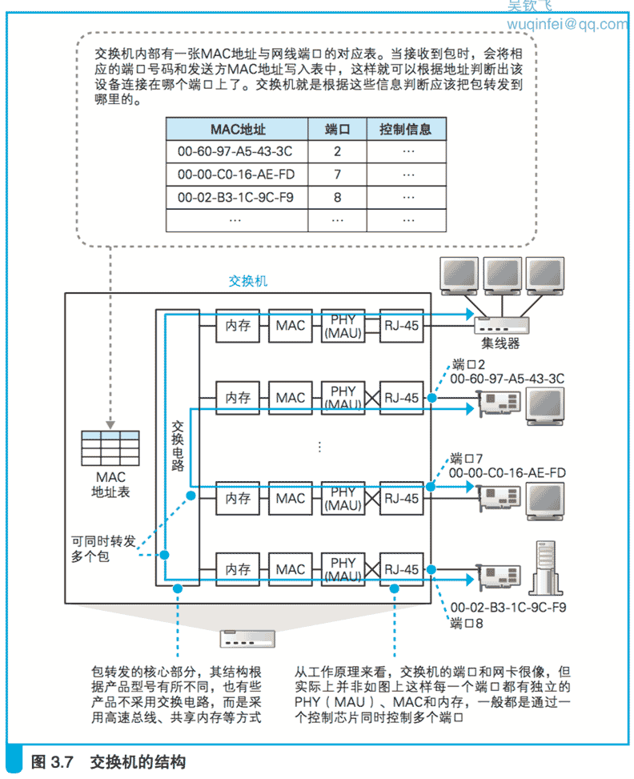

# 3.2 交换机的包转发操作

## 3.2.1 交换机根据地址表进行转发

下面来看一下包是如何通过交换机的。
交换机的设计是将网络包原样转发到目的地,图 3.7 就是它的内部结构,我们边看图边讲。

首先,信号到达网线接口,并由 PHY(MAU)模块进行接收,这一部分和集线器是相同的。
也就是说,它的接口和 PHY(MAU)模块也是以 MDI-X 模式进行连接的,
当信号从双绞线传入时,就会进入 PHY(MAU) 模块的接收部分。

（早期的交换机基本上都和图 3.7 最上面的那种情况一样,是通过集线器和计算机进行连接的,
由于集线器的接口是 MDI-X 模式,如果要用直连网线连接,那么交换机应该采用 MDI 模式的接口。
不过现在我们基本上不使用集线器了,而是将计算机直接连接到交换机上,
因此交换机也和集线器一样采用了 MDI-X 接线。）

接下来,PHY(MAU)模块会将网线中的信号转换为通用格式,然后传递给 MAC 模块。
MAC 模块将信号转换为数字信息,然后通过包末尾的 FCS 校验错误,如果没有问题则存放到缓冲区中。
如果检测到错误就丢弃这个包。

这部分操作和网卡基本相同,大家可以认为交换机的每个网线接口后面都是一块网卡。
网线接口和后面的电路部分加在一起称为一个端口,
也就是说交换机的一个端口就相当于计算机上的一块网卡。

（换句话说,如果在计算机上安装多块网卡,并开启“混杂模式”让网卡接收所有的网络包,
然后再安装一个和交换机具备同样功能的网络包转发软件,那么这台计算机就变成了一台交换机。）

但交换机的工作方式和网卡有一点不同。
网卡本身具有 MAC 地址,并通过核对收到的包的接收方 MAC 地址判断是不是发给自己的,如果不是发给自己的则丢弃;
相对地,交换机的端口不核对接收方 MAC 地址,而是直接接收所有的包并存放到缓冲区中。
因此, 和网卡不同,交换机的端口不具有 MAC 地址。

（内置用于实现管理等功能的处理器的交换机除外。
这种交换机相当于在一个盒子里同时集成了计算机和交换机两种设备,
因此其中相当于计算机的部分是具有 MAC 地址的。）

    交换机端口的 MAC 模块不具有 MAC 地址。

将包存入缓冲区后,接下来需要查询一下这个包的接收方 MAC 地址是否已经在 MAC 地址表中有记录了。

MAC 地址表主要包含两个信息,一个是设备的 MAC 地址,另一个是该设备连接在交换机的哪个端口上。

以 图 3.7 中的地址表为例,MAC 地址和端口是一一对应的,通过这张表就能够判断出收到的包应该转发到哪个端口。

举个例子,如果收到的包的接收方 MAC 地址为 00-02-B3-1C-9C-F9,则与图 3.7 的表中的第 3 行匹配,
根据端口列的信息,可知这个地址位于 8 号端口上,然后就可以通过交换电路将包发送到相应的端口了。

（有些产品不是用交换电路来传输网络包的,但交换电路是交换机的原型, “交换机”这个词也是从交换电路来的。）

现在来看看交换电路到底是如何工作的。交换电路的结构如图 3.8 所示,它可以将输入端和输出端连接起来。

其中,信号线排列成网格状,每一个交叉点都有一个交换开关,交换开关是电子控制的,
通过切换开关的状态就可以改变信号的流向。

交换电路的输入端和输出端分别连接各个接收端口和发送端口,网络包通过这个网格状的电路在端口之间流动。

举个例子,假设现在要将包从 2 号端口发送到 7 号端口,那么信号会从输入端 的 2 号线进入交换电路,
这时,如果让左起的 6 个开关水平导通,然后将 第 7 个开关切换为垂直导通,
信号就会像图上一样流到输出端 7 号线路, 于是网络包就被发送到了 7 号端口。

每个交叉点上的交换开关都可以独立工作,因此只要路径不重复,就可以同时传输多路信号。

当网络包通过交换电路到达发送端口时,端口中的 MAC 模块和 PHY (MAU)模块会执行发送操作,将信号发送到网线中,
这部分和网卡发送信号的过程是一样的。

根据以太网的规则,首先应该确认没有其他设备在发送信号,也就是确认信号收发模块中的接收线路没有信号进来。
如果检测到其他设备在发送信号,则需要等待信号发送完毕;
如果没有其他信号, 或者其他信号已经发送完毕,这时就可以将包的数字信息转换为电信号发送出去。

在发送信号的过程中,还需要对接收信号进行监控,这一点和网卡也是一样的。
如果在发送过程中检测到其他设备发送信号,就意味着出现了信号碰撞,
这时需要发送阻塞信号以停止网络中所有的发送操作,
等待一段时间后再尝试重新发送,这一步和网卡也是一样的。

（这个操作过程的前提是终端通过集线器连接到交换机,也就是半双工模式的工作方式。
这是以太网的原型,但现在基本上都不使用集线器了,而是直接用交换机将终端和路由器相连接,
在这种情况下,交换机的端口会自动切换为全双工模式。关于全双工模式的工作过程我们将稍后介绍。）

    交换机根据 MAC 地址表查找 MAC 地址,然后将信号发送到相应的端口。

