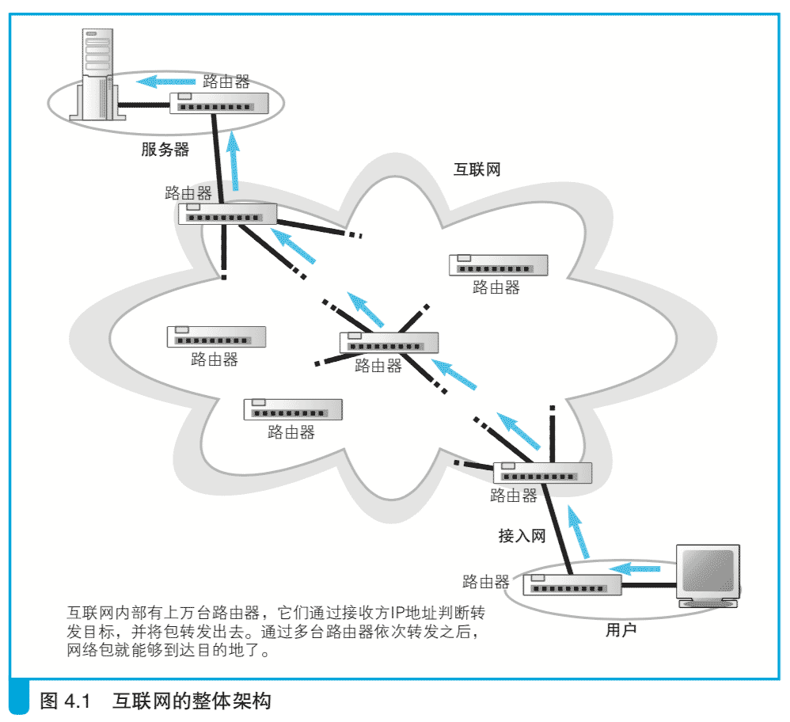
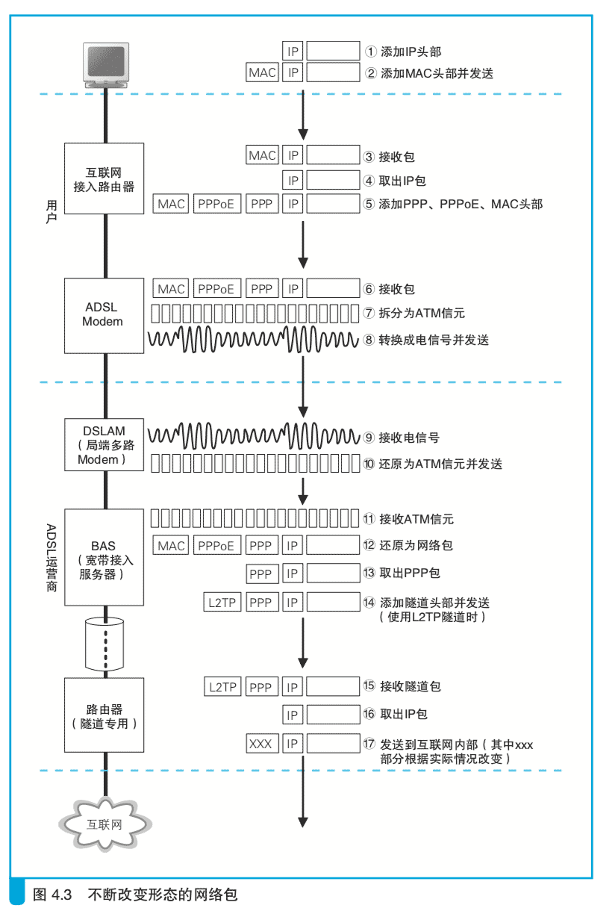
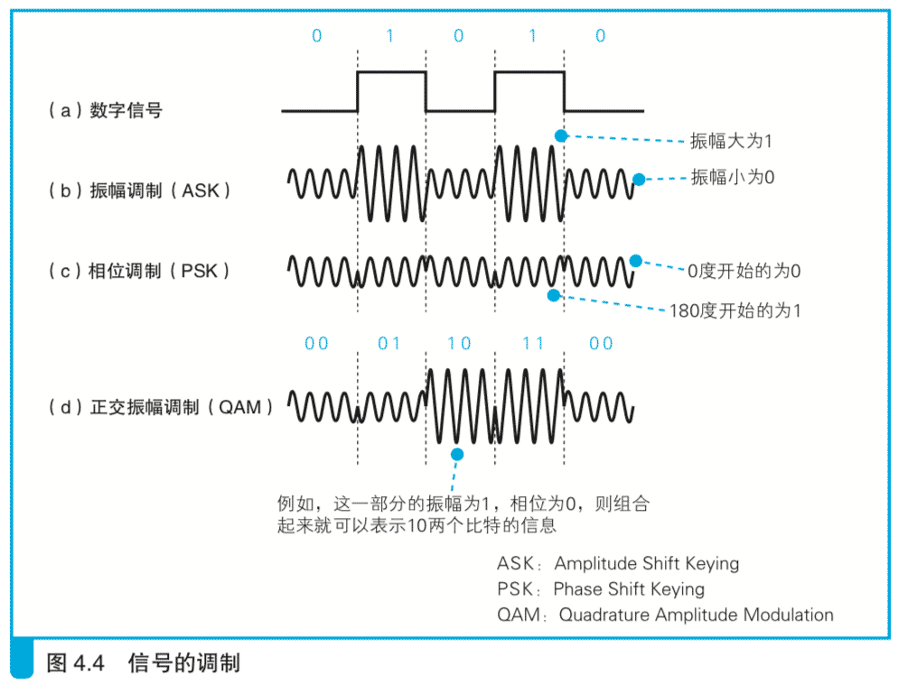

# 4.1  ADSL 接入网的结构和工作方式

## 4.1.1 互联网的基本结构和家庭、公司网络是相同的

互联网是一个遍布世界的巨大而复杂的系统，但其基本工作方式却出奇地简单。和家庭、公司网络一样，互联网也是通过路由器来转发包的，而且路由器的基本结构和工作方式也并没有什么不同(图 4.1)。因此，我们可以将互联网理解为家庭、公司网络的一个放大版。

当然，互联网也有一些和家庭、公司网络不同的地方，其中之一就是与转发设备间的距离。在家庭、公司网络中，与转发设备之间的距离不过几十米到几百米，在这种情况下，只要延长以太网线就可以到达相邻的转发设备了（双绞线的极限距离是 100 米，但光纤的连接距离可以长达几公里。）。

然而，互联网可不能这么搞，因为你家到最近的电话局至少也有几公里的距离，而从日本连接到美国甚至要跨越太平洋，用以太网线是无法实现这种连接的。

除了距离之外，路由器在如何控制包的转发目标上也不一样。尽管从基本原理来看，互联网也是根据路由表中的记录来判断转发目标的，但路由表记录的维护方式不同。

互联网中的路由器上有超过 10 万条路由记录，而且这些记录还在不断变化，当出现线路故障时，或者新的公司加入互联网时，都会引发路由的变化。人工维护这些路由信息是不现实的，必须实现自动化。公司的路由器也有自动维护路由表的机制，但出于各种原因，互联网中采用的机制和公司有所区别。

距离的不同和路由的维护方式，就是互联网与家庭、公司网络之间最主要的两个不同点。

## 4.1.2 连接用户与互联网的接入网

上一章已经讲过，网络包通过交换机和路由器的转发一步一步地接近它的目的地，在通过互联网接入路由器之后，就进入了互联网。本章的探索之旅就从这里开始。

刚才讲过，路由器的转发操作都是相同的，因此互联网接入路由器的包转发操作也和第 3 章讲过的以太网路由器几乎是一样的。

简单来说，就是根据包 IP 头部中的接收方 IP 地址在路由表的目标地址中进行匹配，找到相应的路由记录后将包转发到这条路由的目标网关。

不过，互联网接入路由器发送网络包的操作和以太网路由器有一点不同，互联网接入路由器是按照接入网规则来发送包的。

所谓接入网，就是指连接互联网与家庭、公司网络的通信线路。一般家用的接入网方式包括 ADSL、FTTH、CATV、电话线、ISDN 等，公司则还可能使用专线。接入网的线路有很多种类，我们无法探索所有这些线路，因此下面先介绍一个比较有代表性的例子——ADSL。

（接入网这个词表示的是通信线路的用法，而并不表示通信线路的结构。例如公司里使用的专线，当它用来连接互联网时就叫作接入网，而用来连接总公司和分公司时就不叫接入网。此外，接入网这个词也不仅限于互联网，当使用运营商提供的通信服务时，一般都会将用户与运营商之间的线路叫作接入网。）

（ADSL:Asymmetric Digital Subscriber Line，不对称数字用户线。它是一种利用架设在电线杆上的金属电话线来进行高速通信的技术，它的上行方向(用户到互联网)和下行方向(互联网到用户)的通信速率是不对称的。）

（FTTH:Fiber To The Home，光纤到户。指的是将光纤接入家庭的意思。）

## 4.1.3 ADSL Modem 将包拆分成信元

ADSL 技术使用的接入线路，其内部结构如图 4.2 所示，在这张图中网络包是从右往左传输的。用户端路由器发出的网络包通过 ADSL Modem（中文全称为“调制解调器”，因为这个名字比较长，所以正文中统一使用Modem。） 和电话线到达电话局，然后到达ADSL 的网络运营商(即 ISP，互联网服务提供商)。在网络包从用户传输到运营商的过程中，会变换几种不同的形态，整个过程如图 4.3 所示，让我们一边看图一边继续我们的探索之旅吧。

首先，客户端生成的网络包(图 4.3 的1和2)先经过集线器和交换机到达互联网接入路由器(图 4.3 3)，并在此从以太网包中取出 IP 包并判断转发目标(图 4.3 4)，上面这一部分刚才已经讲过，和第 3 章介绍的以太网路由器的工作方式是一样的。接下来，包发送的操作也很类似。如果互联网接入路由器和 ADSL Modem 之间是通过以太网连接的，那么就会按照以太网的规则执行包发送的操作，发送信号本身的过程跟之前是一样的，但以太网的头部会有一些差异。这部分的具体情况各运营商会有所不同，而且还需要一些关于 BAS(位于接入网另一端的包转发设备)的知识，因此相关的细节我们在探索 BAS 的时候再具体讲解。这里大家先记住，网络 包会加上 MAC 头部、PPPoE 头部、PPP 头部总共 3 种头部(图 4.3 5)， 然后按照以太网规则转换成电信号后被发送出去。

    互联网接入路由器会在网络包前面加上 MAC 头部、PPPoE 头部、PPP 头 部 总 共 3 种 头 部， 
    然 后 发 送 给 ADSL Modem (PPPoE 方式下)。

互联网接入路由器将包发送出去之后，包就到达了 ADSL Modem (图 4.3 6)，然后，ADSL Modem 会把包拆分成很多小格子(图 4.3 7)，每一个小格子称为一个信元。信元是一个非常小的数据块，开头是有 5 个 字节的头部，后面是 48 个字节的数据，用于一种叫作 ATM 的通信技术。 大家可以将信元理解为一种更小一号的包，原理上跟 TCP/IP 将应用程序的数据拆分成块装进一个个包的过程是一样的。

（ATM:Asynchronous Transfer Mode，异步传输。它是在以电话线为载体的传统电话技术基础上扩展出来的一种通信方式。它的数据传输是以“信 元”为单位来进行的，这和以包为单位传输数据的 TCP/IP 很像，但这种方式并不适用于计算机通信。）

说点题外话，其实之所以要将包拆分成信元，原因是这样的。当初开发 ADSL 技术时，通信业比较看好 ATM 技术，各运营商也在 ATM 相关的设备上投入了很多资金。在这样的情况下，如果使用信元来传输数据，就比较容易和其他设备进行整合，可以降低开发投入和设备投入。如果不是出于这样的原因，其实并不需要将包拆分成信元，实际上也有一些 ADSL 运营商使用的 ADSL Modem 是不进行数据拆分的。

    ADSL Modem 将包拆分成信元，并转换成电信号发送给分离器

## 4.1.4 ADSL 将信元“调制”成信号

将网络包拆分成信元之后，接下来就要将这些信元转换成信号了(图 4.3 8)。我们在第 2 章的图 2.27 中介绍过，以太网采用的是用方波信号表示 0 和 1 的方式，这种方式很简单，但同样是将数字信息转换成模拟信号，ADSL 采用的方法要复杂一些。其中有两个原因，一个原因是方波信号的波形容易失真，随着距离的延长错误率也会提高;另一个原因是方波信号覆盖了从低频到高频的宽广频段，信号频率越高，辐射出来的电磁噪声就越强，因此信号频谱太宽就难以控制噪声。

因此，ADSL Modem 采用了一种用圆滑波形(正弦波)对信号进行合成来表示 0 和 1 的技术，这种技术称为调制。调制有很多方式，ADSL 采用的调制方式是振幅调制(ASK)和相位调制(PSK)相结合的正交振幅调 制(QAM) 方式。下面先来看一下它的两个组成要素。

振幅调制是用信号的强弱，也就是信号振幅的大小来对应 0 和 1 的方式。如图4.4(b)，振幅小的信号为0，振幅大的信号为1，这是一种最简单的对应关系。在这个例子中，振幅大小只有两个级别，如果增加振幅变化的级别，就可以对应更多的比特。例如，如果将振幅增加到 4 个级别， 则振幅从小到大可分别对应 00、01、10 和 11，这样就可以表示两个比特了。这样做可以将单位时间内传输的数据量加倍，也就能够提高速率。以此类推，如果振幅有 8 个级别，就可以表示 3 个比特，16 个级别就可以表示 4 个比特，速率也就越来越高。不过，信号会在传输过程中发生衰减， 也会受到噪声影响而失真，如果振幅级别太多，接收方对信号的识别就容易出错，因此振幅级别也不能太多。

另一个组成要素是相位调制，这是一种根据信号的相位来对应 0 和 1 的方式。Modem 产生的信号是以一定周期振动的波，如图 4.5 所示，振动的起始位置不同，波的形状也就不同。如果将波的一个振动周期理解为一个圆，则起始位置就可以用 0 度到 360 度的角度来表示，这个角度就是相位，用角度来对应 0 和 1 的方式就叫作相位调制。例如，从 0 度开始的波为 0，从 180 度开始的波为 1，这是一种最简单的对应关系，如图 4.4(c) 所示。和振幅调制一样，相位调制也可以通过将角度划分为更细的级别来增加对应的比特数量，从而提高速率。但是，角度太接近的时候也容易产生误判，因此这样提升速率还是有限度的。

ADSL 使用的正交振幅调制就是将前面这两种方式组合起来实现的。 图 4.4(d)就是将图 4.4(b)和图 4.4(c)组合起来的一个例子，大家应该一看就明白了。如果信号的振幅可以表示 1 个比特，相位可以表示 1 个比特， 那么加起来就可以表示 2 个比特。因此，将两种方式组合起来，正交振幅调制就可以用一个波表示更多的比特，从而提高传输速率。

正交振幅调制中，通过增加振幅和相位的级别，就可以增加能表示的比特数。例如，如果振幅和相位各自都有 4 个级别，那么组合起来就有 16 个级别，也就可以表示 4 个比特的值。当然，和单独使用振幅调制或相位调制的情况一样，级别过多就容易发生误判，因此这种方法提升的速率是有限度的。