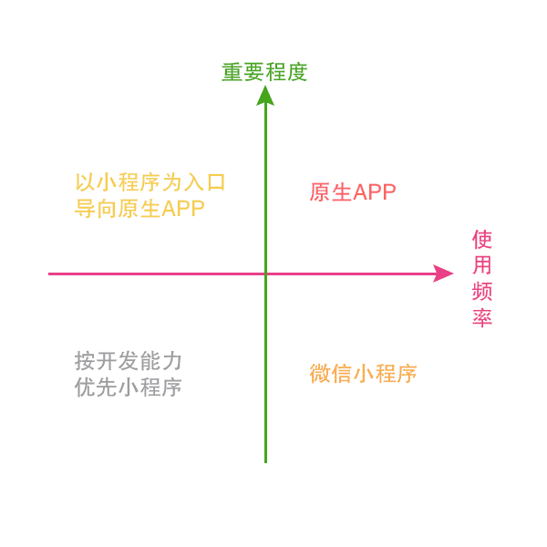

- [什么是微信小程序](#%E4%BB%80%E4%B9%88%E6%98%AF%E5%BE%AE%E4%BF%A1%E5%B0%8F%E7%A8%8B%E5%BA%8F)
    - [1. 什么是微信小程序](#1-%E4%BB%80%E4%B9%88%E6%98%AF%E5%BE%AE%E4%BF%A1%E5%B0%8F%E7%A8%8B%E5%BA%8F)
    - [2. 什么应用可以用微信小程序（微信小程序的应用场景）](#2-%E4%BB%80%E4%B9%88%E5%BA%94%E7%94%A8%E5%8F%AF%E4%BB%A5%E7%94%A8%E5%BE%AE%E4%BF%A1%E5%B0%8F%E7%A8%8B%E5%BA%8F%EF%BC%88%E5%BE%AE%E4%BF%A1%E5%B0%8F%E7%A8%8B%E5%BA%8F%E7%9A%84%E5%BA%94%E7%94%A8%E5%9C%BA%E6%99%AF%EF%BC%89)
    - [3. 小程序目标 --- 杀死一切App](#3-%E5%B0%8F%E7%A8%8B%E5%BA%8F%E7%9B%AE%E6%A0%87-----%E6%9D%80%E6%AD%BB%E4%B8%80%E5%88%87app)
    - [4. 微信的4大号](#4-%E5%BE%AE%E4%BF%A1%E7%9A%844%E5%A4%A7%E5%8F%B7)
        - [4.1 什么是服务号？](#41-%E4%BB%80%E4%B9%88%E6%98%AF%E6%9C%8D%E5%8A%A1%E5%8F%B7%EF%BC%9F)
        - [4.2 什么是订阅号？](#42-%E4%BB%80%E4%B9%88%E6%98%AF%E8%AE%A2%E9%98%85%E5%8F%B7%EF%BC%9F)
    - [5. 微信小程序技术点](#5-%E5%BE%AE%E4%BF%A1%E5%B0%8F%E7%A8%8B%E5%BA%8F%E6%8A%80%E6%9C%AF%E7%82%B9)
    - [6. 小程序开放的API](#6-%E5%B0%8F%E7%A8%8B%E5%BA%8F%E5%BC%80%E6%94%BE%E7%9A%84api)
    - [7. 学习小程序开发](#7-%E5%AD%A6%E4%B9%A0%E5%B0%8F%E7%A8%8B%E5%BA%8F%E5%BC%80%E5%8F%91)

# 什么是微信小程序

## 1. 什么是微信小程序

> 什么是微信小程序：小程序是一种不需要下载安装即可使用的应用，它实现了应用“触手可及”的梦想，
用户扫一扫或者搜一下即可打开应用。也体现了“用完即走”的理念，用户不用关心是否安装太多应用的问题。
应用将无处不在，随时可用，但又无需安装卸载。—— 张小龙

    1. 无需下载安装
    2. 扫一扫即可打开

小程序：一种新的应用形态

## 2. 什么应用可以用微信小程序（微信小程序的应用场景）

从 使用频率、重要程度 来比较原生APP和微信小程序

## 3. 小程序目标 --- 杀死一切App

不做解释

## 4. 微信的4大号

 * 服务号
 * 订阅号
 * 企业号（企业微信）
 * 应用号（小程序）

### 4.1 什么是服务号？

**服务号**：为企业和组织提供更强大的业务服务与用户管理能力，
主要偏向服务类交互（功能类似12315，114，银行，提供绑定信息，服务交互的）；

**适用人群**：媒体、企业、政府或其他组织。

**群发次数**：服务号1个月（按自然月）内可发送4条群发消息。

### 4.2 什么是订阅号？

**订阅号**：为媒体和个人提供一种新的信息传播方式，
主要功能是在微信侧给用户传达资讯；（功能类似报纸杂志，提供新闻信息或娱乐趣事）

**适用人群**：个人、媒体、企业、政府或其他组织。

**群发次数**：订阅号（认证用户、非认证用户）1天内可群发1条消息。

## 5. 微信小程序技术点

* 并不是HTML5/CSS3技术实现
* 抛弃了臃肿的WebView（比如某化妆品公司的微信商城，体验不是很好）
* 采用了JavaScriptCore动态解析
* 大量借鉴React.js + ReactNative.js思想

## 6. 小程序开放的API

* 视图容器：视图(View)、滚动视图、Swiper
* 基础内容：图标、文本、进度条
* 表单组件：按钮、表单等等
* 操作反馈 导航
* 媒体组建：音频、图片、视频。
* 地图 画布 文件操作能力
* 网络：上传下载能力、WebSocket
* 数据：数据缓存能力
* 位置：获取位置、查看位置
* 设备：网络状态、系统信息、重力感应、罗盘
* 界面：设置导航条、导航、动画、绘图等等
* 开放接口：登录，包括签名加密，用户信息、微信支付、模板消息

## 7. 学习小程序开发

* HTML/CSS
* JavaScript（ES6）
* 懂一些iOS/Android开发更好

