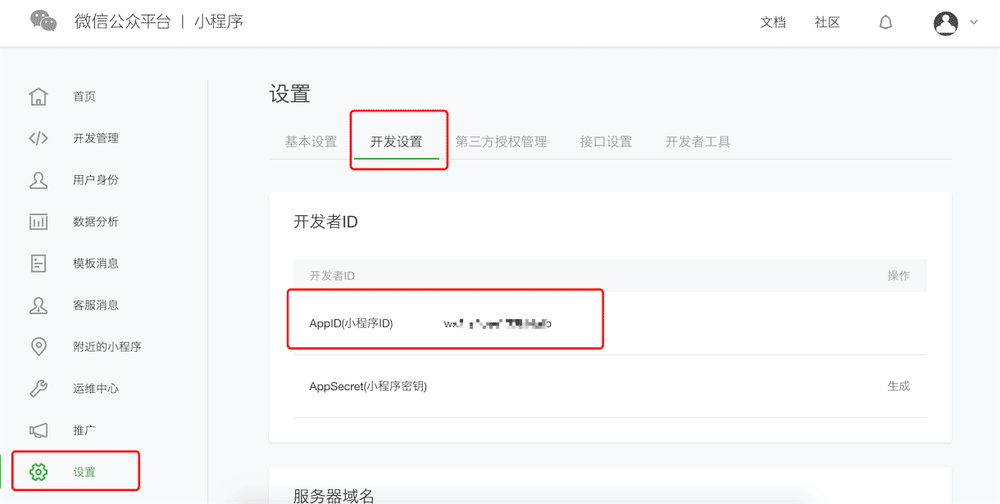
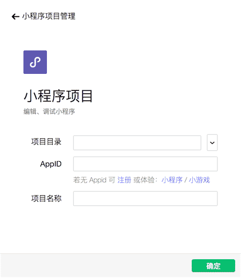
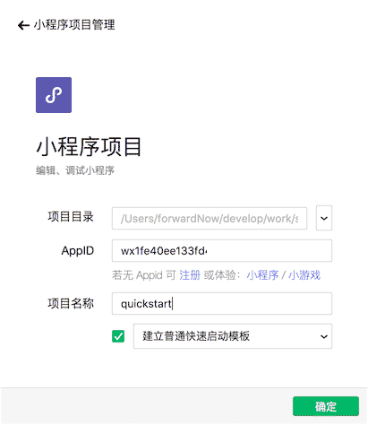
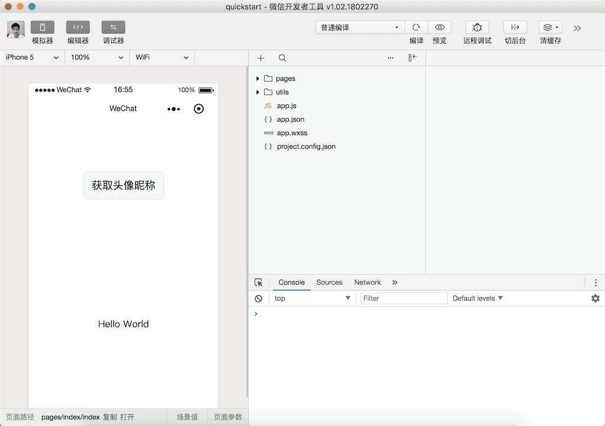
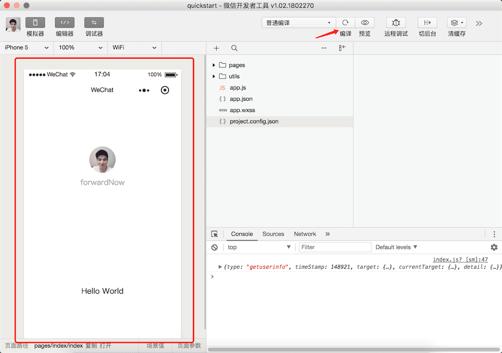
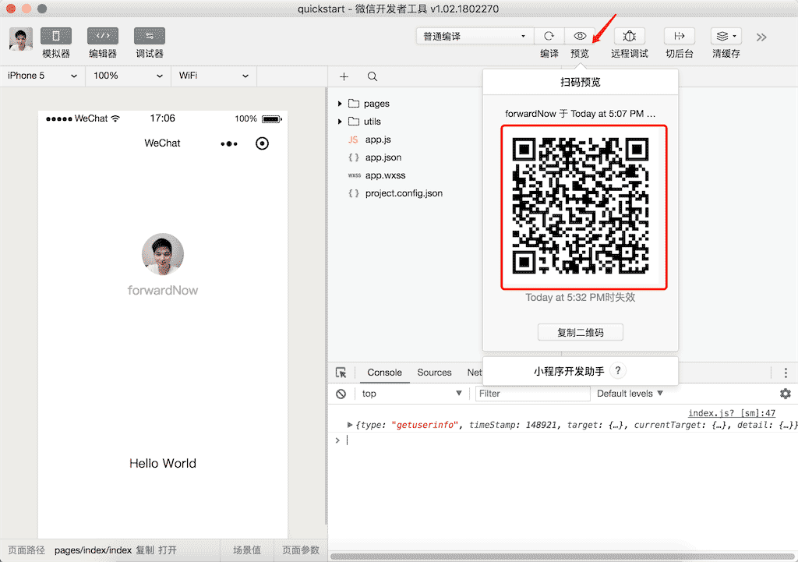

# 基础（简易教程）

[https://mp.weixin.qq.com/debug/wxadoc/dev/quickstart/basic/getting-started.html](https://mp.weixin.qq.com/debug/wxadoc/dev/quickstart/basic/getting-started.html)

## 1. 起步

### 1.1 申请帐号

#### 1.1.1 注册

[https://mp.weixin.qq.com/wxopen/waregister?action=step1](https://mp.weixin.qq.com/wxopen/waregister?action=step1)

#### 1.1.2 查看AppID

访问 [https://mp.weixin.qq.com/](https://mp.weixin.qq.com/)，如图所示：

### 1.2 安装开发工具

* [下载开发工具](https://mp.weixin.qq.com/debug/wxadoc/dev/devtools/download.html)
* [开关工具介绍](https://mp.weixin.qq.com/debug/wxadoc/dev/devtools/devtools.html)

### 1.3 你的第一个小程序

1）新建

2）选择“小程序”

3）创建

### 1.4 编译预览

#### 1.4.1 编译后查看效果

#### 1.4.2 在微信上预览

