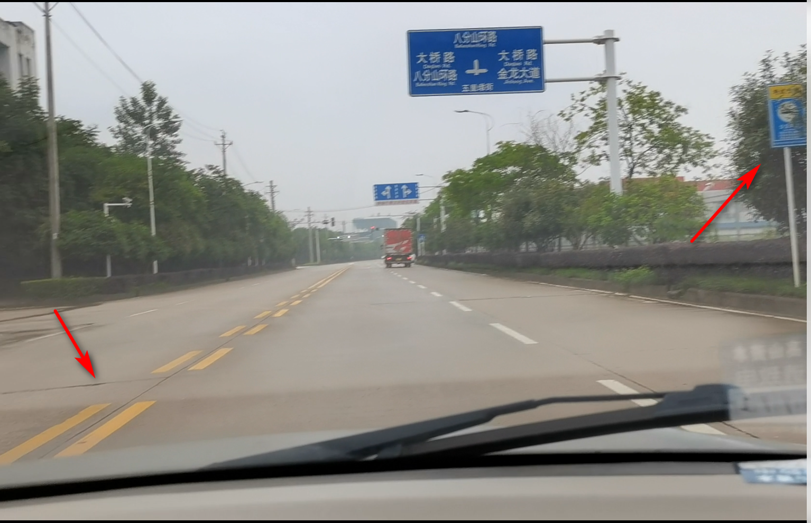

# 科三笔记

## 1. 考试项目

总共 16 项，大致分为

* 灯光
* 路考

## 2. 灯光

### 2.1. 总结

* 近光灯

  1. 前照灯
  2. 会车
  3. 跟车
  4. 照明良好
  5. 有信号灯路口

* 远光灯

  1. 照明不良

* 远近交替

  1. 超车
  2. 急弯
  3. 坡路
  4. 拱桥

注意：

1. 远近交替：

   * 当前是近光，往上抬两次，即 远光 -> 近光
   * 当前是远光，往上抬三次，即 近光 -> 远光 -> 近光
   * 往上抬 是切换近远光的意思

### 2.2. 模拟夜间考试

语音播报：

* “下面将进行模拟夜间考试，听到语音提示后，请在5秒内做出相应的灯光操作”。

* 1.“将要进行夜间行驶 请打开前照灯”。（开启前照灯，灯杆开关向前拧两格。）

* 2.“夜间与机动车会车”。（使用近光灯，如仪表盘显示近光灯，不要动灯杆。如是远光灯，灯杆向面部方向抬一下，切换成近光灯。）

* 3.“夜间同方向近距离跟车行驶”。（使用近光灯，如仪表盘显示近光灯，不要动灯杆。如是远光灯，灯杆向面部方向抬一下，切换成近光灯）

* 4.“进入照明良好道路”。（使用近光灯，如仪表盘显示近光灯，不要动灯杆。如是远光灯，灯杆向面部方向抬一下，切换成近光灯）

* 5.“夜间超越前方车辆”。（远近交替，如仪表盘显示近光灯，灯杆向面部方向抬两下，如仪表盘显示远光灯，灯杆抬3下，还原成近光灯。）

* 6.“夜间通过有信号灯路口”。 （使用近光灯，如仪表盘显示近光灯，不要动灯杆。如是远光灯，灯杆向面部方向抬一下，切换成近光灯）

* 7.“夜间在路边临时停车”。（灯杆向回拧一格，关闭前照灯，留示宽灯）

* 8.“进入照明不良道路”。（使用远光灯，如仪表盘显示近光灯，灯杆向面部方向抬一下，切换成远光灯，如是示宽灯，灯杆开关向前拧一格，打开前照灯，再将灯杆向面部方向抬一下，切换成远光灯。）

* 9.“夜间通过急弯”。（远近交替，如仪表盘显示近光灯，灯杆向面部方向抬两下，如仪表盘显示远光灯，灯杆抬3下，还原成近光灯。）

* 10.“夜间通过坡路”。（远近交替，如仪表盘显示近光灯，灯杆向面部方向抬两下，如仪表盘显示远光灯，灯杆抬3下，还原成近光灯。）

* 11.“夜间通过拱桥”。（远近交替，如仪表盘显示近光灯，灯杆向面部方向抬两下，如仪表盘显示远光灯，灯杆抬3下，还原成近光灯。）

* 12.“模拟夜间考试完成，请关闭所有灯光”。（关闭所有灯光）

注意：

* 考题： 第 1 个、 第 2 ~ 11 中的四五个、第 12 个 

## 3. 路考

考生准备：

* 考官把车开到考试路段，考官下车，打开电脑，语音播报考试人员名字

* 考生从后座下车，坐上驾驶位，调好座位

语音播报“请核对学员身份”：

* 学员转向摄像头进行人脸识别

下车请开始考试：

1. 看左后视镜
2. 打开车门，头伸出去前后看一看
3. 下车后，关好车门

下车后，绕车一周摸感应器： （第 1 项）

* 总共四个
  1. 第 1 个，后尾靠主驾方向，播报（“学员正经过车尾”）
  2. 第 2 个，后尾靠副驾方向，播报（“学员正经过车尾右侧”）
  3. 第 3 个，车头靠副驾方向，播报（“学员正经过车头”）
  4. 第 4 个，车头靠主驾方向，无播报，可不按

* 逐个按，听到语音后才去按下一个

* 第 1 个，如果按三次扔没听到播报（“学员正经过车尾”），则需要告诉考官

上车：

1. 关好车门，此时听到播报“请点火”
2. 系安全带，调座椅
3. 检查是否在 P 档 （非 P 档点火，扣一百分）
4. 点火 （顺时针拧钥匙，看左侧转速表，点着了后松手）

灯光考试：（第 2 项）

* 参考“灯光”

起步：（第 3 项）

1. 左灯： 打左灯，踩紧刹车
2. D档： 挂 D 档 （看仪表盘是否显示 D）
3. 手刹： 松手刹 （按、抬、松）
4. 看后视镜： 安全则起步
5. 松脚刹

前方请变更车道：（第 4 项）

* 打左灯
* 看左后视镜，确认安全
* 左打 45
* 方向盘中间，对准白色虚线（车头三分之一进入车道） 后回正
* 车头快到双黄线，右打 90，车身走直回正

左转：（第 5 项）

* 靠近路面左转标志，语音播报“前方路口左转”
* 对 12 点：左箭头（三角形）
* 绿灯时
  * 车头碰最后一个路标尾部时 点刹车
* 红灯时
  * 车头快碰白实现时 停车
  * 红绿灯左转灯倒计时开始后，打左灯
* 车头盖完斑马线后，左打 90
* 到路中间，看前挡风玻璃左侧是否露出双黄实线，没有则加 45
* 左头快碰到双黄线 走直后回正

保持直线行驶：（第 6 项）

* 方向盘不要动
* 微调放盘（5 度左右）

通过公交站台（双黄虚线前）减速慢行（点刹）

* 

前方路口直行： （第 9 项）

* 车头碰箭头尾部时 点刹

跑 40 码： （第 10 项）

* 过红绿灯后
* 40 码以上维持 3 秒以上

前方请变更车道： （第 11 项）

* 右灯
* 5 秒后，看右后视镜，右打 30，碰线回正，车身走直
* 变道完关灯

前方路口右转： （第 12 项）

* 右灯
* 方向盘右边对准右箭头了，点刹
* 左车头顺着白线往右边转弯
* 过虚线回正，左车头碰线往右调整

变道：（无语音）

* 左灯，5秒，看后视镜，左打 30，碰线回正，关灯，车身走直
* 关灯

再变道：（无语音）

* 左灯，5秒，看后视镜
* 关灯

前方请选择合适位置掉头：

* 左灯
* 松油门，减速到 20 以下
* 左打死
* 车身快走直时回一圈（左车头对着虚线），走直后再回一圈

超车：（第 13 项）

* 左灯，5秒，看后视镜，左打 30，碰线回正，关灯，车身走直
* 5 秒后
* 右灯，5秒，看后视镜，右打 30，碰线回正，关灯，车身走直

左转：

* 略

学校区域（沥青路和水泥路交汇处）点刹（减速慢行）

* 减速

前方路口直行

* 车头碰箭头尾部 点刹

前方会车：

* 点刹

前方请变更车道：

* 右灯，5秒，右 30，走直，关灯

前方路口右转：

* 右灯（听到播报后直接右灯）
* 减速带（沥青路）
* 斑马线走完，右 180（半圈）
* 车身走直，回到了起点

请靠边停车：

* 右灯
* 右 20 ，右侧 30 公分内平行
* 手刹，P档，熄火，松脚刹
* 开车门，关车门
* 解安全带，坐等 3 秒
* 等播报“考试结束，成绩合格”
* 看后视镜，开车门，确认安全后再下车

## 4. 考场信息

武湖科目三考场

* 武汉市黄陂区武湖八一农场西区
* 13396060592
* 8:30-16:30
* 48 公里， 3 小时

知音科目三考场

* 武汉市蔡甸区蔡甸街博奇路19号 
* 44 公里，2 小时

东山科目三考场

* 武汉市东西湖区东山农场东柏路石家嘴345号
* 60 公里， 3 小时