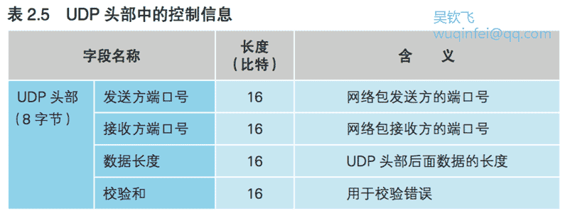

- [2.6 UDP 协议的收发操作](#26-udp-%E5%8D%8F%E8%AE%AE%E7%9A%84%E6%94%B6%E5%8F%91%E6%93%8D%E4%BD%9C)
    - [2.6.1 不需要重发的数据用 UDP 发送更高效](#261-%E4%B8%8D%E9%9C%80%E8%A6%81%E9%87%8D%E5%8F%91%E7%9A%84%E6%95%B0%E6%8D%AE%E7%94%A8-udp-%E5%8F%91%E9%80%81%E6%9B%B4%E9%AB%98%E6%95%88)
    - [2.6.2 控制用的短数据](#262-%E6%8E%A7%E5%88%B6%E7%94%A8%E7%9A%84%E7%9F%AD%E6%95%B0%E6%8D%AE)
    - [2.6.3 音频和视频数据](#263-%E9%9F%B3%E9%A2%91%E5%92%8C%E8%A7%86%E9%A2%91%E6%95%B0%E6%8D%AE)

# 2.6 UDP 协议的收发操作

## 2.6.1 不需要重发的数据用 UDP 发送更高效

跟着第 1 章的脚步,本章我们探索了通过套接字收发数据的整个过程, 这个过程到这里已经告一段落了。
接下来,网络包会从计算机出来跑向集 线器,这个过程我们将在下一章来介绍,现在先来说点题外话。

大多数的应用程序都像之前介绍的一样使用 TCP 协议来收发数据,但当然也有例外。
有些应用程序不使用 TCP 协议,而是使用 UDP 协议来收发数据。
向 DNS 服务器查询 IP 地址的时候我们用的也是 UDP 协议。
下面就简单介绍一下 UDP 协议。

其实 TCP 中就包含了 UDP 的一些要点。
TCP 的工作方式十分复杂, 如果我们能够理解 TCP 为什么要设计得如此复杂,也就能够理解 UDP 了。 
那么,为什么要设计得如此复杂呢?因为我们需要将数据高效且可靠地发送给对方。
为了实现可靠性,我们就需要确认对方是否收到了我们发送的数据,如果没有还需要再发一遍。

要实现上面的要求,最简单的方法是数据全部发送完毕之后让接收方返回一个接收确认。
这样一来,如果没收到直接全部重新发送一遍就好了, 根本不用像 TCP 一样要管理发送和确认的进度。
但是,如果漏掉了一个包就要全部重发一遍,怎么看都很低效。
为了实现高效的传输,我们要避免重发已经送达的包,而是只重发那些出错的或者未送达的包。
TCP 之所以复杂,就是因为要实现这一点。

不过,在某种情况下,即便没有 TCP 这样复杂的机制,我们也能够高效地重发数据,
这种情况就是数据很短,用一个包就能装得下。
如果只有一个包,就不用考虑哪个包未送达了,因为全部重发也只不过是重发一个包而已,
这种情况下我们就不需要 TCP 这样复杂的机制了。
而且,如果不使用 TCP,也不需要发送那些用来建立和断开连接的控制包了。
此外,我们发送了数据,对方一般都会给出回复,只要将回复的数据当作接收确认就行了,也不需要专门的接收确认包了。

## 2.6.2 控制用的短数据

这种情况就适合使用 UDP。
像 DNS 查询等交换控制信息的操作基本上都可以在一个包的大小范围内解决,这种场景中就可以用 UDP 来代替 TCP。

（UDP 可发送的数据最大长度为 IP 包的最大长度减去 IP 头部和 UDP 头部的长度。
不过,这个长度与 MTU、MSS 不是一个层面上的概念。
MTU 和 MSS 是基于以太网和通信线路上网络包的最大长度来计算的,
而 IP 包的最大长度是由 IP 头部中的“全长”字段决定的。
“全长”字段的长度为 16 比特,因此从IP协议规范来看,IP包的最大长度为65 535字节,
再减去 IP 头部和 UDP 头部的长度,就是 UDP 协议所能发送的数据最大长度。
如果不考虑可选字段的话,一般来说 IP 头部为 20 字节,UDP 头部为 8 字节,因此UDP的最大数据长度为65 507字节。
当然,这么长的数据已经超过了以太网和通信线路的最大传输长度,因此需要让 IP 模块使用分片功能拆分之后再传输。）

UDP 没有 TCP 的接收确认、窗口等机制,因此在收发数据之前也不需要交换控制信息,也就是说不需要建立和断开连接的步骤,
只要在从应用程序获取的数据前面加上 UDP 头部,然后交给 IP 进行发送就可以了(表 2.5)。

接收也很简单,只要根据 IP 头部中的接收方和发送方 IP 地址, 
以及 UDP 头部中的接收方和发送方端口号,找到相应的套接字并将数据交给相应的应用程序就可以了。

除此之外,UDP 协议没有其他功能了,遇到错误或者丢包也一概不管。
因为 UDP 只负责单纯地发送包而已,并不像 TCP 一样会对包的送达状态进行监控,
所以协议栈也不知道有没有发生错误。

但这样并不会引发什么问题,因此出错时就收不到来自对方的回复, 
应用程序会注意到这个问题,并重新发送一遍数据。
这样的操作本身并不复杂,也并不会增加应用程序的负担。

## 2.6.3 音频和视频数据

还有另一个场景会使用 UDP,就是发送音频和视频数据的时候。
音频和视频数据必须在规定的时间内送达,一旦送达晚了,就会错过播放时机, 导致声音和图像卡顿。

如果像 TCP 一样通过接收确认响应来检查错误并重发,重发的过程需要消耗一定的时间,
因此重发的数据很可能已经错过了播放的时机。

一旦错过播放时机,重发数据也是没有用的,因为声音和图像已经卡顿了,这是无法挽回的。
当然,我们可以用高速线路让重发的数据能够在规定的时间内送达,但这样一来可能要增加几倍的带宽才行。

（UDP 经常会被防火墙阻止,因此当需要穿越防火墙传输音频和视频数据时,
尽管需要消耗额外的带宽,但有时候也只能使用 TCP。）

此外,音频和视频数据中缺少了某些包并不会产生严重的问题,
只是会产生一些失真或者卡顿而已,一般都是可以接受的。

（如果错误率太高,超过了可接受的限度,那么另当别论。
此外,也有一些情况下连一丁点卡顿都不允许,当然这种情况相当特殊。）

在这些无需重发数据,或者是重发了也没什么意义的情况下,使用 UDP 发送数据的效率会更高。

本章我们探索了在收发数据时,操作系统中的协议栈是如何工作的, 
以及网卡是如何将包转换成电信号通过网线发送出去的。
到这里,我们的网络包已经沿着网线流出了客户端计算机,
下一章,我们将探索网络包如 何经过集线器、交换机、路由器等设备,最终到达互联网。