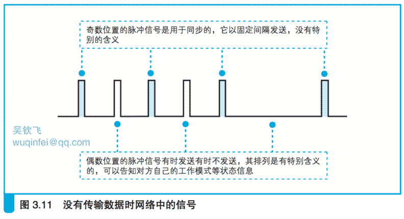
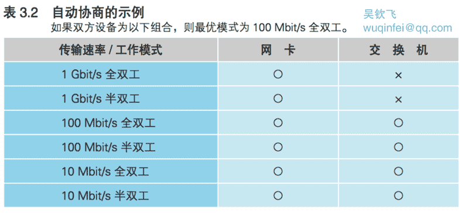

- [3.2 交换机的包转发操作](#32-%E4%BA%A4%E6%8D%A2%E6%9C%BA%E7%9A%84%E5%8C%85%E8%BD%AC%E5%8F%91%E6%93%8D%E4%BD%9C)
    - [3.2.1 交换机根据地址表进行转发](#321-%E4%BA%A4%E6%8D%A2%E6%9C%BA%E6%A0%B9%E6%8D%AE%E5%9C%B0%E5%9D%80%E8%A1%A8%E8%BF%9B%E8%A1%8C%E8%BD%AC%E5%8F%91)
    - [3.2.2 MAC 地址表的维护](#322-mac-%E5%9C%B0%E5%9D%80%E8%A1%A8%E7%9A%84%E7%BB%B4%E6%8A%A4)
    - [3.2.3 特殊操作](#323-%E7%89%B9%E6%AE%8A%E6%93%8D%E4%BD%9C)
    - [3.2.4 全双工模式可以同时进行发送和接收](#324-%E5%85%A8%E5%8F%8C%E5%B7%A5%E6%A8%A1%E5%BC%8F%E5%8F%AF%E4%BB%A5%E5%90%8C%E6%97%B6%E8%BF%9B%E8%A1%8C%E5%8F%91%E9%80%81%E5%92%8C%E6%8E%A5%E6%94%B6)
    - [3.2.5 自动协商:确定最优的传输速率](#325-%E8%87%AA%E5%8A%A8%E5%8D%8F%E5%95%86%E7%A1%AE%E5%AE%9A%E6%9C%80%E4%BC%98%E7%9A%84%E4%BC%A0%E8%BE%93%E9%80%9F%E7%8E%87)
    - [3.2.6 交换机可同时执行多个转发操作](#326-%E4%BA%A4%E6%8D%A2%E6%9C%BA%E5%8F%AF%E5%90%8C%E6%97%B6%E6%89%A7%E8%A1%8C%E5%A4%9A%E4%B8%AA%E8%BD%AC%E5%8F%91%E6%93%8D%E4%BD%9C)

# 3.2 交换机的包转发操作

## 3.2.1 交换机根据地址表进行转发

下面来看一下包是如何通过交换机的。
交换机的设计是将网络包原样转发到目的地,图 3.7 就是它的内部结构,我们边看图边讲。

首先,信号到达网线接口,并由 PHY(MAU)模块进行接收,这一部分和集线器是相同的。
也就是说,它的接口和 PHY(MAU)模块也是以 MDI-X 模式进行连接的,
当信号从双绞线传入时,就会进入 PHY(MAU) 模块的接收部分。

（早期的交换机基本上都和图 3.7 最上面的那种情况一样,是通过集线器和计算机进行连接的,
由于集线器的接口是 MDI-X 模式,如果要用直连网线连接,那么交换机应该采用 MDI 模式的接口。
不过现在我们基本上不使用集线器了,而是将计算机直接连接到交换机上,
因此交换机也和集线器一样采用了 MDI-X 接线。）

接下来,PHY(MAU)模块会将网线中的信号转换为通用格式,然后传递给 MAC 模块。
MAC 模块将信号转换为数字信息,然后通过包末尾的 FCS 校验错误,如果没有问题则存放到缓冲区中。
如果检测到错误就丢弃这个包。

这部分操作和网卡基本相同,大家可以认为交换机的每个网线接口后面都是一块网卡。
网线接口和后面的电路部分加在一起称为一个端口,
也就是说交换机的一个端口就相当于计算机上的一块网卡。

（换句话说,如果在计算机上安装多块网卡,并开启“混杂模式”让网卡接收所有的网络包,
然后再安装一个和交换机具备同样功能的网络包转发软件,那么这台计算机就变成了一台交换机。）

但交换机的工作方式和网卡有一点不同。
网卡本身具有 MAC 地址,并通过核对收到的包的接收方 MAC 地址判断是不是发给自己的,如果不是发给自己的则丢弃;
相对地,交换机的端口不核对接收方 MAC 地址,而是直接接收所有的包并存放到缓冲区中。
因此, 和网卡不同,交换机的端口不具有 MAC 地址。

（内置用于实现管理等功能的处理器的交换机除外。
这种交换机相当于在一个盒子里同时集成了计算机和交换机两种设备,
因此其中相当于计算机的部分是具有 MAC 地址的。）

    交换机端口的 MAC 模块不具有 MAC 地址。

将包存入缓冲区后,接下来需要查询一下这个包的接收方 MAC 地址是否已经在 MAC 地址表中有记录了。

MAC 地址表主要包含两个信息,一个是设备的 MAC 地址,另一个是该设备连接在交换机的哪个端口上。

以 图 3.7 中的地址表为例,MAC 地址和端口是一一对应的,通过这张表就能够判断出收到的包应该转发到哪个端口。

举个例子,如果收到的包的接收方 MAC 地址为 00-02-B3-1C-9C-F9,则与图 3.7 的表中的第 3 行匹配,
根据端口列的信息,可知这个地址位于 8 号端口上,然后就可以通过交换电路将包发送到相应的端口了。

（有些产品不是用交换电路来传输网络包的,但交换电路是交换机的原型, “交换机”这个词也是从交换电路来的。）

现在来看看交换电路到底是如何工作的。交换电路的结构如图 3.8 所示,它可以将输入端和输出端连接起来。

其中,信号线排列成网格状,每一个交叉点都有一个交换开关,交换开关是电子控制的,
通过切换开关的状态就可以改变信号的流向。

交换电路的输入端和输出端分别连接各个接收端口和发送端口,网络包通过这个网格状的电路在端口之间流动。

举个例子,假设现在要将包从 2 号端口发送到 7 号端口,那么信号会从输入端 的 2 号线进入交换电路,
这时,如果让左起的 6 个开关水平导通,然后将 第 7 个开关切换为垂直导通,
信号就会像图上一样流到输出端 7 号线路, 于是网络包就被发送到了 7 号端口。

每个交叉点上的交换开关都可以独立工作,因此只要路径不重复,就可以同时传输多路信号。

当网络包通过交换电路到达发送端口时,端口中的 MAC 模块和 PHY (MAU)模块会执行发送操作,将信号发送到网线中,
这部分和网卡发送信号的过程是一样的。

根据以太网的规则,首先应该确认没有其他设备在发送信号,也就是确认信号收发模块中的接收线路没有信号进来。
如果检测到其他设备在发送信号,则需要等待信号发送完毕;
如果没有其他信号, 或者其他信号已经发送完毕,这时就可以将包的数字信息转换为电信号发送出去。

在发送信号的过程中,还需要对接收信号进行监控,这一点和网卡也是一样的。
如果在发送过程中检测到其他设备发送信号,就意味着出现了信号碰撞,
这时需要发送阻塞信号以停止网络中所有的发送操作,
等待一段时间后再尝试重新发送,这一步和网卡也是一样的。

（这个操作过程的前提是终端通过集线器连接到交换机,也就是半双工模式的工作方式。
这是以太网的原型,但现在基本上都不使用集线器了,而是直接用交换机将终端和路由器相连接,
在这种情况下,交换机的端口会自动切换为全双工模式。关于全双工模式的工作过程我们将稍后介绍。）

    交换机根据 MAC 地址表查找 MAC 地址,然后将信号发送到相应的端口。

## 3.2.2 MAC 地址表的维护

交换机在转发包的过程中,还需要对 MAC 地址表的内容进行维护, 维护操作分为两种。

**第一种是收到包时,将发送方 MAC 地址以及其输入端口的号码写入 MAC 地址表中。**

由于收到包的那个端口就连接着发送这个包的设备,
所以只要将这个包的发送方 MAC 地址写入地址表,
以后当收到发往这个地址的包时,交换机就可以将它转发到正确的端口了。

交换机每次收到包时都会执行这个操作,
因此只要某个设备发送过网络包,它的 MAC 地址就会被记录到地址表中。

**另一种是删除地址表中某条记录的操作,这是为了防止设备移动时产生问题。**

比如,我们在开会时会把笔记本电脑从办公桌拿到会议室,这时设备就发生了移动。
从交换机的角度来看,就是本来连接在某个端口上的笔记本电脑消失了。

这时如果交换机收到了发往这台已经消失的笔记本电脑的包,
那么它依然会将包转发到原来的端口,通信就会出错,因此必须想办法删除那些过时的记录。

然而,交换机没办法知道这台笔记本电脑已经从原来的端口移走了。
因此地址表中的记录不能永久有效,而是要在一段时间不使用后就自动删除。

**那么当笔记本电脑被拿到会议室之后,会议室里的交换机又会如何工作呢?**

只要笔记本电脑连接到会议室的交换机,交换机就会根据笔记本电脑发出的包来更新它的地址表。
因此,对于目的地的交换机来说,不需要什么特别的措施就可以正常工作了。

综合来看,为了防止终端设备移动产生问题,
只需要将一段时间不使用的过时记录从地址表中删除就可以了。

过时记录从地址表中删除的时间一般为几分钟,
因此在过时记录被删除之前,依然可能有发给该设备的包到达交换机。

这时,交换机会将包转发到老的端口,通信就会发生错误,这种情况尽管罕见,但的确也有可能发生。

不过大家不必紧张,遇到这样的情况,只要重启一下交换机,
地址表就会被清空并更新正确的信息,然后网络就又可以正常工作了。

总之,交换机会自行更新或删除地址表中的记录,不需要手动维护。
当地址表的内容出现异常时,只要重启一下交换机就可以重置地址表,也不需要手动进行维护。

## 3.2.3 特殊操作

上面介绍了交换机的基本工作方式,下面来看一些特殊情况下的操作。

比如,交换机查询地址表之后发现记录中的目标端口和这个包的源端口是同一个端口。

当像图 3.9 这样用集线器和交换机连接在一起时就会遇到这样的情况,那么这种情况要怎么处理呢?

首先,计算机 A 发送的包到达集线器后会被集线器转发到所有端口上,
也就是会到达交换机和计算机B(图 3.9 ①)。

这时,交换机转发这个包之后,这个包会原路返回集线器(图 3.9 ②),
然后,集线器又把包转发到所有端口,于是这个包又到达了计算机 A 和计算机 B。

所以计算机 B 就会收到两个相同的包,这会导致无法正常通信。
因此,当交换机发现一个包要发回到原端口时,就会直接丢弃这个包。

还有另外一种特殊情况,就是地址表中找不到指定的 MAC 地址。

这可能是因为具有该地址的设备还没有向交换机发送过包,
或者这个设备一段时间没有工作导致地址被从地址表中删除了。

这种情况下,交换机无法判断应该把包转发到哪个端口,
只能将包转发到除了源端口之外的所有端口上,无论该设备连接在哪个端口上都能收到这个包。

这样做不会产生什么问题,因为以太网的设计本来就是将包发送到整个网络的,
然后只有相应的接收者才接收包,而其他设备则会忽略这个包。

有人会说:“这样做会发送多余的包,会不会造成网络拥塞呢?”
其实完全不用过于担心,因为发送了包之后目标设备会作出响应,
只要返回了响应包,交换机就可以将它的地址写入地址表,下次也就不需要把包发到所有端口了。
局域网中每秒可以传输上千个包,多出一两个包并无大碍。

此外,如果接收方 MAC 地址是一个广播地址,
那么交换机会将包发送到除源端口之外的所有端口。

广播地址(broadcast address)是一种特殊的地址,
将广播地址设为接收方地址时,包会发送到网络中所有的设备。
MAC 地址中的 FF:FF:FF:FF:FF:FF 和 IP 地址中的 255.255.255.255 都是广播地址。

## 3.2.4 全双工模式可以同时进行发送和接收

全双工模式是交换机特有的工作模式,它可以同时进行发送和接收操作,集线器不具备这样的特性。

使用集线器时,如果多台计算机同时发送信号,信号就会在集线器内部混杂在一起,进而无法使用,
这种现象称为碰撞,是以太网的一个重要特征。
不过,只要不用集线器,就不会发生碰撞。

而使用双绞线时,发送和接收的信号线是各自独立的,因此在双绞线中信号不会发生碰撞。

（1000BASE-T 规格的千兆以太网中,发送和接收信号线不是独立的,
而是在同一条线上同时传输两个方向的信号,
但PHY(MAU)模块可以将发送和接收的信号进行分离,因此两者也不会发生碰撞。）

网线连接的另一端,即交换机端口和网卡的 PHY (MAU)模块以及 MAC 模块,
其内部发送和接收电路也是各自独立的,信号也不会发生碰撞。
因此,只要不用集线器,就可以避免信号碰撞了。

如果不存在碰撞,也就不需要半双工模式中的碰撞处理机制了。也就是说,发送和接收可以同时进行。

然而,以太网规范中规定了在网络中有信号时要等该信号结束后再发送信号,
因此发送和接收还是无法同时进行。

于是,人们对以太网规范进行了修订,增加了一个无论网络中有没有信号都可以发送信号的工作模式,
同时规定在这一工作模式下停用碰撞检测(图 3.10)。这种工作模式就是全双工模式。

（如果网络中包的数量很少,不会出现等待其他传输结束的情况,
那么全双工模式和半双工模式的速度是一样的。）

在全双工模式下,无需等待其他信号结束就可以发送信号,因此它比半双工模式速度要快。
由于双方可以同时发送数据,所以可同时传输的数据量也更大,性能也就更高。

    交换机的全双工模式可以同时发送和接收信号。

## 3.2.5 自动协商:确定最优的传输速率

随着全双工模式的出现,如何在全双工和半双工模式之间进行切换的问题也产生了。

（原本以太网并没有工作模式的概念,也没有表示工作模式的专门术语。
后来在全双工模式出现时,人们将通信技术中一直使用的全双工、半双工两 个词搬到了网络技术中,于是就出现了这样的叫法。）

在全双工模式刚刚出现的时候,还需要手动进行切换,但这样实在太麻烦,
于是后来出现了自动切换工作模式的功能。

这一功能可以由 相互连接的双方 探测对方是否支持全双工模式,并自动切换成相应的工作模式。

此外,除了能自动切换工作模式之外,还能探测对方的传输速率并进行自动切换。
这种自动切换的功能称为自动协商。

在以太网中,当没有数据在传输时,网络中会填充一种被称为连接脉冲的脉冲信号。
在没有数据信号时就填充连接脉冲,这使得网络中一直都有一定的信号流过,
从而能够检测对方是否在正常工作,或者说网线有没有正常连接。

以太网设备的网线接口周围有一个绿色的 LED 指示灯,它表示是否检测到正常的脉冲信号。
如果绿灯亮,说明 PHY(MAU)模块以及 网线连接正常。

（MAC 模块、缓冲区、内存和总线部分的异常无法通过这个指示灯来判断。）

在双绞线以太网规范最初制定的时候,只规定了按一定间隔发送脉冲信号,
这种信号只能用来确认网络是否正常。

后来,人们又设计出了如图 3.11 这样的具有特定排列的脉冲信号,
通过这种信号可以将自身的状态告知对方。

自动协商功能就利用了这样的脉冲信号,
即通过这种信号将自己能够支持的工作模式和传输速率相互告知对方,并从中选择一个最优的组合。

（自动协商功能是后来才写入以太网规范中的,
因此会出现支持这一功能的设备和不支持这一功能的设备混用的情况。
在这样的情况下,不支持自动协商的设备由于其所发送的脉冲信号不具备规定的排列,
无法正确告知工作模式,所以会引发故障。
自动协商规格本身也存在一定的缺陷,这些缺陷有时也会引发故障。
因此,尽管有人不喜欢这个功能,但只要正确理解和使用它,就可以防止上述故障。
当然,现在基本上已经没有不支持自动协商的旧设备了,因此一般也不会出问题。）

下面来看一个具体的例子。假设现在连接双方的情况如表 3.2 所示,
网卡一方支持所有的速率和工作模式,而交换机只支持到100 Mbit/s全双工模式。

当两台设备通电并完成硬件初始化之后,就会开始用脉冲信号发送自己支持的速率和工作模式。

当对方收到信号之后,会通过读取脉冲信号的排列来判断对方支持的模式,然后看看双方都支持的模式有哪些。

表 3.2 是按照优先级排序的,因此双方都支持的模式就是第 3 行及以下的部分。
越往上优先级越高,因此在本例中100 Mbit/s全双工模式就是最优组合,
于是双方就会以这个模式开始工作。

## 3.2.6 交换机可同时执行多个转发操作

交换机只将包转发到具有特定 MAC 地址的设备连接的端口,其他端口都是空闲的。

如图 3.7 中的例子所示,当包从最上面的端口发送到最下面的端口时,
其他端口都处于空闲状态,这些端口可以传输其他的包,因此交换机可以同时转发多个包。

相对地,集线器会将输入的信号广播到所有的端口,
如果同时输入多个信号就会发生碰撞,无法同时传输多路信号,
因此从设备整体的转发能力来看,交换机要高于集线器。