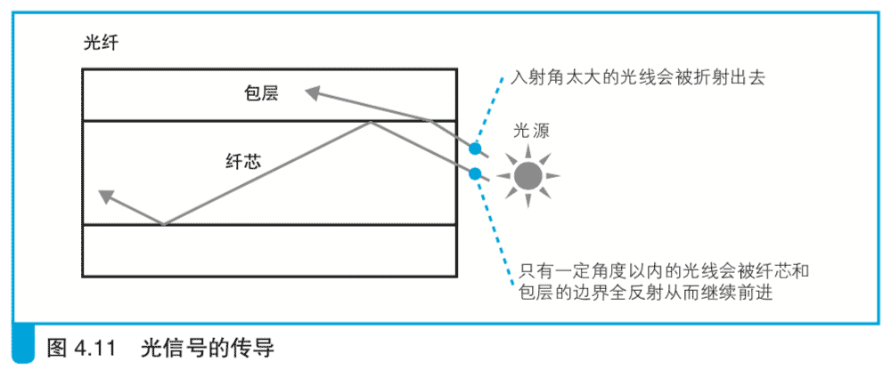
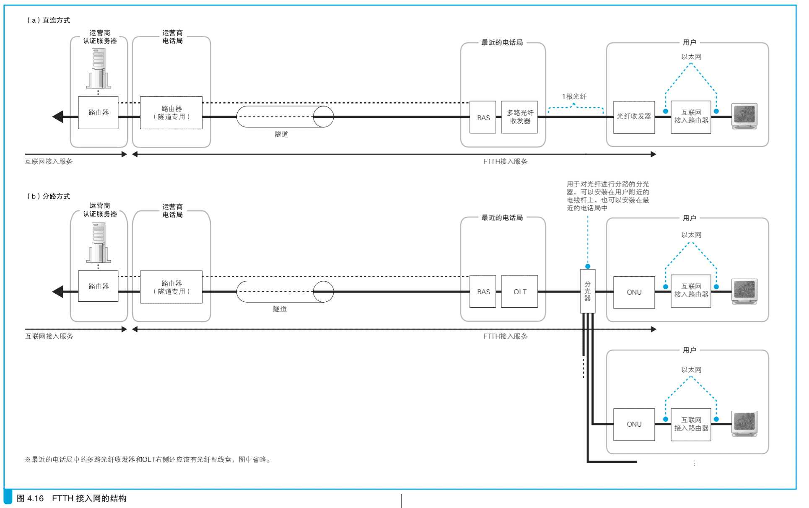

# 4.2  光纤接入网(FTTH)

## 4.2.1 光纤的基本知识

通过 ADSL 接入网和 BAS 之后，网络包就到达了互联网内部，在继续探索之前，我们再来介绍另一种接入网技术，它的名字叫 FTTH，是一种基于光纤的接入网技术。FTTH 的关键点在于对光纤的使用，所以我们先来介绍一些光纤的基本知识。

光纤的结构如图 4.9 所示，它是由一种双层结构的纤维状透明材质(玻璃和塑料)构成的，通过在里面的纤芯中传导光信号来传输数字信息(图 4.10)。ADSL 信号是由多个频段的信号组成的，比较复杂，但光信号却非常简单，亮表示 1，暗表示 0。

不过，数字信息并不能一下子变成光信号，而是需要像图 4.10 所示的 这样，先将数字信息转换成电信号，然后再将电信号转换成光信号。这里的电信号非常简单，1 用高电压表示，0 用低电压表示。将这样的电信号输入 LED、激光二极管等光源后，这些光源就会根据信号电压的变化发光， 高电压发光亮，低电压发光暗。这样的光信号在光纤中传导之后，就可以通过光纤到达接收端。接收端有可以感应光线的光敏元件，光敏元件可以根据光的亮度产生不同的电压。当光信号照射到上面时，光亮的时候就产生高电压，光暗的时候就产生低电压，这样就将光信号转换成了电信号。最后再将电信号转换成数字信息，我们就接收到数据了。

这就是光纤的通信原理。

## 4.2.2 单模与多模

光纤通信的关键技术就是能够传导光信号的光纤。光在透明材质中传导似乎听起来很简单，但实际上光的传导方式是非常复杂的，不同材质的光纤其透光率和折射率也不同，纤芯的直径等因素也会影响光的传导。其中，纤芯的直径对光的传导影响很大，要理解这一点，我们得先来看看光在光纤中是如何传导的。

首先，我们来看看光源发出的光是如何进入纤芯的。光源在所有方向上都会发光，因此会有各种角度的光线进入纤芯，但入射角度太大的光线会在纤芯和包层(纤芯外沿部分)的边界上折射出去，只有入射角较小的光线会被包层全反射，从而在纤芯中前进(图 4.11)。

不过，也不是所有入射角小的光线都会在纤芯中传导。光也是一种波，因此光也有如图 4.5 中那样的相位，当光线在纤芯和包层的边界上反射时，会由于反射角产生相位变化。当朝反射面前进的光线和被反射回来的光线交会时，如果两条光线的相位不一致，就会彼此发生干涉抵消，只有那些 相位一致的光线才会继续在光纤中传导。

这个现象和往水面上投一颗石子产生的波纹是一样的。水波也有相位，在石子进入水面的瞬间，波纹中心会产生各种相位的波。不过，相位不同的波会相互干涉，图 4.12 中相位相反的情况是最容易理解的。相位不同的波在干涉后会变弱、消失，最后就只剩下相位相同的波向周围扩散开来。石子投入水面后扩散出来的波纹会形成同心圆状，一般大家对这样的现象已经习以为常，实际上只有相位相同的波才会扩散出来被我们看到。

如果周围没有障碍物，水面上的波纹会一直呈同心圆状扩散出去，但如果遇到两侧的墙壁，波纹就会被反射回来。这时，向墙壁前进的波和从墙壁反射回来的波就会相互叠加，其中相位相同的波相互加强，相位不同的波相互抵消。

光纤中的情况也是一样的，只不过和水波不同的是，光在被纤芯和包层的边界反射时，相位会发生变化。这个变化的量随光在反射面的反射角度不同而不同，大多数角度下，都会因为相位不同而被干涉抵消。不过，有几个特定的角度下，向反射面前进的光和反射回来的光的相位是一致的，只有以这些角度反射的光才能继续向前传导(图 4.13)。进入光纤的光线有各种角度，但其中，只有少数按照特定角度入射以保持相位一致的光线才会继续传导。

这个角度非常关键，纤芯的直径也是根据这个角度来确定的，而且纤芯的直径大小会极大地改变光纤的性质。根据纤芯直径，光纤可以划分成几种类型，大体上包括较细的单模光纤(8~10 μm)和较粗的多模光纤(50 μm或62.5 μm)。单模光纤的纤芯很细，只有入射角很小的光线才能进入，因此在能够保持相位一致的角度中，只有角度最小的光线能进入光纤。 反过来可以说，单模光纤的纤芯直径就是按照只允许相位一致的最小角度的光进入而设计的。多模光纤的纤芯比较粗，入射角比较大的光也可以进入，这样一来，在相位一致的角度中，不仅角度最小的可以在光纤中传导，其他角度更大一些的也可以，也就是说，可以有多条光线在纤芯中同时传导。换句话说，单模和多模实际上表示相位一致的角度有一个还是多个(图 4.14)。

单模光纤和多模光纤在光的传导方式上有所不同，这决定了它们的特性也有所不同。多模光纤中可以传导多条光线，这意味着能通过的光线较多，对光源和光敏元件的性能要求也就较低，从而可以降低光源和光敏元件的价格。相对地，单模光纤的纤芯中只能传导一条光线，能通过的光线较少，相应地对于光源和光敏元件的性能要求就较高，但信号的失真会比较小。

信号失真与光在纤芯传导时反射的次数相关。多模光纤中，多条反射角不同的光线同时传导，其中反射角越大的光线反射次数越多，走过的距离也就越长;相对地，反射角越小的光线走过的距离越短。光通过的距离会影响其到达接收端的时间，也就是说，通过的距离越长，到达接收端的时间越长。结果，多条光线到达的时间不同，信号的宽度就会被拉伸，这就造成了失真。因此，光纤越长，失真越大，当超过允许范围时，通信就会出错(图 4.15)。

相对地，单模光纤则不会出现这样的问题。因为在纤芯传导的光线只有一条，不会因为行进距离的差异产生时间差，所以即便光纤很长，也不会产生严重的失真。

光纤的最大长度也是由上述性质决定的。单模光纤的失真小，可以比多模光纤更长，因此多模光纤主要用于一座建筑物里面的连接，单模光纤则用于距离较远的建筑物之间的连接。FTTH 属于后者，因此主要使用单模光纤。

## 4.2.3 通过光纤分路来降低成本

用光纤来代替 ADSL 将用户端接入路由器和运营商的 BAS 连接起来的接入方式就是 FTTH，从形态上可大致分为两种。

一种是用一根光纤直接从用户端连接到最近的电话局(图 4.16(a)。 这种类型的 FTTH 中，用户和电话局之间通过光纤直接连接，网络包的传输方式如下。首先，用户端的光纤收发器将以太网的电信号转换成光信号。这一步只进行电信号到光信号的转换，而不会像 ADSL 一样还需要将包拆分成信元，大家可以认为是将以太网包原原本本地转换成了光信号。接下来，光信号通过连接到光纤收发器的光纤直接到达 BAS 前面的多路光纤收发器。FTTH 一般使用单模光纤，因此其纤芯中只有特定角度的光信号能够反射并前进。然后，多路光纤收发器将光信号转换成电信号，BAS 的端口接收之后，将包转发到互联网内部。

把网络包发送到互联网之后，服务器会收到响应，响应包的光信号也是沿着同一条光纤传输到用户端的。这里，前往互联网的上行光信号和前往用户的下行光信号在光纤中混合在一起，信号会变得无法识别，因此我们需要对它们进行区分，办法是上行和下行信号采用不同波长的光。波长不同的光混合后可通过棱镜原理进行分离，因此光纤中的上行和下行信号即便混合起来也可以识别。像这样在一条光纤中使用不同的波长传输多个光信号的方式叫作波分复用。

另一种光纤的接入方式是在用户附近的电线杆上安装一个名为分光器的设备，通过这个设备让光纤分路，同时连接多个用户(图 4.16(b)。在这种方式下，用户端不使用光纤收发器，而是使用一个叫作 ONU 的设备， 它将以太网的电信号转换成光信号之后，会到达 BAS 前面的一个叫作 OLT 的设备。光信号的传导方式和刚才介绍的直连方式是一样的，但有一点不同，因为多个用户同时收发网络包时信号会在分光器产生碰撞。因此， OLT 和 ONU 中具备通过调整信号收发时机来避免碰撞的功能。具体来说，OLT 会调整信号发送时机并向 ONU 下发指令，ONU 则根据 OLT 的指令来发送数据。反过来，当 BAS 端向用户发送数据时，分光器只需要将信号发给所有用户就可以了，这里并不会发生碰撞，但这样做会导致一个用户收到其他所有用户的信号，造成信息泄露的问题，因此需要在每个包前面加上用于识别 ONU 的信息，当 ONU 收到信号后，会接收发给自己的信号并将其转换成以太网信号。

像这样，FTTH 可以分为直连和分路两种方式，这两种方式只是光信号的传输方式有一些区别，实际传输的网络包是相同的。当使用PPPoE 来传输包时，其工作过程和刚才讲过的 ADSL 类似。具体来说，就是像图 4.3 中的5一样，由互联网接入路由器在 IP 头部前面加上 MAC 头部、 PPPoE 头部和 PPP 头部，然后由光纤收发器或者 ONU 转换成光信号，并通过光纤到达 BAS 前面的多路光纤收发器和 OLT，最后被还原成电信号并到达 BAS。
