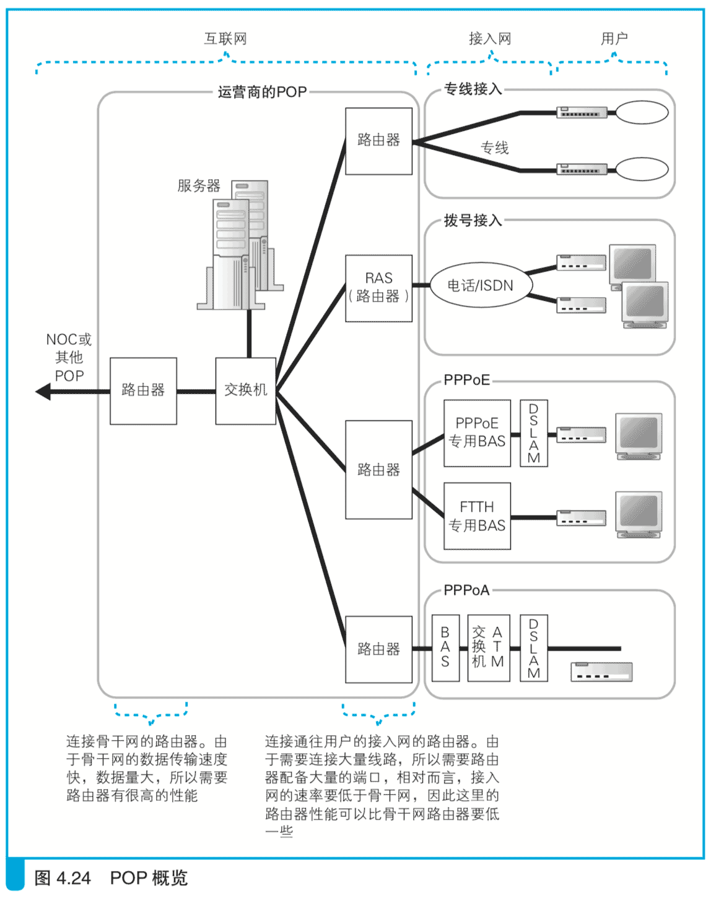

# 4.4 网络运营商的内部

## 4.4.1 POP 和 NOC

下面回到正题，现在网络包已经通过接入网，到达了网络运营商的路由器。这里是互联网的入口，网络包会从这里进入互联网内部。（简单来说，此后网络包的传输轨迹就是通过路由器的不断转发向目的地前进，基本过程和我们之前介绍的内容大同小异。）

互联网的实体并不是由一个组织运营管理的单一网络，而是由多个运营商网络相互连接组成的(图 4.23)。ADSL、FTTH 等接入网是与用户签约的运营商设备相连的，这些设备称为 POP，互联网的入口就位于这里。

（POP:Point of Presense，中文一般叫作“接入点”。）

    网络包通过接入网之后，到达运营商 POP 的路由器。

那么，POP 里面是什么样的呢? POP 的结构根据接入网类型以及运营商的业务类型不同而不同，大体上是图 4.24 中的这个样子。POP 中包括各种类型的路由器，路由器的基本工作方式是相同的，但根据其角色分成了不同的类型。图 4.24 中，中间部分列出了连接各种接入网的路由器，这里的意思就是根据接入网的类型需要分别使用不同类型的路由器。

我们从上面开始看，首先是专线，这里用的路由器就是具有通信线路端口的一般路由器。专线不需要用户认证、配置下发等功能，因此用一般的路由器就可以了。接下来是电话、ISDN 等拨号方式的接入网，这里使用的路由器称为 RAS。拨号接入需要对用户拨电话的动作进行应答，而 RAS 就具备这样的功能。此外，之前我们讲过通过 PPP 协议进行身份认证和配置下发的过程，RAS 也具备这些功能。再往下是 PPPoE 方式的 ADSL 和 FTTH。PPPoE 方式中，ADSL、FTTH 接入服务商会使用 BAS，运营商的路由器则与 BAS 相连。PPPoE 中的身份认证和配置下发操作由接入服务商的 BAS 来负责，运营商的路由器只负责对包进行转发，因此这里也是使用一般的路由器就可以了。如果 ADSL 采用 PPPoA 方式接入，那么工作过程会有所不同，DSLAM 通过 ATM 交换机与 ADSL 的运营商的 BAS 相连，然后再连接到运营商的路由器。用户端传输的信号先经过 ADSL Modem 拆分成 ATM 信元并进行调制，然后 DSLAM 将信号还原成信元，通过 ATM 交换机转发到 BAS，最后 BAS 将信元还原成网络包，再通过运营商的路由器转发到互联网内部。

（专线是固定连接线路，不需要进行身份认证，参数是根据传真、书面等方式下发后进行手动配置的，因此也不需要 PPP、DHCP 等机制。其实，这就是最古老的互联网接入方式。）

对于连接接入网的部分来说，由于要连接的线路数量很多，所以路由器需要配备大量的端口，但能传输的网络包数量相对比较少，这是因为接入网的速率比互联网核心网络要低。因此，端口多且价格便宜的路由器适用于这些场景。相对地，图中左侧的路由器用于连接运营商和核心 NOC以及其他 POP，所有连接接入网的路由器发出的包都会集中到这里，使用的线路速率也比较高，因此这里需要配备转发性能和数据吞吐量高的路由器。

NOC 是运营商的核心设备，从 POP 传来的网络包都会集中到这里，并从这里被转发到离目的地更近的 POP，或者是转发到其他的运营商。这里也需要配备高性能的路由器。

（NOC:Network Operation Center，网络运行中心。）

话说回来，到底需要多高的性能才行呢?我们来看实际产品的参数。面向运营商的高性能路由器中有些产品的数据吞吐量超过 1 Tbit/s，而一般面向个人的路由器的数据吞吐量也就100 Mbit/s左右，两者相差1万多倍。 当然，路由器的性能不完全是由吞吐量决定的，但从这里可以看出规模和性能的差异。

其实，NOC 和 POP 并没有非常严格的界定。NOC 里面也可以配备连接接入网的路由器，很多情况下是和 POP 共用的。从 IP 协议的传输过程来看，也没有对两者进行区分的必然性，因为无论是哪个路由器，其转发网络包的基本工作原理都是相同的。因此，大家可以简单地认为，NOC 就是规模扩大后的 POP。

（从探索之旅的角度来看，运营商内部似乎只要有路由器就行了，但实际上POP 和 NOC 中的设备不只有路由器。因为运营商还会提供如网站、邮件等各种服务，所以机房里面还会配备各种服务器。）

## 4.4.2 室外通信线路的连接

POP 和 NOC 遍布全国各地，它们各自的规模有大有小，但看起来跟公司里的机房没什么太大区别，都是位于一幢建筑物中的，其中的路由器或者通过线路直接连接，或者通过交换机进行连接，这些和公司以及家庭网络都是相同的。只不过，公司的机房一般使用双绞线来连接设备，但运营商的网络中需要传输大量的包，已经超过了双绞线能容纳的极限，因此一般还是更多地使用光纤。

（光纤基本上和 FTTH 没有区别，只不过在大楼内部短距离连接时，一般采用多模光纤。）

大楼室内可以用线路直接连接，对于距离较远的 NOC 和 POP 来说，它们之间的连接方式可以分为几种。

对于自己拥有光纤的运营商来说，可以选择最简单的方式，也就是用光纤将 NOC 和 POP 直接连接起来。

（比如，电话公司由于自身业务需要，通过电线杆等方式铺设了很多光纤，那么这些公司属于拥有光纤的。电力公司通过继承电线杆上架设的光纤来开展通信业务，也算是自己拥有光纤的。此外，高速公路沿途铺设的光纤也会归一些公司所有，因此拥有光纤的方式是多种多样的。）

这种方式虽然想法简单，但实现起来却并不简单。光纤需要在地下铺设，需要很大的工程费用，而且当线路发生中断时还必须进行维修，这些维护工作也需要费用。因此，只有有限的几家大型运营商才拥有光纤。

那么，其他运营商怎么办呢?其实也不难，只要从其他公司租借光纤就可以了，但所谓租借并不是光纤本身。

拥有光纤的公司一般都会提供光纤租用服务。以电话公司为例，电话公司会在其拥有的光纤中传输语音数据，但一条光纤并不是只能传输一条语音数据，光纤是可以复用的，一条语音数据只占其通信能力的一部分。换句话说，电话公司可以将自己的光纤的一部分通信能力租借给客户。对于客户来说，只要支付一定的费用就可以使用其中的通信能力了。对于电话公司来说，其拥有的光纤不会全部自己使用，通过租借的方式也可以带来一定的收益，无论其业务本质是电话还是互联网，这一点都是共通的。 这种服务就叫作通信线路务。

不拥有光纤的运营商则可以使用租借通信线路的方式将相距较远的 NOC 和 POP 连接起来。电话使用的通信线路(电话线)只能传输语音这种单一形式的数据，但运营商使用的通信线路则种类繁多。首先，在速率上就分为很多种，其中比较快的种类，其速率为电话线的 100 万倍左右。除了速率之外，数据的传输方式也分为很多种。以前，将多条电话线捆绑在一起的方式比较主流，现在我们有了各种类型的通信线路，其中也有一些公司不对光纤进行细分，而是直接将整条光纤租借出去。不同的通信方式和速率对应着不同的价格，对于不拥有光纤的运营商来说，需要根据需要从中进行选择。

